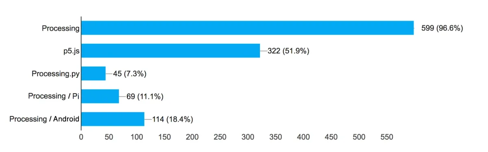
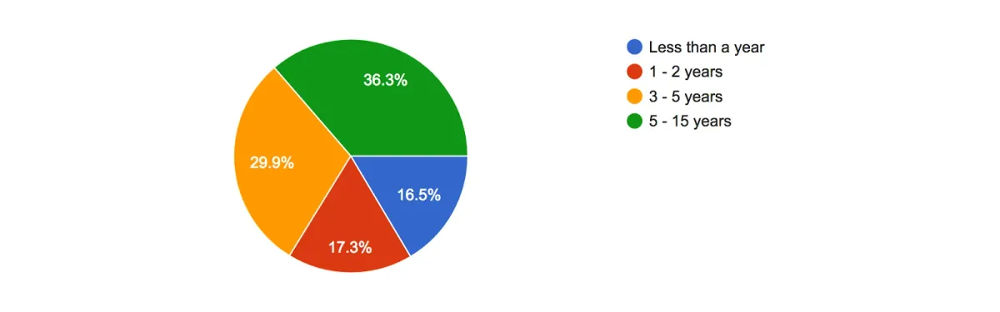
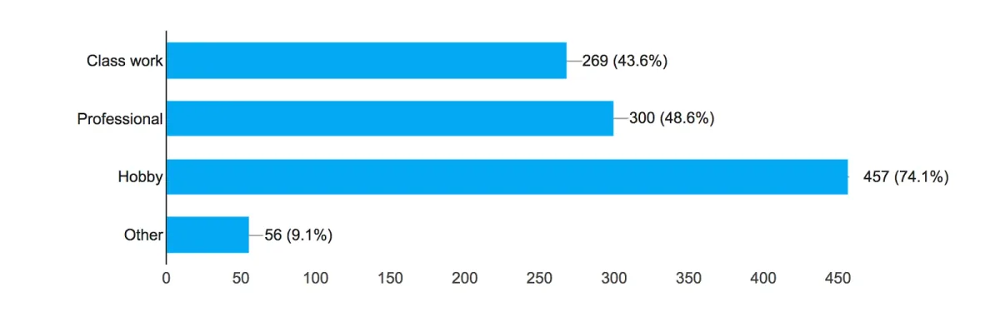
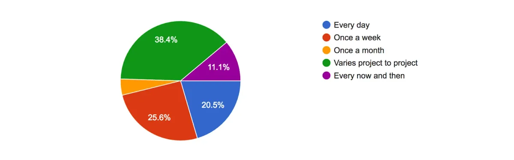
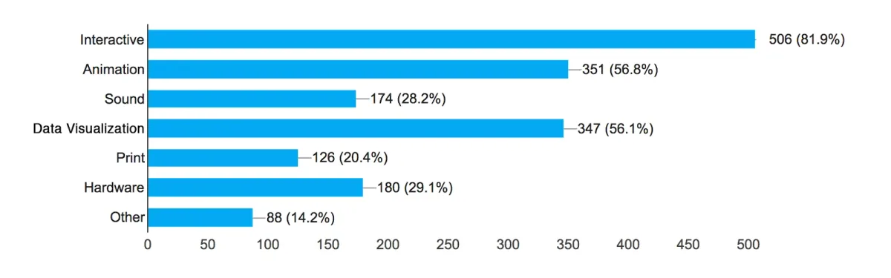
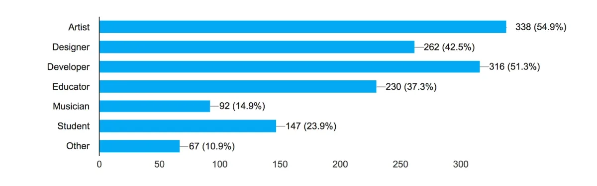
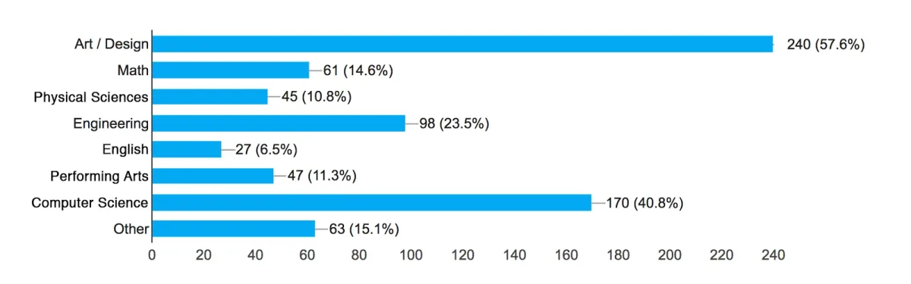
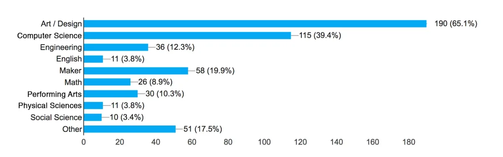
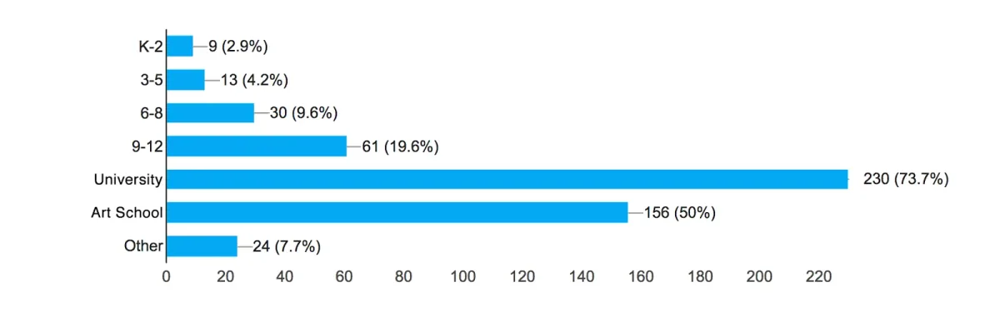

*Compiled by Casey Reas*

We developed the Community Survey to better understand how and why our software is used and to get a better grasp on the communities of people who use the software. From universities, to high schools, to the home, how are people working with our software? Across the globe, who is using our software? What is working and what can be improved?

We announced the Survey through a mass email to our existing list and through Twitter and Facebook. We received over 600 responses from the middle of November to the end of the year. We’re extremely grateful for the hundreds of thoughtful responses and we have summarized them here.

### General Information

For the survey, we wanted to learn which of our software platforms people are using and why. Are people using only [Processing](https://processing.org), [p5.js](https://p5js.org), or are they using both? What percentage is using [Processing for Android](https://android.processing.org) or [Processing.py](https://py.processing.org)? Do we have people who have used our software since it was first released fifteen years ago, or are most people new? Also, we were curious about what the software is used for and if people are using it to generate income and/or for enjoyment?

**Which tools from the Processing family do you use?** (620 responses)

**How long have you been using our software?** (619 responses)

**How do you use our software?** (617 responses)

**How often do you use our software?** (620 responses)

**What are your main interests?** (618 responses)

**Do you use our software to generate income?** (619 responses)

**How do you identify yourself?** (161 responses)

### Education

The original Processing software started as a platform for teaching and learning as well as a code sketchbook. Like Processing, the p5.js and Processing.py projects have a strong focus on learning to code. For the survey, we hoped to learn more about who is teaching with our software and in which kinds of classes, both the grade level and subject.

**How many courses/workshops have you taught with our software?** (325 responses)

**Which best describes your educational background?** (417 responses)

**Which subjects do you teach?** (292 responses)

**Which grade levels do you teach classes and/or workshops?** (312 responses)

### International Communities

One of the most fascinating and essential aspects of our software is the international scope of the communities. For this survey, we received survey results from 68 countries, from each continent except Antarctica:

> Algeria, Argentina, Australia, Austria, Belgium, Brazil, Bulgaria, Canada, Chile, China, Colombia, Croatia, Czech Republic, Denmark, Dominican Republic, Egypt, El Salvador, England, Estonia, Finland, France, Germany, Ghana, Greece, Hong Kong, Hungary, Iceland, India, Indonesia, Iraq, Ireland, Italy, Japan, South Korea, Kuwait, Lithuania, London, Luxembourg, Maldives, Mexico, Netherlands, New Zealand, Nigeria, Norway, Pakistan, Paris, Peru, Philippines, Poland, Portugal, Quebec, Reunion, Romania, Russia, Scotland, Serbia, Singapore, Slovakia, Slovenia, Spain, Sweden, Switzerland, Taiwan, Turkey, Ukraine, United States, Uruguay, Wales

The survey results encouraged us to allocate more resources to translations, both for the reference and for learning and teaching materials. Many people also volunteered to work on translations. We hope to get deeper into this in 2017. We have a priority to get the Processing Reference translated into Spanish. The complete p5.js site is already [translated into Spanish](https://p5js.org/es/), so the goal there is to translate it into Chinese. We hope to put systems in place to harness the energy of community members to translate educational materials into a wider range of languages.

### Thank you!

We thank all of the respondents for their time and thoughtful responses. Many of the survey questions probed the idea of Processing Membership as way to raise funds for development and initiatives. The feedback we received was invaluable and we’ll be launching the Membership system soon. We plan to run a community survey again late in 2017. At that time, we hope to collect even more information about how to focus our efforts.

We thank [openFrameworks](http://openframeworks.cc/), whose community survey was a guide for this one.
