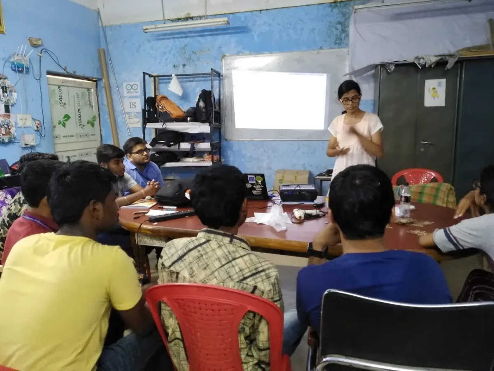
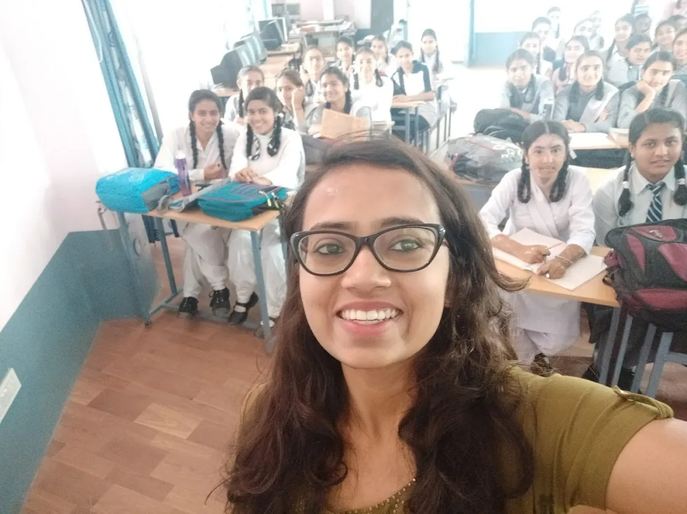

अध्येताओं को 100 घंटे के काम के लिए एक वजीफा दिया जाता है, और समुदाय के भीतर से सलाह मिलती है। इस साल की फैलो ने पी 5. जे एस वेबसाइट के हिंदी अनुवाद से लेकर ट्रांस और जेंडर नॉनफोर्मिंग करने वाले युवाओं के वर्कशॉप तक काम किया, जो बेसिक प्रोग्रामिंग और डिजाइन सीखने के लिए न्यूयॉर्क शहर के बेघर आश्रयों में रहते हैं। आने वाले हफ्तों के दौरान, हम एडवोकेसी जोहान हेदवा के निदेशक के साथ बातचीत में साथियों के साथ साक्षात्कार पोस्ट करेंगे, जो इस वर्ष के सहयोग से महत्वपूर्ण और अभिनव काम का प्रदर्शन करते हैं।

---

*नैंसी चौहान ने कई स्कूलों की लड़कियों तक पहुंच बनाई और स्कूलों में रचनात्मक कोडिंग के महत्व पर जोर देते हुए एक कार्यशाला का आयोजन किया, जिसमें गवर्नमेंट गर्ल्स हाई स्कूल में p5.js का इस्तेमाल किया गया।. (Image description: एक कक्षा में खड़े स्कूल यूनिफॉर्म में 19 युवतियों का समूह फोटो।.)*

To read the English version of this article click [here](https://medium.com/processing-foundation/interview-with-2019-fellows-manaswini-das-nancy-chauhan-and-shaharyar-shamshi-172127c2e277).

**JH: हाय मनस्विनी, नैंसी, और शहरयार! आइए अपने फेलोशिप प्रोजेक्ट के संक्षिप्त विवरण के साथ शुरुआत करें। आपने क्या करने की ठानी और आपने क्या हासिल किया?**

**MD, NC & SS**: हमारी फेलोशिप परियोजना का उद्देश्य प्रोसेसिंग उपकरणों को भारतीय समुदाय के लिए सुलभ बनाना था। हम मुख्य रूप से p5.js. पर केंद्रित हैं शुरू करने के बाद हमारे पास निम्नलिखित उद्देश्य थे:

1.  P5.js वेबसाइट और प्रलेखन का हिंदी में अनुवाद करे
2.  हिंदी में [p5 YouTube ट्यूटोरियल](https://www.youtube.com/watch?v=HerCR8bw_GE&list=PLRqwX-V7Uu6Zy51Q-x9tMWIv9cueOFTFA) प्रदान करें
3.  सॉफ्टवेयर साक्षरता को बढ़ावा देने के लिए गैर-सरकारी संगठनों और / या स्कूलों तक पहुँचें

हमने मार्च के दूसरे सप्ताह में काम करना शुरू किया और मई के अंत तक उपरोक्त सभी को पूरा किया। इस वेबसाइट का अनुवाद शहरयार द्वारा किया गया था, जिसमें से बचने के क्रम और व्याकरण को ध्यान में रखा गया। सभी पूर्णकालिक स्नातक छात्रों के बावजूद, हम हिमाचल प्रदेश और भुवनेश्वर में छात्रों के लिए चार कार्यशालाओं का संचालन करने में कामयाब रहे। हमने राष्ट्रीय प्रौद्योगिकी संस्थान हमीरपुर, भारतीय सूचना प्रौद्योगिकी संस्थान ऊना, कॉलेज ऑफ़ इंजीनियरिंग एंड टेक्नोलॉजी, भुवनेश्वर, और गवर्नमेंट गर्ल्स हाई स्कूल सहित स्कूलों और कॉलेजों में p5.js को बढ़ावा दिया। हम 11 कोडिंग ट्रेन वीडियो ट्यूटोरियल का हिंदी में अनुवाद करने में भी कामयाब रहे।

**JH: अंग्रेजी के अलावा अन्य भाषाओं में p5.js का अनुवाद कुछ ऐसा है जो प्रोसेसिंग फाउंडेशन समर्थन करने के लिए उत्सुक है (पिछले फैलोशिप और योगदानों ने p5.js का** [**स्पेनिश**](https://medium.com/processing-foundation/p5-js-is-now-available-in-spanish-3d1eab9dffa0) **और** [**चीनी**](https://medium.com/processing-foundation/chinese-translation-for-p5-js-and-preparing-a-future-of-more-translations-b56843ea096e) **में अनुवाद किया है)। क्या आप हिंदी में p5.js उपलब्ध कराने के महत्व के बारे में बात कर सकते हैं? आपके काम का हिंदी भाषियों के समुदाय पर क्या प्रभाव पड़ेगा जो p5.js का उपयोग करेंगे?**

**MD, NC & SS**: सॉफ्टवेयर साक्षरता भारत में शुरू से ही चिंता का विषय रही है। संयुक्त राष्ट्र के सबसे हालिया आंकड़ों के आधार पर भारतीय जनसंख्या का अनुमान 1.35 बिलियन है, और 80 प्रतिशत जनसंख्या हिंदी पढ़ती या समझती है। यह पसंदीदा भाषा है, और गणित और प्रोग्रामिंग में जटिल अवधारणाओं का अध्ययन करने के लिए विशेष रूप से सहायक है।

हाल के आंकड़ों के अनुसार, भारत की 50 प्रतिशत आबादी 25 वर्ष से कम उम्र की है, या उनके सीखने के चरण में है। पूर्व की पीढ़ियों में छात्रों को स्नातक विद्यालय में कंप्यूटर प्रोग्रामिंग के लिए पेश किया गया था, लेकिन फलते-फूलते आईटी उद्योग ने युवा छात्रों को कंप्यूटर पाठ्यक्रम शुरू करने के लिए शिक्षा नीति के लिए मजबूर किया है। हालाँकि, उस नीति में प्रमुख बाधाएँ शामिल हैं:

1.  ठीक से प्रशिक्षित शिक्षकों और आकाओं की कमी: यह कंप्यूटर विज्ञान को उबाऊ बनाता है और छात्रों के लिए सीखना मुश्किल है। एक परिणाम के रूप में, वे इसे केवल एक उपकरण के रूप में मानते हैं जो उन्हें उनके स्नातक होने के बाद नियोजित करने में मदद करता है, जो उन्हें कंप्यूटर प्रोग्रामिंग के प्यार में पड़ने से रोकता है।
2.  भारत की 85 प्रतिशत से अधिक आबादी मध्यम या निम्न आय वर्ग में है, और उनके पास कंप्यूटर प्रोग्रामिंग में अतिरिक्त कक्षाएं लगाने के संसाधन नहीं हैं, भले ही वे चाहें।

भारत का बढ़ता आईटी क्षेत्र अधिक अच्छी तरह से शिक्षित और प्रशिक्षित डेवलपर्स की मांग करता है। यह मांग केवल मध्य या निम्न आय वर्ग के छात्रों को लक्षित करके और कंप्यूटर प्रोग्रामिंग को उनके लिए रोचक और सस्ती बनाकर पूरी की जा सकती है।

*शहरयार शमशी ने राष्ट्रीय प्रौद्योगिकी संस्थान हमीरपुर में स्नातक छात्रों के लिए p5.js पर एक कार्यशाला का आयोजन किया।. (image description: एक शिक्षक कक्षा के सामने p5.js वेबसाइट के प्रक्षेपण की ओर इशारा करता है। खुले लैपटॉप वाले छात्रों की पंक्तियाँ दिखती हैं।.)*

**JH: आपके काम में आने वाली कुछ चुनौतियाँ क्या थीं? उन्होंने आपको क्या सिखाया और आपने कैसे जवाब दिया?**

**MD, NC & SS**: हमने स्कूलों तक पहुंचने और उन्हें कार्यशालाओं को आयोजित करने के लिए समझाने के लिए बहुत सारी चुनौतियों का सामना किया, लेकिन हमारे संरक्षक, मथुरा गोविंदराजन (जो [2018 में एक प्रोसेसिंग फाउंडेशन फेलो](https://medium.com/processing-foundation/working-on-the-p5-accessibility-project-58a781575400) थे) ने हमें अदिति कुमार के साथ [FAT (फेमिनिस्ट एप्रोच टू टेक्नोलॉजी)](https://www.fat-net.org/) से मदद के लिए जोड़ा। हमें ऐसी कार्यशालाओं के महत्व के बारे में सवालों से निपटने के लिए तैयार करें। हमने एक प्रस्ताव बनाया जो हमने स्कूलों को भेजा, जिससे हमें अपनी प्राथमिकताएं तय करने में बहुत मदद मिली।

जहां तक ​​वेबसाइट अनुवाद का संबंध है, हमने अलग-अलग वेब पेजों के अनुरूप वाईएमएल फाइलों को बदल दिया और हमारे बदलाव किए। अपने काम को साफ-सुथरा बनाने के लिए, हमने कमिट्स को स्क्वीज किया और एक पुल अनुरोध बनाया। दुर्भाग्य से, जब हमने परियोजना को चलाने की कोशिश की, तो यह दुर्घटनाग्रस्त हो गई।

यह पहला झटका था जिसका हमने सामना किया। हमने इस मुद्दे का हल निकालने की कोशिश की लेकिन हमारे सभी प्रयास व्यर्थ गए। हमारे पास ध्यान केंद्रित करने के लिए अन्य लक्ष्य थे, लेकिन पहले इस समस्या को हल किए बिना शुरू नहीं किया जा सकता था। शहरयार ने यह पता लगाया की एस्केप सीक्वेंस के कारण नुकसान हुआ। एस्केप सीक्वेंस के अनुचित स्थान के कारण हमारा अनुवाद काम नहीं कर पाया।

डैनियल शिफमैन के लिए सभी धन्यवाद, हमने YouTube वीडियो अनुवाद के साथ किसी भी समस्या का सामना नहीं किया है।

*मनस्विनी दास ने कॉलेज ऑफ इंजीनियरिंग एंड टेक्नोलॉजी, भुवनेश्वर में स्नातक छात्रों के लिए p5.js पर एक कार्यशाला का आयोजन किया।. (image description: आठ छात्रों को एक मेज के चारों ओर इकट्ठा किया जाता है, जबकि शिक्षक कक्षा के केंद्र में होता है, व्याख्यान देता है।.)*

**JH: आपकी परियोजना के साथ क्या करना बाकी है?**

**MD, NC & SS**: जहां तक ​​हमारे उद्देश्यों का संबंध है, वेबसाइट अनुवाद के अलावा, हमने कई स्कूलों और कॉलेजों में कार्यशालाओं की मेजबानी करने की कोशिश की, और फैलोशिप के 100 घंटों के भीतर यथासंभव अधिक से अधिक वीडियो का अनुवाद किया। हम प्रोसेसिंग टूल की पहुंच को अधिक से अधिक स्कूलों और कॉलेजों तक पहुंचाने का इरादा रखते हैं, ताकि कोड सीखना यहां के छात्रों के लिए थोड़ा आसान हो सके, अब वे हिंदी में सभी संसाधनों का उपयोग कर सकते हैं। हम p5.js वेबसाइट के हिंदी अनुवाद का प्रबंधन करने के लिए भी उत्सुक हैं। हम रचनात्मक कोडिंग के प्रसार के लिए तत्पर हैं!

**JH: आप सभी के लिए आगे क्या है, और फैलोशिप ने आपके लक्ष्यों को कैसे सूचित किया है?**

**MD, NC & SS**: हम इस परियोजना पर काम करने का अवसर देने के लिए और अपने निरंतर समर्थन और मार्गदर्शन के लिए हमारे गुरु मथुरा गोविंदराजन के लिए प्रसंस्करण फाउंडेशन के लिए बेहद आभारी हैं। हम फाउंडेशन के साथ और अधिक शामिल होने की आशा करते हैं। हम कंप्यूटर सॉफ्टवेयर में गहराई से जांच करके अपने करियर को आगे बढ़ा रहे हैं।

फैलोशिप ने हमें स्कूलों में प्रोग्रामिंग की आवश्यकता के साथ-साथ शिक्षण के लिए हमारे जुनून का एहसास कराया है। स्कूलों में प्रोग्रामिंग की आवश्यकता और उसी की सहायता करने वाले औजारों की उपलब्धता के बीच की खाई को पाटने के लिए हम वास्तव में खुश थे। हम इस विरासत को आगे बढ़ाने का इरादा रखते हैं जो भी हो हम प्रोसेसिंग फाउंडेशन में अपना योगदान दे सकते हैं।

इसके अलावा, वेबसाइट अनुवाद का एक हिस्सा अभी भी बचा हुआ है। हम हिंदी अनुवाद के लिए योगदानकर्ताओं की मदद ले रहे हैं। यदि आप योगदान देना चाहते हैं तो [इस रिपॉजिटरी](https://github.com/processing/p5.js-website/) में बेझिझक जाएं।

*हमीरपुर में विभिन्न स्कूलों के छात्रों के साथ नैंसी चौहान. (image description: चश्मे के साथ एक मुस्कुराती हुई महिला एक कक्षा के सामने एक सेल्फी लेती है। अट्ठाईस छात्र उसके पीछे डेस्क की पंक्तियों में बैठे हैं, सभी कैमरे के लिए मुस्कुरा रहे हैं।.)*
