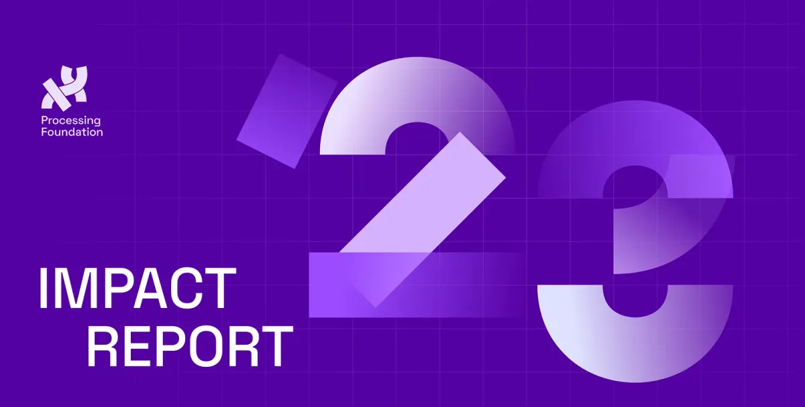

*2023 Impact Report Graphic created by Design Systems International (DSI).*

Reading this report, you will learn about our commitment to community building through various events like CC Fest, p5.js Access Day, and partnerships for open-source arts, fostering collaboration, learning, and celebration within the community.

The report also highlights the foundation’s internal developments, including expanding the core team and a strategic shift in the Board of Directors toward greater diversity and community representation. The fellowship program remains a cornerstone of our mission, supporting diverse artists, technologists, and educators in pioneering projects at the intersection of art, science, and technology. We also outline the foundation’s budget, spending priorities, and investment strategies, emphasizing sustainability and long-term planning. Our dedication to nurturing a vibrant, inclusive community at the nexus of arts and technology is reflected in the ways we work together at the foundation.

Please check out our [Impact Report here](https://processingfoundation.report)!

We hope to keep supporting the creative code and open source community, year after year. Want to support the Processing Foundation in this work? [Donate here](https://processingfoundation.org/donate) to support our ecosystem of open source contributions!
