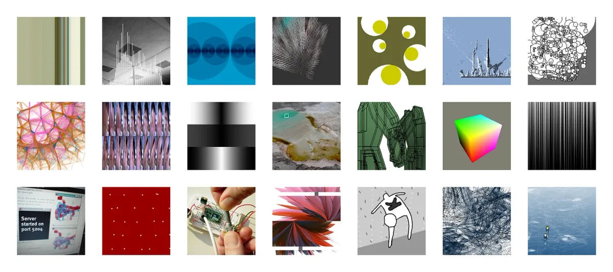
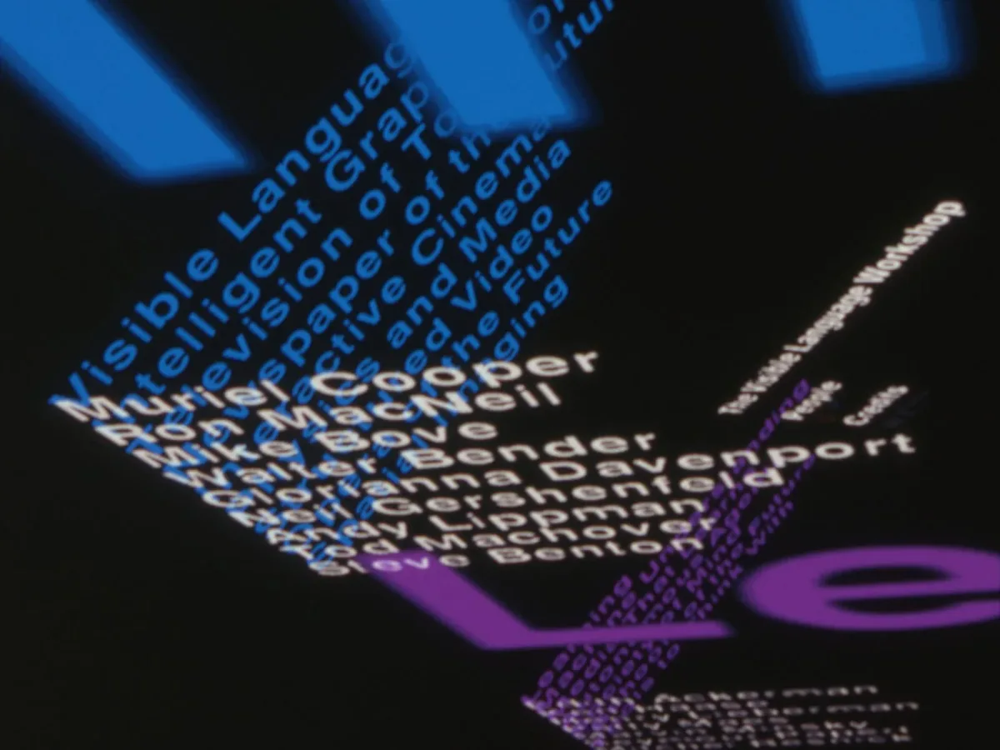
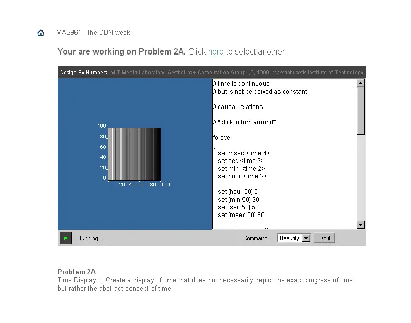
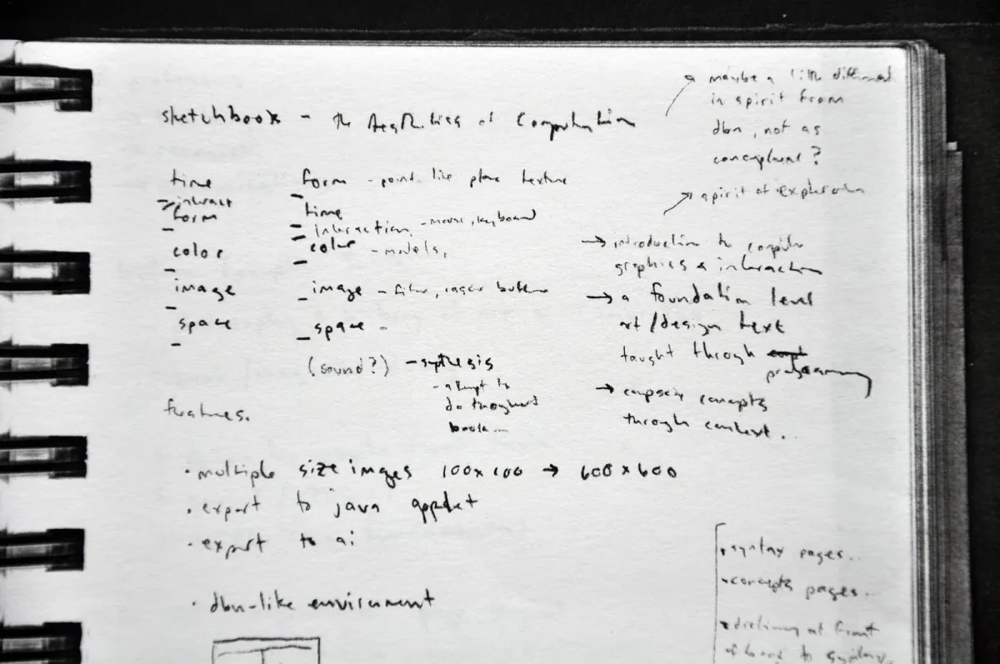
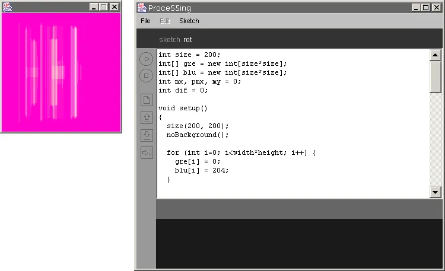
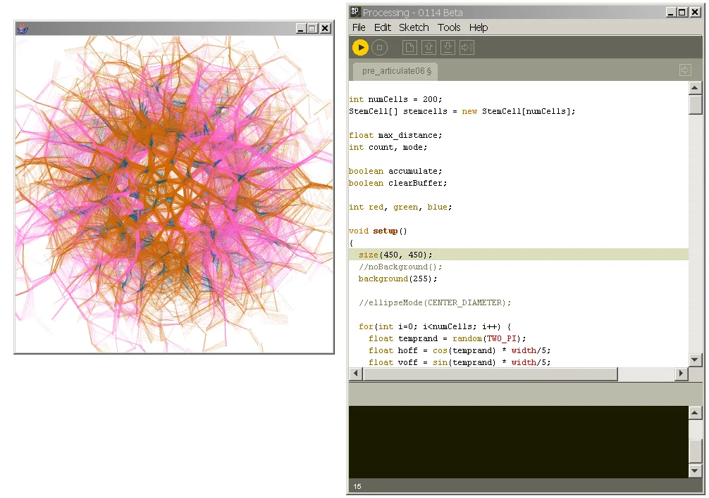
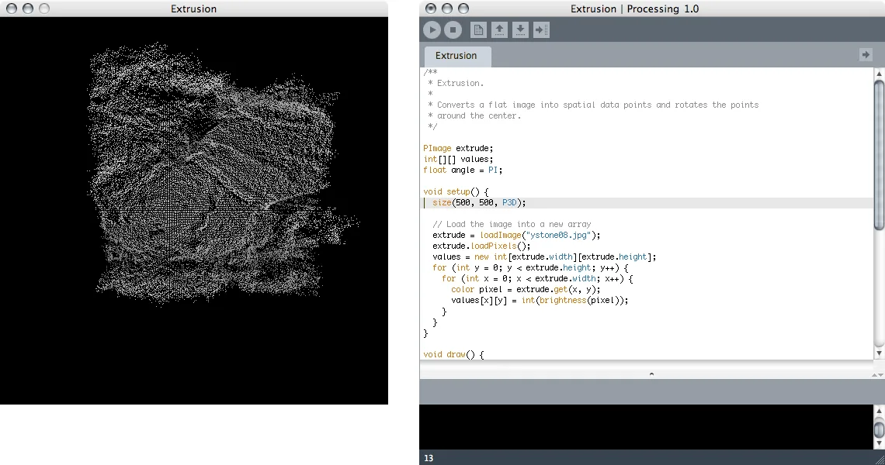
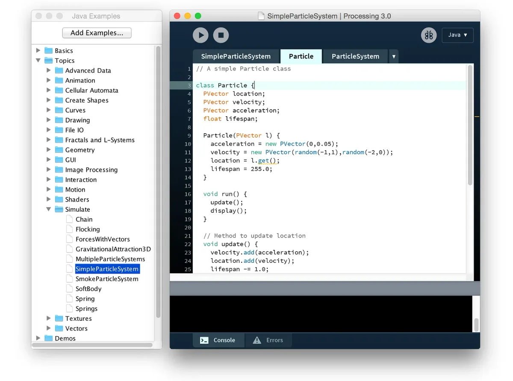
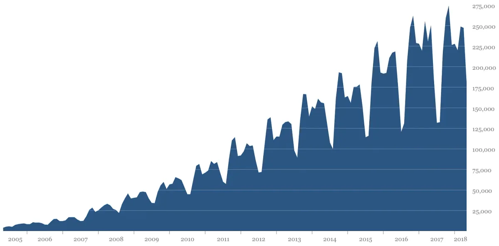
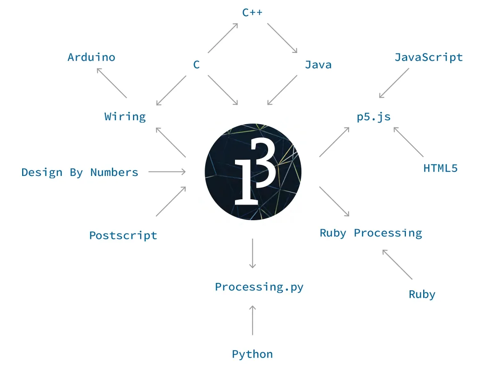

*Selection of images created from Processing examples in 2003 to show a range of 2D/3D techniques, drawing with geometry and photography, and networking and physical computing (electronics) capabilities.*

When we started Processing in 2001, the goal was to bring ideas and technologies out of MIT and into the larger world. One idea was the synthesis of graphic design with computer science, combining the visual principles of design with ways of thinking about systems from computer science. We also wanted to share a way of working with code where things are figured out during the process of writing the software. We called this *sketching* with code. A third idea was to share what we had learned about how to teach programming to designers — to share this beyond the people we could teach directly through our workshops and classrooms. We wanted to spread this as far as we could.

This was all made possible by a set of programming tools we created specifically for making pictures, for choreographing animation, and for creating interactive work. Over many years, we refined a set of elements for creating visual design with code. Additionally, we didn’t start this work from scratch, we built on top of existing ideas and code from people who worked in this area before us.

### The Lab

Processing has direct origins at the MIT Media Lab back going back to The Visual Language Workshop (VLW.) The VLW was founded in 1975 and it became a founding research group at the Lab from 1985 to 1994, when Muriel Cooper, the director, passed away. Cooper was a graphic designer at MIT, first at the Office of Publications and later as the founding art director at MIT Press. The VLW focused on traditional design considerations within the domain of screen-based publication and information spaces. One of the most compelling and public demos to emerge from the VLW was *Information Landscapes*, a three-dimensional presentation of animated, interactive typography that was well ahead of its time. Processing was hugely influenced by the research and people within the VLW.



*Information Landscapes. Muriel Cooper, David Small, Suguru Ishizaki, Earl Rennison, and Lisa Strausfeld, 1994. Image copyright Massachusetts Institute of Technology. Courtesy Visible Language Workshop Archive, MIT Program in Art, Culture and Technology (ACT).*

Processing emerged directly from the Aesthetics and Computation Group (ACG), a research group started at the Media Lab by John Maeda in 1996. Maeda’s research at the Lab continued to synthesize visual design exploration with emerging software technologies. The students he recruited worked within similar themes to the VLW and their work continued research into programming tools to create visual media. David Small was the one person to start in the VLW and to graduate with his PhD in the ACG. His work and knowledge established a continuity.

Within the ACG, code was most commonly written with the C++ programming language and a graphics toolkit called ACU that was started by Ben Fry, with Tom White and Jared Schiffman contributing significant portions as well. In the late 1990s, when we started at the Media Lab, ACU was used on Silicon Graphics Octane and O2 workstations, computers that cost tens of thousands of dollars at that time. By the year 2000, ACU was used on PCs configured with a graphics hardware that cost hundreds of dollars. This shift in hardware affordability is one of many reasons why, at the turn of the century, it became possible to create the kind of work created within the VLW and ACG outside of academic and corporate laboratories.

The ACG website remains online at [http://acg.media.mit.edu/](http://acg.media.mit.edu/) and there are a few personal backups. A slice of the work is archived in Maeda’s *Creative Code* book, published by Thames and Hudson in 2004. The [ACG concept videos](http://acg.media.mit.edu/concepts/) that Maeda encouraged us to make are low-resolution videos by today’s standards, but they show the work in motion as intended. Most of the [ACG MS and PhD thesis documents are online](http://acg.media.mit.edu/projects/theses.html) as well.



*Design By Numbers online coding system within the Courseware, an online system for writing code, turning it in, and exhibiting the results. This screen capture was made in 2000.*

John Maeda started the [Design By Numbers](http://dbn.media.mit.edu/) (DBN) programming platform within the ACG. Both the MIT Press book and software for the project were released in 1999. Maeda brought the two of us into the project after the initial release to help maintain and extend it. Many aspects of Processing were modeled after DBN, which also integrated a code editor with a language. DBN was a minimal system, the canvas was always 100 × 100 pixels and only gray values could be used — there was no color. These constraints, as well as comfortable code elements such as paper and pen made DBN easy to learn.

Teaching with Design By Numbers was a formative experience for us. Our first event was a workshop at the AIGA national headquarters on August 25, 1999. This “computational illustration” workshop was planned for people with no prior background in programming and even for people without much experience operating a computer. Maeda led the workshop and Tom White also assisted. Maeda later asked us and Elise Co to teach a series of workshops at RISD. For these and other workshops at the time, we designed and built the DBN Courseware software, a series of Perl scripts that allowed teachers to create exercises and students to upload their work directly to a web server.



*Notes in Casey’s sketchbook in 2001 from our first conversation about the project that would become Processing. There was an early focus on creating a coding environment that would be compatible with the tradition of foundation studies in art and design education.*

This experience kindled the ambition to start Processing. We started by extending DBN to include color and other features, but soon realized that these limitations were the essence of that platform and it shouldn’t be expanded. We wanted to make a system that was as easy to use as Design By Numbers, but with a bridge to making more ambitious work. We wanted to allow people to work in color, at large sizes, to create 3D graphics, and more. Simple Processing sketches are almost as simple as DBN sketches, but Processing scales up — it has a “low floor” and a “high ceiling.” The ceiling is more similar to the C++ programs we used to write with ACU partly because the rest of the Java programming language and its libraries were available.

### Language, Environment, Community

We created Processing as three parts: language, environment, community. Each part is essential; the project is defined by the interactions between all three.

#### Language

A Processing program is called a *sketch*. This is more than a change in nomenclature, it’s a different approach to coding. The more traditional method is to resolve the entire plan for the software before the first line of code is written. This approach can work well for well-defined domains, but when the goal is exploration and invention, it prematurely cuts off possible outcomes. Through sketching with code, unexpected paths are discovered and followed. Unique outcomes often emerge through the process.

Processing isn’t a language created from scratch, it’s a hybrid between our own elements and the Java programming language. As a minimal example, this is how the standard “Hello World!” program is written in Java:

```java
public class HelloWorld {
  public static void main(String[] args) {
    // Prints "Hello, World" to the terminal window.
    System.out.println("Hello, World");
  }
}
```

This program encloses the line that writes the text to the screen within two layers of additional detail that are important for large programs, but are confusing for a simple program. This is how the same result is achieved in Processing:

```java
print("Hello World!");
```

This “Hello World!” example, however, has very little to do with the essence of Processing — writing code to make pictures. This is a more common first Processing sketch:

```java
line(10, 20, 90, 80);
```

This code draws a line to the screen from coordinate (10, 20) to (90, 80). A more interesting short Processing sketch draws the line from the center of a 500 × 500 pixel canvas to the position of the cursor:

```java
void setup() {
  size(500, 500);
}

void draw() {
  line(width/2, height/2, mouseX, mouseY);
}
```

Because Processing is made for creating pictures, the language includes elements specifically for working with form, color, geometry, images, etc. At the same time, any code that can be used in Java can also be used in Processing. The main idea is to make it easy to do simple visual things, but to also allow a more experienced programmer to do complicated things within the same language.

#### Environment

The *environment* is the software application that sketches are written within. The Processing environment is called the PDE, the Processing Development Environment. The current PDE for Processing 3 has just a few buttons to Run and Stop sketches and to turn on and off the Debug mode. (The earlier PDEs had a few more to Open, Create, Save, and Export sketches.) The primary idea of the PDE is to make it quick and easy to starting writing sketches. The secondary idea is to use the PDE as a sketchbook, a place to save the sketches and to provide easy access open and run them. The PDE can also open and run examples sketches and can easily link to the Reference.



*Processing ALPHA IDE running on Windows.*



*Processing BETA IDE running on Windows.*



*Processing 1.0 IDE running on Mac OS.*



*Processing 3.0 IDE with Examples menu open on Mac OS.*

The PDE was created for beginners and not everyone uses the PDE for writing sketches. Some people use other programming environments like Eclipse and other text editors like Sublime Text 2 to work with Processing. The PDE has evolved since 2001 with the Processing 3 PDE presented a major step forward.

#### Community

The *community* is the group of people who write Processing sketches and who share work and code with each other. We’ve never written custom software to support community engagement, but we’ve used existing Forum software and different community members have created new opportunities. Early versions of Processing exported sketches to Java Applets and at the time, that was an easy and convenient way to share work through the web. By default, exported sketches included a link to their source code and the web page included the text “Built with Processing.” This phrase was a simple search term to explore work created by others and the source code included on the page was a way to learn how that sketch was created. Users could remove the links to the source code, but we wanted sharing to be the default. We learned coding in large part by looking at others’ code, and wanted this openness to be central to the project.

The first Processing Forum, at that time called *Discourse*, was launched August 2, 2002. The first posts in the *Introductions* sections were made by REAS, adrien, re|form|at, eviltyler, tomek, ik0, fdb, Josh Nimoy, Mike Davis, Takachin, edwardgeorge, riboflavin, jes, and Alex. For the first few years, the Discourse was a vibrant space. It was a place where people shared and helped each other. We were all exploring together and some people who knew more than others were generous in offering advice. The “alpha” forum was closed in 2005 and replaced by the “beta” forum, which was closed in 2010 for the “1.0” Forum. The complete set of prior forums are archived online: [Alpha Forum](https://forum.processing.org/alpha/), [Beta Forum](https://forum.processing.org/beta/), [1.0 Forum](https://forum.processing.org/one/), [2.0 Forum](https://forum.processing.org/two/). In May 2018, we launched our [fifth forum](https://discourse.processing.org/), once again called *Discourse*.

In the spirit of community, individuals have created other opportunities for learning and sharing. The longest-running and most prominent effort is Sinan Ascioglu’s OpenProcessing, which recently launched a new interface that is compatible with [p5.js](https://p5js.org) sketches. Earlier initiatives include the Free Art Bureau’s *Processing Cities* initiatives to start user groups in cities around the world, Tom Carden and Karsten Schmidt’s Processing Hacks wiki, and Tom Carden’s blog aggregator. Early social media sites created community and energy around Processing through tags used within sites like Del.ici.ous and Flickr. OpenProcessing is going strong, but these other initiatives have changed as the web and the community has shifted.

The Processing source code has been available online for many years, first through SourceForge and later through Google Code, but our move to GitHub in 2013 started a new kind of community around Processing through increased quantity and quality of code contributions. GitHub makes it easier to integrate contributions and to discuss details. It also helped the expanded development teams to communicate and track software changes. A [full list of contributions](https://github.com/processing/processing/graphs/contributors) to the Processing core software reveals this ongoing work.

The most essential community contributions to Processing are the Libraries. There are over one hundred [Processing Libraries](https://processing.org/reference/libraries/) that extend the software in different directions beyond the core. In categories ranging from Data to Simulation to Video & Vision, the Libraries are independent pieces of software that integrate into the Processing language. Most Libraries are developed by independent community members and the source code and examples are made available for everyone to use and learn from.

### On Growth and Form

Processing started with a few notes in a sketchbook in spring 2001. In fall of that year, Ben taught the first workshop at Musashino Art University in Japan. This pre-alpha version of the software, Processing 0005, was minimal, but this early version of the language was integrated into a spare Processing environment. Because Casey was teaching at the Interaction Design Institute Ivrea in Italy at the time, many early workshops were in Europe. Processing evolved rapidly through these early workshops and the language was frequently changed during the alpha release period. We’re grateful for the institutions that gave us a chance and the opportunity to spend time with their students.

In the early days, the project was called Proce55ing and the website was [www.proce55ing.net.](http://www.proce55ing.net.) In the very beginning the project name was always changing: Pr0c3ssing, Pro35sing, Pr0cess1ng, etc. We changed the name to “Processing” and the website to [www.processing.org](http://www.processing.org) in 2004 to reach a wider audience. In general, the name of the project has received continuous snarky comments from people who don’t like it, to frustrated people who can’t find related information in search queries. The idea of the name “Processing” was to focus on “process” over final results and to indicate the active state of software; it’s always running, it’s realtime media.

For the first few years Processing was distributed to people who signed up through the website. At that time, we were still working our way through the software agreements with MIT and the software was rough. The first [www.proce55ing.net](http://www.proce55ing.net) site went online October 20, 2001 with a set of examples, a reference, and the following text:

> Proce55ing is an environment for programming images, movement, and interaction. It is a sketchbook for developing ideas, a tool for creating prototypes, and a context for learning the fundamentals of computer programming. The Pr0cess1ng environment is in its early stages and will continue to develop.

> Pr()ce55ing is written in Java and enables the creation of Java Applications and Applets within a carefully designed set of constraints. It uses a 2D/3D Java rendering API that is a cross between postscript-style imaging in 2D and 3D rendering with OpenGL.

Before the 1.0 version of the software, we named the releases in order, rather than using the more traditional software release numbering (1.0, 2.0, etc.) For instance, Processing 0069 was the 69th release of the software. After we switched the style of numbering, we continued both for a time; Processing 1.5.1 is also release 0197. Revision 0069 was the last alpha release, revision 00161 was the last beta release, and release 1.0 is also 0162. [The dates and notes for every release of Processing are online at GitHub](https://github.com/processing/processing/commits/master/build/shared/revisions.txt).

In 2007, we published the Processing textbook, *Processing: a programming handbook for visual designers and artists*. This textbook, published with MIT Press, defined our vision for how Processing could be used in a university classroom. It was developed through years of direct classroom experience teaching at UCLA and Carnegie Mellon. The software is discussed within the context of the history of experimentation within the visual arts and technology. It includes interviews with professionals in the expanded fields of animation, performance, and graphic design. A set of Extension chapters expand the domain into audio, computer vision, electronics and other topics. This book, in addition to *Learning Processing* by Daniel Shiffman and *Processing: Creative Coding and Computational Art* by Ira Greenberg were the first round of Processing publications that further extended the reach of the software in academia. A more [complete list of books](https://processing.org/books/) written with Processing is published on the Processing website. Over time, energy has shifted away from books and onto online instruction and video tutorials.



*Number of times the Processing software is opened on unique computers each month from 2005 to early 2018. The peaks and valleys are correlated with the academic year with the highest points in the fall and the lowest during the summer. This data doesn’t account for shared computer use or when people turn this reporting off in the software Preferences.*

The number of people using our software continues to increase. As a part of this transition, the direct link between us and the original community spread so thin that the single Processing community has become a series of more fragmented groups associated around school, cities, social media platforms, or topics. The Processing software and the people who used it were largely synonymous in the beginning, but over time, it’s become a piece of software that people use without a knowledge of the original context. This was a difficult and slow transition, but it provided new opportunities for more people to be involved and for the software and its core ideas to spread. As the community grew, it became increasingly difficult to determine how and why people were using the software, and therefore it became harder to focus the development. Recently, the software has started to be used more frequently in high schools, mostly for classes in math and science. Universities continue to integrate the software into curricula; it has expanded into computer science and humanities departments.

### The Present

We have had growing pains where the expectations of the community and the complexity of the software have outpaced our ability to maintain and improve it. The vast majority of the code is written by the same small number of people volunteering their time — there are no paid full-time developers. Technology shifts like moving from 32-bit to 64-bit operating systems and the emergence of high-resolution screens have created the need for significant updates even to continue running on ever-evolving operating systems and hardware. We started the Processing Foundation in 2012 along with Daniel Shiffman to expand our reach and to support the software development. Lauren McCarthy is now the fourth member of the Foundation Board and we have additional collaborators and advisors.

The original mission of Processing was to create software that made learning to code accessible for visual people (designers, artists, architects) and to help a more technical audience work fluidly with graphics. We aspired to empower people to become software literate — to learn to *read* and *write* software. We wanted to change curriculum in universities and art schools around the world. Instead of teaching students how to *use* software, we thought it was just as important to teach them how to *create* software.

The further expedition of the Processing Foundation is to make code more accessible to an even wider audience. Toward this goal, we’re investing our resources in mentoring and in collaboration. We believe in the synthesis of the arts and technology, and we know the arts are a necessary part of education from a young age. We don’t want to live in a world where technology is developed without ideas and input from the arts and where only some people have access to learning to code.



*Processing has been influenced by other coding systems and it has influenced others.*

Right now, we’re at the start of Summer of Code 2018. Through this program, sponsored by Google, we’re mentoring fifteen students to learn about software development. These students are working on different parts of the Processing Foundation software. We’re also in the middle of our [2018 Fellowships](https://processingfoundation.org/fellowships) cycle. A Processing Fellowship is a grant with mentorship that allows an individual or group to realize a project within the mission of the Foundation. We awarded nine Fellowships this year. We’re working with the Fellows on a wide range of projects: developing high school curricula, teaching coding on smart phones in Ghana, documentation for p5.js developers, improving the accessibility of our tools, and creating a new website build system for Processing.org, to name a few.

From the original Processing software, the Foundation is now supporting a range of different projects. The p5.js project is a JavaScript reimagining of Processing within the context of contemporary web browsers. This project was started and is led by Lauren McCarthy. Processing.py was started by Jonathan Feinberg and it’s now a Mode for the Processing 3 editor. Additionally, Andres Colubri is extending Processing for Android as a Mode for Processing 3. Gottfried Haider has written code to get Processing 3 running well on Raspberry Pi and CHIP hardware, and he has written a library to read and write directly to the I/O pins. These inexpensive computers are in line with the original mission of Processing, to make learning to code accessible and enjoyable.

A more complete list of people who are contributing to Processing, and who have contributed in the past, is available as the [People](https://processing.org/people/) page on the Processing website. Contributions through GitHub are diagrammed within the [Processing Foundation repositories](https://github.com/processing).

We’ve been working on Processing now for nearly seventeen years. It’s difficult to remember clearly what it felt like in 2001, when the first website went public or the day the Processing Alpha software was released on February 2, 2004. We have an archive of documents and “to do” lists and every change made to the code has been tracked, but this data doesn’t capture the mood or personal impact. We hope this short text helps to bridge Processing in 2018 with its past. Most essentially, Processing is about people. It’s about individuals and collective learning and exploration; it’s about sharing ideas and giving what you can.
