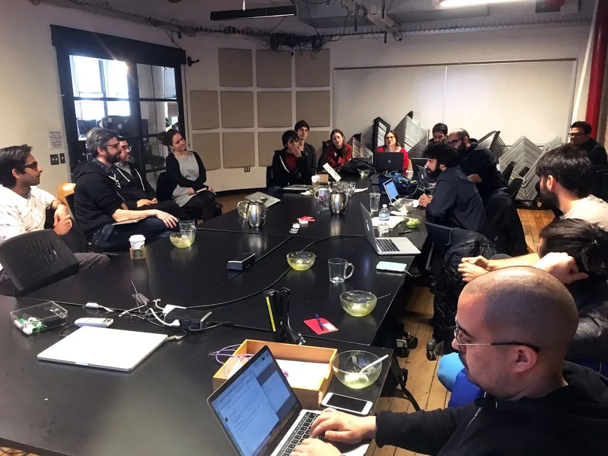
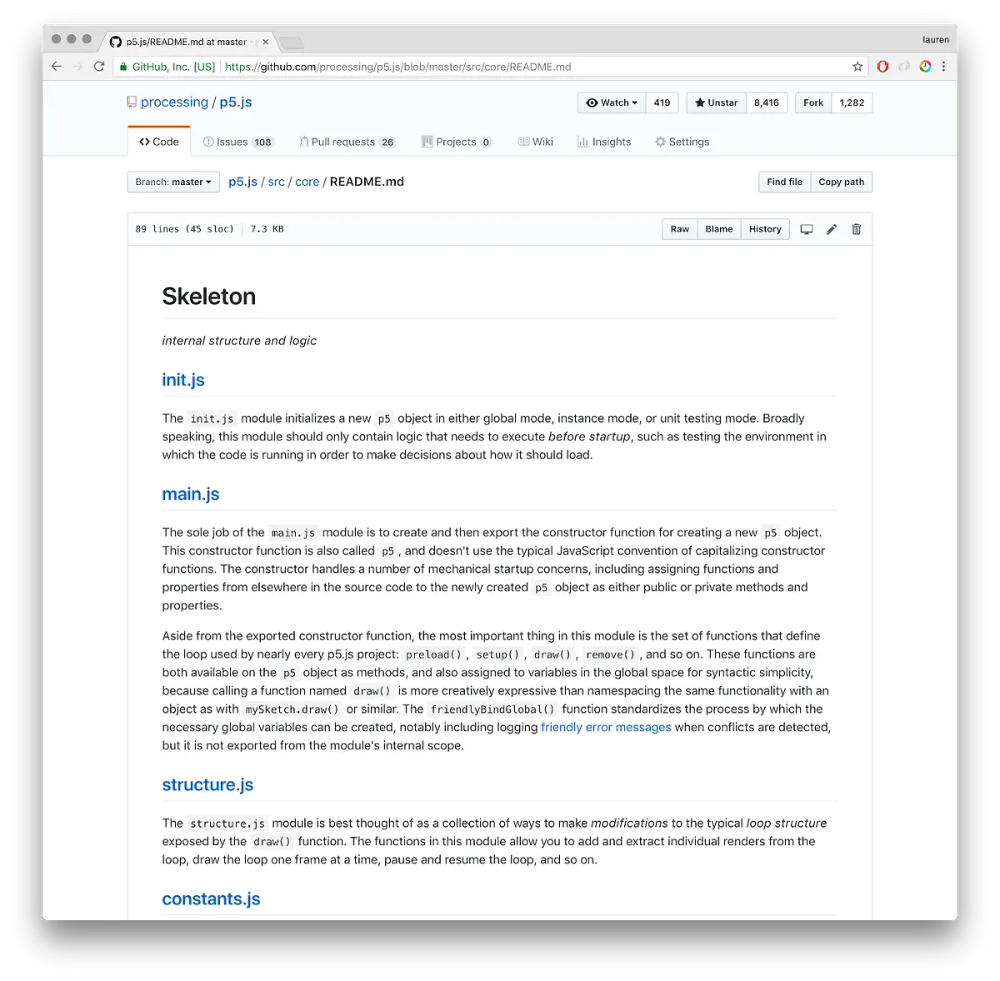

2018 Processing Foundation Fellow

---

*The 2018 Processing Foundation Fellowships sponsored* [*eight projects*](https://medium.com/processing-foundation/introducing-the-2018-processing-foundation-fellows-a16ae4e87f80) *from around the world that expanded the p5.js and Processing softwares and their communities. Fellows developed work ranging from Chinese translation of the p5.js website, to workshops that teach smartphone coding in Ghana. During the coming weeks, we’ll post articles written by the fellows and interviews with them, in conversation with Director of Advocacy Johanna Hedva, that showcase and document the great work by this year’s cohort.*

---

**p5 contributors meeting at NYU* — *the gang’s all here! \[image description: Fifteen people assembled in a room around laptops.\]**

My goal for the Processing Foundation fellowship was to document how p5.js works internally by putting together written descriptions of the architecture and underlying principles to help contributing developers. I initially proposed this because I find reading, writing, and even just thinking about software engineering to be every bit as rewarding as coding, but p5’s creator Lauren McCarthy quickly redefined it as a matter of diversity and inclusion — because, as she later put it to me, “Documentation is one way to enable people to enter a project, and make them feel welcome to do so.” Let’s try not to scare off new contributors.

After a kickoff meeting hosted by the [ITP](http://tisch.nyu.edu/itp) program at NYU, I began by reading the codebase and asking Lauren a ton of questions, which were probably some combination of obvious, obnoxious, and occasionally illuminating. One major difference from most of the other software documentation efforts I have helped out with in the past is that, with p5.js, some of the exchanges were structurally adversarial at times. That is, Lauren sometimes pushed back on my proposed language to make sure we were documenting the code in a way that remained true to project goals. Take the educational intent, for example, which was prioritized whenever I suggested changing something in the interest of performance or engineering best practices that might have been more difficult for newcomers to grasp. In turn, I sometimes had to ask the same question repeatedly or rephrase it if I didn’t think the initial answer was clear enough to work for the purpose of documentation.

Our threads would often start with me focusing on something that didn’t seem to be self-explanatory, and then nitpicking in an attempt to figure out how it had ended up that way. There were usually good reasons for everything, and I picked up some design patterns that I hadn’t seen before but will probably now start using myself, but p5 also has occasional baffling peculiarities. (My favorite so far is the unusual behavior of the [loadJSON()](https://p5js.org/reference/#/p5/loadJSON) function: “even if the JSON file contains an Array, an Object will be returned with index numbers as keys.” I don’t know either, man; our world is a strange and fascinating place!) Sometimes it took a frustrating amount of time for things to start clicking in my head, but when we finally managed to get there, the insights arrived in torrents, and I’d find myself able to write in large chunks about principles that hadn’t been previously articulated, the project’s implicit rules now made explicit in pieces and groups and networks.

**How does it all work??? \[image description: Close-up of an architectural blueprint.\]**

In any given software project, it’s rarely feasible to document everything, so figuring out how to prioritize was a key turning point. Lauren guided me toward the things that would constitute high-value documentation, after which I focused my efforts on understanding those specific files, often at the expense of others. To this day I still can’t tell you how p5’s WebGL functionality works, but that’s actually probably fine, because I can instead explain in detail how a new p5 object is initialized, and the latter is relevant to every other part of the codebase, including the WebGL bits.

**Resulting documentation was published on GitHub. \[image description: screenshot of Github page.\]**

One particular question that we interrogated a lot was about how p5 conceptually relates to addon libraries. For example, p5.dom is provided as a separate script, but is included in the main repository, whereas p5.sound is provided as a separate script from a separate repository. Discussing what these boundaries meant and why they had been established led us to all sorts of useful conclusions about what p5 is trying to accomplish — and, just as importantly, what is out of scope for the project or otherwise a diversion. For example, we realized that the p5.js equivalent to the “sketch” concept in Processing is the entire browser window, which in turn suggests that p5.dom should probably be folded into the library at some point instead of distributed separately. That change is now on the roadmap. Answering these questions, or in some cases even merely posing them, creates a clearer path forward.

**Are we there yet? \[image description: satellite image of a map.\]**

I’ll probably never understand why some people find software documentation tedious; here, I got to spend a couple months spelunking inside the guts of a cool tool for building interactive art projects, and then directly ask its creators to teach me the things I didn’t understand. If that sounds like fun to you too, maybe you should consider applying for one of next year’s Processing Foundation fellowships. In the meantime, p5.js is ready to onboard some new contributors.
