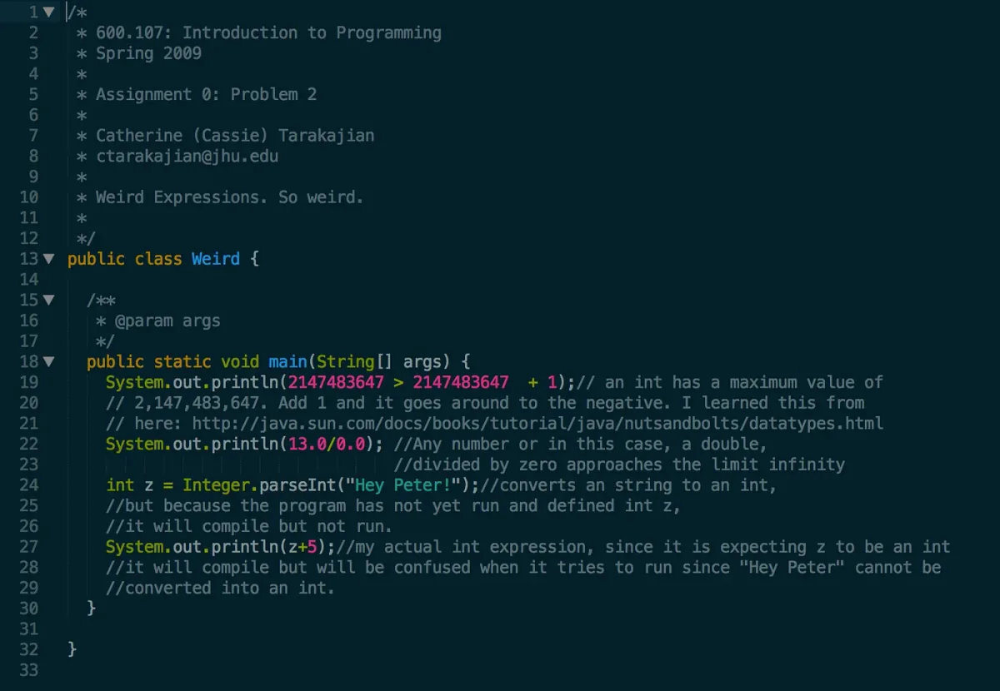
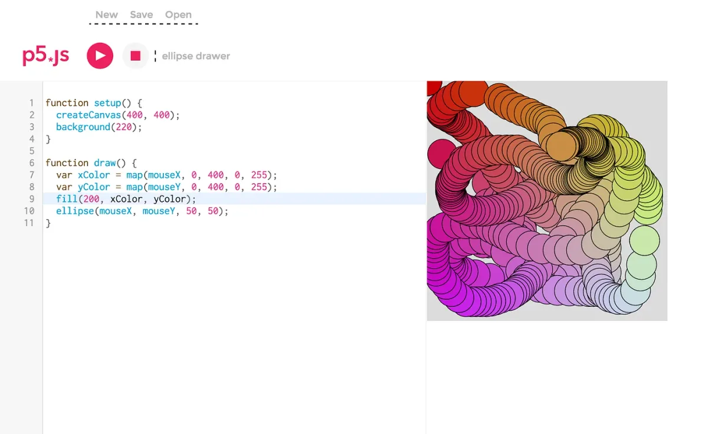
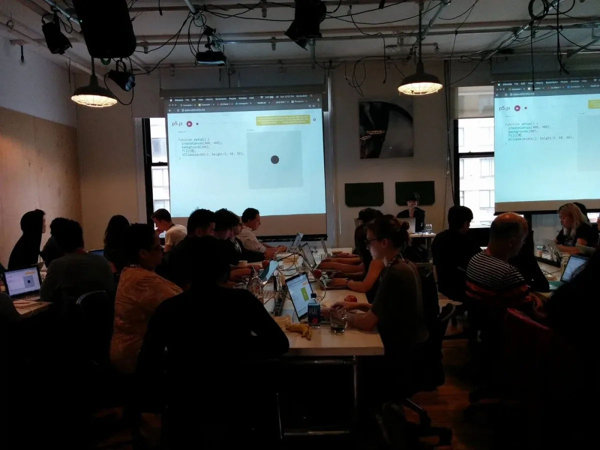

The 2017 Processing Foundation Fellowships supported an unprecedented [seven research projects](https://processingfoundation.org/fellowships) that expanded the p5.js and Processing platforms and their communities. Fellows developed work ranging from bilingual zines, to accessible coding curriculum to be taught in prisons, to workshops aimed at teaching code to women, non-binary, and femme-identifying folks. Throughout the summer we’ll be posting a series of articles — some written by the fellows, some in conversation with Director of Advocacy, Johanna Hedva — that showcase and document the great work by this year’s cohort.

---

*[Cassie Tarakajian](https://github.com/catarak) is a software developer, hardware engineer, creative technologist, and artist. She is a cofounder at the digital creative agency [Girlfriends](http://girlfriends.site/), an engineer at Cycling ’74, and a contributor to open source. She is interested in ways that art drives technology and vice versa. For her Fellowship Cassie was mentored by [Daniel Shiffman](http://shiffman.net/) and [Lauren McCarthy](http://lauren-mccarthy.com/), and her Fellowship was sponsored by [NYU ITP](http://itp.nyu.edu/).*

Even though the Processing Fellowship began in February, I’ve been working on the p5.js web editor since April of 2016. It’s been a humbling and rewarding experience, and I can’t wait for the editor to be officially released and shared with the world.

I’ve been a fan of Processing and p5.js for a while, but I didn’t learn about them until late in my programming career. I was fascinated by how easy they were to use, even for novices, to make really cool stuff in a short amount of time. It was much different from my experience learning how to code, in 2009. I took an Introduction to Java class, in which my professor taught lectures using [vim](http://www.vim.org/) and the command line. I wasn’t a computer kid so it was pretty overwhelming, and it felt like everyone knew what was going on except for me. By the end of a semester-long class, all I could do was make command line applications, which none of my friends were impressed by.

*My unimpressive, first programming assignment from an introduction to programming class in 2009.*

When approached to create a web editor for p5.js, the goal was to create a tool to make coding accessible to anyone. Well, that was the dream goal. The first step was to make an editor with the smallest number of features to teach the basics of p5.js. Before I knew it, I was the lead developer on an open source project, which felt to me like one of the biggest responsibilities I’d ever had. I had to be the one to make all of the technical choices? [Do you know what it’s like to write JavaScript in 2017?](https://hackernoon.com/how-it-feels-to-learn-javascript-in-2016-d3a717dd577f)

Since I started, I’ve backwards-engineered almost every online code editor and talked to lots of the people that made them. [I’ve spent many hours listening to Dan Abramov’s voice, teaching me Redux.](https://egghead.io/courses/getting-started-with-redux) I quickly made something that worked — just making an app that takes code from a text area and injects it into an iframe is surprisingly easy — and the rest of my time has been the other 90 percent of the app, such as making it secure, configuring AWS, and [making a login system that actually works.](https://github.com/processing/p5.js-web-editor/issues/87)

*An early version of the p5.js web editor.*

I’ve also learned how to build and manage an open source community. It was important to me that not only the editor itself be easy to use, but contributing to the editor be accessible as well. I’ve collaborated with and mentored many people, which has been an invaluable experience. I love watching people contributing to open source and making their first pull request.

I’ve also loved teaching workshops with the editor and watching people use my creation at various stages of its completion. Last summer I taught a workshop at Pioneer Works and I hadn’t yet added the ability to sign out. Luckily, people are pretty forgiving and excited to offer suggestions for changes or new features. Because of all the user testing, we’ve had lots of discussions about how to make the editor better for students, teachers, teenagers, and people with low vision or blindness (shoutout to [Mathura](https://github.com/MathuraMG) for all of her amazing work!)

*Teaching an introduction to creative coding class at ITP Camp.*

I’m excited to keep working on this project and see where it goes. It wouldn’t have been possible without the support of Dan Shiffman and Lauren McCarthy, as well as [all of my amazing contributors](https://github.com/processing/p5.js-web-editor/graphs/contributors), and of course, the support of the Processing Foundation and [NYU ITP](https://tisch.nyu.edu/itp).
