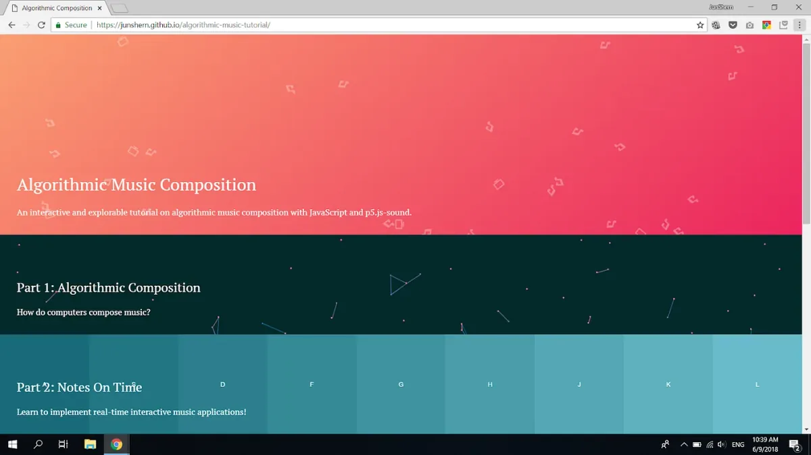
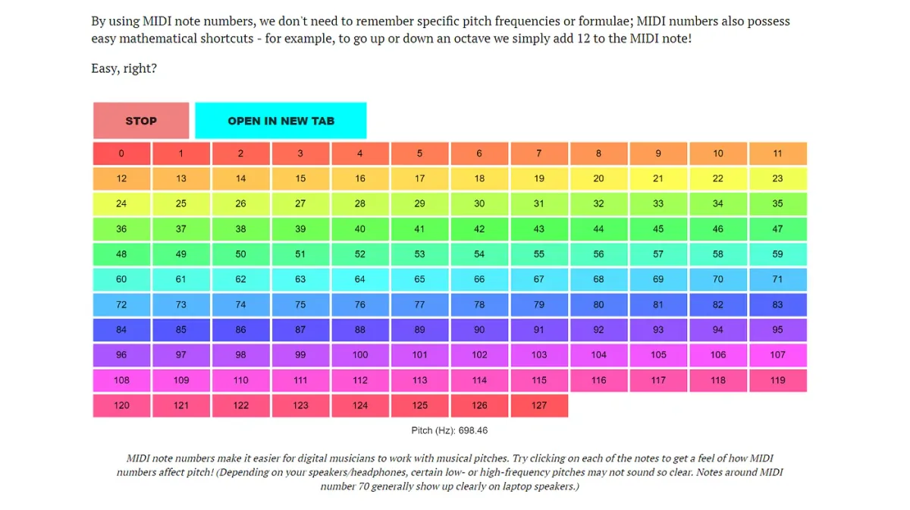
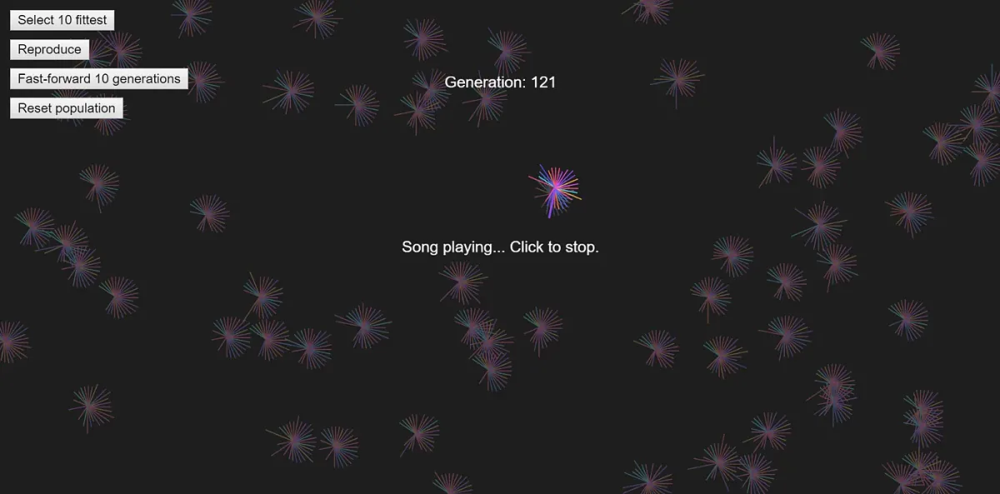
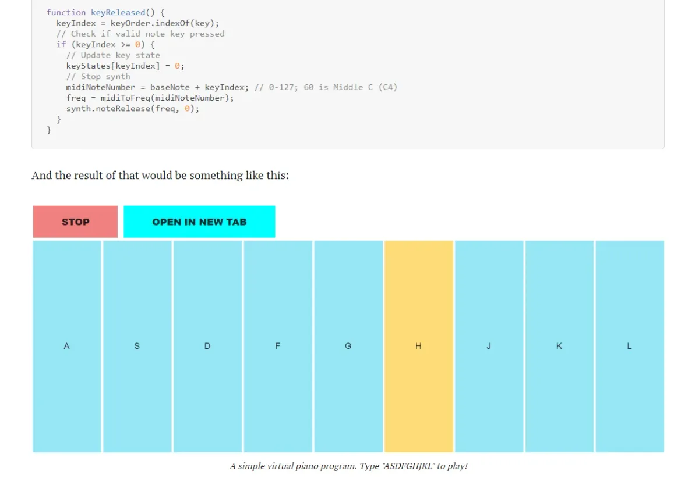

Google Summer of Code 2018

mentored by [Jason Sigal](http://jasonsigal.cc)

---

*This summer was the Processing Foundation’s seventh year participating in Google Summer of Code. We received 112 applications, a significant increase from previous years, and were able to offer 16 positions. Over the next few weeks, we’ll be posting articles written by some of the GSoC students, explaining their projects in detail. The series will conclude with a wrap-up post of all the work done by this year’s cohort.*

---

**The homepage for the project’s culminating* [interactive tutorial on Algorithmic Music Composition](https://junshern.github.io/algorithmic-music-tutorial/)*. \[image description: A screenshot of a browser window split into three parts, each with a different color and a few simple graphics made of lines. The top part, which has a gradient of pink to orange and music note symbols, reads, “Algorithmic Music Composition, An interactive and explorable tutorial on algorithmic music composition with JavaScript and p5.js-sound.” The middle part, which is a dark green, and has symbols of lines and points, reads, “Part 1: Algorithmic Composition, How do computers compose music?” The bottom part, which shows a scaled gradient of blue-green, and different letters, reads, “Part 2: Notes on Time, Learn to implement real-time interactive music applications!”\]**

As a person with equal parts enthusiasm for music and code, I’ve always been intrigued by the idea of using technology to enhance and propel our experiences with music. So, for my 2018 Google Summer of Code project, I chose to work on algorithmic music composition with [the p5.sound library](https://p5js.org/reference/#/libraries/p5.sound).

p5.sound is an add-on library that equips p5.js with the ability to do all manner of audio-related tasks, from playing a sound file to applying audio effects directly on the browser. At the start of summer 2018, when I began my project, the p5.sound library provided basic support for synthesizing sounds at different frequencies, and gave access to the Web Audio clock, which allows for accurate audio-scheduling. These features provided a solid foundation for working with generative music, but there was still a lot of experimenting and fine-tuning to do before the library was ready for general composition use.

There were many questions to consider about how a composition program might look in the context of a p5.js sketch: How do we represent musical qualities like pitch and velocity in code? What about timing information? How do we write a program which handles composition tasks and visual animation simultaneously, and how do we make sure both tasks can interact and sync with one another? Most importantly, how do we make all of this simple and intuitive to use?

*[Part of the tutorial](https://junshern.github.io/algorithmic-music-tutorial/part1.html#composition_building_blocks) *written for the project, explaining the usage of MIDI note numbers to represent pitch information. \[image description: A chart of different colors that show different frequencies of pitch as they correspond to MIDI note numbers. Text at the top of the image reads, “By using MIDI note numbers, we don’t need to remember specific pitch frequencies or formulae; MIDI numbers also possess easy mathematical shortcuts — for example, to go up or down an octave we simply add 12 to the MIDI note! Easy, right?” The text at the bottom of the chart reads, “MIDI note numbers make it easier for digital musicians to work with musical pitches. Try clicking on each of the notes to get a feel of how MIDI numbers affect pitch! (Depending on your speakers/headphones, certain low- or high-frequency pitches may not sound so clear. Notes around MIDI number 70 generally show up clearly on laptop speakers.”\]**

These were tough questions to answer well, but thankfully I had an amazing mentor, Jason Sigal, to help me. Jason created and maintains the p5.sound library, and has been part of GSoC in the past, as both a mentor and participant. He was able to give me a lot of useful advice on both the technical and non-technical side of things.

*Contributions*

Throughout the summer, Jason and I were able to produce eight new instructive examples related to algorithmic composition, starting from basics like how to play a note, to more advanced topics like demonstrating composition algorithms. These examples currently live on the [p5.sound examples page](https://processing.github.io/p5.js-sound/), and are soon on their way to joining the main examples [on the p5.js website](https://p5js.org/examples/).

**The* [genetic music example](https://junshern.github.io/algorithmic-music-tutorial/part1.html#composition_genetic) *demonstrates the use of evolutionary techniques to “breed” a population of the fittest songs according to some “musical fitness” rules. \[image description: A black background with sporadic clusterings of small bursts of lines in red and green. The text in the upper left hand corner reads like a menu: “Select 10 fittest, Reproduce, Fast-forward 10 generations, Reset population.” In the center of the image, near the top, the text reads, “Generation: 121.” Below it is one of the shapes of bursts of lines, its colors brighter than the rest, in hot pink, yellow, red, blue, and green. The text in the center of the image reads, “Song playing… Click to stop.”\]**

Interestingly, we found that the more we worked on the examples and tried to make them sound good, the more we had to hand-engineer ideas from musical theory into the code. At the same time, we could never really know what results we’d get when we put new rules into the system. This was challenging yet exciting at the same time, and suggests that perhaps the role of algorithms in music will never be to replace humans entirely, but to facilitate new ideas and give us new ways to be creative.

In the process of building our examples, we also ended up fixing a number of bugs and adding better documentation for the library, so p5.sound is now in better shape than ever!

You can find more specifics on the contributions made during this project [here](https://github.com/processing/p5.js/blob/master/developer_docs/project_wrapups/junshern_gsoc_2018.md).

*A Tutorial On Algorithmic Music Composition*

As I worked on the project, I realized that I might be able to use the examples we had created to put together a useful resource for others who want to work on generative music. With Jason’s guidance, I put together an interactive and explorable web tutorial, which encompasses all of the examples we built and the lessons we learned along the way.

Please check out the tutorial [here](https://junshern.github.io/algorithmic-music-tutorial/)!

Some features of the tutorial:

-   More than 10 interactive demos running p5.js sketches,
-   Sketches enabled and disabled according to scroll events using [scrollMonitor](https://github.com/stutrek/scrollMonitor),
-   Pretty and readable code snippets using [highlight.js](https://highlightjs.org/)

*[Part of the tutorial](https://junshern.github.io/algorithmic-music-tutorial/part2.html#time_instantaneous) *which explains how to make a simple virtual keyboard with p5.sound. \[image description: At the top of the image is a sample of code written in p5. Below it, the text reads, “And the result of that would be something like this:” Nine vertically oriented blue rectangles are in a line, representing keys of a piano. Each one has a letter on it, corresponding to the keyboard of a computer: ASDFGHJKL. The “H” key is highlighted in yellow. At the top of the keyboard, are two buttons: Stop and Open in New Tab. The text beneath the keyboard reads, “A simple virtual piano program. Type “ASDFGHJKL” to play!”\]**

*Final Thoughts*

All in all, it has been a highly satisfying summer, and I can now confidently recommend p5.sound as a capable and reliable library for developing algorithmic music. The examples and final tutorial show these capabilities quite well, and hopefully the work done in this project will enable and inspire many users to create their own algorithmic music applications!
