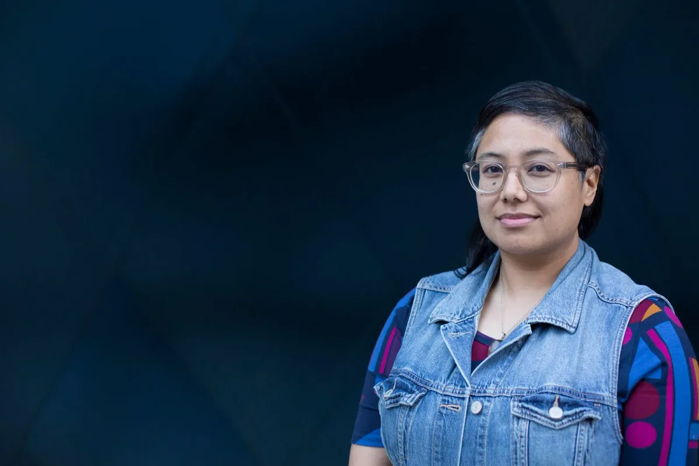

### Program Manager, Processing Foundation

*Dorothy R. Santos is a Filipina-American writer, editor, and curator whose research interests include digital art, computational media, and biotechnology. Born and raised in San Francisco, California, she is currently a Ph.D. student in Film and Digital Media at the University of California, Santa Cruz, as a Eugene V. Cota-Robles fellow. She serves as a co-curator for [REFRESH](https://refreshart.tech/) and, as of March 2018, is the Program Manager for Processing Foundation. (image description: Dorothy is pictured with glasses, a multi-colored shirt, and a jean jacket on the right side of the frame. The background is dark.) Photo by Tamara Porras.*

As my classmates and I gathered to form a single-file line to the school’s only computer lab, I remember anxiously waiting to hop onto the next available Apple II. Being raised in the heart of San Francisco’s Mission district by immigrant Filipino parents meant saving as much money as possible, which meant not having a computer or video games at home. Since I didn’t grow up with a computer in our railroad-style apartment, my access to technology was through school or going to a friend’s house, and school was the place where I started to learn the capacity and creativity of computing.

The first programming language I learned was [Logo](https://en.wikipedia.org/wiki/Logo_%28programming_language%29). I remember, with fondness, giving the little turtle on the screen directions for where to go and how to make shapes. I was in awe of what was happening then, and marveled at the fact I was playing and making with a machine.

For my mother, the primary reason to invest in a computer was for her own proficiency, which meant it was for labor and not creativity. The personal computer was an object with the purpose and intention of helping our family become part of the American dream. It was a tool to be used for work, efficiency, and productivity. But I craved to learn to go beyond that.

It wasn’t until junior high when my mother finally bought our family a personal computer. Unlike the Apple II, it was bigger and bulkier, but I loved all of its sounds and strange green text on the black screen. The click-clacking of the mechanical keyboard was such a satisfying sound. I was using our computer at a time when connectivity was limited; it was through [dial-up](https://www.youtube.com/watch?v=gsNaR6FRuO0), vying with other members of the household for the phone. Well into college, I saw computers as a way of finishing homework, logging on to AOL chat rooms with random people around the world (my handle was drs8791), and sending lengthy email messages to best friends.

Yet I remember both loving and feeling incredibly anxious about the computer. I didn’t want to break this coveted machine, and it seemed uncomfortably possible that I might enter the wrong syntax or erase files by mistake. The machine itself represented a thing to learn from, as well as take care of, somehow.

I now understand that this anxiety has become a passion to learn about computing and its effects, which has, all these years later, served as a foundation to my scholarship and writing within new media and digital arts. It’s tough to pinpoint the initial push that moved me toward studying contemporary art specific to technology, but if I have to pick an instance, it was Bay Area-based artist [Scott Kildall](https://kildall.com/) provoking me to study work produced with algorithmic data and what some call creative coding. For the first time, I started to grasp computational aesthetics as a way of engaging with the use of technology in the arts. While I’m a complete novice when it comes to programming, meeting artists and activists like [Sharon Lee De La Cruz](http://unoseistres.com/about/), Assistant Director of [The Studio Lab](https://cst.princeton.edu/studiolab) at Princeton University, has inspired me to take my fears and insecurities and turn them into a generative artistic and writing practice.

Recently, I completed a lengthy research paper combining film and cultural criticism related to technology; part of my research was watching and reading about American techno-thriller films from the 1970s-1990s. In re-watching these films, I am reminded of the fact that while growing up I had no role models or sources of inspiration that made me feel as if I could be a computer whiz (like, for example, David Lightman in [WarGames](https://www.youtube.com/watch?v=bh2ShAQ4lw0)). I never saw what I might become, in terms of someone who would have access to computers, let alone code. I didn’t see a woman, let alone a woman who looked like me, as a technologically savvy protagonist, or a scientist who created machines that saved the day.

As someone who identifies as a Queer Filipina, I constantly find myself traversing many different spaces. Since I was a little girl, I’ve always found my fascination with digital technology and art as an avenue to explore what I could become, as well as a driving force to help affect change. Along the way, artists, musicians, composers, and thinkers have generously offered me knowledge and expertise, and helped create safe spaces for me to tinker, collaborate, make great things, and ponder big ideas. Because of their help and encouragement, I’m no longer averse to experimentation, failure, and finding new ways of doing things.

After working in biotech for close to 14 years, while also freelancing, I’m fortunate to have started working with the Processing Foundation team this year, as Program Manager. For years I saw and studied artwork created with Processing, so it feels inevitable to be led to this incredible team. It feels like being at the center of creating new ways for interdisciplinary practices to flourish, a place where traversing many different spaces is the goal, rather than an obstacle. The enthusiasm and desire I felt as a little girl pushing that turtle around on the Apple II screen, to do great things regardless of discouragement, never went away. I can see how it propelled me forward and explains a lot about what I’m passionate about now, as well as what has led me to the Foundation.

When I started my role as Program Manager in March 2018, I was brought on to help lead efforts in fundraising, development, and program management, in particular supporting and engaging with community members and partners to help continue the work [Casey and Ben started 17 years ago](https://medium.com/processing-foundation/a-modern-prometheus-59aed94abe85). Two of my most important projects involve working on the membership program and helping to develop and foster partnerships with cultural and educational institutions. I also want to help expand the importance of open source software literacy within education and the arts, through building and sustaining relationships with community partners aligned with our mission. I want disabled artists and the LGBTQIA community to look to the Foundation as a place for both comfortable and uncomfortable discussions around current technologies sustaining old, insidious models. I want to support our Processing Foundation [fellows](https://processingfoundation.org/fellowships) (artists, coders, and art collectives selected annually to pursue exploratory research projects), in the brilliant work they are doing within the realms of art, design, and education. I see all of this converging in different ways that break and dismantle oppressive systems. My hope is to cultivate collaboration and encouragement within the spirit of the open source community. I want software literacy to be a catalyst for radical change, and I believe we can create a better world if people are given the tools and the time to think of the possibilities.
