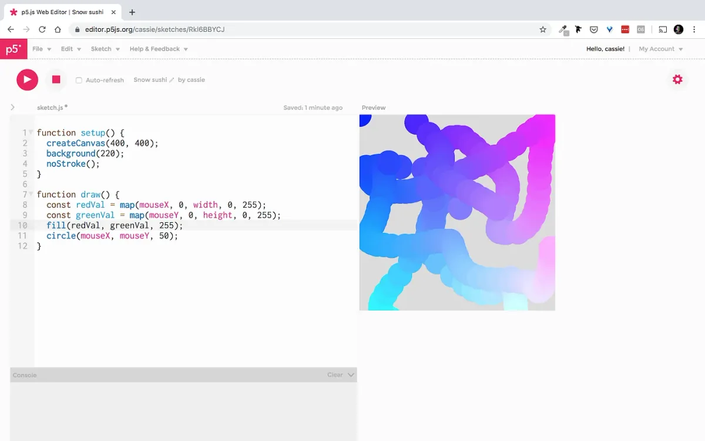
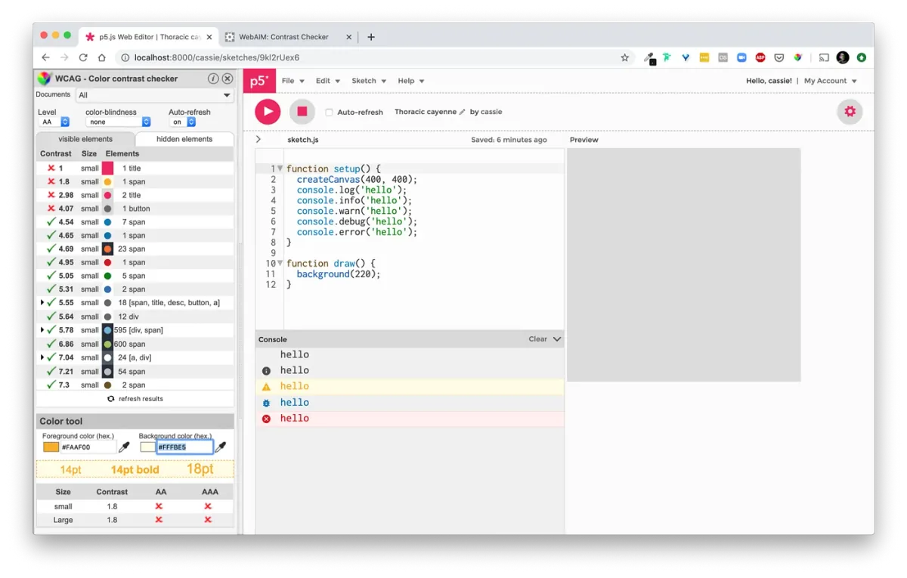
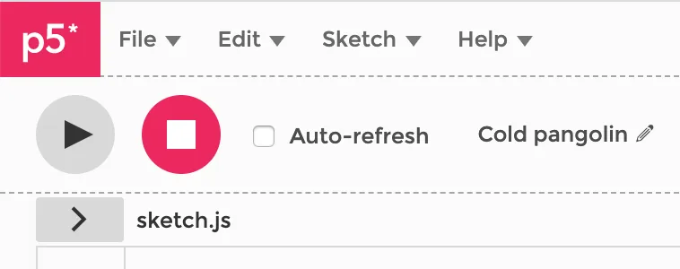
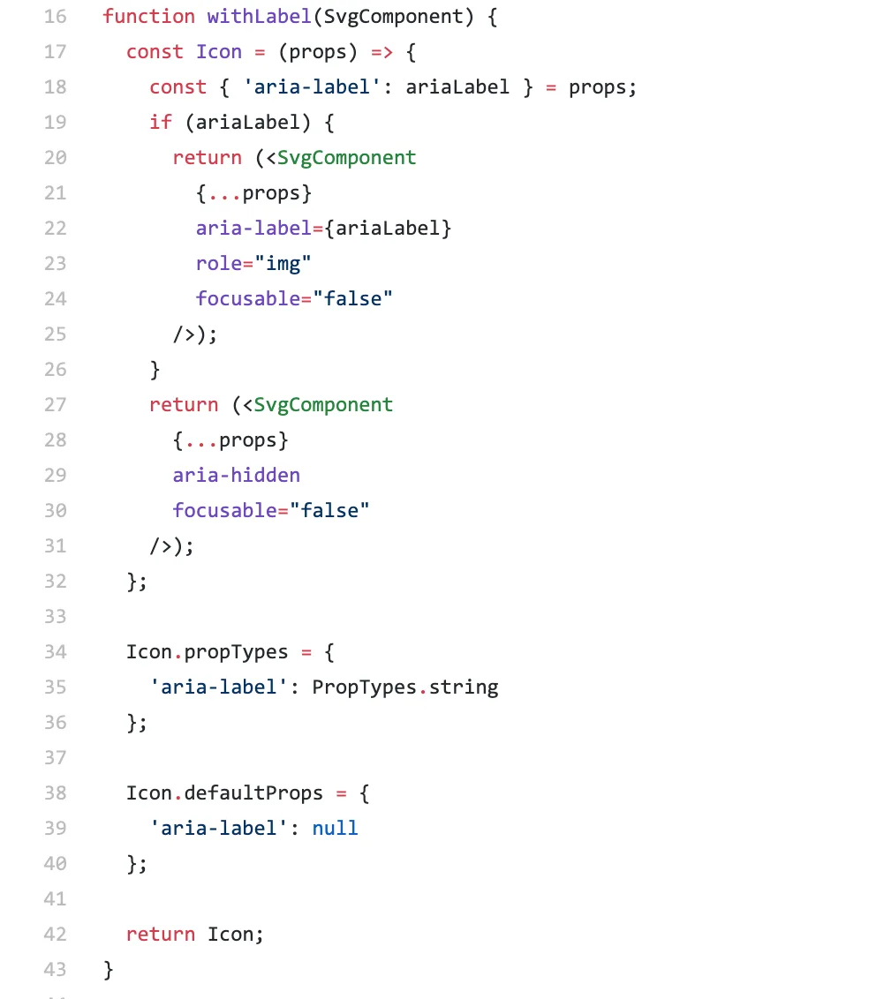

*From the [2019 p5.js Contributor’s Conference](https://processingfoundation.org/advocacy/p5-js-contributors-conference-2019).*

The [p5.js Web Editor](https://editor.p5js.org) is a widely used open-source project with 200,000 active users a month. As the lead maintainer, I juggle many different tasks and priorities, and I organize my work by balancing maintenance tasks, such as responding to and organizing GitHub issues, and projects, in which I focus on creating or improving one feature. I knew the web accessibility of the site needed some attention, and I had wanted to make the space to improve it, but it felt overwhelming because I thought I didn’t really know what I was doing. [Fifteen percent of the world’s population has a disability](https://qz.com/1407450/theres-already-a-blueprint-for-a-more-accessible-internet/), such as low vision, blindness, hearing impairment, and deafness, yet web developers aren’t typically trained to think about this population — I certainly was not. How could I learn to improve support for a huge number of people who use the web editor?

I’m inspired and humbled by the amazing work of folks in the p5.js community who have pushed the goal of accessibility forward. This includes [Luis Morales-Navarro and Mathura Govindarajan](https://medium.com/processing-foundation/making-p5-js-accessible-e2ce366e05a0), [Claire Kearney-Volpe](https://medium.com/processing-foundation/p5-accessibility-115d84535fa8), and many others. They have patiently explained accessible design to me: how users with low vision and blindness should have an equally robust experience as sighted users, and how accessibility features should be on by default. I am also grateful for a grant from the [Clinic for Open-Source Arts](https://www.du.edu/ahss/opensourcearts/) (COSA) at Denver University, which allowed me to focus specifically on accessibility.

The [Web Content Accessibility Guidelines](https://www.w3.org/WAI/standards-guidelines/wcag/) (WCAG) outline a thorough standard for web content accessibility, and they are fairly wordy (as standards should be!). Luckily, to make your website accessible, you don’t need to read the whole thing, as there are many tools to help you align with these standards. There are specific criteria in three different levels (A, AA, and AAA) to meet folks with different needs, which cover different topics such as [color contrast](https://www.w3.org/TR/UNDERSTANDING-WCAG20/visual-audio-contrast-contrast.html) and [semantic HTML](https://developer.mozilla.org/en-US/docs/Web/HTML/Element).

I began with updating the [editor.p5js.org](https://editor.p5js.org) website colors across the three different themes (light, dark, and high contrast). When teaching with the web editor, I had noticed that sometimes certain things were hard to see or read, especially on a projector. I used the [web editor design system](https://www.figma.com/file/cyHiandYyEAPj0Kj6tJbHc/p5-design-system-2018) created by Jerel Johnson and a [color contrast Chrome extension](https://chrome.google.com/webstore/detail/wcag-color-contrast-check/plnahcmalebffmaghcpcmpaciebdhgdf?hl=en) to painstakingly go through every element on the page. As a side effect, it helped me reduce the number of different colors used in each theme, clean up the styling code, and make some small improvements to the non-color interface design.

*Screenshot of the previous light theme colors in the web editor.*

*Using a color contrast checker to update low contrast colors in the web editor. Notice the updated higher contrast.*

The [pull request](https://github.com/processing/p5.js-web-editor/pull/1406) I made ended up fixing seven different open issues! It was very exciting. I even got to show off the crisp new colors in a [livestream talk](https://www.youtube.com/watch?v=sRLWIAPaiRI).

Next, I decided to tackle the icons, as there are a lot in the web editor: play, pause, settings cog, and so on. I knew that I needed to give them all labels that would be accessible to screen readers, but I didn’t know how. I found and used [“Contextually Marking Up Accessible Images and SVGs”](https://www.scottohara.me/blog/2019/05/22/contextual-images-svgs-and-a11y.html) by Scott O’Hara to guide me. I learned that sometimes icons convey information, and need a label, and sometimes they are decorative, and should be hidden from screen readers.

*The arrow next to “File” is decorative, whereas the “play” icon conveys important information.*

In order to add all of the necessary attributes to the SVG icons, I had to import the SVGs using a new library called [SVGR](https://github.com/gregberge/svgr), which imports all of the icons as React Components. As a side effect, it significantly reduced the number of network requests the web editor makes when loading, since the icons get bundled into the JavaScript.

[Andrew Nicolaou](https://medium.com/processing-foundation/features-and-fixes-in-the-p5-js-editor-722e4b56495e), a Processing Foundation Fellow in 2017 and web editor contributor, had been working on using [Storybook](https://storybook.js.org/) to build and document a component library to make contributing to the web editor interface easier. My changes to make the icons accessible caused merge conflicts with this branch, so I jumped in to fix these. In the process, I had the realization that by building a component library, accessibility features could be built into components so that you could use them without needing to fully understand them. This led me to create a [Higher-Order Component](https://github.com/processing/p5.js-web-editor/blob/9d68de8dd22bad5af40197277f1053f5ab738b66/client/common/Icons.jsx) for the SVG icons, based on what I learned from Scott O’Hara’s post to account for decorative versus informational icons.

*Source code of React component with included accessibility features.*

Lastly, I wanted to improve the [semantic HTML](https://developer.mozilla.org/en-US/docs/Web/HTML/Element/details), which adds meaning to your website content rather than change how it looks. Screen readers rely on semantic HTML to work properly, and by using the right HTML elements to match the meaning of your website content, you get many web accessibility features for free. For example, I knew that the web editor was missing <main> tags, which help screen readers skip navigation links at the top of the page and jump to the main content (which is easy to do visually). I added these to every page, and changed many 
s (which have no semantic meaning) to <section>s and <article>s. I even learned about HTML elements I had never used but would like to eventually, like [<dialog>](https://developer.mozilla.org/en-US/docs/Web/HTML/Element/dialog), which contains features that I had engineered into the web editor from scratch.

There are still many accessibility improvements to be made to the web editor, but in only ~32 hours of work I made huge progress. The [React Accessibility Guide](https://reactjs.org/docs/accessibility.html) is a great place to start if you’re looking to make your website web accessible, even if you’re not using React. Thanks to Chris Coleman and COSA for making this work possible!
