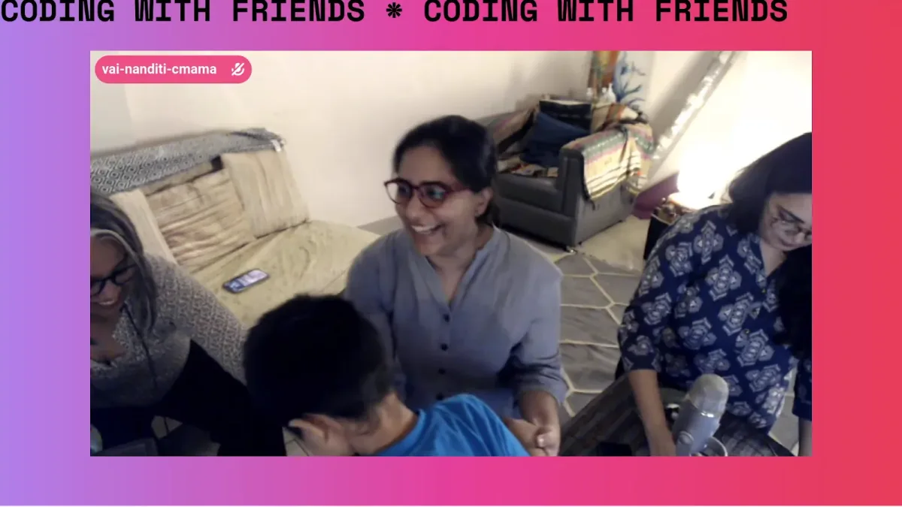
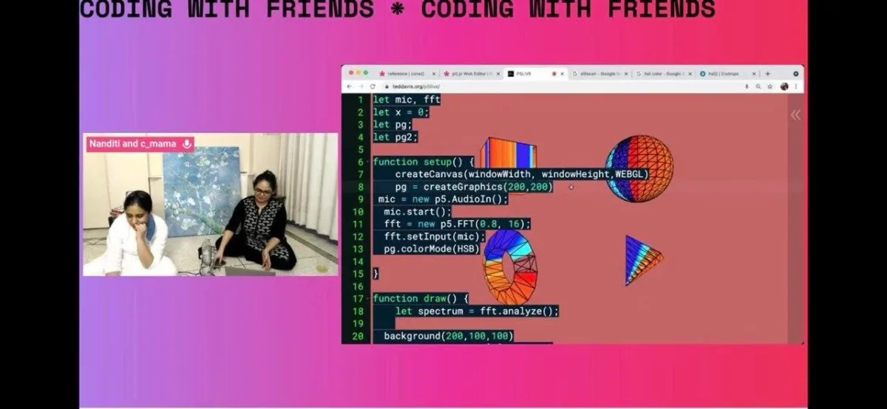
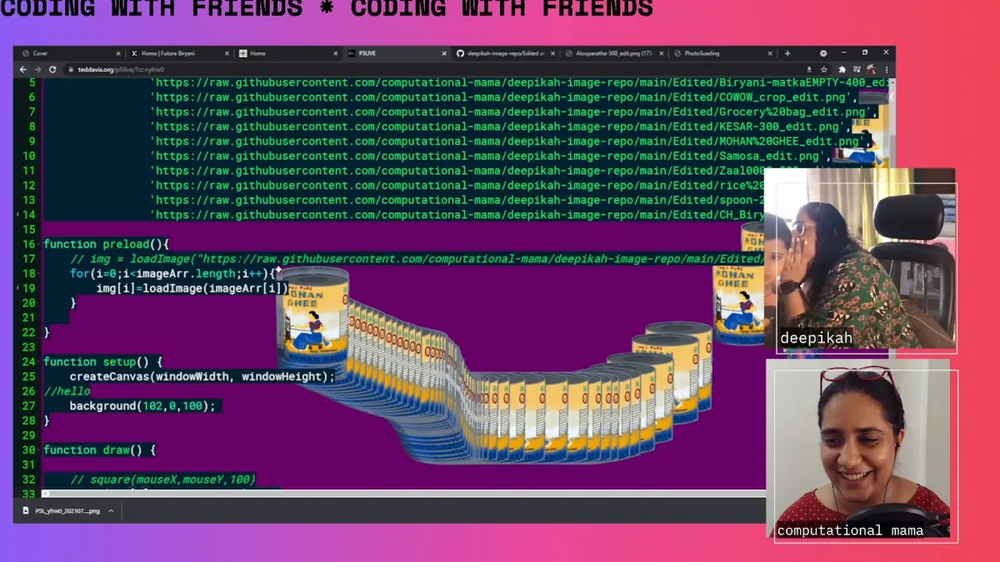
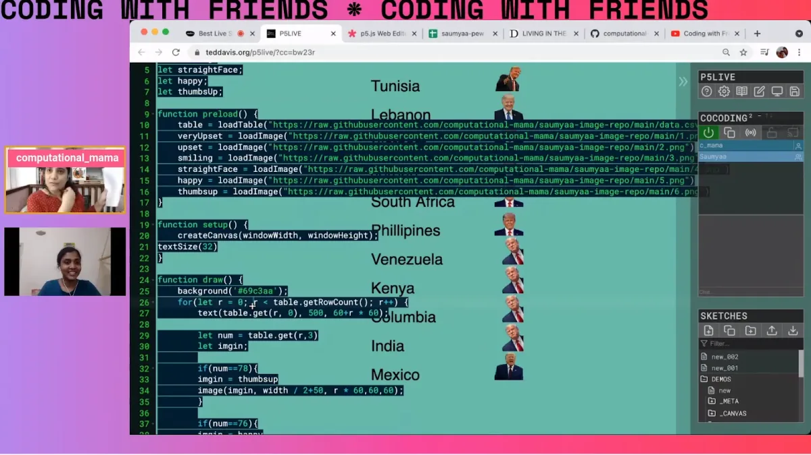

#### by Computational Mama, Processing Foundation Fellow 2021

interviewed by Johanna Hedva, Director of Advocacy, Processing Foundation

---

*For the sixth year of our annual Fellowship Program, we aimed to better support the new paradigm of remote and online contexts and socially distanced communities. We asked applicants to address at least one of four Priority Areas that, to us, felt especially important for finding ways to feel more connected right now: Accessibility, Internationalization, Continuing Support, and AI Ethics and Open Source. Additionally, we sponsored four Teaching Fellows, who developed teaching materials that will be made available for free, and are oriented toward remote learning within specific communities. We received 126 applications and were able to award six Fellowships, with four Teaching Fellowships. We are excited to note that this is our most international cohort ever, with Fellows based in Australia, Brazil, India, Mexico, Philippines, Switzerland; and in the U.S. in California, Portland, and New York. Over the next few weeks, we’ll be posting articles written by the fellows, or interviews with them, where they describe their projects in their own words. For an archive of our past Fellows* [click here](https://processingfoundation.org/fellowships)*, and to read our series of articles on past Fellowships,* [click here](https://medium.com/processing-foundation/https-medium-com-tag-pf-fellowships-la/home)*.*

---

*[Computational Mama](https://www.instagram.com/computational_mama/) has been learning, teaching, and experimenting with creative computation since 2017. She is a co-instigator of dra.ft and co-founder of Ajaibghar Cultural Services. Her work explores coding as a form of self-care and learning. She is a regular live streamer on [Twitch](https://www.twitch.tv/computational_mama), where she teaches the basics of creative computation. Screenshot of a Coding with Friends livestream with Computational Mama (center) and creators Vaibhavi (left) and Nanditi (right). \[**Image description**: A screenshot showing three women smiling while the back of a young child appears in the centre of the image. The image appears over a pink and purple background.\]*

**Johanna Hedva: Hi Computational Mama! Can you tell our readers what your project is about? What are your intentions and goals with this project?**

**Computational Mama**: The project is a livestream with womxn makers called [“Coding with Friends.”](https://www.twitch.tv/computational_mama) Coding with Friends casually and simply claims space for womxn creators. The series extends the idea of live coding as a form of camaraderie, friendship, and self-care.

As I was traversing the wonderful world of creative coding, I found an encouraging community of creators but womxn were few and far between. When I spoke to other womxn, they would always say that they had dabbled in Processing but couldn’t do much with it. Coding with Friends is expressly meant to push womxn creators off the cliff of creative coding. It’s very upfront goal and intention is to build an image of two or more womxn creators building projects with code, and doing it together — having fun and sometimes failing, too!

**JH: What were you able to accomplish of your initial goals?**

**CM**: I had planned out four to five streams of about 60 minutes with various guests. Of the five invited guests, we had four streams with one guest unable to join due to health reasons. I did three bonus streams. We had over 5,400 minutes of watch time for the seven streams — all live!

If you are interested in watching the streams, they are time-stamped and available [here](https://www.youtube.com/playlist?list=PL8fSylRVlW65uS8m3PuAUNPmny20RPhVg).

*Screenshot of a livestream of Coding with Friends with Computational Mama at left and creator Nanditi at right. \[**Image description**: A live-streamed image on the left shows two women sitting cross-legged on the floor with computer equipment; on the right, a screenshot shows rudimentary 3D objects in the p5.js live coding environment.\]*

**JH: Writing about your Fellowship at the start of summer, you posed a couple questions that I’ve thought a lot about since: “What could be more provocative than to build soft, understated, and rooted networks of womxn creators? What could be more powerful than relationships built in safe, creative environments?” I’d love to hear more of your thoughts about this, now that you’re at the end of the fellowship period (but not of the project!). What were some of the strategies you used to do this?**

**CM**: In spaces both professional and personal, you always find womxn networks. Often they are hushed in tone, informal in nature, intricately connected, supportive, and understanding. I’d like to unapologetically harness this energy — not just for me but for all womxn creators.

Through the conversations with guests coming into Coding with Friends, I found it was important to be focused on people and the process, not the product. It’s easy for all of us to fall into the trappings of creating “something.” (A product, an app, a tutorial even.) It’s very easy to forget that people come together as a group not because of a product but because they produced it “together!” As the Fellowship closes another season of Coding with Friends, I sense the importance of giving coding that texture and quality of listening, that togetherness and care.

*Screenshot of a Coding with Friends livestream with the creator Deepikah. \[Image description: Two images on the right show, respectively, a woman whispering something to a little boy, and a woman smiling. On the left, a screenshot shows the p5.js live coding environment with the trail of a hand-drawn image.\]*

**JH: Can you tell us a bit about why you think it’s important to make such spaces for womxn creators in creative coding? What are some of the infrastructural obstacles that womxn coders face?**

**CM**: It’s difficult to shy away from code or computation as a maker today. Womxn can have an especially tough time associating themselves with code or computation. Communities around creative coding can be dominated by narratives that have no resonance for womxn creators. Bringing womxn into conversations and spaces is the first step, but retaining their excitement is another thing altogether.

Indian initiatives like [Algorave India](https://instagram.com/algorave_india) and [BeFantastic](http://befantastic.in) have been amazing enablers of womxn creators jumping off the creative coding cliff. It’s their welcoming nature, their messaging, and ongoing support and connections that have helped to build up some wonderful womxn in the creative-coding world.

**JH: What is the future of your project? What do you still want to do?**

**CM**: I’m actually quite pumped about hosting another season of Coding with Friends. The Fellowship award was a huge validation for me, as I wasn’t able to continue this after the first season without financial support.

I still want to publish a few posts about the guests and their projects, which will be posted to my website [here](https://friends.computationalmama.xyz) or can be accessed on my substack [here](https://computationalmama.substack.com).

*Screenshot of a Coding with Friends livestream with creator Saumyaa. \[**Image description**: On the left, two video feeds show two women in communication. On the right, a screenshot shows the p5.js live coding environment with Trump’s headshots being used as a data visualization tool.\]*

**JH: What does coding mean to you, personally?**

**CM**: I’ve been something of a primary carer for first grandparents, and now a toddler, for about nine years. This was a period sprinkled with loss and grief, too. I felt almost disenfranchised at low points, and a sense of resentment toward peers who were not in the same position. Of course, this was an internal feeling. I had all the tools and agency to achieve what I wanted and was doing so, too. It is just difficult to recognize the wins when your focus is expected to be on someone other than yourself.

Somewhere around this time I heard a podcast with the artist Amy Sherald, who paused her life and work to be a primary carer for various family members and suffered her own loss and illnesses in the mix. I resonated with this a lot! Time moves differently in this space as you are navigating your own journey all the while prioritizing the focus of care on another person.

I see the sense of focus that coding allows me — sketches are small and code can be debugged easily, unlike life. I’d like to share this as a self-care tool with others.

I’m keen to feature primary carers in the next season, aka moms/parents/carers of other family members. I almost always find these creators to have worked doubly hard to be seen or heard. They are rarely understood. Coding with Friends must have the space to feature these amazing womxn creators, brightly and grittily.

**JH: I love your name, Computational Mama 😍 Where does it come from?**

**CM**: I came up with the name as I started to learn from Coding Train videos in my last trimester of pregnancy, in late 2017. It became an obvious moniker to showcase my experiments. This account was originally somewhat of a secret, and even now many old friends are just discovering this alter-ego that I built.

See clips from Coding with Friends [here](https://youtu.be/MkgxzGSsguQ).

---

*Computational Mama was mentored by* [Shaharyar Shamshi](https://shaharyarshamshi.xyz/)*, who was a Fellow in 2019.*
