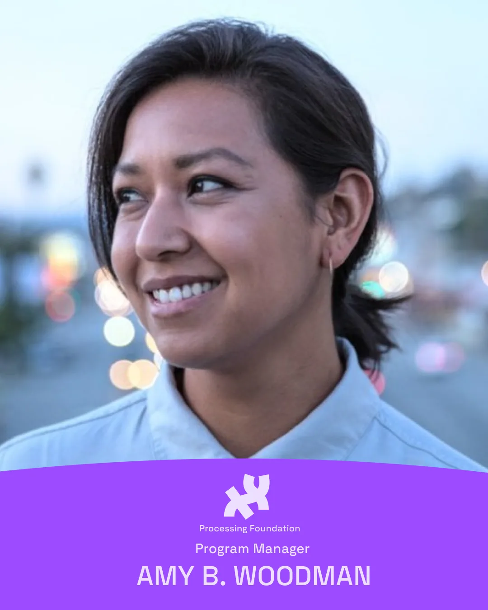
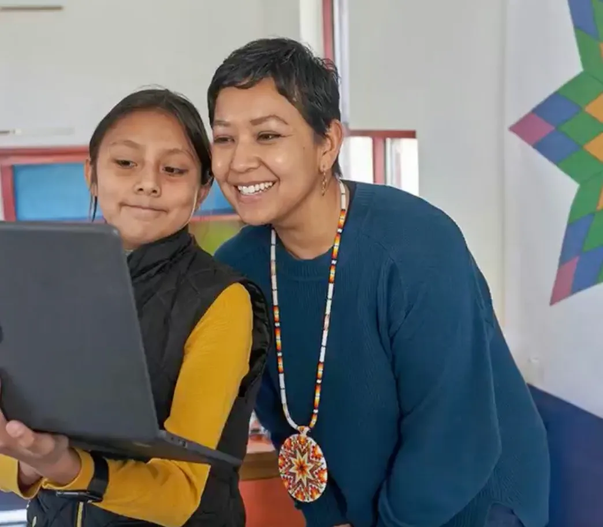
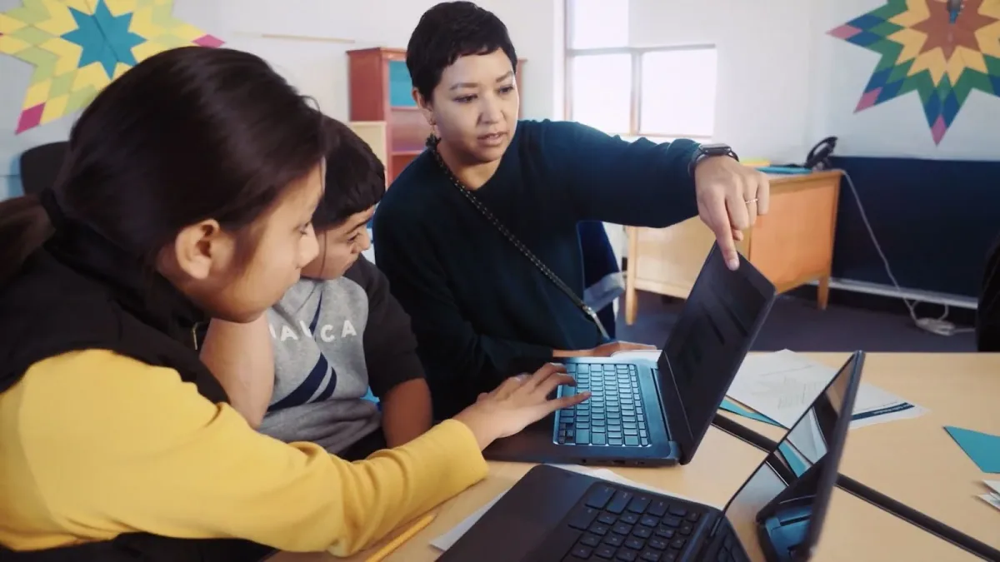
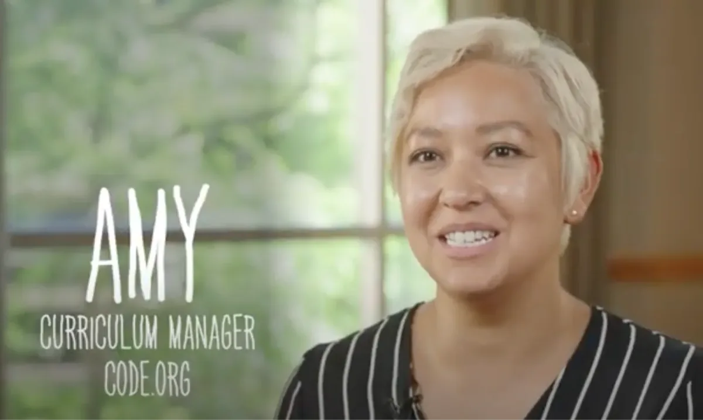
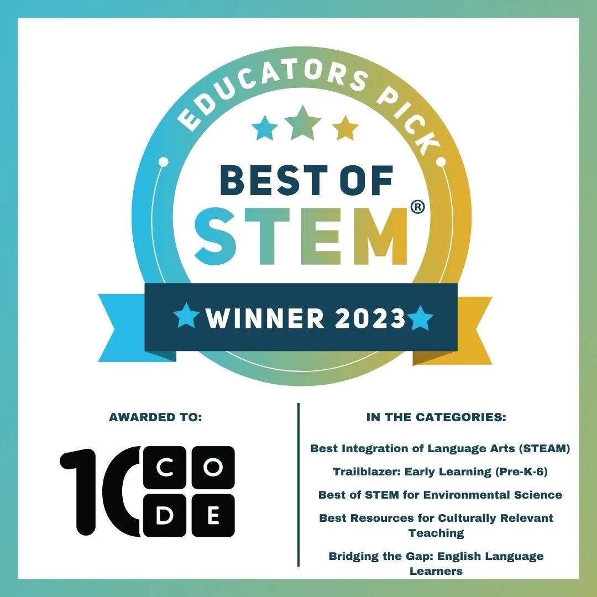
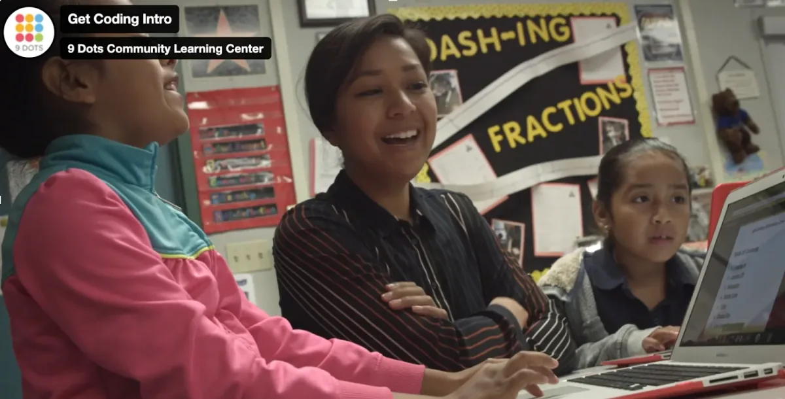
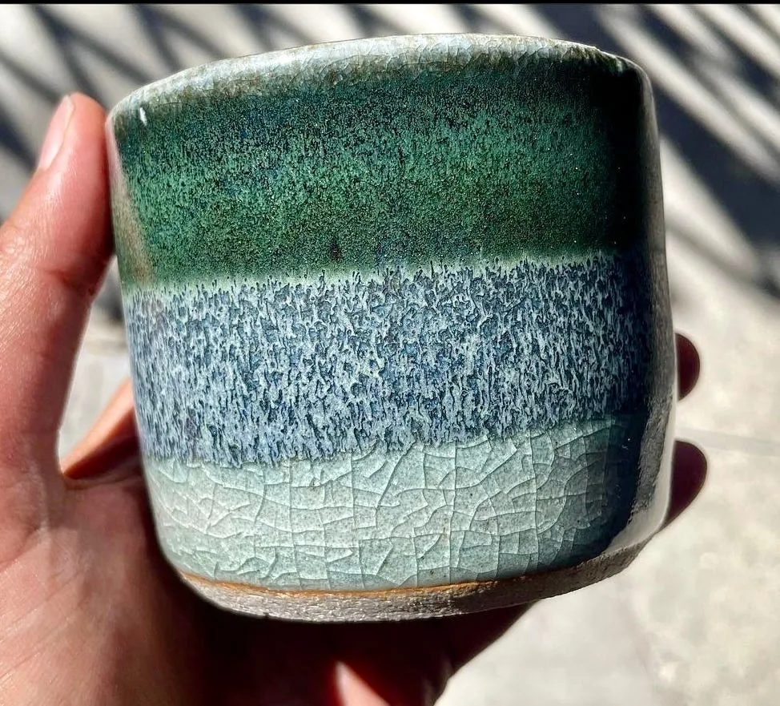
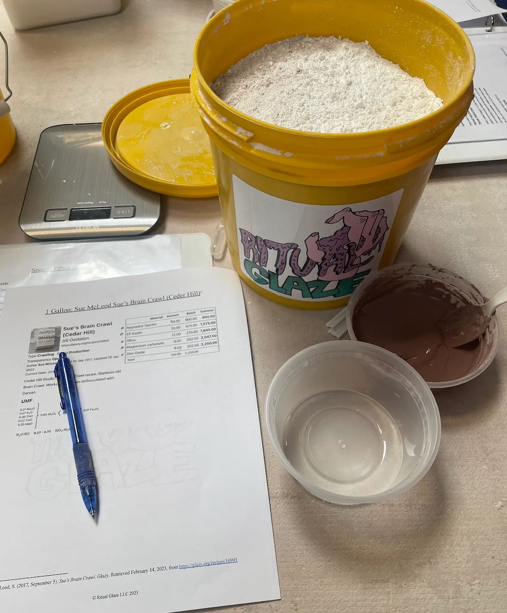

*Photo of Amy B. Woodman by [Joel Woodman](https://joelwoodmancreative.com/).*

[Amy B. Woodman](https://www.amybwoodman.com) (she/they) is an educator, writer, and ceramic artist. Her professional experiences have spanned from teaching in the classroom, training teachers, shaping local education policy, building learn-to-code products, and executing nationally-renowned curriculum that has reached millions of users worldwide. But she’ll be the first to tell you: everything she knows started as “Ms. B”, a classroom teacher.

Today, she is here as the new Program Manager of Processing Foundation because she is drawn to the organization’s open-source and inclusive mission. It is the next evolution of her understanding of community, holding space for educators, artists, and coders to stay, grow, and try something new and brave. At the heart of it all is her belief that technology is a cultural tool that many hands should shape.

She comes to this role with a decade of experience designing programs that make coding more joyful, equitable, and creative. Her recent work includes:

-   *Music Lab: Jam Sessions* — A creative coding tutorial for remixing sound with code.
-   *Dance Party: AI Edition* — Exploring generative AI through visual effects and music.
-   *Coding Poem Art:* A [p5.js](http://p5.js)\-based activity connecting poetry, typography, and animation.
-   *Star Quilts: Coding 8-pointed Stars* — A culturally responsive CS lesson co-developed with Native educators and [featured by the BBC](https://www.bbc.com/storyworks/the-human-component/cisco-codeorg).
-   *CS Connections:* A cross-disciplinary computer science curriculum adopted across U.S. districts.

*Images courtesy of Amy B. Woodman.*

Earlier in her career, Amy co-founded *t*he [Detroit Food Academy](https://www.detroitfoodacademy.org) while teaching high school in Michigan. She later scaled [9 Dots’ Get Coding](https://www.9dots.org/getcoding#:~:text=Our%20online%20platform%20makes%20teaching,of%20belonging%20in%20coding%20class.) program to support hundreds of educators across Los Angeles. Her identity as a Korean and Dutch-Indonesian daughter of immigrants raised in Hawaiʻi deeply informs her commitment to educational equity and culturally sustaining pedagogy.

Outside of work, Amy spends her time in the pottery studio. For her, working with code and working with earth are part of the same creative impulse: a love of process, imperfection, and making something out of nothing.

Amy is excited to learn from this community and contribute to Processing Foundation’s mission of expanding access to creative tools. You can follow her work or get in touch with her on [LinkedIn (Amy B. Woodman)](https://www.linkedin.com/in/amybwoodman/) and [Instagram @Nuna\_Pots](https://www.instagram.com/nuna_pots/), and learn more about her on [her website](https://www.amybwoodman.com/).

*Amy B. Woodman’s ceramic art.*
