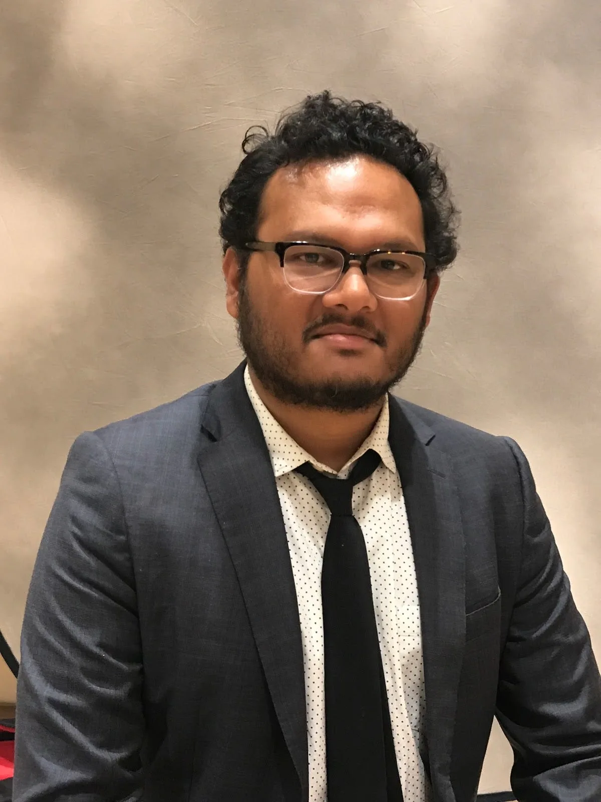

#### Education Community Director, Processing Foundation

*[Saber Khan](https://www.edsaber.info/) is a Bengali-American educator based in New York City, and the Processing Foundation’s Education Community Director. He is a veteran K12 educator with over 15 years of experience teaching math, science, and computer science in public and private middle and high schools. Currently, he teaches multiple introductory and advanced computer science classes in creative coding and web development. And he organizes events and spaces for educators to engage with code, ethics, and equity. He loves email. \[image description: A man in a dark gray suit, with a black tie, and a white shirt with small black dots, sits in front of a pale background.\]*

In their essay, [“A Modern Prometheus,”](https://medium.com/processing-foundation/a-modern-prometheus-59aed94abe85) Ben Fry and Casey Reas write that “Processing emerged directly from the Aesthetics and Computation Group, a research group started at the Media Lab by John Maeda in 1996.” That same year my family and I emigrated to the United States from Bangladesh via Saudi Arabia. We landed in Catonsville, Maryland, a suburb just outside Baltimore, because that’s where one of my aunts resided. My mother’s sister had come to the U.S. a decade before with her husband, thanks to the high demand and reward for doctors. She was able to sponsor my mother’s visa via the family reunification program. We would spend a year here while my father finished his job in Saudi Arabia and looked for a job in the States. Hearing that the public schools were lacking, my parents enrolled my older sister and I in private schools. I was sent to an all-boys college-prep Catholic high school located in the city. The neighborhood was largely African-American, while the school was overwhelmingly white.

As an immigrant it was hard to understand how Baltimore, and the rest of the country, was a place so divided by race and wealth. Later I would learn one of the reasons for this was when, in 1996, Bill Clinton signed the [Personal Responsibility and Work Opportunity Act](https://www.congress.gov/104/plaws/publ193/PLAW-104publ193.pdf), a cornerstone of the Republican Party’s [Contract with America](https://www.theatlantic.com/past/docs/unbound/jfnpr/jfreview.htm) and the fulfillment of Clinton’s promise to “end welfare as we know it.” Passing with bipartisan support, the bill contained racist and sexist ideas couched in a logic of the “deserving poor.” The most toxic idea in the bill was the notion that people on welfare had become reliant and no longer wanted to work. The new legislation placed limits on the amount of aid a person could receive, restricted eligibility rules, and lets states decide how to use the aid. Legal immigrants would now be excluded, because the logic seemed to be that immigrants were “undeserving poor,” and were a burden on productive members of society.

We finally settled in suburban Chicago, and I enrolled at Palantine High School, a large public high school. In Saudi Arabia I had struggled in school, often lying and cheating on exams, and failing many classes. My parents struggled to help me, and I made it difficult for my teachers. At my first meeting with a counselor at Palatine High, they did not look at my transcript and see the mess I was in. Instead, they saw a “model minority” and quickly assigned me to advanced courses, which were only available via counselor recommendation. I thrived in this system because it saw me as deserving, gave me opportunities to share my thinking, and treated me as already in possession of the gifts and talents to be successful. However, it deemed others undeserving. Only at graduation did I see the many students excluded from these classes, especially Hispanic and African-American students who made up a large portion of the school. While I did not think it then, or even know the words to define it, I benefited from the Model Minority Myth that sees value in Asian immigrants, while being rooted in anti-Blackness and white supremacy.

The benefit did not end there; I was able to secure a scholarship to college, though I had no plans or idea what I wanted to do with my degree. (In 2001, when Ben and Casey started working on Processing at MIT, I was a sophomore.) Entering college on scholarship was disorienting. I was in class with wealthy students, but then went to my work-study of washing dishes in the cafeteria, where we all earned the minimum wage of $4.25 per hour. During my senior year I volunteered as a school aide at a middle school in Centerburg, Ohio. Once a week I would meet with a small group of students from the “Gifted and Talented” program. There was little to no direction given to me about what to do with these students, so I tried to come up with activities that might spark intellectual curiosity. I remember bringing my chess set to a few of the meetings, and sometimes sci-fi and comic books. I didn’t know it at the time but these experiences — working in the cafeteria, volunteering at the school — were giving me a perspective and a direction in life.

When I graduated in 2003 I had no plans or know-how to start a career. I moved to New York City without a job, and slept on friends’ couches, trying to save my few dollars. I saw on Craigslist that the New York City Department of Education was looking for new teachers to enter their Teaching Fellows program for their hard-to-staff schools. At that moment I did not know if I had the temperament or skills to be a good teacher, but I applied anyway. Spoiler alert: I did not have a teacher’s temperament or skills — but I learned that I cared a lot about education. It had been the central motivation in my family, the reason behind our migration and what shaped many of our values.

On December 1, 2003, with minimal interviewing or training, I became a teacher. As a member of a rolling cohort of Teaching Fellows, I started as a science teacher at MS 57 in Brooklyn, a high-need school which struggled to hold onto teachers. The school was targeted for possible closure under the No Child Left Behind Act (2001). These would be toughest two years of my life, and at the end of my two-year commitment to the school, I was struggling. The school was dysfunctional, and I was desperate to improve. I made a hasty move to the West Coast and joined the charter school movement. While the charter school was more functional, it espoused a zero-tolerance attitude toward the students and placed unreasonable expectations on the teacher, which were difficult to navigate. Eventually I landed in private school where I was able to grow as an educator, while also looking for opportunities to serve those who were under-served. For the first time I felt consistently successful as a teacher, but when I looked back at my cohort of Teaching Fellows, I saw that I was among a small handful who’d remained teachers after 10 years. Having made the journey from low-income public schools to privileged private school, with a couple of stops in the middle, I am struck by the challenge of how we can create inclusive, desegregated educational spaces for students and teachers of all backgrounds.

In 2013, around the time Lauren Mccarthy started developing p5.js, I was back in New York, becoming a technology educator. My involvement with Processing started with p5.js. I was using JavaScript to teach the basics of coding, and was introduced to p5.js and Dan Shiffman’s [Coding Train](https://www.youtube.com/channel/UCvjgXvBlbQiydffZU7m1_aw). A few educators and I were excited about the opportunities that p5.js presented, and we talked to Dan about starting an event to share tools and projects with students and teachers. This became [CC Fest](http://ccfest.rocks/), the first one of which was held at NYU-ITP in October 2016.

Since then we’ve held eight more CC Fests in New York, Los Angeles, and San Francisco. These events aim to create those desegregated, inclusive spaces that are hard to find in schools. Thanks to free space from educational institutions, volunteers, and modest financial support from a few organizations, we’ve been able to keep the events free. The biggest asset has been the large number of educators who have given their time to organize, lead sessions, and volunteer. Beyond introducing a large group of [students and teachers to creative coding](https://medium.com/@ed_saber/creative-coding-for-all-7dadde33273b), I’m proud that we’ve helped form a community of educators who can support each other beyond the event. We’ve been able to bring CC Fest to more cities, and hope to reach Chicago, Boston, and more.

With the growth of [CSforAll](https://www.csforall.org/), there is a high demand for tools and curricula that students and teachers can use. However, most of the available curricula are either offered from for-profit ed-tech startups or nonprofits backed by the technology sector. This has led to the development of a CSforAll movement that has inherited the biases of the industry while it tries solve challenges around equity, access, and power. Processing Foundation, and the community of educators around it, are well-poised to build an independent K12 CS community and movement that takes questions of ethics, identity, and creativity seriously.

While Processing Foundation may not have the resources of others, its community has a large group of dedicated educators, a commitment to diversity and inclusion, and a critical perspective on biases and their impact on the marginalized. This year’s collection of international Processing Community Days show how widespread, enthusiastic, and diverse the community is already; and, begun last year, the collaboration between the New York City Department of Education and Processing Foundation is a hopeful example of what an authentic collaboration can yield — free and open resources and tools that are community-oriented.

In 2019, in my new role as Education Community Director for Processing Foundation, I want to work on building organic learning communities in places that do not get enough attention. Ultimately this means helping people organize themselves into collaborative group, and I can help the most by providing support to what is already happening. I want to make the Processing community at-large a welcoming place for K12 students and teachers. This can happen by organizing more CC Fests that center under-served students and teachers. I am also excited to share the values of Processing in the education world via a web portal, currently in the works, that will highlight what we want to see in computer science education, and how we can get there.

I chose to be part of the Processing community because of our shared values. These values — inclusion, equity, ethics, open source, creativity, self-expression — are essential especially when working to place those who have been previously under-served in the center of their education. I want to extend that work and engage in more efforts and collaborations with others who share our values. Though the journey may be long and circuitous and take many turns, as my own has, there are many different ways to enact this vision, and all of them are important.
