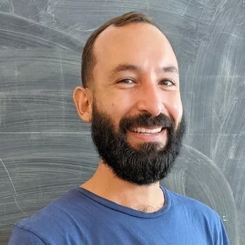
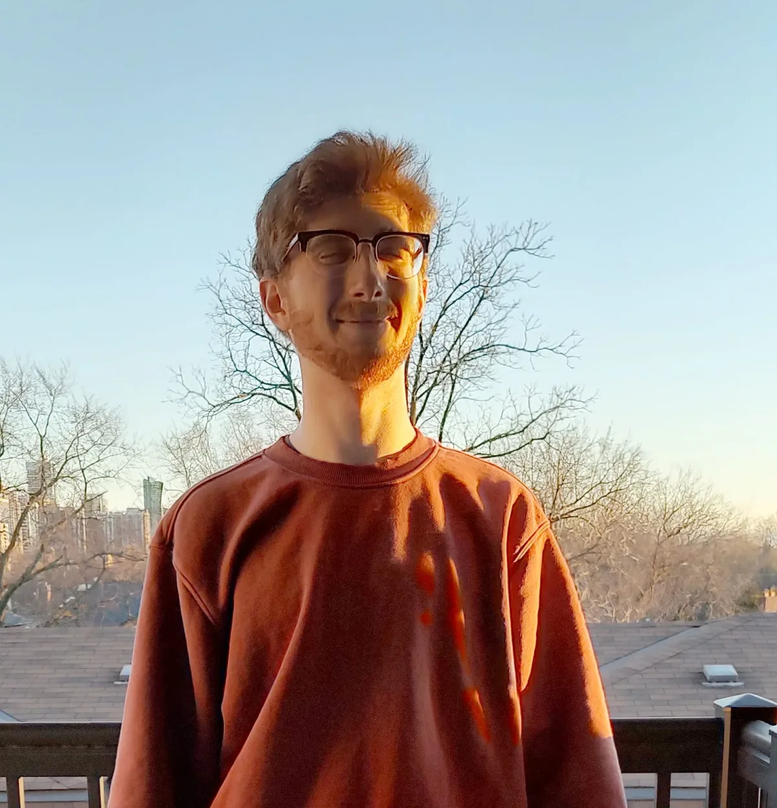
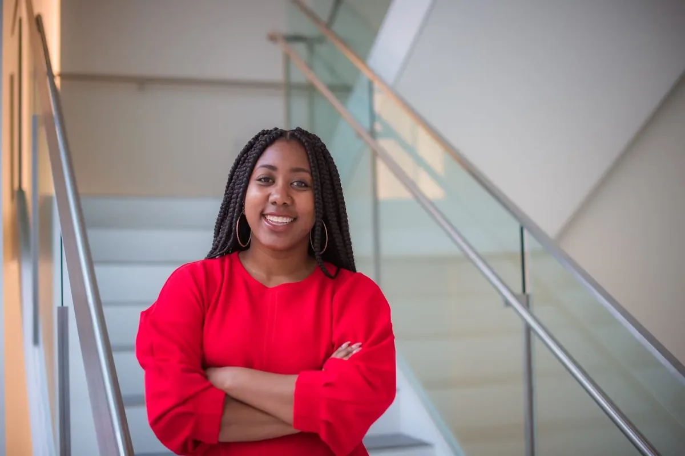

This project aims to improve the Reference and Example page documentation on the p5.js website.

The project will ensure that the p5.js’s documentation is well-organized, beginner-friendly, up-to-date, and consistent by implementing a clear structure based on community feedback, using simple language, avoiding technical jargon, and providing beginner-friendly examples and explanations. By improving the documentation, users of all levels will be able to learn p5.js more easily, reducing frustration and improving their confidence in using the library. Ultimately, this will help promote the growth and development of the p5.js community, which is essential for the project’s long-term sustainability.

[Nick McIntyre](https://mcintyre.io) **| p5.js Technical Writer (he/him)**

Nick McIntyre is an artist, writer, and teacher living in Galveston, TX. He taught some of his first K–12 classes with Processing and has spent the last five years teaching STEAM subjects in a range of environments. Nick loves to integrate creative coding with mathematics. Last year, he wrote a little book called Synchrony which uses p5.js and simulated fireflies to introduce an idea from calculus called a differential equation. Nick’s next book, a beginner-friendly introduction to calculus, will be published by *No Starch Press* next year. In the meantime, he’s working on his first publicly-funded art project called, ‘Common Pastiche’. The project is a “little meditation on empathy” in the form of a community art assignment. Nick is using p5.js to make the project’s 3D drawing app and live projection mapping system. He also uses p5.js to create visualizations for clients in the flood insurance industry. Nick is excited to draw upon that experience while exploring environmental justice issues in his upcoming work.

Over the coming months, Nick plans to work with the mentor, advisor, and the broader p5.js community to make our documentation more beginner-friendly. We will refine the details as we go along, and we will focus on improving the documentation’s organization, simplicity, and consistency. He will spend several hours each week reviewing documentation, gathering and integrating feedback from the community, and contributing updates to the p5.js Reference and Example pages. He’s excited to learn more about how the broader p5.js community utilizes documentation so that we can improve this shared resource together.

*Follow Nick on* [LinkedIn](https://www.linkedin.com/in/nicolasmcintyre/) *or* [Github](https://github.com/nickmcintyre)*.*

[Dave Pagurek](https://www.davepagurek.com/) **| p5.js Technical Writer Mentor (he/him)**

Dave is a computer graphics programmer in Toronto, Canada, working on animation software for motion graphics and developing the WebGL mode of p5js. In his spare time, Dave enjoys leaving geometry problems on his friends’ whiteboards for them to solve.

*Follow Dave on* [Twitter](https://twitter.com/davepvm)*,* [Instagram](https://www.instagram.com/dpagurek/)*, and* [GitHub](https://github.com/davepagurek/)

**Jaleesa Trapp | p5.js Technical Writer Advisor (she/her)**

Jaleesa Trapp is a PhD student at the MIT Media Lab in the Lifelong Kindergarten Research Group. Her current research focus is developing community-centered creative learning spaces. Prior to grad school, she taught high school computer science and was the program coordinator at the computer clubhouse in Tacoma, WA. Jaleesa received her bachelor’s in Human Centered Design and Engineering from the University of Washington.

*Follow Jaleesa on* [Twitter](https://twitter.com/JaleesaT)*,* [Instagram](https://www.instagram.com/jellysnax/)*, and* [LinkedIn](https://www.linkedin.com/in/jaleesatrapp/)

Welcome aboard!
