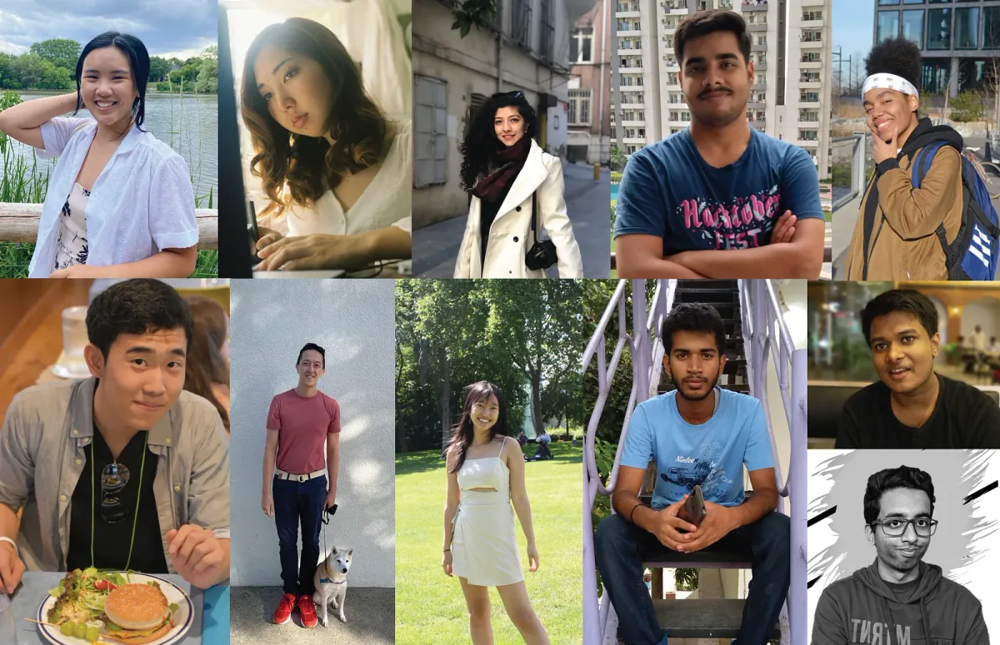
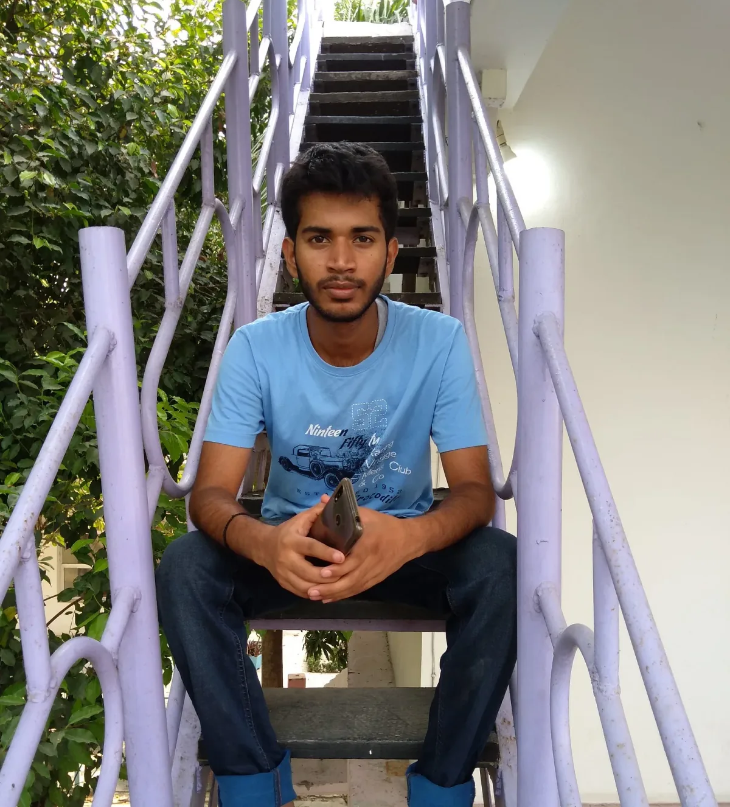
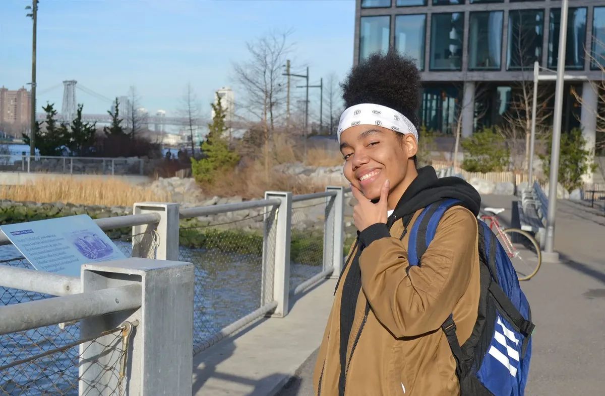
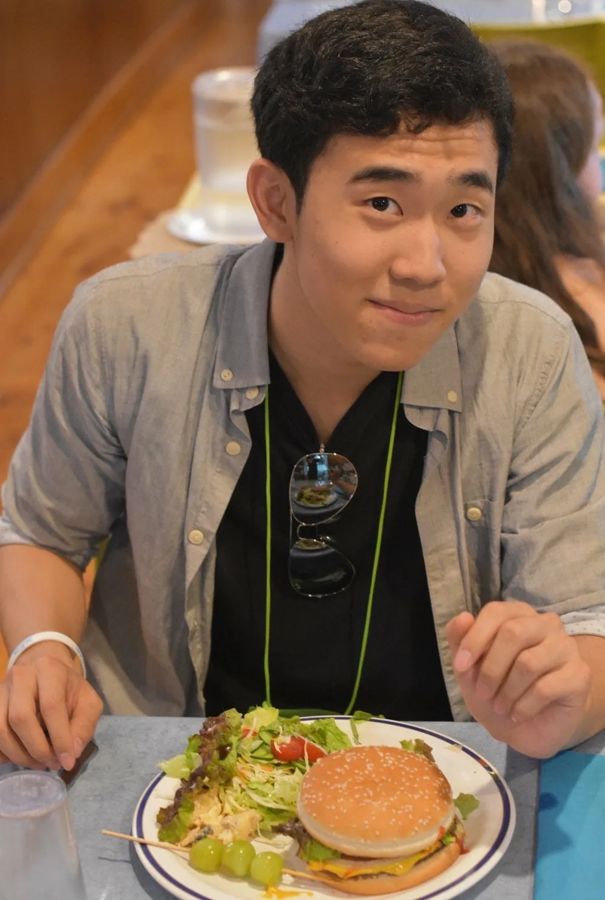
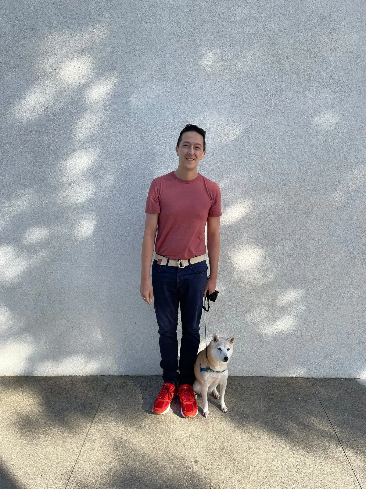
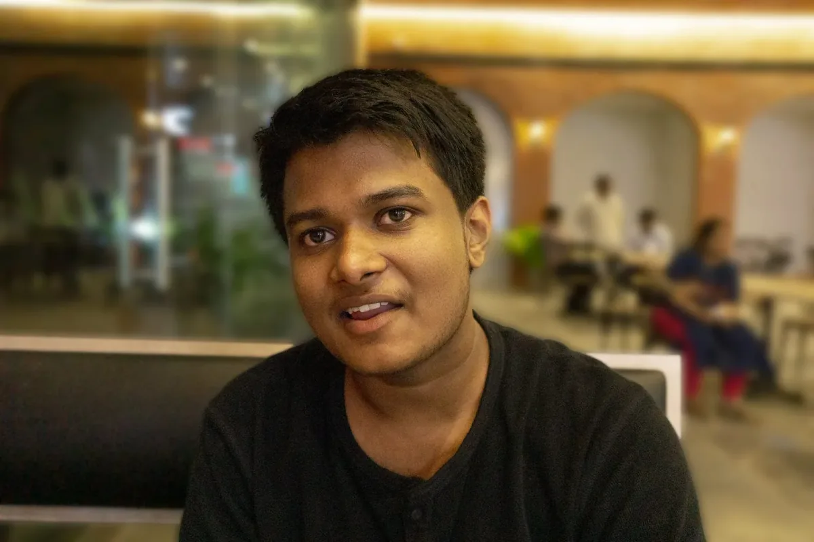
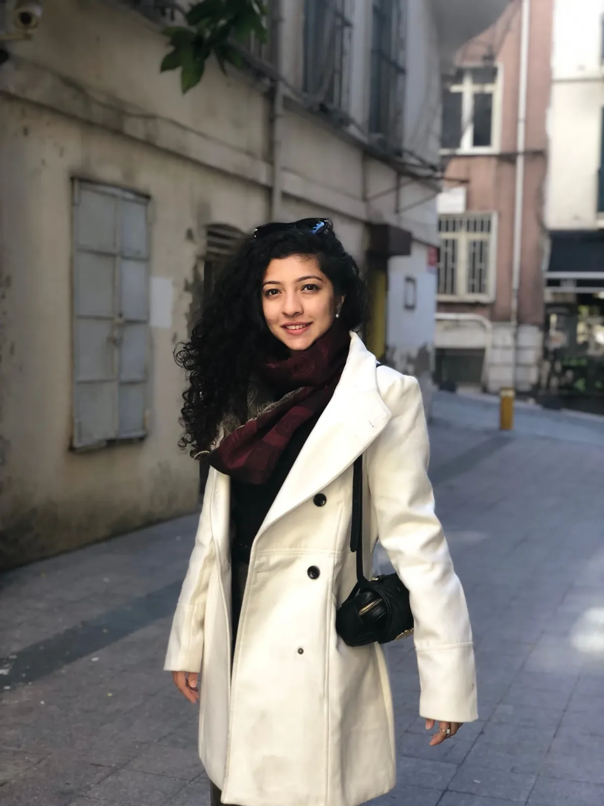

We are thrilled to participate in [Google Summer of Code](https://summerofcode.withgoogle.com/) in what marks our 10th year! The GSOC program aims to get students involved in open-source software by providing a summer stipend to work on a project of their choice. This year, students submitted proposals to work on different aspects of Processing and p5.js, in areas including accessibility, music and sound, the Friendly Error System, the Showcase, XR, and i18n. We were able to offer 11 positions from a field of 66 applications.

Each student is paired with a mentor from the Processing Foundation community, and we are excited to note that many of this year’s mentors are alumni from our previous GSOC and Fellowship Programs. The students’ work kicked off at the beginning of June, and will continue throughout the summer. Stay tuned for updates!

*Meet our GSOC 2021 cohort! From left to right, top row: Katie Chan, Niki Ito, Stuti Mohgaonkar, Shantanu Kaushik, and Anais Gonzalez. Bottom row: Joseph Hong, Masood Kamandy, Katie Liu, Aditya Siddheshwar, Sai Bhushan, and Sanjay Singh Rajpoot.*

---

### Aditya Siddheshwar

#### Addon Library Development — p5-teach.js

*Aditya Siddheshwar is currently a third-year undergraduate student of Electronics and Communication Engineering at JKIAPT, India. He loves animations related to maths and physics. He is excited to build tools for teaching. He can be found at [Instagram](https://www.instagram.com/two.ticks/) and [Twitter](https://twitter.com/two__ticks).*

Aditya will be working on p5.teach.js, which will involve developing tools for teaching STEM through p5.js, adding functions to animate shapes, and animating math symbols. It will provide educators tools to make interactive animated sketches that can support learning in the remote environment.

Aditya will be mentored by Nick McIntyre and Jithin KS, who was a student in GSOC 2018.

---

### Anais Gonzalez

#### Improving the p5.xr Library Through Artistic Examples

*Anais Gonzalez is a recent graduate of The City College of New York, where she majored in Digital Design. She is a Dominican-American graphic designer and illustrator who loves experimenting with typography, creating bold illustrations, and playing with code. This is her first time participating in Google Summer of Code but she is excited to explore the possibilities of p5.xr from a creative perspective.*

Anais Gonzalez will be creating a series of interactive examples for the p5.xr library that show people how to work with creative coding concepts inside of a virtual space. Anais will be mentored by Stalgia Grigg, who was a 2019 p5.js Fellow.

Anais will be mentored by Stalgia Grigg, who was a 2019 p5.js Fellow and now serves on the Board of Advisors for Processing Foundation.

---

### Joseph Hong

#### Korean Translations and Website Improvements

*“I’m a rising junior at New York University Abu Dhabi. I enjoy a lot of different things and got into coding a couple years ago. This is my first time contributing to open source code, so I hope to learn a lot and enjoy this experience!”*

Joseph Hong will be working on updating and adding to the Korean translations of the p5.js website. He will also be working on restructuring navigation within the site to improve the user experience of those new to p5.js.

Joseph will be mentored by Jiwon Shin, who was a student in GSOC 2019, and advised by [Inhwa Yeom](https://yinhwa.art/), who was a 2020 Processing Foundation Fellow.

---

### Katie Chan

#### p5.js 2021 Showcase: The Love Ethic

*Katie Chan is a rising senior at the University of Southern California in the Media Arts + Practice program (with a minor in Web Technologies and Applications). There, she learns and creates critical new media, and it is where her love of creative coding was sparked. Outside of school and work, she enjoys learning new languages (currently: French (on Duolingo (365+ day streak!))) and finding the best noodle soup in LA.*

Katie Chan will be working on the third iteration of the p5.js showcase this summer. Unlike previous years, this showcase will have a theme: “The Love Ethic,” which is heavily inspired by author bell hooks and her writing on embracing love in all aspects of our life. This showcase will have a particular focus on the softness of the programming language and the ability of p5.js to be a radical community with values rooted in social justice and accessibility.

Katie will be mentored by KT Duffy and Sam Vassor, and advised by [Ashley Kang](https://ashleykang.dev/), who was a student in GSOC 2019 and [worked on the p5.js showcase](https://medium.com/processing-foundation/p5-js-showcase-4a3756528542).

---

### Katie Liu

#### Adding Alt Text

*Katie Liu is a junior at the University of Southern California, double majoring in Business Administration and Media Arts + Practice. She became interested in creative coding last semester after being exposed to p5.js and other forms on creative coding in a class at school. This is her first time contributing to open source code and she is very excited about her project! Her portfolio is at [https://katieliu.art/](https://katieliu.art/) and her LinkedIn is at [https://www.linkedin.com/in/katiejliu/.](https://www.linkedin.com/in/katiejliu/.)*

Katie will be focused on adding alt text to visual elements on the p5.js website to increase the website’s accessibility for all users. The addition of alt text will help users who use screen readers to better understand tutorials and examples on the p5.js website.

Katie will be mentored by Rachel Lim, who was a student in GSOC 2019, and Clarie Volpe-Kearney, who was a Processing Foundation Fellow in 2016 and now serves on the Board of Advisors.

---

### Masood Kamandy

#### Add Examples and Fix Bugs in Swift Processing

*Masood Kamandy (he/they) is an artist, educator, researcher, and software engineer. His research goal is to help make computing education and access more equitable through systems engineering and design. He is a professor of creative coding and interaction design at Pasadena City College. Alongside his colleagues, he created a Design Media Art department that holds social justice, access to computation, and cultural competence as core values. He’s also a PhD student at the University of California Santa Barbara’s Media Arts & Technology department and a member of their Expressive Computation Lab and a creative coding lecturer.*

Masood will be working to continue developing the SwiftProcessing library. His focus will be adding live-coding educational playgrounds to the library via Xcode Playgrounds and SwiftPlaygrounds for the iPad. He’ll also be helping with the iOS 15 version of the library and identifying bugs/fixes during the development of the educational materials.

Masood will be mentored by [Jon Kaufman](https://github.com/jjkaufman), who served as a mentor in GSOC 2020.

---

### Niki Ito

#### Activism Through Storytelling with Code

*Niki Ito is a third-year undergraduate B.F.A. student of Graphic Design based in NYC. She is originally from Japan and comes from a fine arts background. She recently discovered creative programming and has enjoyed experimental combinations of traditional art, graphic design, and coding ever since.*

Niki Ito will be creating a web-based guide for artists, designers, and coders to learn potential collaborations between art, community, and code. The guide will follow her project, “Activism Through Storytelling with Code” as an example. The project will be an interactive code-based website with visual narratives that illustrate conversations documented within the Asian community. The website will shed light on their experiences and create a stronger bond between individuals and cultures.

Niki will be mentored by Elgin-Skye McLaren, who was a student in GSOC 2018, and Grace Kwon.

---

### Sai Bhushan

#### Improve Test Coverage in p5.Sound library

*[Sai Bhushan](https://github.com/satyasaibhushan) is a third-year undergraduate currently pursuing his bachelor of technology from IIT Kharagpur, India. This is his first time participating in GSOC and he is currently exploring the world of open source. His interests mainly fall into the web development category. He is very much excited for the work he’s going to do this summer.*

Sai Bhushan will be working on improving the test coverage and the testing architecture of the p5.sound library.

Sai will be mentored by Guillermo Montecinos.

---

### Sanjay Singh Rajpoot

#### Hindi Translation for p5.js Website

*Sanjay Singh Rajpoot is a first-year student pursuing Electronics and Communication Engineering from IET DAVV. He is a student with keen interests in the fields of technology, programming, and data science. His programming languages of choice are C++, JavaScript, and Python. He is a Full Stack (MERN) developer with a great interest in open-source technologies. He values teamwork, practical optimism, and compassion.*

With this project, the p5.js website will have a Hindi language translation and better language support added to its bucket. This project will improve the i18n engine for better translation across all languages. With proper implementation of the new functionality, Sanjay will be making sure that it is future-proof and stable for the upcoming versions of p5.js.

Sanjay will be mentored by Aditya Rana.

---

### Shantanu Kaushik

#### Adding to p5.js Friendly Error System

*I am Shantanu Kaushik, an undergraduate student at Hansraj College, Delhi University, New Delhi, India. I am pursuing my Bachelor’s with Electronic Science as a major and Computer Science as a minor. I love to develop things for the web, implement new Ideas with my knowledge, and to come up with creative solutions to solve problems.*

Shantanu Kaushik will be working on p5.js’s Friendly Error system and will add a new a feature that will allow the Friendly Error System to read the user’s code, analyze it for mistakes and log a friendly message for the same.

Shantanu will be mentored by Thales Grilo, and Luis Morales-Navarro, who was a GSOC student in 2020 and a Processing Foundation Fellow in 2018.

---

### Stuti Mohgaonkar

#### Create p5 Music examples —Interactive and Generative

*Stuti is a software developer currently pursuing her Master’s in Interactive Telecommunications from NYU, where she is experimenting with tech and art to create playful experiences. Prior to her Master’s, she worked as a full stack developer and web freelance developer. She loves playing around with data visualization and interactive storytelling in the digital 3D space.*

Stuti will be working on creating interactive and generative music examples for understanding music theory.

Stuti will be mentored by Luisa Pereira, who was a Processing Foundation Fellow in 2016.
