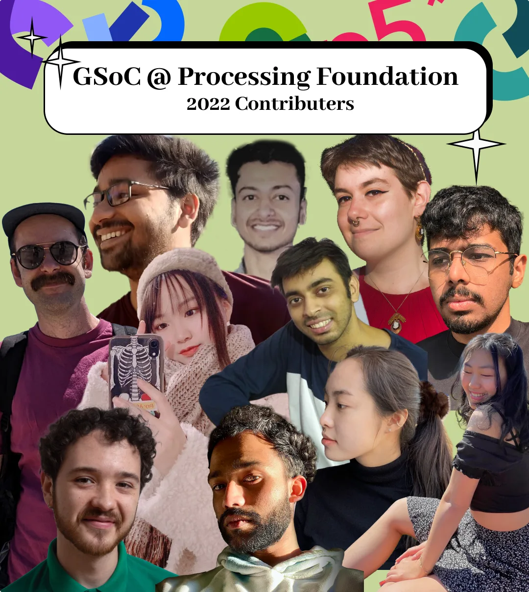
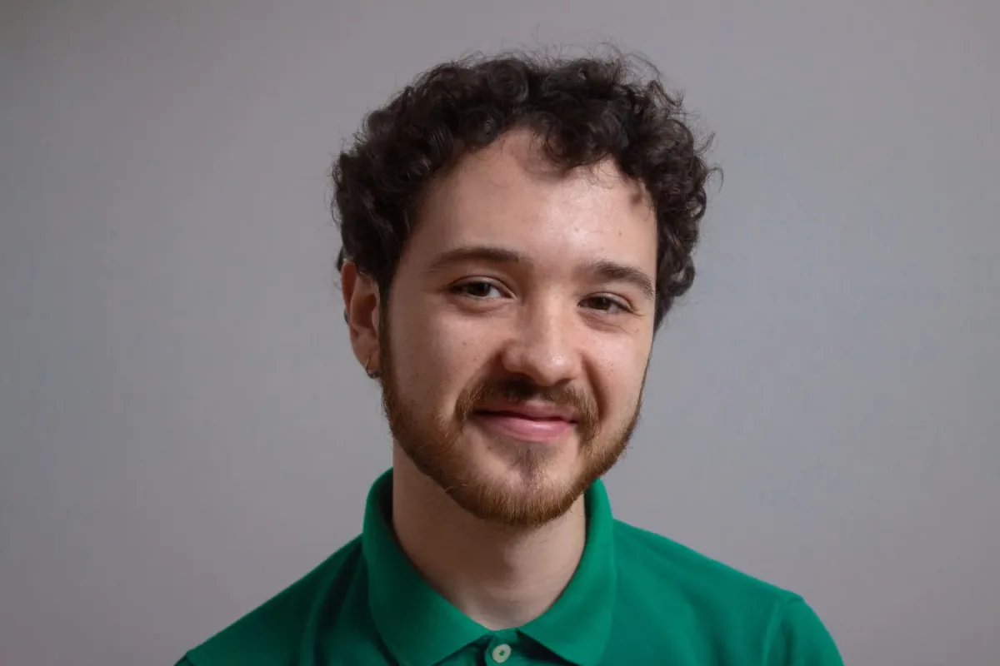
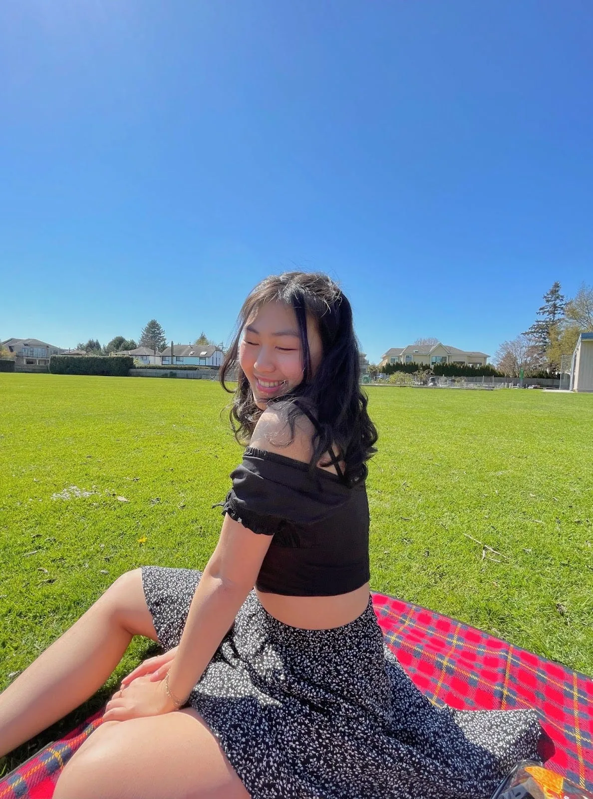
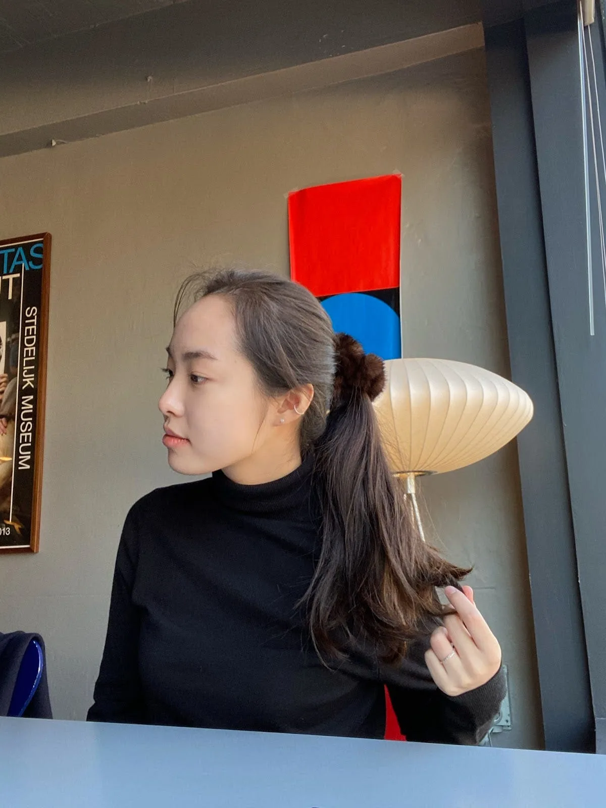
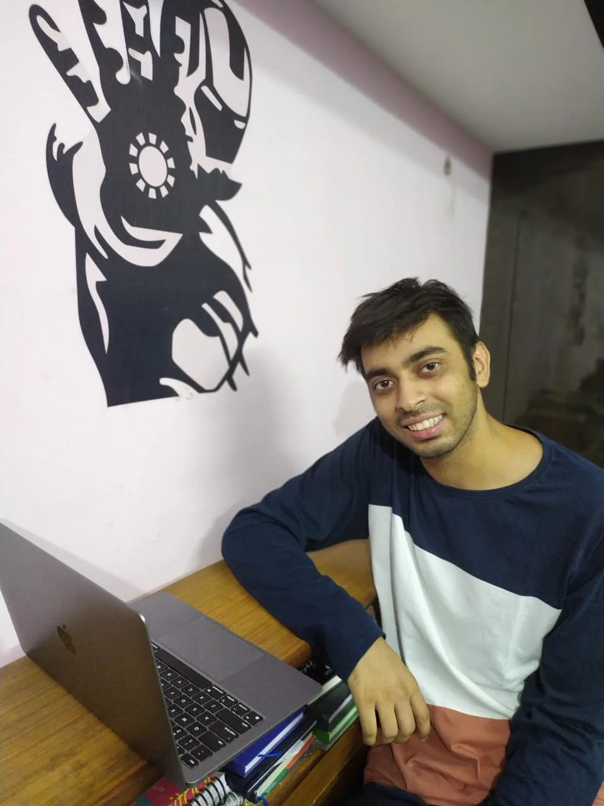
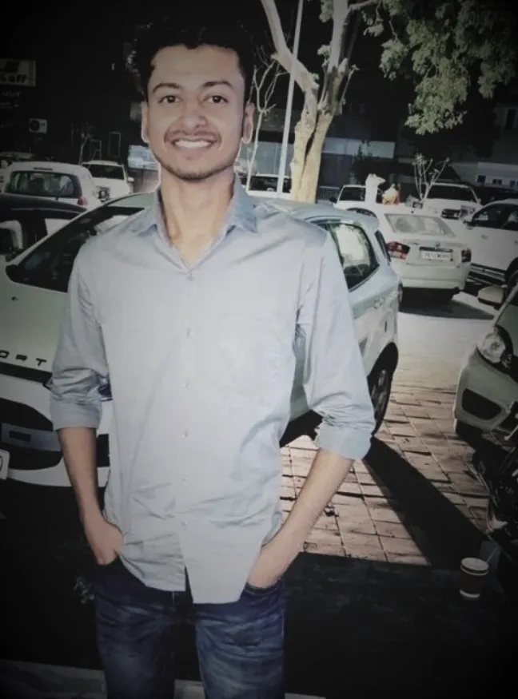
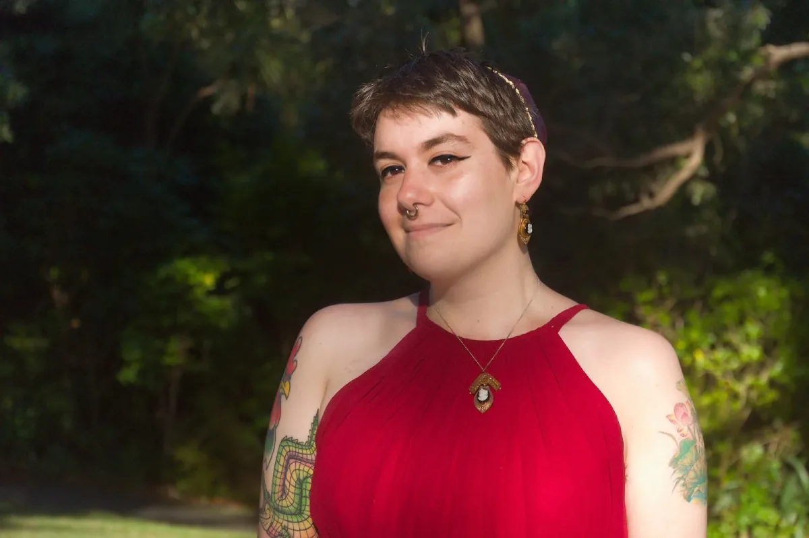
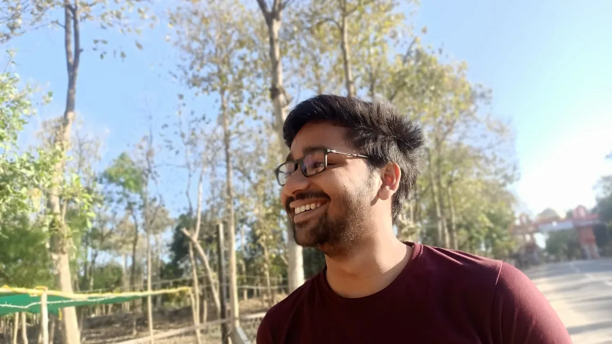

**11 projects for our 11th year in GSoC!**

We are participating in [Google Summer of Code](https://en.wikipedia.org/wiki/Google_Summer_of_Code) for the 11th year. The GSoC program aims to bring in new contributors into open-source software development by providing stipend to work on priorities identified by different non-profit organizations. Each non-profit organization provides mentorship and support to the contributors with the goal of creating opportunities for long-term collaboration with the new contributors. The Processing Foundation identified a [set of priorities](https://github.com/processing/processing/wiki/Project-List) earlier this year. We received 52 proposals and eight were accepted in the GSoC program. Beyond those we identified three projects that we are supporting directly. Keep reading to learn about the contributors, the projects, and mentors. There will be a follow-up post at the completion of the projects.

*2022 GSoC Cohort*

---

[**Jesús Rascón**](https://twitter.com/jesi_rgb) **— Saving GIF files in p5.js**

Mentored by [Divyanshu Raj](https://in.linkedin.com/in/divyanshu-raj-899514186), past GSoC contributor

*Jesús Rascón*

In this proposal, the main goal is to add functionality to the p5.js library to be able to save GIF files quickly and easily. GIF file saving is currently an aspect that many artists struggle with. It’s one of the easiest formats to publish to social media, especially Twitter. That said, generating a GIF out of a given animation is not particularly straight forward. We are aiming to solve this problem, among other bug fixes and whatnot that may come with — or be related to — it.

Jesús is a Spanish computer and data scientist and video producer. He’s been creating things since very little and continues to do so. He’s worked with Youtube channels such as Veritasium or Reducible as a mathematical animator, and aims to become a Computer Science educator and animator. He is also a musician and producer, with one album published on all major platforms. He’s also an amateur graphic designer, with several infographics and a whole YouTube channel rebranding.

**Annie Zheng — BONDS: Improving the p5.js Showcase’s Accessibility to Expand Community Support For New Coders**

Mentored by [Rachel Lim](https://www.linkedin.com/in/rachel-lim-324a8ab6), past GSoC contributor

*Annie Zheng*

Annie Zheng will be working on the fourth iteration of the p5.js showcase. She will be exploring the theme of “BONDS”, which will emphasize community building and extending support to new coders. This showcase will specifically focus on exploring accessibility in non-violent, caring, accessible, and creative ways and will begin preparations for the showcase launch through various social media challenges.

Annie Zheng is a rising junior at the University of Southern California pursuing a major in Media Arts + Practice (BA) from the School of Cinematic Arts. She became interested in creative code after taking a class at USC, and since then she strives to use code and other media platforms to create new narrative experiences. In her spare time, she enjoys eating her way across LA and shamelessly trying to teach herself to dance (unsuccessfully).

[**Samir Ghosh**](https://www.instagram.com/vertex.shader/) **— p5.xr Enter VR button, controller functionality, interface primitives, and basic locomotion**

Mentored by Stalgia Grigg

*Samir Ghosh*

Samir will be bringing improvements to p5.xr in order to expand p5.js’s capabilities in creating 3D VR experiences for devices such as Meta Quest 2 and Valve Index. Some proposed improvements include controller interfaces and representation, locomotion, and object interaction.

Samir Ghosh is a VR developer and educator based in Los Angeles. They serve as the Assistant Director of the Ahmanson Lab, a library makerspace at USC that produces AR and VR projects in the humanities. In addition to providing technical expertise, they manage fabrication resources and teach community workshops that span techniques in 3D graphics, hardware prototyping, issues in digital privacy, and explorations of creative coding.

[**Jeongin Lee**](https://www.linkedin.com/in/jeongin-lee-4687401b3/) **— Beginner-friendly ML Library for Processing**

Mentored by Andrés Colubri

*Jeongin Lee*

Jeongin will be developing a [beginner-friendly Machine Learning library](https://github.com/jjeongin/ml4processing) for Processing this summer. The library will be built on top of TensorFlow Java and include a user-friendly reference page that will allow beginners to easily apply ML in their Processing applications.

Jeongin Lee is a rising junior at New York University Abu Dhabi, studying Computer Science with a minor in Interactive Media and Mathematics. She is interested in Artificial Intelligence and Interactive Art and exploring the intersection between technology and art. Outside of school work, she loves making art with code, watching films, and traveling. Her GitHub is [https://github.com/jjeongin](https://github.com/jjeongin) and her Instagram is [https://www.instagram.com/jeong.in.work/.](https://www.instagram.com/jeong.in.work/.)

[**Shubham Kumar Sharma**](https://github.com/ShenpaiSharma) **— Improving p5.js WebGL Functionality**

Mentored by [Caleb Foss](https://www.calebfoss.com/)

*Shubham Kumar Sharma*

This project aims to implement some new features and enhance the current functionalities for p5.js and refactor the WebGL rendering pipeline so that multiple materials can be applied to geometry.

Shubham Kumar is a final-year undergraduate student from IIT Dhanbad. He is originally from India and loves experimenting with new technologies and learning from it. He discovered creative coding while contributing to the Processing Foundation and has enjoyed it. This is his first time participating in GSOC and he is currently exploring the world of open source. He hopes to learn a lot and enjoy this experience!

[**Gracia Zhang**](https://wp.nyu.edu/tischschoolofthearts-gz/) **— p5.js Teach Page**

Mentored by [Inhwa Yeom](https://yinhwa.art/), past Processing Foundation Fellow

*Gracia Zhang*

Gracia plans to re-organize media from the teachers, code and video, re-organize the resources with more detailed tags, renew unreachable links and update the materials. She will also update the contents and link to associated resource content and try to grade contents by difficulty.

Gracia is a visual designer and a front-end development beginner. She majors in ITP in NYU as a first-year master.

[**Austin Slominski**](https://www.aceslowman.com/) **— Resolving Bugs and Expanding Documentation for WebGL in p5.js**

Mentored by [Kate Hollenbach](http://www.katehollenbach.com/), Processing Foundation Board member

*Austin Slominski*

Austin Slominski will be working with mentor Kate Hollenbach to resolve a number of bugs with WebGL functionality in p5.js, as well as expand on the documentation and examples related to that functionality.

Austin Slominski is an audiovisual artist based in Denver, CO, originally from Missoula, MT. His work uses custom software to create sounds and visuals that explore ideas around how we interact and navigate with others within networks, through multimedia works, performance, installation, and web art. Austin recently received his MFA from University of Denver’s Emergent Digital Practices program, where his thesis focus is on building networked tools for artists and other creative tools.

[**Malay Vasa**](https://www.malayvasa.com/) **— p5.js Examples Code Improvement**

Mentored by [Tyler Yin](https://tyleryin.co/)

*Malay Vasa*

Malay will be working with his mentor Tyler on updating the examples in the p5 website to contextualize them with principles of visual design. By showcasing how the tools can be used visually, he aims to bridge the gap that beginners often face between conceptualizing an artwork and coding it. He also plans to improve the user experience of the examples page by introducing search and thumbnails.

Malay Vasa is a third-year undergraduate student of Human Centered Design at Srishti Manipal Institute in Bangalore. He is also a self-taught front-end developer and creative coding enthusiast. He has been a part of the processing community since one of his first-year projects was featured in the p5js 2020 showcase [https://connie-liu.me/p5.js-showcase/#/2020-All/project-15/.](https://connie-liu.me/p5.js-showcase/#/2020-All/project-15/.) This is his first time participating in Google Summer of Code.

---

Processing Foundation is directly supporting the following projects submitted via GSoC.

[**Rupesh Kumar**](https://www.instagram.com/withrupesh/) **— Finalizing the Update of the Android Mode to Processing 4**

Mentored by [Aditya Rana](https://in.linkedin.com/in/adityarananitt), past contributor and mentor

*Rupesh Kumar*

Some initial progress has been made in getting the Android mode to work with current betas of Processing 4. Rupesh will be working on the Android mode to make it fully compatible with the final version of Processing 4 and the most recent releases of the Android platform.

Rupesh holds a degree in Computer Science and Engineering. He has been actively contributing to Processing for Android. Some of his previous work involves AndroidX Migration of core library and incorporation of AAB(Android App Bundle) Support to the Android Mode.

[**Zelle Marcovicci**](https://zelle.zone) **— Writing py5 tutorials and how-to documentation to support creative coders new to Python and/or new to the Processing ecosystem**

Mentored by [Tristan Bunn](https://tabreturn.com) and [Jim Schmitz](https://ixora.io/)

*Zelle Marcovicci*

[Zelle](https://www.linkedin.com/in/denzelle/) will be teaching an introductory course (Intro to Programming for Interactive Projects) that has always revolved around the use of Processing’s Python mode, but updating it to use py5 in the Thonny IDE. In the process of adapting the course to these standards, she will also be producing documentation to contribute to the [http://py5.ixora.io/](http://py5.ixora.io/) site, allowing anyone to follow basic tutorials around visual output in coding, interactivity in py5, and more!

Residing in Wellington, New Zealand, [Zelle](https://twitter.com/tenderhooves) (pronounced like the first syllable of Zelda) is a developer, anarchist, foodie, gamer, bleeding-heart nature lover, metalhead, and stuffed animal collector. She’s clearly lost, but having fun. When she’s not tutoring (and studying) at [Massey University](http://massey.ac.nz/), she is enmeshed in virtual worlds, staring at the ceiling trying to figure out how to bugfix real life, or feeding her Neopets that are older than most of her students.

[**Tushar Gupta**](https://www.linkedin.com/in/tushar55/) **— Add Skia as a 2D renderer in p5py**

Mentored by [Ziyao Zhang (Mark)](https://www.linkedin.com/in/ziyaointl/), past GSoC contributor

*Tushar Gupta*

Tushar will be setting up Skia as a 2D backend renderer in p5py, the native python port of Processing. It would give a significant performance boost and enhance the typography support of p5py. Tushar will be mentored by Ziyao Zhang (Mark), who was a student in GSoC 2020 and worked on enhancing p5py.

Tushar is a pre-final year student from the KIET Group of Institutions, India, majoring in Computer Science. He has an avid passion for software development and started his open-source journey with Processing a few years back. He loves python and making hacks that help him automate the boring stuff. Fun-Fact: You can find him enjoying free coffees at Hackathons or gazing at computer simulations.
