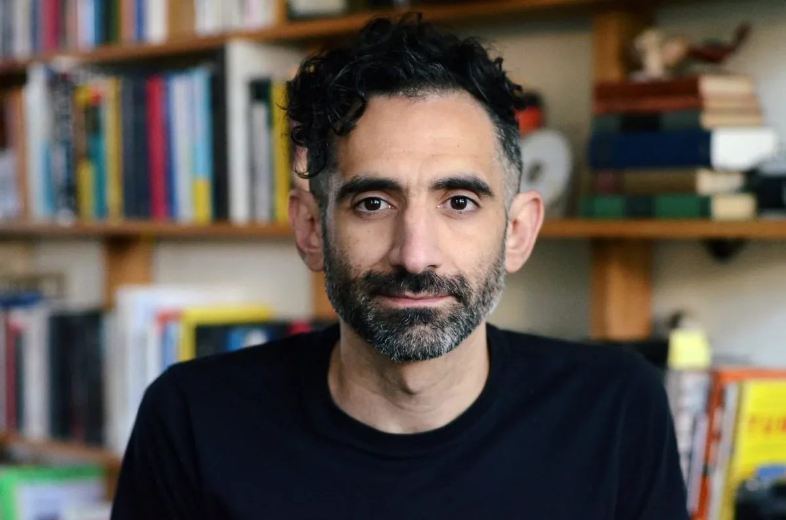
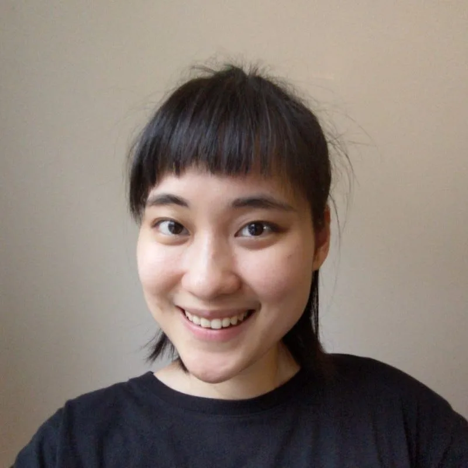
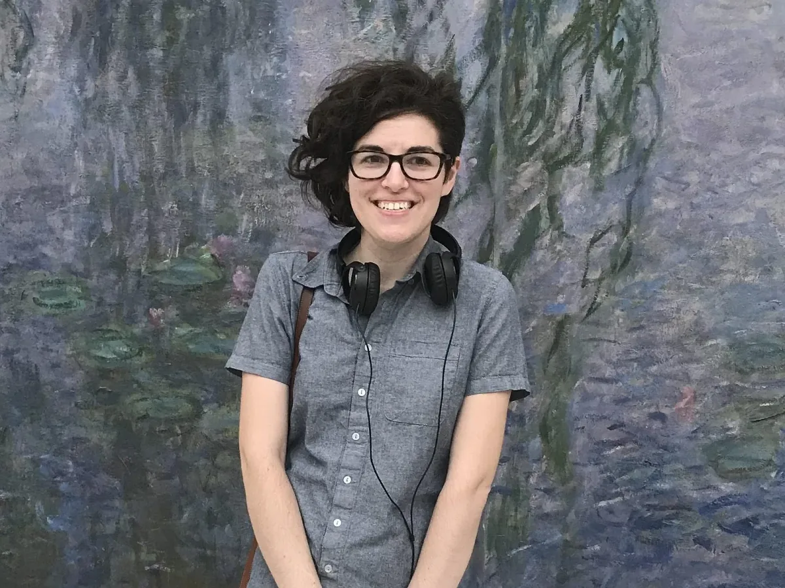
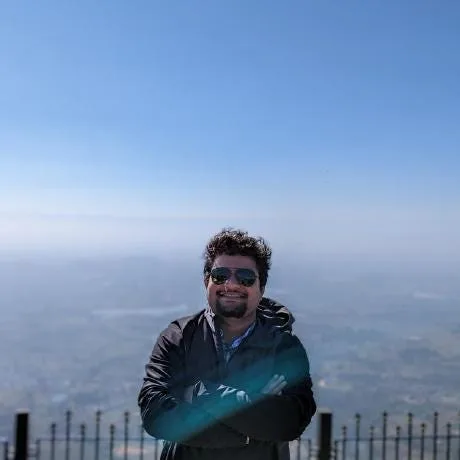
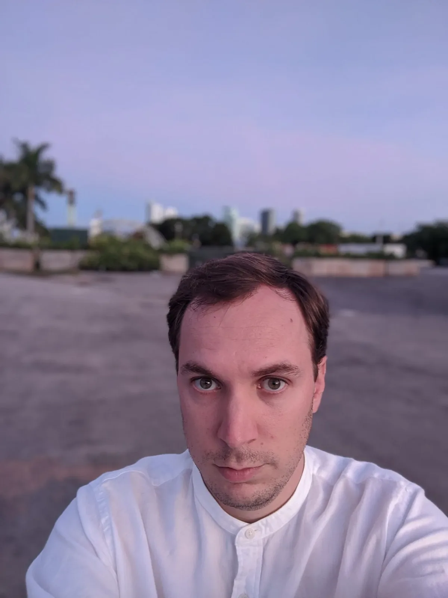
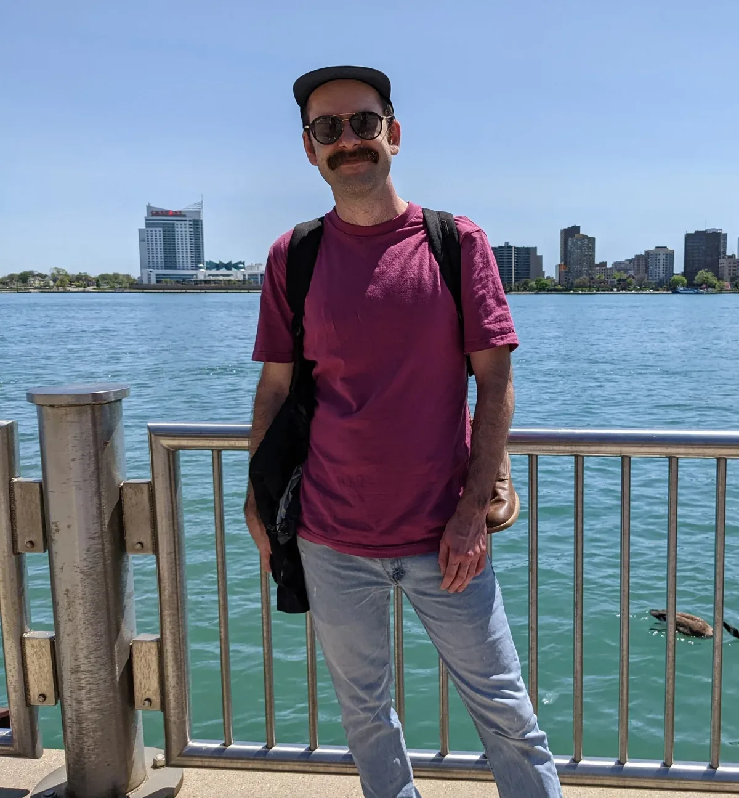
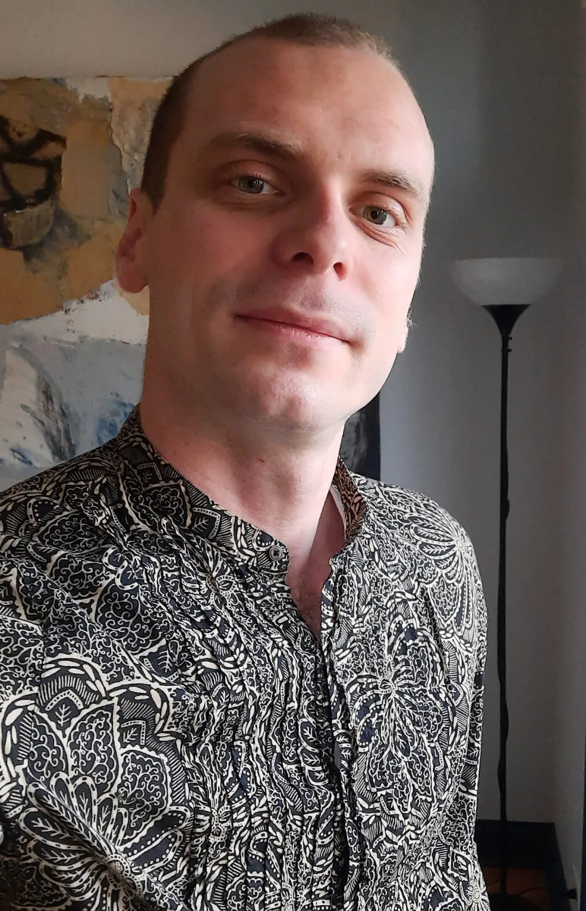
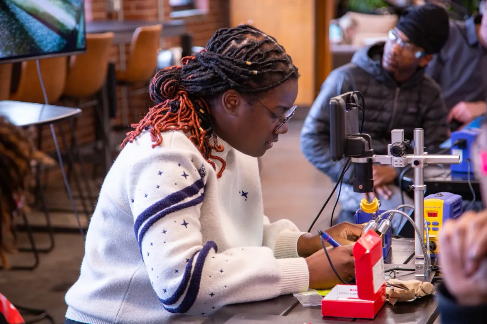
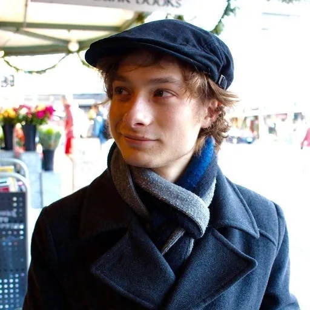
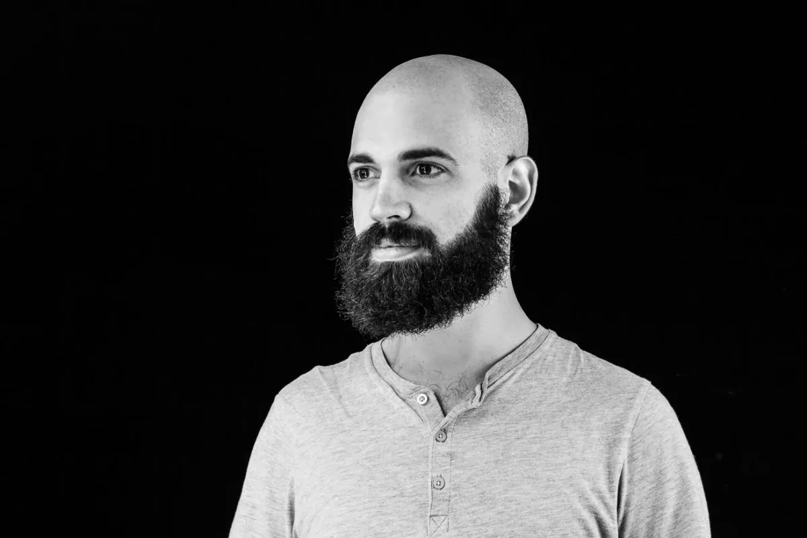

Google Summer of Code is a global, online mentoring program focused on introducing new contributors to Open Source software development. The GSoC program aims to bring in new contributors into open-source software development and seeks to encourage participants to engage with and continue their involvement in open-source communities even beyond the duration of the program. New contributors to open source will spend 12+ weeks writing code for an open source organization under the guidance of mentors from their new open source community. Each non-profit organization provides mentorship and support to the contributors with the goal of creating opportunities for long-term collaboration with the new contributors. The Processing Foundation identified [a set of priorities](https://github.com/processing/processing/wiki/Project-List) earlier this year. We received 91 proposals and 8 were accepted in the GSoC program. Keep reading to learn about the GSoC mentors.

Check out our article for GSoC Contributors [here](https://medium.com/p/75080c1554aa)!

*2023 Google Summer of Code Cohort*

---

**Tanvi Kumar and Dave Pagurek mentoring** [Aryan Koundal](https://www.linkedin.com/in/aryankoundal) **(he/him) — Improving p5.js WebGL/3D Functionality**

Aryan Koundal will be working on “Improving the p5.js WebGL/3D Functionality” by adding support for “Image Based Lighting” in WebGL mode. His work would allow creative coders to add a more aesthetic and natural-looking lighting to their drawings using different backgrounds. The creative coder/artist would have the freedom to decide the background image.

*Tanvi Kumar*

[Tanvi Kumar](https://linkedin.com/in/TanviKumar) **(she/her)**

Tanvi is a software engineer at Microsoft, India and works on frontend technologies at Microsoft Teams. She graduated from NIT Trichy, India in 2020 after completing her B.Tech in Civil Engineering with a minor in Computer Science and Engineering. She was a GSoC contributor in 2018 for the Processing Foundation. Today she uses p5.js to create pattern-based digital artwork as a generative artist.

Follow Tanvi on [instagram](https://www.instagram.com/generativebyt/)

*Dave Pagurek*

[Dave Pagurek](https://twitter.com/davepvm) **(he/him)**

Dave is a computer graphics programmer in Toronto, Canada, working on animation software for motion graphics and developing the WebGL mode of p5.js. In his spare time, Dave enjoys leaving geometry problems on his friends’ whiteboards for them to solve.

Follow Dave on [instagram](https://www.instagram.com/dpagurek/)

**Alm Chung and Nick Briz mentoring** [Ayush Shankar](https://www.linkedin.com/in/ayush23dash/) **(he/him) — Friendly Error System(FES) and Documentation**

Ayush proposes to work on the following for enhancement of Friendly Error System : 1. Decoupling the Friendly Error System to a standalone package 2. Resolving Issues/Fixing Bugs on Friendly Errors Issues 3. Adding a new language translation (#3390) for FES error messages.

*Alm (Alice) Chung*

[Alm (Alice) Chung](https://almchung.github.io/) **(she/they)**

Alm (Alice) Chung is an artist and researcher currently pursuing a PhD in the Cognitive Science program at UCSD, specializing in Human-Computer Interaction. Their research focuses on computing education and artist-created technology.

Follow Alm on [instagram](https://www.instagram.com/nekofutura/)

*Nick Briz*

[Nick Briz](http://nickbriz.com) **(he/him)**

Nick Briz is an internationally recognized new-media artist, educator, and organizer. His work investigates the promises and perils of living in an increasingly digital and networked world. He is an active participant in various online communities and conversations including glitch art, net art, remix culture, digital literacy, hacktivism and digital rights. He’s co-founder of netizen.org, a nonprofit focused on digital literacy and digital culture. He’s an Associate Professor Adjunct at the School of the Art Institute of Chicago, Lecturer at the University of Chicago, and a freelance Creative Technologist.

Follow Nick on [Twitter](https://twitter.com/NBriz), [Instagram](https://www.instagram.com/nbriz/), [Github](https://github.com/nbriz), and [Youtube](https://www.youtube.com/user/nickbriz)

**Shuju Lin and Linda Paiste mentoring Dewansh Thakur — Mobile/Responsive Implementation of p5.js Web Editor**

Dewansh Thakur has a plan to make the web editor work across all devices, providing not only project sharing and output viewing but also full editor capabilities for editing the source code on mobile devices. This enhancement aims to ensure a good user experience. Additionally, he intends to incorporate offline capabilities into the application, which would greatly enhance the web editor’s features and provide a more native experience overall.

*Shuju Lin*

[Shuju Lin](https://www.linkedin.com/in/linshujuuu/) **(she/her)**

Shuju is a UX designer currently residing in Brooklyn, New York. She has a background in advertising but developed a love for digital media over time, which led her to start coding as a hobby. Her diverse background and technical skills come together in her work, where she focuses on creating user-friendly designs that enhance digital experiences for everyone. Outside of work, Shuju enjoys traveling and watching reality shows.

*Linda Paiste*

[Linda Paiste](https://www.lindapaiste.com/) **(she/her)**

Linda Paiste is a software developer based in Houston, Texas. She works remotely as a Senior Frontend Engineer for medtech startup Basil Systems and contributes to open source projects in her free time. Her interests include architecture, antiques, women’s gymnastics, Girl Scouting, and cats.

**Aditya Rana mentoring** [Gaurav Puniya](https://www.linkedin.com/in/gpuniya/) **(he/him) — Migrating VR library and Adding Image Markers to AR**

Gaurav will be migrating the existing VR library from Google VR to Cardboard-VR as the prior is no longer supported/maintained by Google. In the latter half of the program, he will be adding the Image Markers functionality to the AR library, which is a part of the AR-Core Library and a must have for AR apps.

*Aditya Rana*

[Aditya Rana](https://www.instagram.com/adityarana814/) **(he/him)**

Aditya is a Software Engineer based in Bangalore, India. He is an open source enthusiast and has been mentoring with Processing for the past 3 years and did his GSoC under Processing in 2020. He’s built Processing Kotlin mode from scratch for mobile devices.

**Adam Ferriss and Austin Slominski mentoring** [Justin Wong](https://wonger.dev) **(he/him), advised by So Sun Park — Support Shader-Based Filters in p5.js**

Justin will be making image filters with shaders. These will improve performance in p5.js sketches that use blur, grayscale, or other filters. In the process, he’ll clarify documentation about WebGL mode, add an entry point for shader programming, and work on a benchmarking system.

*Adam Ferriss*

[Adam Ferriss](http://amf.fyi) **(he/him)**

Adam Ferriss is an artist and programmer based out of Oregon. He received a BFA in Photography from the Maryland Institute College of Art, and an MFA from the Design Media Arts department at UCLA. His work has been featured widely in print and around the web on the New York Times, Time Magazine, MIT Technology Review, The New Yorker, Wired, and more. Adam’s works have appeared as interactive installations at Google I/O, Nike, and Coachella. His most recent pieces harness technologies like face tracking, neural networks / AI, and augmented reality to manipulate live camera and photographic imagery.

Follow Adam on [instagram](https://www.instagram.com/adamferriss/) and [twitter](https://twitter.com/adamferriss)

*Austin Slominski*

[Austin Slominski](https://www.instagram.com/aceslowman/) **(he/they)**

Austin Slominski is an audiovisual artist based in Denver, CO, originally from Missoula, MT. His work uses custom software to create sounds and visuals that explore how we interact and navigate with others within networks, usually through the use of custom software, performance, and installation.

Follow Austin on [twitter](https://twitter.com/aceslowman)

*So Sun Park*

[So Sun Park](https://instagram.com/sosunnyproject) **(she/her)**

So Sun is a developer, creative technologist, educator, and artist. She specializes in web development and interactive graphics, using libraries like p5.js and three.js, as well as game engines. She also uses technologies like creative coding for exhibitions and audiovisual shows, collaborating with other artists on arts and technology projects. Her goal is to create engaging, enjoyable, and accessible digital narratives using various tools and media. Recently, she has expanded her interests and skills to include computer graphics, XR, and gaming.

**Caleb Foss and Paula Isabel Signo mentoring** [Kathryn Lichlyter](https://www.linkedin.com/in/kathryn-lichlyter-664751189) **(they/them), advised by Claire Kearney-Volpe — Updating p5js.org Site Documentation and Accessibility**

Kathryn will improve the accessibility of the p5.js site by conducting an accessibility audit to gauge the current deficits of the platform, prioritizing what changes and/or additions need to be made to improve accessibility, inclusion, and usability, and seeing those changes through by re-coding and/or re-designing the appropriate aspects of the site.

*Caleb Foss*

[Caleb Foss](http://github.com/calebfoss) **(they/them)**

Caleb Foss is a Chicago-based media artist and educator. Their work has been showcased in film festivals including Chicago Underground, Imagine Science (Brooklyn), and FRACTO (Berlin) as well as game events including Hand Eye Society’s WordPlay Festival (Toronto) and Bit Bash at the Chicago Humanities Festival. Foss teaches classes on a variety of subjects including creative coding and game development. They are currently developing a project called p5-Marker that offers a way to create p5.js sketches declaratively and a new editor with a more visual, less text-based format.

*Paula Isabel Signo*

[Paula Isabel Signo](https://linkfree.eddiehub.io/paulaxisabel) **(she/her)**

Paula is a web application developer based in the Philippines. Her passion for open-source technology has led her to volunteer for p5.js as a steward, with a focus on color and typography areas. In addition to her technical work, Paula also writes for Open Source Software PH and serves as an ambassador for thirdweb. She is a strong advocate for open-source software and enjoys sharing her knowledge with others. With her dedication to the field, Paula continues to make valuable contributions to the open-source community.

*Claire Kearney-Volpe*

[Claire Kearney-Volpe](https://takinglifeseriously.com/index.html) **(she/her)**

Claire is an art therapist, designer, researcher, and accessibility specialist. She completed a Master’s in Interactive Telecommunications in 2015, and a PhD in Rehabilitation Sciences and Human-Computer Interaction. Her areas of expertise include digital accessibility, UI/UX, STEM education, and human-centered design. She’s worked on a variety of assistive and rehabilitation technology projects and is active in the digital accessibility community. She is a firm believer that technology serves people best when they participate in its design.

**Kevin Yeh and Aren Davey mentoring** [Munus Shih](https://www.instagram.com/munusshih/) **(he/him), advised by Kenneth Lim — A Typographic Revamp for p5.js,**

“A Typographic Revamp for p5.js” aims to improve the typographic section of the p5.js library by fixing the issue flag on GitHub, adding new features, developing new examples for typography documentation, and interviewing creative coders for feedback. The goal is to enhance the functionality and versatility of p5.js, and ensure that it remains a valuable tool for creative coders and graphic designers.

*Kevin Yeh*

[Kevin Yeh](https://twitter.com/spacetypeco) **(he/him)**

Kevin Yeh is a partner at Space Type, a Brooklyn based type studio that operates at the intersection of type, design, and technology. As a designer, developer, and educator, his work reflects broad and varied interests to imagine, reconstruct, and relate to letterforms through generative design and interactive experiences, using algorithmic form-making tools to create playful and experimental websites, animated sequences, and dynamic branding identities.

*Aren Davey*

[Aren Davey](https://twitter.com/albeit_angular) **(she/her)**

Aren is a creative technologist and artist. She works with p5.js, OpenRNDR, and her beloved Axidraw.

**Sam Pottinger and Raphaël de Courville mentoring** [Will Rabalais](https://www.linkedin.com/in/will-rabalais-28b005216/) **(he/him) — Friendlier Error Messages for Processing**

The aim of Will’s project is to improve error messages within Processing so that it is more beginner friendly in the style of the p5.js Friendly Error System (FES). To do so, error messages will have four components: the JVM error, the cause of the error, an explanation, and when possible, a solution. The messages will be in simple language, convey the severity of the error and include relevant documentation. If time allows, features such as translation into multiple languages, a log of previous errors, and a user feedback button will be added.

*Sam Pottinger*

[Sam Pottinger](http://gleap.org) **(he/him)**

Serving the project since 2019, Sam has contributed as an open source developer on Processing’s core and worked heavily on the version 4 release. Outside Processing, he’s a Senior Research Software Engineer / Data Scientist at The Eric and Wendy Schmidt Center for Data Science and Environment at UC Berkeley where he combines machine learning, information design (data visualization), and game design for human centered / participatory data science. He also previously worked at Google, Apple, IDEO, Plenty, EVERY, and LabJack.

*Raphaël de Courville*

[Raphaël de Courville](http://twitter.com/sableraph) **(he/him)**

Raphaël de Courville is a generative artist and designer from Paris. He currently serves as the Community Lead for the Processing project. In 2012, he co-founded Creative Code Berlin, an initiative that fosters collaboration between artists and coders through monthly events. Additionally, Raphaël shares insights on Creative Coding through his Twitch streams. He lives and works in Berlin.

We’re so excited to see what our GSoC Contributors will work on this summer! Thank you to our amazing cohort of mentors and advisors in the field that support this work. We hope to keep supporting the creative code and open source community, year after year. Want to support the Processing Foundation in this work? [Donate here](https://processingfoundation.org/donate) to support our ecosystem of open source contributions!
