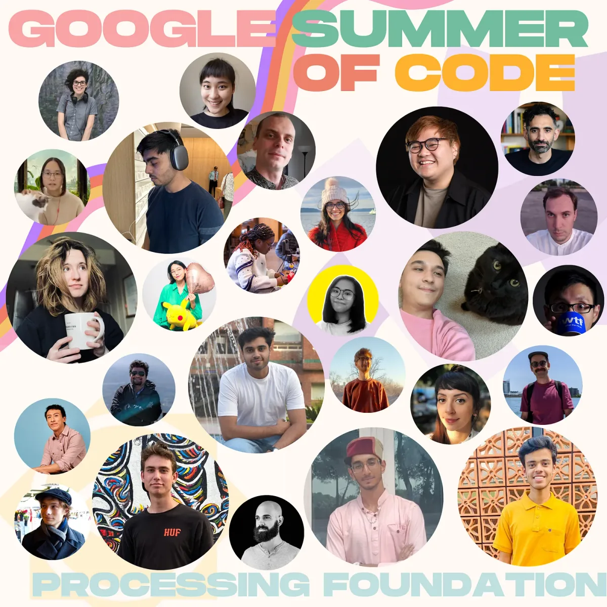
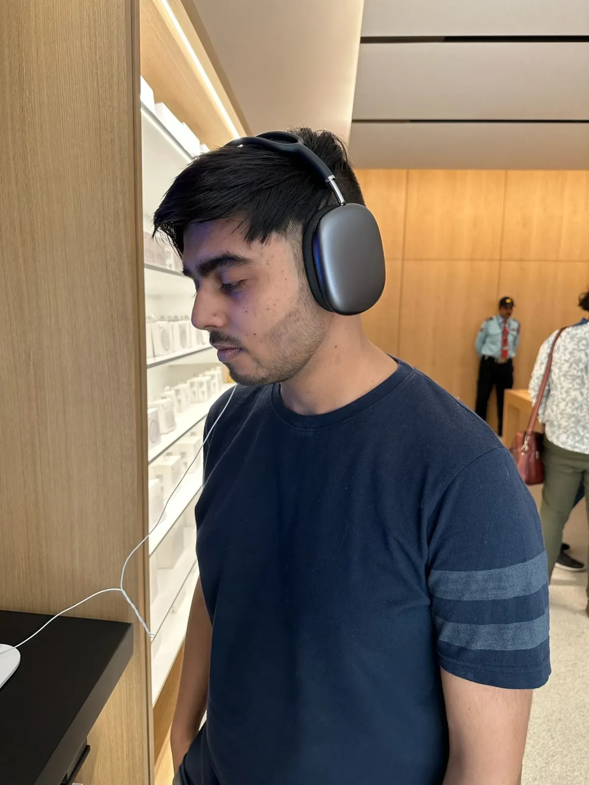
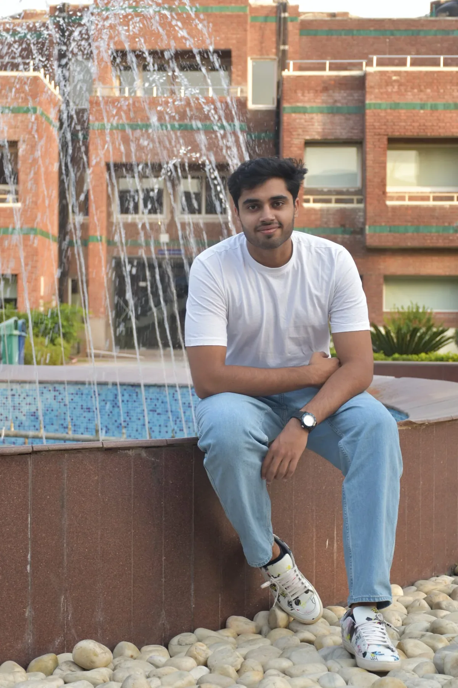
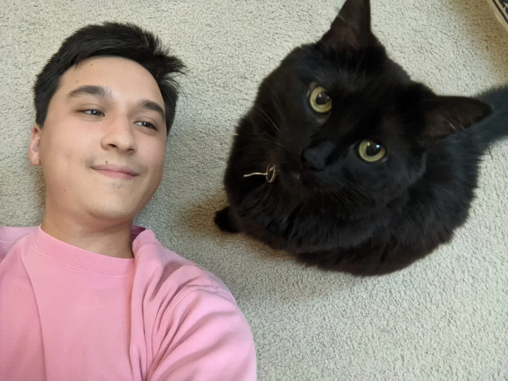
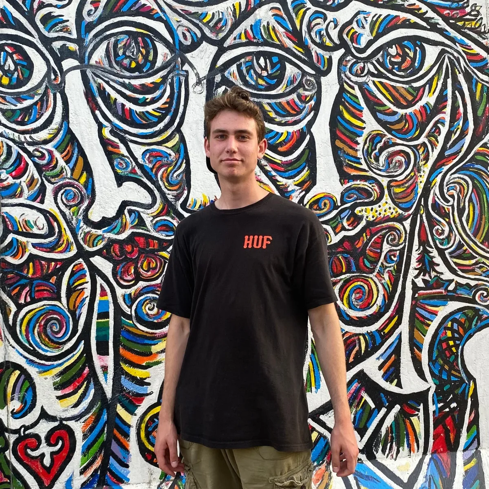

We are participating in [Google Summer of Code](https://en.wikipedia.org/wiki/Google_Summer_of_Code) (GSoC) for the 12th year! Google Summer of Code is a global, online mentoring program focused on introducing new contributors to Open Source software development. The GSoC program aims to bring in new contributors into open-source software development and seeks to encourage participants to engage with and continue their involvement in open-source communities even beyond the duration of the program. New contributors to open source will spend 12+weeks writing code for an open source organization under the guidance of mentors from their new open source community. Each non-profit organization provides mentorship and support to the contributors with the goal of creating opportunities for long-term collaboration with the new contributors. The Processing Foundation identified [a set of priorities](https://github.com/processing/processing/wiki/Project-List) earlier this year. We received 91 proposals and 8 were accepted in the GSoC program. Keep reading to learn about the contributors, the projects, and mentors! There will be a follow-up post at the completion of the projects.

*2023 Google Summer of Code Cohort*

---

[**Aryan Koundal**](https://www.linkedin.com/in/aryankoundal) **(he/him) — Improving p5.js WebGL/3D Functionality**

Mentored by Dave Pagurek and Tanvi Kumar

*Aryan Koundal*

Aryan Koundal will be working on “Improving the p5js WebGL/3D Functionality” by adding support for “Image Based Lighting” in WebGL mode. His work would allow creative coders to add a more aesthetic and natural-looking lighting to their drawings using different backgrounds. The creative coder/artist would have the freedom to decide the background image.

Aryan Koundal is studying Computer Science and Engineering at the National Institute of Technology Hamirpur, India. He is a full-stack developer, SQL Developer, and Technical Writer. He likes contributing to open-source projects and writing blogs online. He has been part of the p5.js community since the beginning of 2023 and this is his first time contributing a new feature to the p5.js library during GSoC. Outside of work, he loves sketching, dancing, and riding bikes.

[**Ayush Shankar**](https://www.linkedin.com/in/ayush23dash/) **(he/him) — Friendly Error System(FES) and Documentation**

Mentored by Alm Chung and Nick Briz

*Ayush Shankar*

Ayush proposes to work on the following for enhancement of Friendly Error System : 1. Decoupling the Friendly Error System to a standalone package 2. Resolving Issues/Fixing Bugs on Friendly Errors Issues 3. Adding a new language translation (#3390) for FES error messages.

Ayush is an avid techie who has worked on various technologies like NodeJs, ReactJs, Dot Net, and has a good grasp of Version Control. He has participated in various hackathons, won a few, and has simultaneously contributed to open source in the past as well to some organizations like Gnome and AnitaB.org.

[**Dewansh Thakur**](https://twitter.com/ThakurDewansh) **— Mobile/Responsive Implementation of p5.js Web Editor**

Mentored by Linda Paiste and Shuju Lin

*Dewansh Thakur*

Dewansh Thakur has a plan to make the web editor work across all devices, providing not only project sharing and output viewing but also full editor capabilities for editing the source code on mobile devices. This enhancement aims to ensure a good user experience. Additionally, he intends to incorporate offline capabilities into the application, which would greatly enhance the web editor’s features and provide a more native experience overall.

Dewansh Thakur is a creative web developer and designer. He is currently a third-year undergraduate student at Bhilai Institute of Technology Durg, pursuing Information Technology as his major.

[**Gaurav Puniya**](https://www.linkedin.com/in/gpuniya/) **(he/him) — Migrating VR library and Adding Image Markers to AR**

Mentored by Aditya Rana

*Gaurav Puniya*

Gaurav will be migrating the existing VR library from Google VR to Cardboard-VR as the prior is no longer supported/maintained by Google. In the latter half of the program, he will be adding the Image Markers functionality to the AR library, which is a part of the AR-Core Library and a must have for AR apps.

Gaurav Puniya is a junior year student at NSUT. He’s an autodidact with a strong will to contribute and collaborate with the community. Besides academics, Gaurav is an active member of the Prayas community teaching underprivileged students, and loves sketching. When he’s not coding, you’ll definitely find him on the basketball court.

[**Justin Wong**](https://wonger.dev) **(he/him) — Support Shader-Based Filters in p5.js**

Mentored by Adam Ferriss and Austin Slominski, advised by So Sun Park

*Justin Wong*

Justin will be making image filters with shaders. These will improve performance in p5.js sketches that use blur, grayscale, or other filters. In the process, he’ll clarify documentation about WebGL mode, add an entry point for shader programming, and work on a benchmarking system.

Justin Wong is a software developer in Central Florida who finished a degree in programming and tinkered with hobby projects for a while. GSoC will be his first opportunity to dive into open source, where he will practice development skills beyond just writing code. He is currently searching for the sane parts of web development and enjoying the simple beauty of the terminal. You might find him exploring produce aisles and parks in his free time.

[**Kathryn Lichlyter**](https://www.linkedin.com/in/kathryn-lichlyter-664751189) **(they/them) — Updating p5js.org Site Documentation and Accessibility**

Mentored by Caleb Foss and Paula Isabel Signo, advised by Claire Kearney-Volpe

*Kathryn Lichlyter*

Kathryn will improve the accessibility of the p5.js site by conducting an accessibility audit to gauge the current deficits of the platform, prioritizing what changes and/or additions need to be made to improve accessibility, inclusion, and usability, and seeing those changes through by re-coding and/or re-designing the appropriate aspects of the site.

Kathryn is a multi-disciplined designer specializing in web accessibility, design systems, and user experience. They are currently enrolled in the Emergent Digital Practices program at the University of Denver and expect to graduate this August. Most of their expertise lies in design systems and web accessibility but they also have interests in UX development, technical writing, and SEO strategy. After graduation, they hope to continue their career in design and make the web a more inclusive area to navigate, utilize, and thrive.

[**Munus Shih**](https://www.instagram.com/munusshih/) **(he/him) — A Typographic Revamp for p5.js**

Mentored by Kevin Yeh and Aren Davey, advised by Kenneth Lim

*Munus Shih*

‘A Typographic Revamp for p5.js’ aims to improve the typographic section of the p5.js library by fixing the issue flag on GitHub, adding new features, developing new examples for typography documentation, and interviewing creative coders for feedback. The goal is to enhance the functionality and versatility of p5.js, and ensure that it remains a valuable tool for creative coders and graphic designers.

Munus Shih is a Taiwanese Hakka coder and educator based in NYC, passionate about bringing more critical and diverse perspectives to teaching code. With a background in design and technology, Munus leverages contextual data and customized algorithms to explore community organizing. Recently, Munus was a fellow for the Processing Foundation, where he contributed to open source projects and helped develop decolonial teaching resources. In collaboration with Iley Cao, he also co-developed p5.genzine, an open-source and user-friendly javascript library for anyone who’s curious about forking, remixing, and collaborative zine-making.

[**Will Rabalais**](https://www.linkedin.com/in/will-rabalais-28b005216/) **(he/him) — Friendlier Error Messages for Processing**

Mentored by Sam Pottinger and Raphaël de Courville

*Will Rabalais*

The aim of Will’s project is to improve error messages within Processing so that it is more beginner friendly in the style of the p5.js Friendly Error System (FES). To do so, error messages will have four components: the JVM error, the cause of the error, an explanation, and when possible, a solution. The messages will be in simple language, convey the severity of the error and include relevant documentation. If time allows, features such as translation into multiple languages, a log of previous errors, and a user feedback button will be added.

Will Rabalais is a rising sophomore studying computer science and mathematics at the University of Maryland at College Park. Will has experience with technical writing, Java development, and object oriented programming. His interest in Processing stems from its emphasis on accessibility to beginners and the creativity it facilitates. He enjoys watching movies, reading, and traveling and has lived in four different countries but is currently at home for the summer in Amsterdam.

We’re so excited to see what our GSoC Contributors will work on this summer! We hope to keep supporting new contributors to open source year after year. Want to support the Processing Foundation in this work? [Donate here](https://processingfoundation.org/donate) to support our ecosystem of open source contributions!
