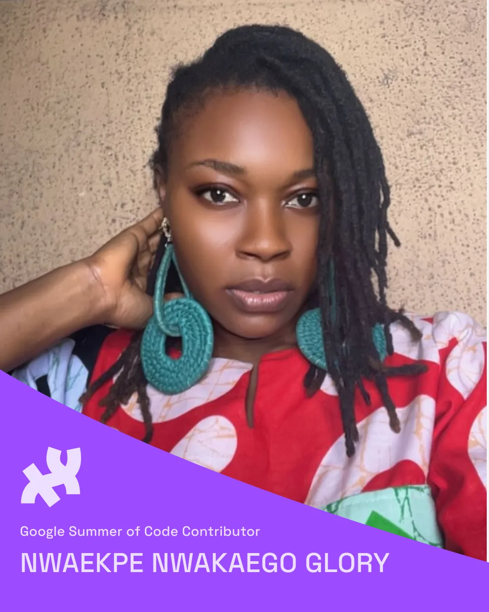

  <iframe src="https://www.youtube.com/embed/GI2YVc7O_cI?feature=oembed" frameborder="0" scrolling="no"></iframe>

Google Summer of Code is a global, online mentoring program focused on introducing new contributors to open-source software development. GSoC aims to bring in new contributors and encourages them to engage with open-source communities even beyond the duration of the program. We will provide mentorship and support to the contributors and create opportunities for long-term collaboration. Our [Project Leads](https://processingfoundation.org/people), Rachel Lim (p5.js Editor), Kit Kuksenok (p5.js), and Raphaël de Courville (Processing), identified a set of [Project Ideas](https://github.com/processing/Processing-Foundation-GSoC/wiki/Project-Ideas-List-%28GSoC-2025%29) published on the [Processing Foundation Github](https://github.com/processing/Processing-Foundation-GSoC?tab=readme-ov-file) earlier this year. We received nearly 150 proposals, and 3 were accepted into the GSoC program. Keep reading to learn about the contributors, projects, and mentors! After completing their projects, contributors will showcase them in a final presentation.

#### [Nwaekpe Nwakaego Glory](https://www.linkedin.com/in/glory-nwaekpe/) (she/her) — Friendly Sketch Embedder for p5.js

**Mentored by** [Dora Do](http://www.doradocodes.com/)

*2025 Google Season of Code Contributor, Nwakaego Nwaekpe Glory. Dress by [themunabrand](https://www.instagram.com/themunabrand/).*

Embedding p5.js sketches on different platforms can be tricky because some sites block scripts, remove iframes, or require a specific format. This project will create an easy-to-use embed generator that lets users customize their embeds without writing any code. It will support both Global and Instance Mode, making it flexible for different coding styles. Users can adjust the size, background color, playback options, and whether the code is editable or locked, all through a simple interface. To make things even easier, the tool will include smart platform presets so users can generate the right embed code for platforms like WordPress, Medium, Notion, and static site builders. A live preview will show exactly how the embed will look before copying the code. This project will remove technical barriers, making it simple for teachers, artists, and developers to share p5.js sketches anywhere.

[Nwaekpe Nwakaego Glory](https://www.linkedin.com/in/glory-nwaekpe/) is a frontend developer, content writer, and technical writer with a strong focus on JavaScript, React, and Next.js. She is passionate about solving real-world problems through code and simplifying complex technical concepts through writing. When she’s not coding, she’s breaking down programming ideas into accessible content while deepening her understanding of the tools she uses. She enjoys exploring open-source, improving user experience, and learning from the philosophies behind technologies like React. She is currently contributing to a GSoC project that improves how creative coding sketches are embedded and shared.

She is most excited about the opportunity to grow deeply, not just as a contributor but also as a developer. She is also looking forward to mentorship, learning from experienced contributors, building real connections, and gaining insight into how meaningful, user-focused tools evolve through collaboration. For her, this is more than a project; it’s a step into purposeful, long-term contribution.

Follow [Nwaekpe Nwakaego Glory](https://www.linkedin.com/in/glory-nwaekpe/) on [Twitter/X @glorynwaekpe](https://x.com/GloryNwaekpe).

#### [Kamakshi](https://github.com/kammeows) (she/her) — Context-Aware Autocomplete and Refactoring Enhancements for the p5.js Web Editor

Mentored by [Diya Solanki](https://github.com/diyaayay) and [Tristan Espinoza](https://github.com/tespin)

*2025 Google Season of Code Contributor, Kamakshi.*

Currently, the autocomplete feature in the p5.js Web Editor is facilitated by CodeMirror and a custom-built static hinter (as given in the structured JSON file, p5-hinter.js). The hinter suggests all the available functions, and while it is helpful, the current implementation lacks context-awareness, which can be confusing, especially for beginners. This project aims to improve the autocomplete by making it context-aware. Additional functionalities like autocomplete for user-defined functions, variables, and classes, and support features like jump-to-definition and renaming will also be added. This will make the editor more beginner-friendly, intuitive, and efficient.

[Kamakshi](https://github.com/kammeows) is a passionate tech enthusiast with a deep interest in exploring the world of science and technology. She enjoys diving into full-stack development and machine learning. She also has a particular interest in game development, using software like Unity and Phaser. In her free time, she loves thinking up new ideas and coding games for fun. She’s always open to learning new things, meeting new people, and making meaningful connections along the way.

For this year’s program, Kamakshi is most excited to build her project, explore her potential, and connect with people in the community. She’s really looking forward to learning, sharing ideas, and making new friends along the way.

Follow [Kamakshi](https://github.com/kammeows) on [LinkedIn (Kamakshi)](https://www.linkedin.com/in/kamakshi-b-224467207/).

#### [Divyansh Srivastava](https://www.instagram.com/divyansh_.22/) (he/him) — Friendly p5.js Reference Translation Tasks

Mentored by [Kit Kuksenok](https://xnze.ro)

*2025 Google Season of Code Contributor, Divyansh Srivastava.*

This project will build a friendly automation tool to support community translation of the p5.js reference documentation, including p5.js core and p5.sound. The p5.js reference (API documentation) is authored in English via JSDoc comments in the source code, and the website currently offers documentation in five languages (English, Spanish, Simplified Chinese, Korean, and Hindi)​. As p5.js evolves, keeping these translations up-to-date is challenging. The goal is to create GitHub Actions and workflows that do not automate translation (which requires human nuance​) but instead assist volunteer translators. These tools will automatically track changes in the English “source” docs, flag or open tasks for updates in other languages, suggest new translation needs (for newly added APIs), and streamline communication with translation contributors.

[Divyansh Srivastava](https://www.instagram.com/divyansh_.22/) is a software engineer and IIT (BHU) Varanasi alumnus with a Bachelor of Technology degree. In his current org, he is working on increasing accessibility and has built AI-driven voice agents and a Web SDK for seamless voice interactions. An active contributor to p5.js and imaginative creative coder, he also served as a Hindi translation steward for p5.js 2.0. Divyansh blends user-focused design with robust, scalable solutions to deliver engaging digital experiences.

Follow [Divyansh](https://www.instagram.com/divyansh_.22/) on [Twitter/X @divsrivastava45](https://x.com/divsrivastava45).
