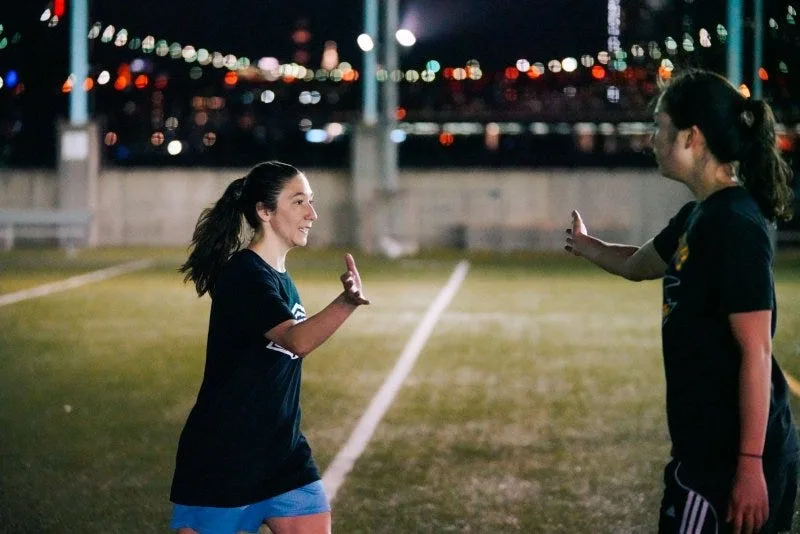
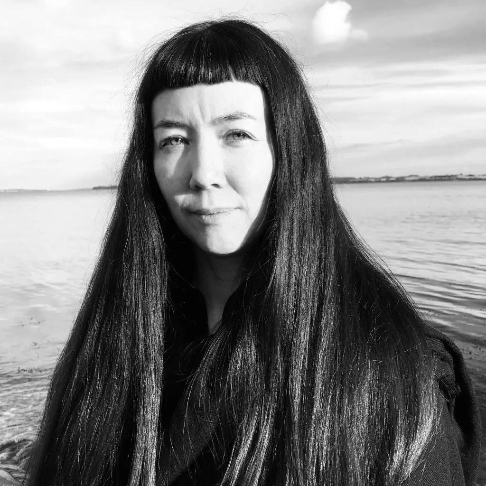
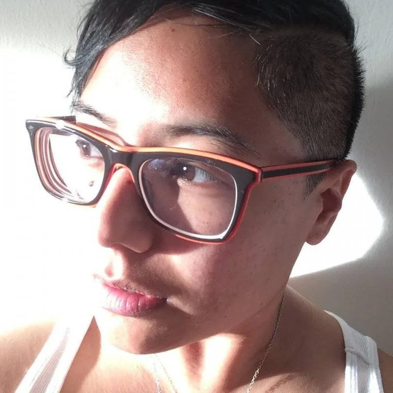

In 2012, after more than a decade of the Processing software’s growth in reach and impact, Ben Fry, Casey Reas, and Daniel Shiffman received 501(c)(3) nonprofit status for the Processing Foundation. Since that beginning of three, the Foundation’s growth has sought to be, and remains, human-scaled. Our goal has not been to rule the world, but to find in it our friends, collaborators, and like-minded allies. Together with these colleagues, we’ve worked to support the creativity and innovation that thrives in our community at all its intersections and overlaps. As we move forward into our ninth year as a nonprofit, we are excited to share some news about the people working behind the scenes.

---

*Toni Pizza*

First, we’d like to introduce you to Toni Pizza, who joined our team in January as Grants & Finance Manager. She is working to expand the Foundation’s grants and fundraising initiatives, streamline internal financial processes, and to help make sure the Foundation is financially sustainable for years to come. “Processing Foundation works to support such a fun and diverse group of creatives, technologists, activists, and educators, and I’m here to expand that work!” Toni says. “I want to make sure we have funding in place so we can continue to maintain, grow, and strengthen our global communities.” Toni Pizza (she/her) is a Brooklyn-based game designer, educator, and grant manager working as a Project Coordinator and adjunct instructor at the NYU Game Center. Previously she co-organized IndieCade East at the Museum of the Moving Image, the Different Games Conference, the Lost Levels Unconference, and the Come Out & Play Festival. She also co-writes The Sportswoman, a semi-regular newsletter and Twitch show celebrating queer and women’s sports and athletes.

---

*Johanna Hedva*

Joining the Foundation as its first staff member in 2014, our Director of Advocacy, Johanna Hedva (they/them), is now on the Board of Directors. Since 2016, Johanna has led the Processing Foundation Fellowship program, steering it toward supporting the needs of diverse communities and championing Fellows from a wide variety of backgrounds. Hedva also serves as the Foundation’s Editor, where they manage and edit the content of our Medium publication, as well as our website and Education Portal. “I like to think of myself as the ‘voice’ of the Foundation,” they say. “Words matter: how we think and speak about what we do affects its impact in the world. We reach people by speaking to them in a language they can hear, and to do that, we first have to listen.”

---

*Dorothy R. Santos*

Last but not least, after serving as Program Manager since March 2018, we are excited to announce that Dorothy R. Santos (she/they) is stepping into the position of Executive Director for Processing Foundation. Dorothy is a fourth-year Ph.D. candidate in Film and Digital Media at the University of California, Santa Cruz (UCSC), where they have recently entered the dissertation-writing phase of their program. Dorothy’s research areas are critical medical anthropology, feminist media histories, technology, race, and ethics. She also works as a graduate researcher for the UCSC Science and Justice Research Center, focusing on the statistical modeling of COVID-19, the dissemination of big data, healthcare technologies, race, and ethics. In her role as Executive Director, Dorothy is most excited about continuing the Foundation’s partnerships with leading nonprofit organizations that align with our mission; laying the groundwork for a “Summer School for Art Teachers,” focused on educators incorporating art, computer science, and technology into their pedagogical approaches; working towards the development of a Processing Foundation Press, where we select projects to turn into zines, books, or educational material; organizing events and programming to celebrate the 20th Anniversary of Processing in August 2021 (a Leo!); and taking part in our next Processing Community Day and Creative Code Fest activities.
