Our [Fellowship Program](https://processingfoundation.org/fellowships) began in 2013, and this is the second year we’ve held an open call. We were overwhelmed by the response! We received three times as many applicants as last year, making it extremely difficult to select just seven of 130 proposed projects. Please check out the fellows and their projects below!

The Processing Foundation Fellowships support artists, coders, and collectives in visionary projects that conceive a new direction for what our software and a community can do. Fellowships are an integral part of the Processing Foundation’s work developing empowering and accessible tools at the convergence of the arts and technology. Each Fellowship is supported through a stipend and mentorship from The Processing Foundation.

### DIY Girls

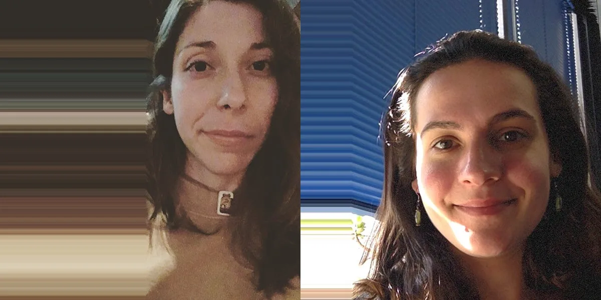

[DIY Girls](http://www.diygirls.org/) seeks to increase girls’ interest and success in STEAM through new educational experiences and mentor relationships. Sylvia Aguiñaga is the director of curriculum at DIY Girls and a digital media artist with Y\_NIS. Vanessa Landes is a program leader at DIY Girls and a Biomedical engineering PhD student at USC.

Their project will involve a p5.js (6–8 grade) curriculum development and translation of the p5.js zine into Spanish. Sylvia and Vanessa will expand, iterate, and improve DIY Girls’ current Processing curriculum. They will plan week-long creative coding camps for girls and will use their feedback to further iterate and improve the material. The creation and implementation of their p5.js curriculum and zine will broaden the scope of impact with girls in underserved areas of Los Angeles and in Mexico. Their bilingual zine will be a stand-alone resource for girls to explore — a tool that encourages self-led learning and awakens a love for code.

Sylvia and Vanessa will be mentored by [Lauren McCarthy](http://lauren-mccarthy.com) and [Jesse Cahn-Thompson](https://jessecahnthompson.com/).

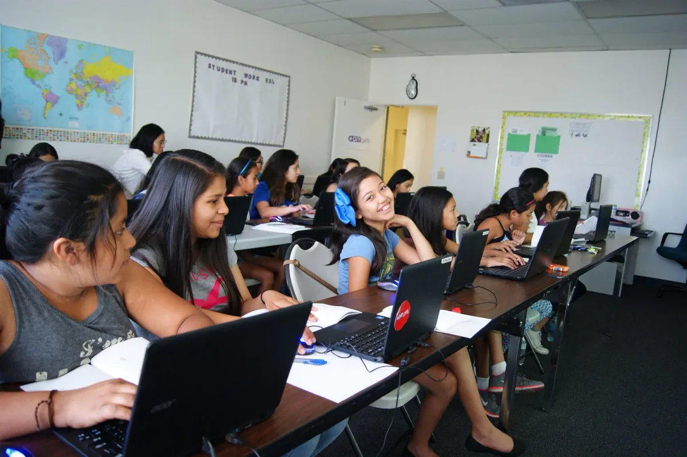

### Gottfried Haider

[Gottfried Haider](http://ghai.xyz/) is an artist, educator and tool-maker. His background is Digital Arts, with a degree from the University of Applied Arts Vienna. He is also recipient of a Fulbright Scholarship and holds an MFA in Design Media Arts from the University of California Los Angeles (UCLA).

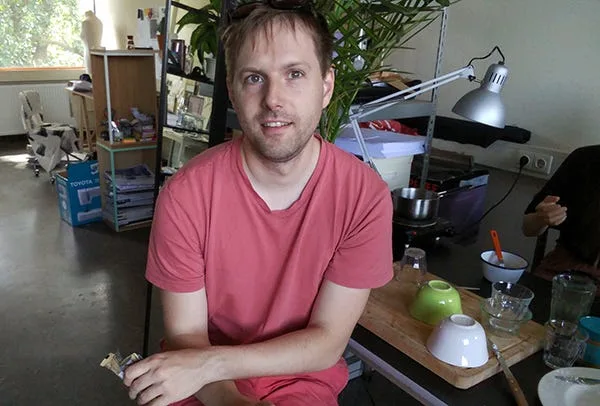

Devices such as the Raspberry Pi and the C.H.I.P. are promising vehicles for using code in environments such as teaching and installation art. In the context of everyday life, their ability to execute custom code sketches will also lend itself to ways of actively reflecting upon an area that is increasingly permeated by rather opaque technology, such as Amazon Echo or Google Home.

In the coming months, Gottfried will continue to build out Processing’s ability to run sketches on those small, ARM-based computers. With many pieces of the puzzle already in place, such as the ability to talk to external hardware (Hardware I/O library), or accelerated video-decoding (GL Video library), emphasis will be placed on making it easier to get started, and to develop the tools and libraries needed for students, designers and hobbyists to engage with the aforementioned areas of interest.

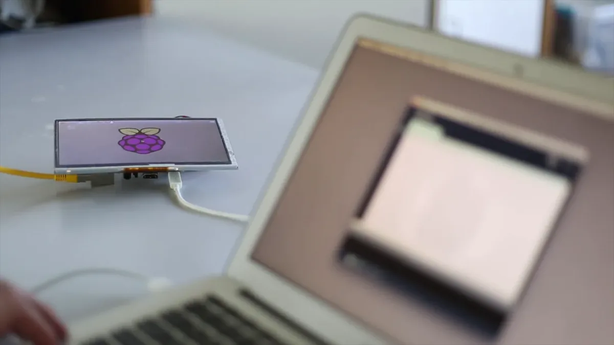

Another goal of the fellowship is to advocate for an understanding of Free (Libre) Open Source Software (FLOSS) culture in design and the arts. With the software stack that, e.g., the Raspberry Pi runs on — i.e. GNU/Linux — being developed in a cooperative manner, Gottfried believes that it will be important for young designers and developers to be able to navigate this space and to engage with these communities in informed ways.

Gottfried will be mentored by [Ben Fry](http://benfry.com/).

### Niklas Peters

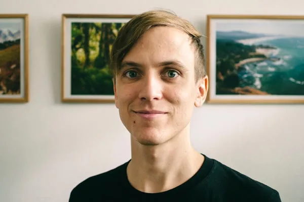

[Niklas Peters](http://www.niklaspeters.com/) is a visual artist and musician based in Johannesburg. Prior to moving to South Africa, he worked as a portfolio analyst at an impact investing non-profit headquartered in NYC.

Through the Processing Fellowship, Niklas seeks to make coding more accessible for people with low computer literacy. Learners from marginalized groups often lack a basic familiarity with computers; even if they become more comfortable using computers, coding can seem foreign and inaccessible. By developing a curriculum that builds general computer skills and demonstrates the power (and fun!) of coding from the start of a learner’s computing experience, participants will see coding as a way to express themselves and as a natural extension of using a computer. The curriculum will be piloted with high school students in Johannesburg, South Africa.

Niklas will be mentored by [Daniel Shiffman](http://shiffman.net/).

### **Saskia Freeke**

[Saskia Freeke](http://www.sasj.nl/) is an artist, creative coder, interaction and visual designer. She is interested in creating playful experiences. She makes daily art, mainly generated with code, since January 1, 2015. She is a member of Code Liberation and is doing her masters in Computational Arts at Goldsmiths University of London.

In-person learning can be highly valuable to create a sense of community and to lower the barrier to learn a new tool. During this fellowship, Saskia will develop, organise and create a series of workshops to teach p5.js in person to women, non-binary and femme identifying people in London, UK and Europe. This will be organized in collaboration with the [Code Liberation Foundation](http://codeliberation.org/). We work together with only one simple mission: teach women, non-binary, femme, and girl-identifying people to program using creativity as a pedagogical approach. Workshops in creation of digital games and creative technologies, game jams, game night, social networking events offer an informal setting for networking and community bonding to encourage participation.

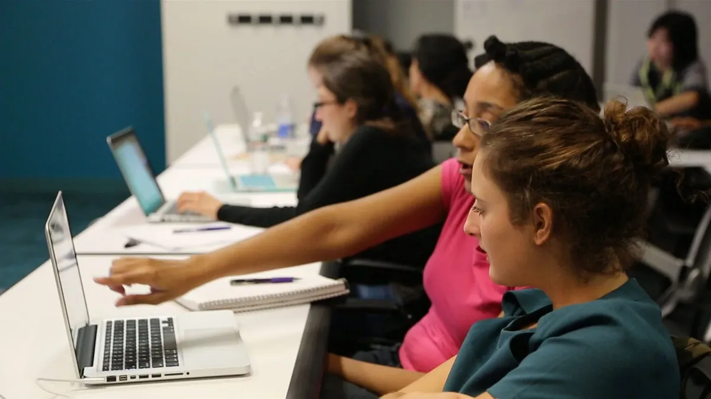

The workshops are focused on creating interactive playful artworks in p5.js and encouraging women to explore coding to express themselves in creative ways. The workshops will establish a firm introduction to the library and programming basics.

Saskia will be mentored by [Phoenix Perry](http://phoenixperry.com/) and [Johanna Hedva](http://johannahedva.com).

### Susan Evans

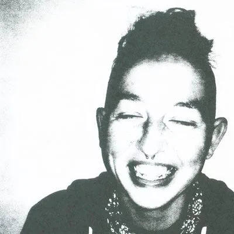

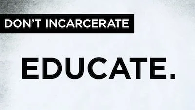

[Susan Evans](https://github.com/susanev) is passionate about creating safe, inclusive, and supportive computer science education communities. She has a diverse background in improving the human experience through UX design and code. She rides her bike everywhere and doesn’t think aptitude is a thing.

People in prison deserve open access to education, especially computer science education, which opens access to high-paying jobs. Susan will be crafting and offering a series of classes in Washington state prisons using p5.js. Since people in prison have limited access to computers and no internet access, Susan will develop a paper curriculum to ensure learning can happen beyond the classroom. Assignments and activities will engage and support students on their path to learning to code.

Susan will be mentored by [Dr. Rhazes Spell](http://rhaz.es/).

### Cassie Tarakajian

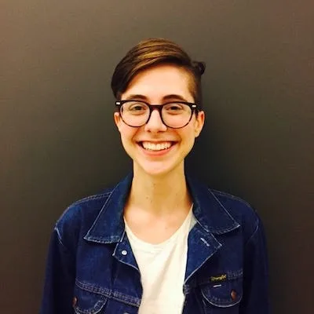

**This Fellowship is graciously sponsored by** [**NYU ITP**](http://itp.nyu.edu/)**.**

[Cassie Tarakajian](https://github.com/catarak) is a software developer, hardware engineer, creative technologist, and artist. She is a cofounder at the digital creative agency [Girlfriends](http://girlfriends.site/), an engineer at Cycling ’74, and a contributor to open source. She is interested in ways that art drives technology and vice versa.

The p5.js Web Editor is an in-browser interactive development environment for writing p5.js sketches. It aims to lower the bar for creative coding. Users can start writing p5.js by simply opening a browser window, without the need to download software or do any configuration. This makes it a great entry point for beginners to p5.js. It does this while maintaining a full set of features, like working with media files and other JavaScript libraries.

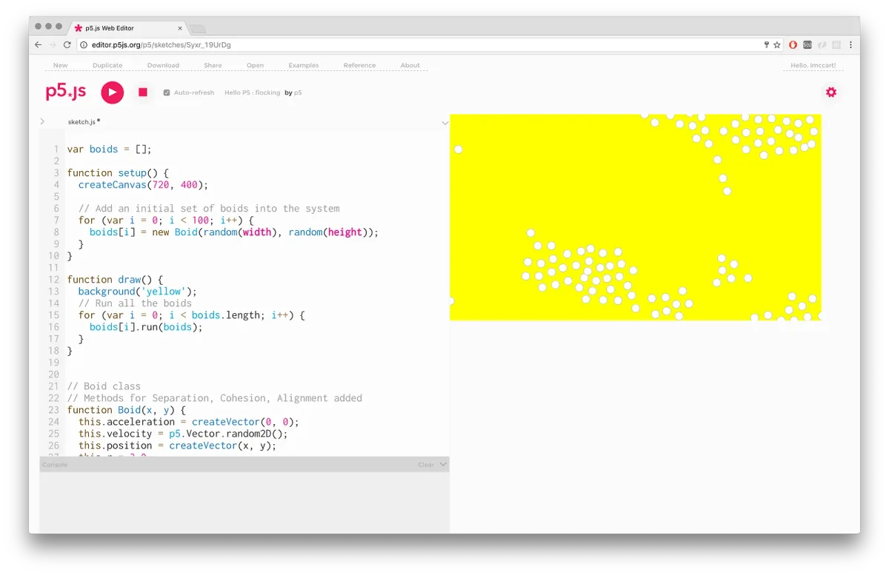

When users become more advanced, the editor makes it easy to export their work to more complex tools. Because web editor sketches live online, they’re more shareable than local files — which makes it easier for users to showcase their work and get help from the online community. For these reasons, the editor is also a great teaching tool. It is free to use and it is an open source project.

Cassie will be mentored by [Daniel Shiffman](http://shiffman.net) and [Lauren McCarthy](http://lauren-mccarthy.com).

### Andrew Nicolaou

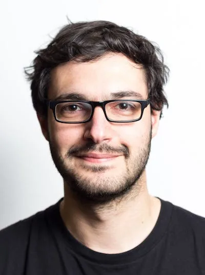

[Andrew Nicolaou](http://andrewnicolaou.co.uk/) is a Creative Technologist with a background building web applications and connected products. He’s passionate about the power web-based tools offer for expanding creative expression.

Andrew will be be working on the p5.js Web Editor. He’ll be working on general enhancements and bug fixes to the existing Editor. He’ll also explore ways to make the feedback loop between writing code and seeing the possible outcomes as short as possible.

The aim is to make it easier to think through, sketch out, and iterate on ideas. This could range from surfacing available p5.js function parameters through auto-complete to more exotic UI elements overlaid on the code for manipulating and picking values.

Andrew will be mentored by [Cassie Tarakajian](https://github.com/catarak).

---

**More information about the origins and development of the Fellowship program can be found** [**here**](https://www.publicprivatesecret.org/articles-essays-interviews/interview-processing-foundation-director-of-initiatives-johanna-hedva-with-curator-in-residence-charlotte-cotton)**. If you are interested in sponsoring a Fellowship, please contact** [**foundation@processing.org**](mailto:foundation@processing.org)**.**
