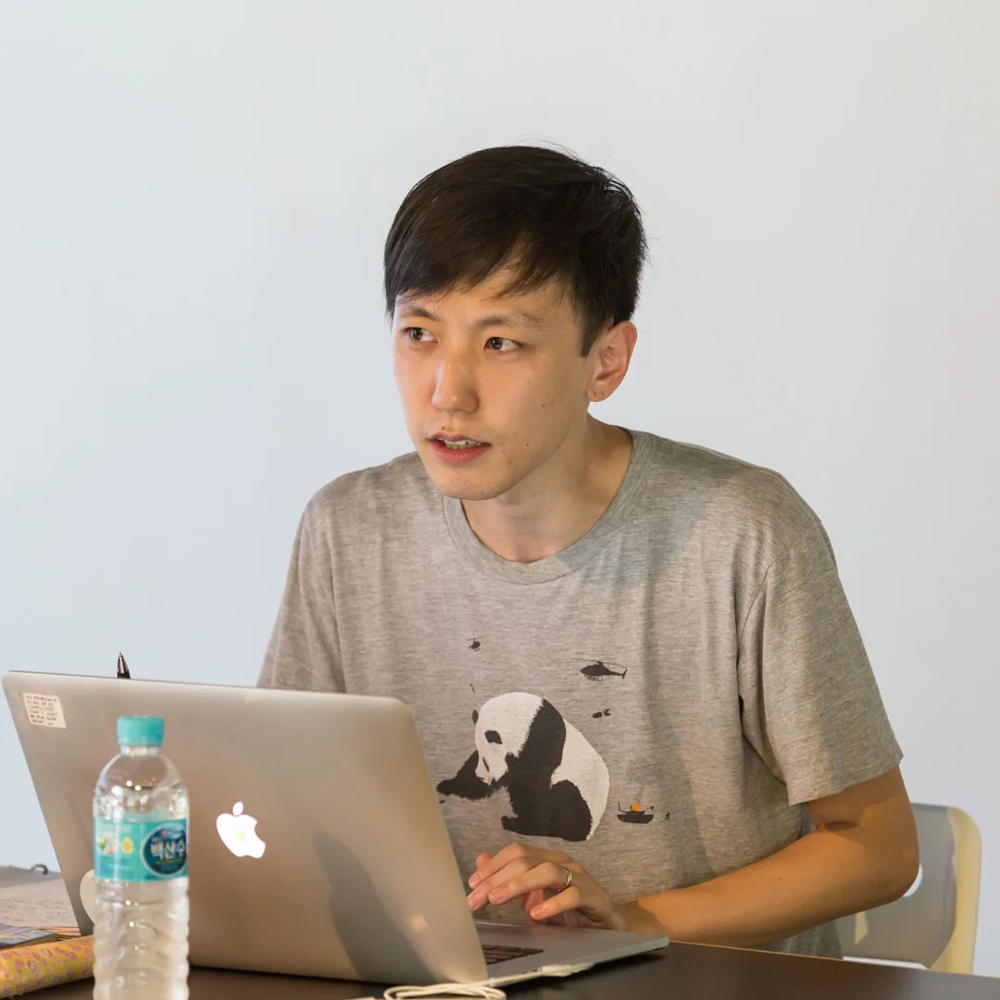
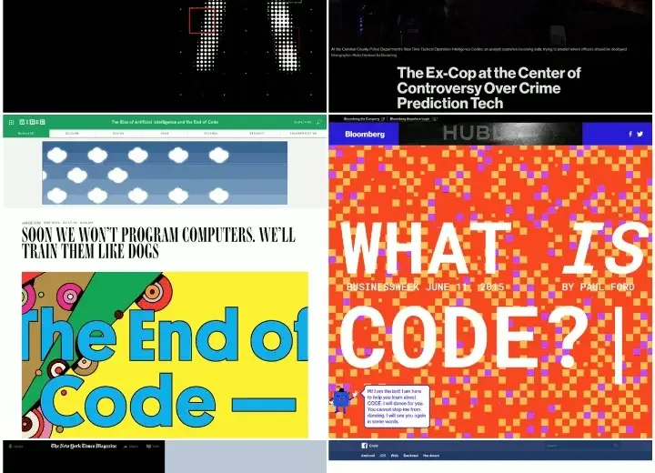
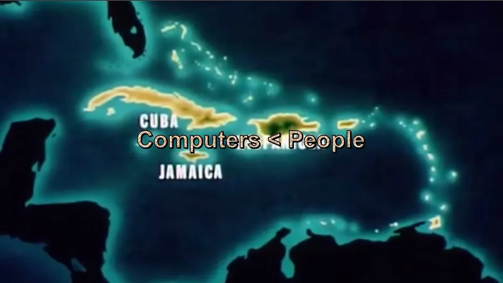
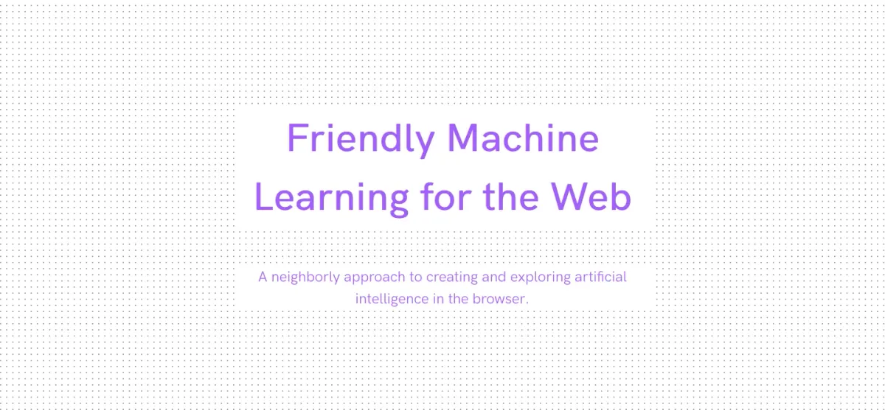
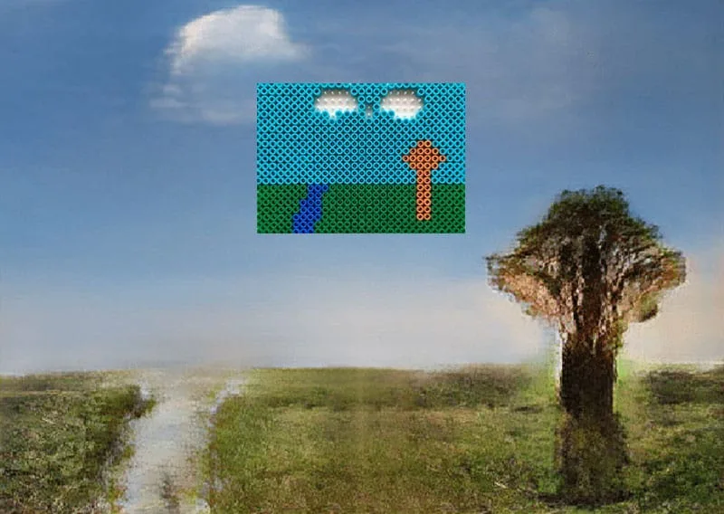

The Processing Foundation is pleased to announce that we are partnering with NYU’s [Interactive Telecommunications Program](https://tisch.nyu.edu/itp) to support four Fellowship projects in 2020 that are specifically focused on [ml5.js](https://ml5js.org/). Machine learning feels vital and exciting these days, with interest in it growing both as a tool for creativity and data visualization, and as a platform to engage in topical discussions on the societal effect of computational algorithms. By supporting these four 2020 ml5.js Fellows, we aim to concentrate the enthusiasm for machine learning specifically on the themes of accessibility, inclusion, and care.

Built on top of TensorFlow.js, ml5.js is a beginner-friendly open-source JavaScript library which aims to make machine learning approachable for a broad audience of artists, creative coders, and students. The ml5.js project is at once a code library and a call to action; central to the project is radical participation. Our goal is to use ml5.js as a way to reflect values — e.g., kindness, inclusivity, criticality, and thoughtfulness — that we believe are essential to technological development, particularly those in the domain of machine learning. By building the social and technical infrastructure to make machine learning “friendlier,” we are working to simultaneously problematize and re-imagine what it means to meaningfully engage, question, and propose alternative solutions to the complex issues and challenges embedded in machine learning and software development.

The four Fellows will be supported jointly by Processing Foundation and the Interactive Telecommunications Program at NYU’s Tisch School of the Arts. Daniel Shiffman and Ashley Lewis will serve as Advisors to the project.

---

*[Achim Koh](https://scalarvectortensor.net/) is a programmer, translator, and educator, currently based in Seoul, who works around the techno-politics of machine learning, digital culture, and knowledge production. He is interested in technological literacy that enables social progress and democratization rather than simply reproducing existing power structures. Image courtesy of Seoul Museum of Art.*

### Achim Koh

#### Critical Machine Learning with ml5.js

*The source of these screenshots includes news articles or blog posts in English about Cambridge Analytica, big data, artificial intelligence; the Cybernetics Conference 2017; and the AI NOW institute, among others.*

Critical Machine Learning with ml5.js will be a series of educational material that enables a critical understanding and use of machine learning and artificial intelligence, with a focus on the social implications of said technologies. The material will be produced in Korean and English, for local usage and broader access.

The developed material will be activated through a series of workshops in Seoul. The workshops will be accompanied by a discussion-oriented event around critical perspectives on software, ML, and AI. All events aim at fostering a more inclusive environment in the Korean tech context.

The project is partly a response to industry- and government-driven AI initiatives, which typically cast AI-related education as vocational, as previous coding education initiatives tended to do with software programming. Ultimately, this work intends to build resources that help people think critically about technology, power, and knowledge.

Achim will be mentored by Joey Lee.

[Joey Lee](https://jk-lee.com/) is a creative technologist and software developer with a background in Geography and atmospheric science. He is interested in creative applications and expressions of technology to better understand the urban environment, weather, and climate. Joey’s projects focus on methods of how people collect, process, and interact with data. He works across disciplines, makes open source software and web applications, and teaches about maps, data, machine learning, and the web. He is currently a Research Fellow and Adjunct Professor at NYU’s Interactive Telecommunications Program where he is focused on leading the ml5.js project.

---

*[Emily Martinez](https://emilyknowsht.ml) is a new media artist, front-end developer, digital strategist, and serial collaborator who believes in the tactical misuse of technology. Her most recent works explore new economies and queer technologies. Off the clock, Emily enjoys plants, dolphins, cafecitos, synths, humidity, heartfulness, and exploring inner space. Some of her lovely collaborators include [Queer AI](https://queer.ai), [Anxious to Make](https://anxioustomake.ga), and [Color Coded](https://colorcoded.la).*

### Emily Martinez

#### DIY AI: ML5 Community Starter Kit

*Video still from “The Insufferable Whiteness of Being,” by Anxious to Make, a collaboration between Liat Berdugo and Emily Martinez.*

DIY AI: ML5 Community Starter Kit is a toolkit that teaches beginners how to set up and train an artificial intelligence using ML5. The kit will include instructions for how to find, clean, and process data to feed into a machine-learning algorithm. The step-by-step guide will also include guidelines for running small workshops where people can teach each other how to design and build their own artificial intelligence without having to rely on “experts.” The first training module will be focused on text-based, conversational chatbots using multi-layer Recurrent Neural Networks (LSTM, RNN).

As co-creator of [Queer AI](https://queer.ai/) and a member of [Color Coded](https://colorcoded.la/), I am motivated to develop tools and materials for queer, BIPOC, and other marginalized communities interested in working with technologies like artificial intelligence for their own purposes, pleasure, and empowerment. As critical conversations continue to unfold around the limited access, risks, and harms of artificial intelligence, my hope is that together, we can build counter-examples tending to the poetics, play, self-discovery, and world-building potential of artificial intelligence with curiosity and care.

Emily will be mentored by Lydia Jessup.

[Lydia Jessup](https://www.lydiajessup.me/) is a creative and public interest technologist whose work focuses on urban space, tech, and design. She is currently a master’s student at NYU’s Interactive Telecommunications Program (ITP) and former policy wonk and economist. She previously studied international relations at Tufts University and worked for four years in public policy research at the UChicago Urban Labs and in Peru at Innovations for Poverty Action.

---

*[Bomani Oseni McClendon](https://bomani.xyz/) is an engineer living in Brooklyn. Bomani builds software to support artists, and teaches students grades 2–5 about electronic circuitry through craft activities. Through his creative practice, he studies the ways that Black health outcomes are influenced by a history of scientific racism. Bomani’s Github is [here](https://github.com/bomanimc/).*

### Bomani Oseni McClendon

#### Fine-tuning ml5.js: Friendlier Code & Development Processes

Bomani Oseni McClendon will be working with mentor Joey Lee to contribute a variety of improvements to the ml5.js core library and website. As ml5.js matures, we are focused on stability and addressing community needs, with the goal of making ml5.js more accessible to a wider variety of contributors and creators.

Our changes will begin with a simplification of the release process for the library so that contributors can more easily release new versions of ml5.js. We will focus on improving the parity between our library features and our documentation, and additionally, make improvements to our automated testing workflow. Lastly, we’ll build tools to improve our integrations with the p5.js Web Editor, Teachable Machine, Typescript-based projects, Node.js, and more.

An additional focus for our work relates to increasing the visibility of our values and community statement, which will include a variety of improvements to the ml5.js website. Throughout the project, Bomani will help to support our community’s requests through GitHub issues and push improvements to code quality and design pattern consistency throughout the library. We believe that these changes will enhance the experience for people using ml5.js and open source contributors.

Bomani will be mentored by [Joey Lee](https://jk-lee.com/).

---

*[Andreas Refsgaard](https://andreasrefsgaard.dk/) is an artist and creative coder based in Copenhagen. He uses algorithms and machine learning to allow people to play music using only eye movement and facial gestures, control games by making silly sounds or transform drawings of musical instruments on paper into real compositions.*

### Andreas Refsgaard

#### ml5.js Examples

I propose to make a new set of playful interactive examples to support the ml5js library, website, and community. The aim is to showcase the creative potential of using ml5 and attract even more people to use the library through a series of simple and more advanced examples:

1.  Simple interactive examples —   
    Some people might be interested in a particular technique, but do not know how to get started with it. Other people do not fully understand certain techniques or know what to build with them, and need to see them in action in order to come up with ideas of their own. These simple examples will build on top of existing ml5.js examples, by adding just enough additional code to make them more playful or engaging.
2.  Advanced artistic examples —   
    The more advanced examples go a step deeper, either by combining multiple functionalities within ml5.js or by using p5.js to make the outputs from ml5 machine learning models even more interesting. Compared to the simple examples, these examples will generally be longer and more complex, and therefore are intended to serve as inspirational examples rather than as tutorial examples for beginners.

Andreas will be mentored by Yining Shi.

[Yining Shi](https://1023.io/) is a creative technologist, researcher, and software developer who is interested in building tools to craft a better learning experience for people. She has built tools for those learning to code like Runway, the p5.js online editor, and an interactive programming and drawing interface, p5.playground. Yining teaches the following courses at NYU’s ITP program: “Machine Learning for the Web”; “Introduction to Synthetic Media,” a course that uses machine-learning algorithms to generate images, videos, and text; and “Machine Learning for Physical Computing,” a course that classifies and predicts sensor data from microcontrollers like Arduino.
