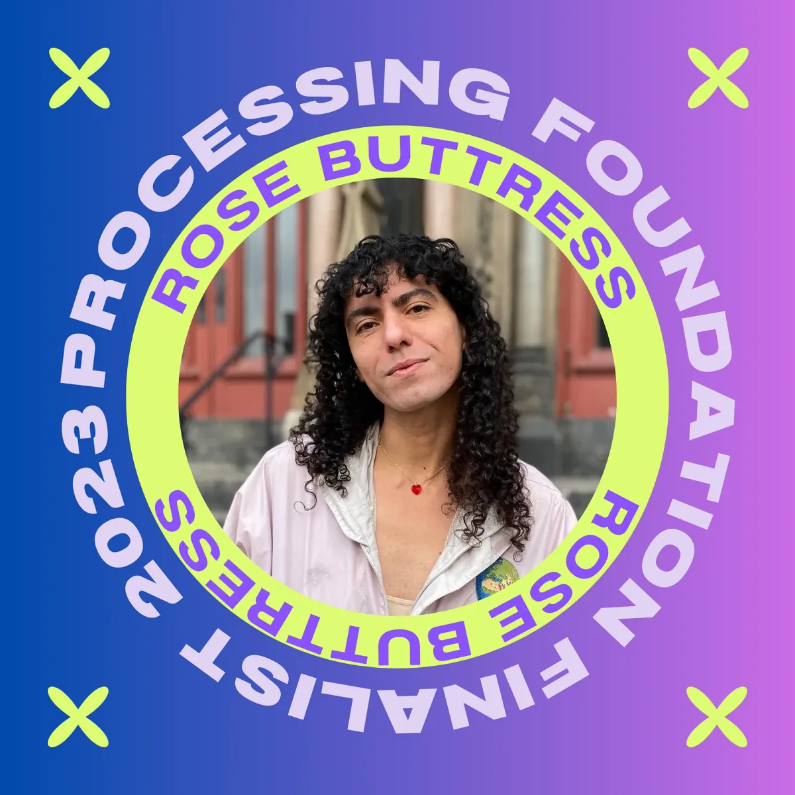
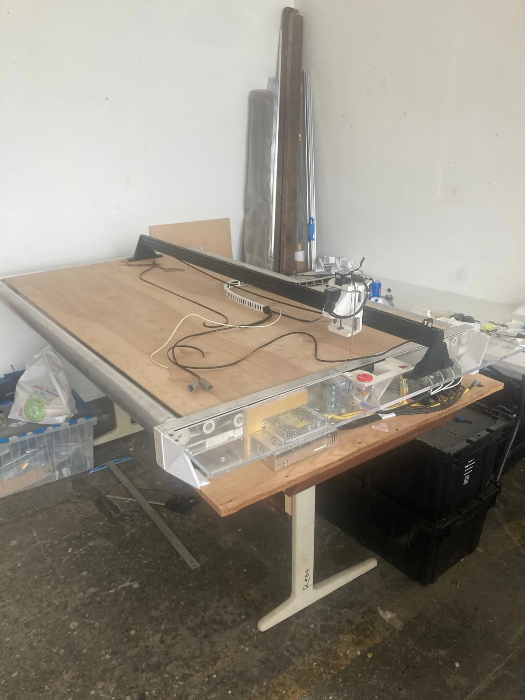
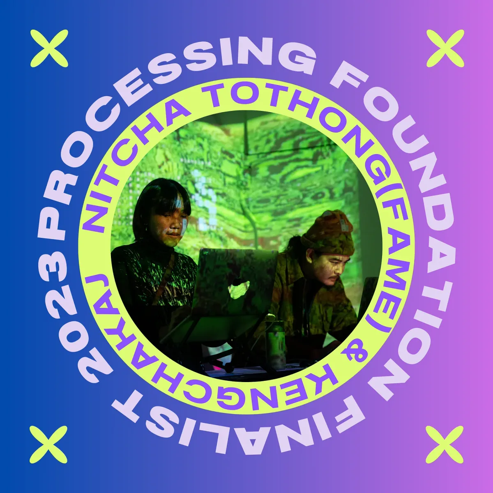
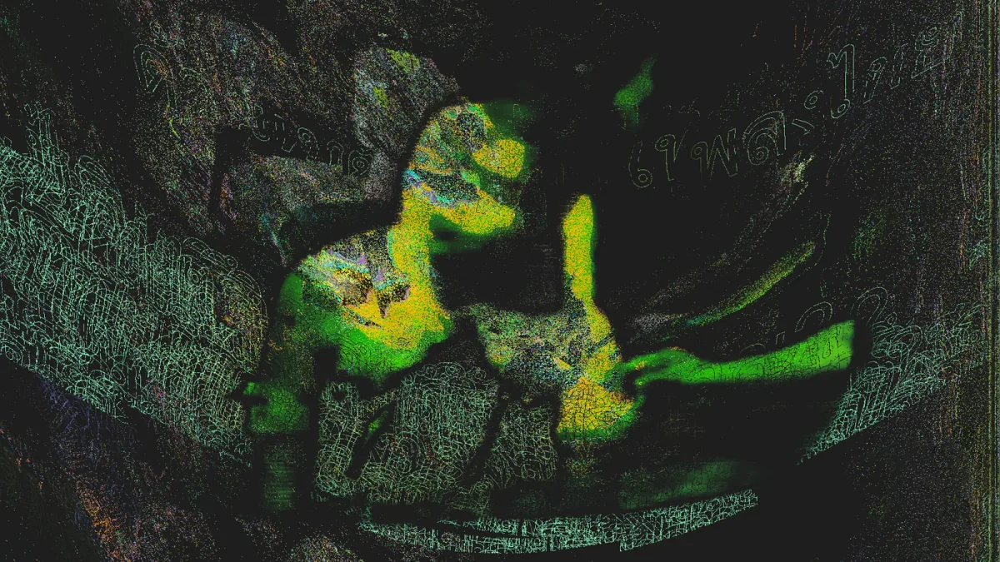
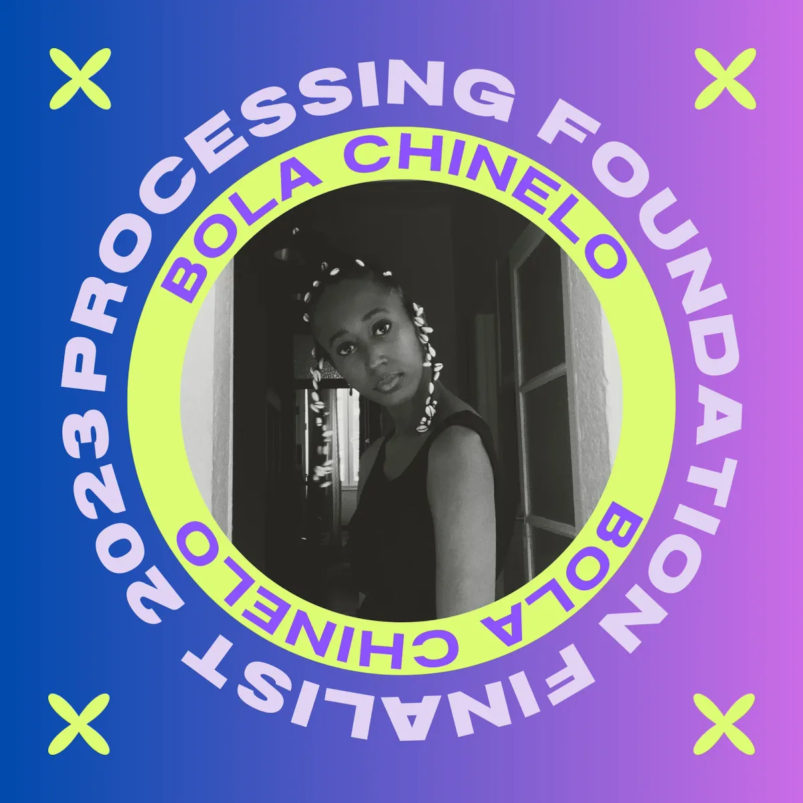
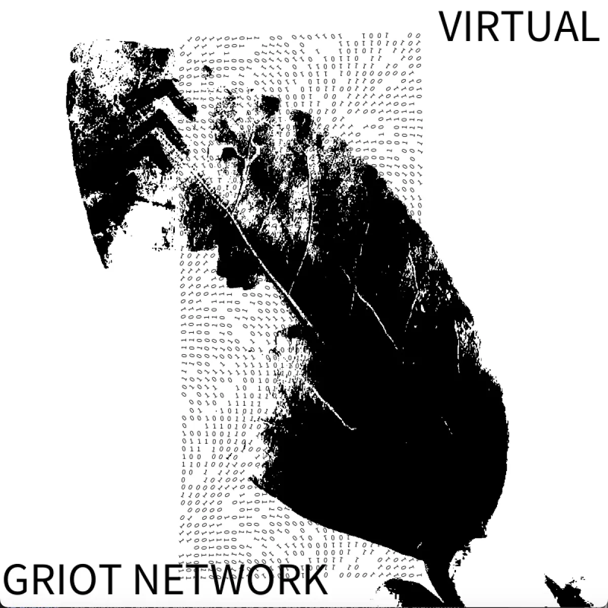
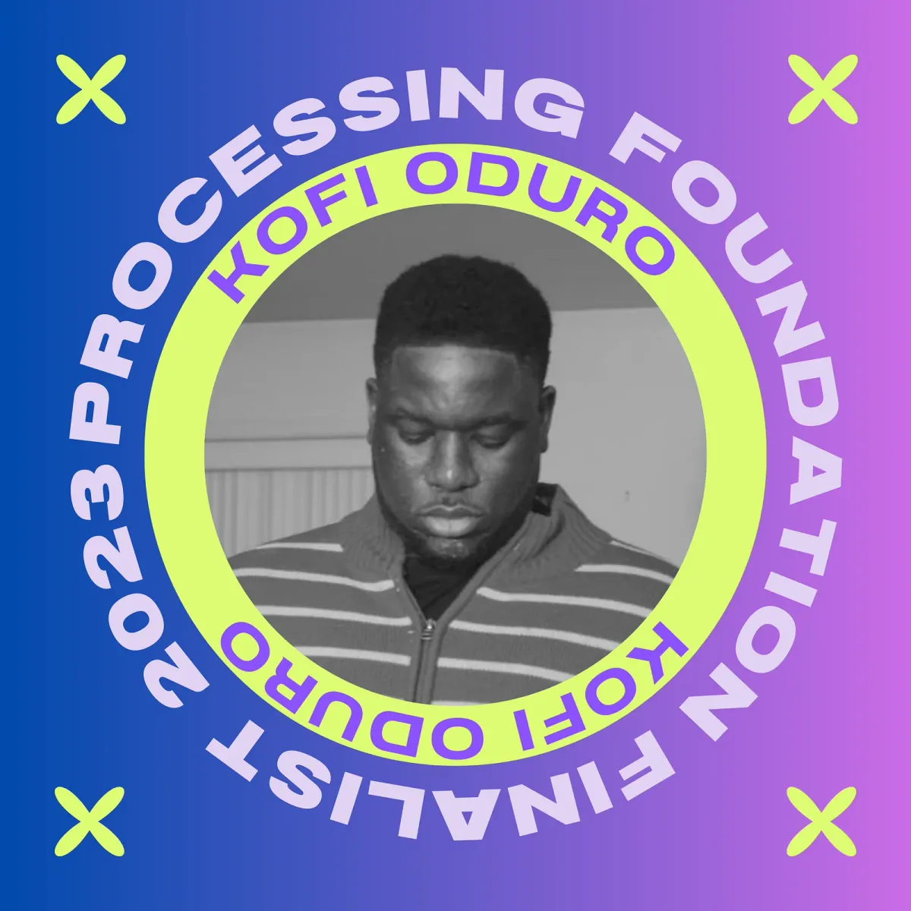
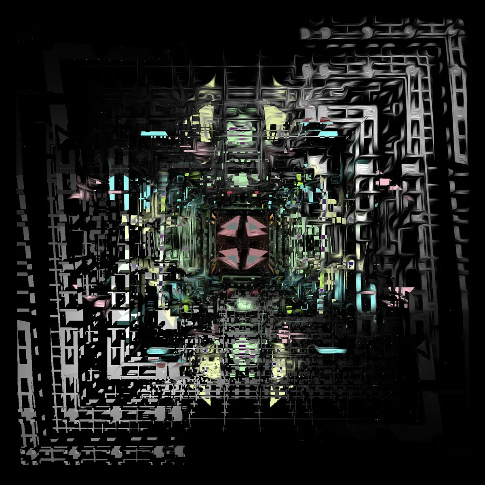
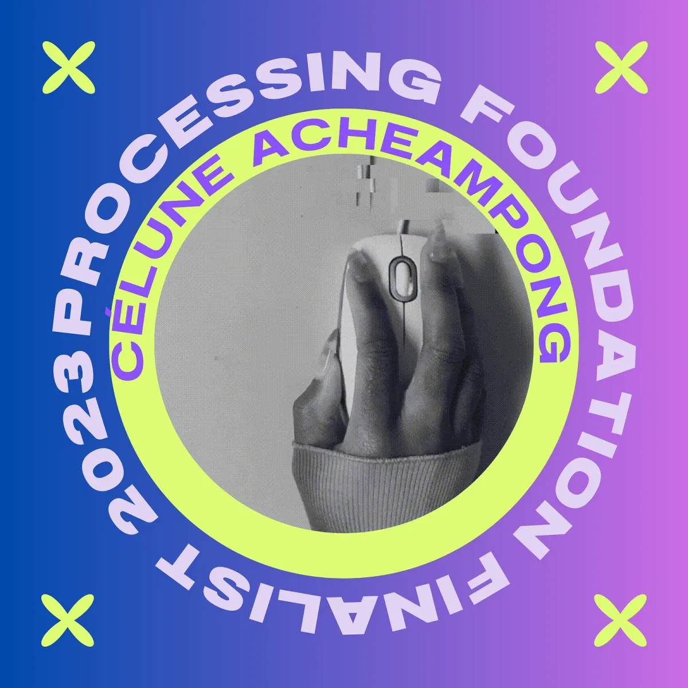
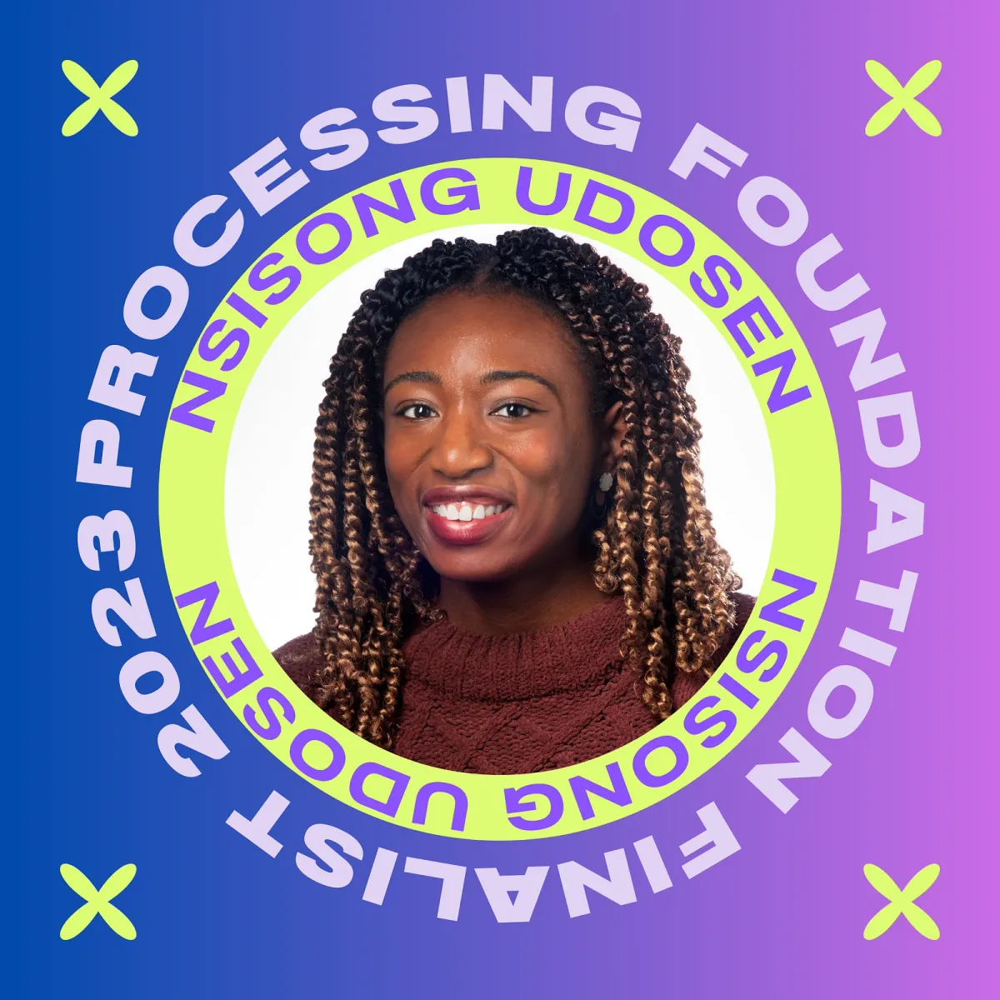

Thanks to the National Endowment for the Arts, we are able to award 8 finalists with mini grants of $1000 to support their projects, in addition to supporting the fellows this year financially and with mentorship. Out of the 8 finalists, 6 chose to share their projects with us. We hope that these mini grants support our broader community outside of our fellowship’s capacity.

Continuing with previous years, we asked applicants to address at least one of five Priority Areas that, to us, feel especially important for technology and coding right now: Accessibility, Internationalization, Continuing Support, AI Ethics and Open Source, and Ecology and Environment.

We received **a record-breaking 241 applications** this year. Special thanks to our new Program Manager, Tsige Tafesse, who made this work possible! Thank you to all who applied to our fellowship. We hope to continue to be in community with you all and take steps to support your work in the future. This year was an especially rigorous review process due to the sheer volume of applications we received, so we would like to applaud everyone who applied for their efforts. We appreciate all your shared brilliance in our community, and hope your work can be supported no matter what.

**Rose Buttress (she/her)**

*A graphic image of our 2023 Processing Finalist, Rose Buttress.*

Making the clothing Rose needs herself will not do. Rose does not seek to explore a niche area of production. Instead this project is an attempt to renegotiate the constraints on the industry. As she sees it, the task at hand requires the development of new equipment that places the leading industrial mass production techniques and processes within a small studio.

To meaningfully contribute to this, she spent 2020–2022 designing and building a small footprint computer controlled roll-to-roll fabric cutter for digital patterning. She 3D printed her own binding and elastic guides for precision seams. She programmed a pattern nesting application and studied the landscape of state-of-the-art garment design software. By the end of this year (2023), she will realize the ability to produce a software generated garment in a total time of 145 seconds. She will finally make the clothing that her community and she deserves; but more importantly she will open the possibility of a phase of prolific iterative design, collaboration, and research.

Creating a more inclusive and sustainable fashion industry means renegotiating the constraints on the industry. That’s why Rose is redesigning hardware for digital fabric cutting and creating the software which can facilitate the translation of data from the measurements of unique bodies, including those with disabilities, into the patterns of seamstresses who are working in 3D fashion CAD software.

Her work exists to “descale” and make that whole cycle of the means of digital and parametric fashion design and production more accessible. That’s what she believes it will take to make fashion more inclusive. Descaling is, in her use of the term, the practice of applying the values of the environment and economic philosophy of degrowth to system and production engineering. Degrowth in the fashion industry is an outcome she anticipates resulting from the advancement in automation designed in service of made-to-order garment making.

*As a self trained machinist and programmer Rose has the skills to produce tooling for systems. She takes it personally, as a trans woman, where it can be very difficult to find clothing manufactured with her in mind. In tracing the cause of this systemic lapse there is a principle antagonism in the fashion industry. Designers would design such garments but manufactures only deal with prohibitively large volume orders. The complex and laborious task falls on the limited production capacities of small scale workshops. Inventory remains limited. While large scale producers make claims of inclusivity, few alternative designs emerge in favor of the reproduction of existing designs with “inclusive” colors or marketing. Fat, disabled, and gender nonconforming people simply make do with what insufficient clothing is available and continue to campaign for a more inclusive fashion industry.*

*By understanding this issue in terms of how craft is expressed, with respect to these antagonisms, she sees the greatest potential for the advancement of garment fabrication craft specifically within the relationship of labor and access to technology. Her work is available at* [*https://github.com/rbuttress*](https://github.com/rbuttress)

*Follow Rose on Instagram:* [*@RoseButtress*](https://www.instagram.com/rosebuttress/)*,* [*@\_buttress*](https://www.instagram.com/_buttress/)*,* [*@obj.fashion*](https://www.instagram.com/obj.fashion/)

*Courtesy of Rose Buttress.*

**Elekhlekha: Nitcha Tothong (fame) (she/her) & Kengchakaj (he/him)**

*A graphic image of our 2023 Processing Finalists, Nitcha Tothong (fame) & Kengchakaj. Photo credit: S4y.*

elekhlekha อีเหละเขละขละ is a collaborative research-based group consisting of Bangkok-born, Brooklyn-based artists, Kengchakaj–เก่งฉกาจ and Nitcha–ณิชชา that examines, decodes, explores, and defines decolonized possibilities by creating, using code, algorithm, multimedia, and technology. elekhlekha has performed in small communities, larger institutional spaces, and music festivals, including Barbican Centre, London; Smithsonian Hirshhorn Museum and Sculpture Garden, Washington D.C.; Wonderfruit Festival, Pattaya; Int-Act Festival 2022, Bangkok; Wonderville NYC, as a part of LiveCode.NYC, New York; Flux Factory, New York, and more. In 2022, they were awarded The Lumen Prize Gold Award — the first Gold Award winner from the Global Majority nominee. In addition, the artists have received grants and development funds from a City Artist Corps Grant, Queens Council on the Arts, and Babycastles for their debut project Jitr จิตร.

They are interested in subversive storytelling using non-dominance sound and visual archives, historical research–decoding and unlearning biases, performing documents, multimedia, and technology to experiment, explore, and define decolonized possibilities.

Their ongoing work, Jitr จิตร, was created out of struggle as a process of unlearning and relearning many political layers of their history. Jitr จิตร is a speculative imaginary electronics ensemble performative audio-visual using computer programming, Southeast Asian tuning system, historical archives, and generative visual art. The project parallels the 2020–2021 Thai protest movement in Bangkok, where the abusive government silenced those opposing them. The project is named after a crucial Thai activist, writer, and historian, Jitr Poumisak, who was seen as a threat and killed in 1966. Their history in Southeast Asia has been a story about the silencing and forced disappearance of many activist and radical thinkers, which continues today. At the core, their work is micro-politic; they want to affect scale–how smaller units can affect a more extensive system. They hope that their work is an example of how we can unlearn and relearn–the process of elimination of bias that is embedded as a result of imperialism, classism, nationalism, and patriarchy. Their awakening moment is subsequent from the Post-Internet era, where knowledge is decentralized and accessible. The project reclaims agency and the long-lost innovation as a result of the effects of classism, colonialism, imperialism, and nationalism–and reimagines the new process and mode of expression using cultural practice and indigenous knowledge.

They hope their works tell a story that continues oral and aural histories that have historically been oppressed and question the status quo. They believe art can be a tool to subvert authoritarian power, especially with technology nowadays; the unheard can be heard and resounded. The unseen can be seen and revealed as we decode and recognize the patterns of these forces and redirect them to create a systematic change. They want to reclaim their agency and expand their practice to support their community. They wish to create an alternative future and find a new mode of expression, hacking existing platforms that may not have been made for us, to create a welcoming, inclusive, and equitable space.

*Nitcha Tothong (fame) is an interdisciplinary artist using narrative and storytelling, sensory experience, and emotional expression through art and technology. Tothong holds an MFA from the Parsons School of Design.*

*Kengchakaj is an award-winning pianist, improviser, composer, and electronic experimentalist. By juxtaposing different materials and concepts such as Southeast Asian tuning, the Blues, layered rhythms, electronics, etc., Kengchakaj composes and improvises sounds that unify seemingly opposite ideas and make room for new directions.*

*His works aim to investigate and unfold layers of Southeast Asia’s political complexity through the continuity of aural history and sound cultures’ lineage. The juxtaposition of ancestors’ knowledge and new aesthetic as algorithmic compositions put the work into a new context, creates a new relationship, breaks the social expectation that sound culture has to present in a traditional context, and finds possibilities derailing from consciousness.*

*Their work is available at* [*https://www.elekhlekha.xyz/*](https://www.elekhlekha.xyz/)

*Follow* [*Elekhlekha*](https://www.instagram.com/elekhlekha/)*:* [*Nitcha Tothong (fame)*](https://www.instagram.com/nitchafame/) *&* [*Kengchakaj*](https://www.instagram.com/kengchakaj/) *on Instagram.*

*Courtesy of Elekhlekha: Nitcha Tothong (fame) & Kengchakaj.*

**Bola Chinelo (she/her) | Virtual Griot Network**

*A graphic image of our 2023 Processing Finalist, Bola Chinelo.*

The Virtual Griot Network is a digital counter-archive aimed towards preserving the cultural narratives of present-day BIPOC for future generations to come. The Virtual Griot Network envisions data collection as a form of resistance art rooted within legacies of encrypted radical knowledge and Indigenous technology. Our intention is to offer a space where coded language, regenerative memorialization, data sovereignty and cultural repatriation can coexist and ensure that future generations are equipped with tools to nurture their own legacies of resistance.

*Bola Chinelo is a multimedia artist who received her bachelors of arts degree from UC Berkeley. She is a Watering Hole, Tin House, and Periplus Collective alum. Chinelo’s work uses coding, sonic, ideographic and iconographic languages to convey messages and esoteric symbolism. Her work has been featured in Prometheus Dreaming, Obsidian: Literature & Arts in the African Diaspora, ContemporaryAnd & other publications. Currently, Chinelo is an Akademie Schloss Solitude fellow and mentors creatives in her free time. Her work is available at* [*www.bolachinelo.com*](http://www.bolachinelo.com)

*Follow Bola on* [*Twitter*](https://twitter.com/ChineloBola)*.*

**Courtesy of Bola Chinelo.**

**Kofi Oduro (he/him) | Expressing Oneself Through Code**

*A graphic image of our 2023 Processing Finalist, Kofi Oduro.*

‘Expressing Oneself Through Code’ is an educational/interactive & explorative project, where throughout the course/syllabus, participants/students will see how coding can be used in musical, performative, artistic, and literary arts. By using p5 and Processing as well as other tools in the open software community such as but not limited to livecoding, Youtube, Hydra, Inverse.website and Sonic Pi to name a few. They will see how expressive and creative code will be with the benefit of seeing how it can be used in individual and collaborative settings.

Participants will see how creative and improvised coding in combination with other mediums can lead to various outcomes, musically, as well as to express oneself.

In the Curriculum the following techniques and mediums will be explained through a mixture of examples, blogs, tutorials and events/festivals that participants can to submit afterwards.

Branching Narrative/Creative Coding/LiveCoding/Poetry/Performance Art/ScriptWriting/Audiovisuals/Animation/Videography/Data Science/Visualization and Sonification/Multisensory work

Part of the goal of the curriculum will also have other practitioners showcase how to do things within the above categories in a digestible manner. The goal of this project is to have students be comfortable expressing themselves in different mediums through code.

As this originally started as a workshop that has been done several times, the feedback that has been provided will be used during this iteration to make this a suitable addition to those wanting to engage/teach/learn in the creative coding/tech. Since it has origins as a workshop, it will also be designed to be modular in nature, therefore providing those who only need a section to build it.

Thoughts flowing through exploration

Allow the mind a journey, within its imagination

Take a snippet of code

With the addition of play

For divergence that can manifest in different ways

Where expressions can freely roam

And equations can lead to a story being told

As code is poetry and poetry is code

*Kofi Oduro (illestpreacha) is an Experiential Storyteller that transforms data, words, and code into experiences that nurtures discussion, reflection, and interaction. With a decade plus of performance, event & audiovisual production, he takes inspiration from endeavors that are not normally together to create a harmonic experience for audiences.*

*His artistic practice is an observation of the world around us that he puts into artworks for others to relate to or disagree with. Through Videography, Poetry and Creative Coding, he tries to highlight the realms of human performance and the human mind in different scenarios. These situations can be described as social, internal, or even biological, which we face in our everyday lives. Adding music and visuals often helps to perceive one’s own feelings, and to highlight the different subtleties that make us human.*

*Follow Kofi on* [*Instagram*](https://www.instagram.com/illestpreacha/)*.*

*Courtesy of Kofi Oduro.*

**Célune Acheampong (she/her) | ‘Y>x’**

*A graphic image of our 2023 Processing Finalist, Celune Acheampong.*

To access a website, you typically must enter “www.” at the beginning of the address bar. This prefix functions as a sort of postal code which indicates that the link you are about to visit is part of the World Wide Web. However, the belief that the web is universally inclusive is a myth. The digital divide fragments our world, denying broadband access to many and perpetuating inequalities. Even among those of us fortunate enough to have internet connections, biases disseminated online reproduce hierarchical structures that position white, cisgender men as the default.

Propelled by the desire to reclaim these programming languages from their use in reproducing marginalization in a digital framework, Célune writes poetry with code as a tool to expose and interrogate the biases embedded within the internet’s default settings. By locating her concrete poems within the browser, readers can apply their understanding of how web elements work to support their interpretation of her analogical use of screen space and window size. If we know how a browser works, such as that dragging the browser smaller is a process described as minimizing, we can seize code to play with computational breakpoints as to break free from the constraint of binaries and margins of social hierarchies.

‘Y>x’ (pronounced “Y is greater than X”) is a codework that uses the browser’s dimensions to depict a patriarchal power dynamic between the binary genders, man and woman. The website is designed to be experienced on a device with a landscape monitor and a mouse, such as a laptop or a desktop computer. Depending on how big your browser is, you may experience one of two words. If your browser occupies approximately more than a quarter of your device’s screen, the word ‘Man’ is displayed on a white background. Contrastingly, if your browser is exactly or less than a quarter of your device’s screen, the word ‘Woman’ is displayed on a black background. To that effect, minimizing the browser horizontally from left-to-right until it takes up less than a quarter of your device’s screen will show the words switching to allude to the amount of space men and women are perceived to take up. As a result, ‘Y>x’ is a sort of data visualization. Instead of presenting it with a percentage or report, it’s figurative, inspired by personal experience, and turned tactile as a moment of interaction. You can interact with ‘Y>x’ over at [www.man--woman.glitch.me.](http://www.man--woman.glitch.me.)

*Célune considers poetry as a means of breaking free from the limitations of thinking in binary — zeroes/ones, non-man/man, if/else, non-white/white, true/false. In contrast to coding conventions, poetry is a writing system where human language is considered for its aesthetic qualities in addition to, or instead of, its notional and semantic content. In ‘Poetry Is Not a Luxury,’ Audre Lorde describes poetry as essential to women because it becomes the way we can “give a name to the nameless so that it can be thought” through self-expression unbounded by complete logical or narrative structures. It comes to little surprise to her then that the poetry and stories of women of color are repeatedly about writing to access the power to signify, as noted by Donna Haraway in ‘A Cyborg Manifesto.‘ Poetry encourages multiplicity in understanding, rather than forcing one into two. As such, through implementing code as a poetic medium, she hopes that we can transcend the limitations of binaries and work to dismantle default settings from online to offline — URL/IRL. Her work is available at* [*https://hunilune.com*](https://hunilune.com)*.*

**Nsisong Udosen**

*A graphic image of our 2023 Processing Finalist, Nsisong Udosen.*

*Nsisong Udosen is an interdisciplinary artist and UX consultant based in New York City. In her work, she blends art and technology to cultivate ecological awareness, mainly through the transformation of discarded e-waste. Through a series of observational walks, poetry workshops, and coding sessions, she creates transformative spaces for healing and empowerment, while also inviting people to reimagine how they relate to the environment.*

We’re so excited to see what our Processing Finalists will work on this summer! We hope to keep supporting new artists, designers, activists, educators, engineers, researchers, coders, and collectives, year after year. Want to support the Processing Foundation in this work? [Donate here](https://processingfoundation.org/donate) to support our ecosystem at the intersection of art and technology!
