This is our tenth year running the fellowship program and this year’s fellowship program is themed ‘Sustaining Community: Expansion & Access.’ We hope these mini-grants support our broader community outside our fellowship’s capacity.

Continuing with previous years, we asked applicants to address at least one of four Priority Areas, describing how their project responds to the concerns of the topic. The four priority areas were:

• Archival Practices: Code & New Media: Projects aimed at developing tools and platforms for archiving and preserving creative code/the digital, as well as new media archival practices.

• Open-Source Governance: Initiatives focused on creating governance models that promote equitable decision-making, inclusive communities, engagement, and sustainable growth in open-source projects.

• Disability Justice in Creative Tech: Tools and projects that advance access and promote disability justice within the realm of creative technology.

• Access & AI: Engaging AI technologies to create accessible solutions and improve inclusivity in digital spaces.

We received a record-breaking 346 applications this year and were able to award 10 finalists. Special thanks to our new Program Manager, Tsige Tafesse, who made this work possible! Thank you to all who applied to our fellowship. We hope to continue to be in community with you all and take steps to support your work in the future. This year was an especially rigorous review process due to the sheer volume of applications we received, so we would like to applaud everyone who applied for their efforts. We appreciate all your shared brilliance in our community and hope your work can be supported no matter what.

#### Mala Kumar (she/her) | Economic, Social and Cultural Rights in AI

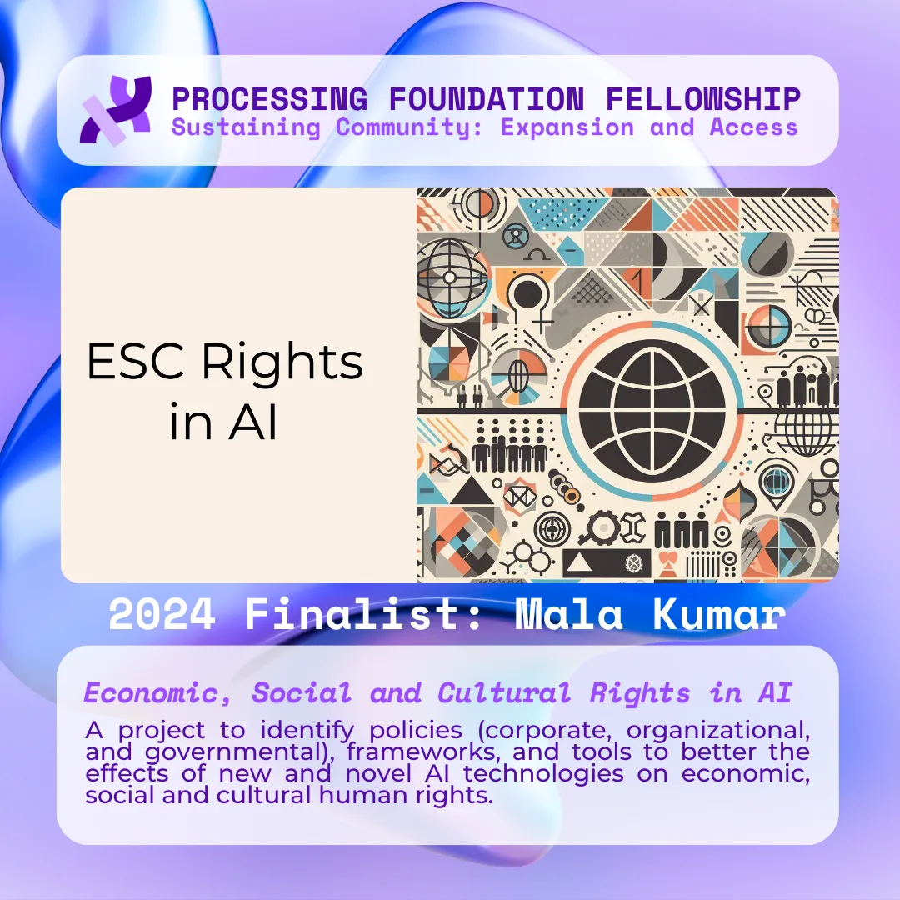

*2024 Finalist Project: Economic, Social and Cultural Rights in AI*

Most big corporate tech “for good” efforts focus on compliance with laws that govern civil and political rights, such as not facilitating human trafficking or not violating copyright. Such efforts are increasingly being referred to as “Responsible Tech.” A ride-share company is much more likely to have a policy to compensate its gig economy drivers for passenger assault than to guarantee income levels. Since a significant portion of foundational AI technologies are controlled by fewer than 15 companies, a lack of attention to ESC rights and AI will affect everyone. If net labor is not replaced in already economically depressed areas and if governments do not provide universal social safety nets, large portions of the global population cannot afford to participate in the modern economy. Mala is working on a project to identify policies (corporate, organizational, and governmental), frameworks, and tools to better the effects of new and novel AI technologies on ESC human rights. Examples include proposed legislation to mitigate economic disparities from large-scale labor automation, policies to reduce health disparities from computer vision diagnostic tooling, or GenAI model and product threat assessment framework tooling to assess cultural autonomy.

*Photo of Mala Kumar*

*Mala is a global leader in social impact and technology for social good with deep expertise in UX research and design, open-source software, and increasingly, artificial intelligence and machine learning. Throughout her 15+ year career, she has led groundbreaking initiatives that have reached 50,000+ people globally and contributed to the Sustainable Development Goals. Currently, Mala is the Director of Program Management, AI Safety at MLCommons. Previously, she was the Director of Tech for Social Good at GitHub, where she created five cutting-edge programs that leveraged the company’s core products, services, and communities. Mala spent the prior decade and the year after GitHub working at the United Nations and in INGOs and the private sector, in both English and French. Since 2007, she has lived and worked extensively in four continents. Mala lives in New York City and travels abroad frequently. Separate to her tech work, Mala is the author of two novels. Her second, titled ‘What it Meant to Survive’, will be published on October 1, 2024. Mala’s brother and she also co-ran the podcast, ‘Desi Women Diaspora.’*

*Follow Mala on* [*LinkedIn (Mala Kumar)*](https://linkedin.com/in/malakumar) *and* [*Mala’s Website*](https://malakumar.com)*.*

#### Chris Barber (he/him) | The Code Art Archive

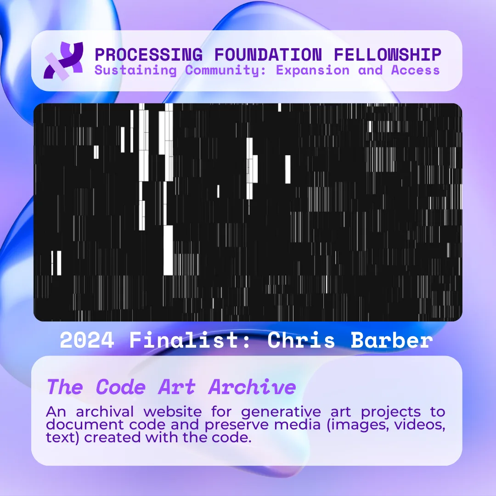

*2024 Finalist Project: The Code Art Archive. Art by Chris Barber (@code\_rgb)*

The Code Art Archive would be a website where people can upload their generative art projects including documentation of the code or techniques used, as well as media associated with the project. All of the code would be open source and people could learn from the community by searching through the archive. In addition, Chris thinks it could be great as a personal history of people’s projects so they can easily search their codebase and keep their projects organized and documented.

*Photo of Chris Barber*

*Chris Barber grew up in California and graduated from college with a degree in Computer Science. Chris is a generative artist under the name code\_rgb, and uses the p5.js library to create his art. Coding allows him to rapidly iterate on ideas, generating new pieces with each program reload. Recently, Chris has been incorporating motion into his art and using simple geometric shapes to make complex compositions. The idea that art generated with programming can still invoke emotion is fascinating to him, and he hopes to continue exploring this in his art.*

*Follow Chris on* [*Instagram @code\_rgb*](https://www.instagram.com/code_rgb/)*,* [*Twitter/X @code\_rgb*](https://twitter.com/code_rgb)*, and* [*Chris’ Website*](http://www.codergb.art)*.*

#### Iz Paehr (they/none) | DISCO CRAWLER

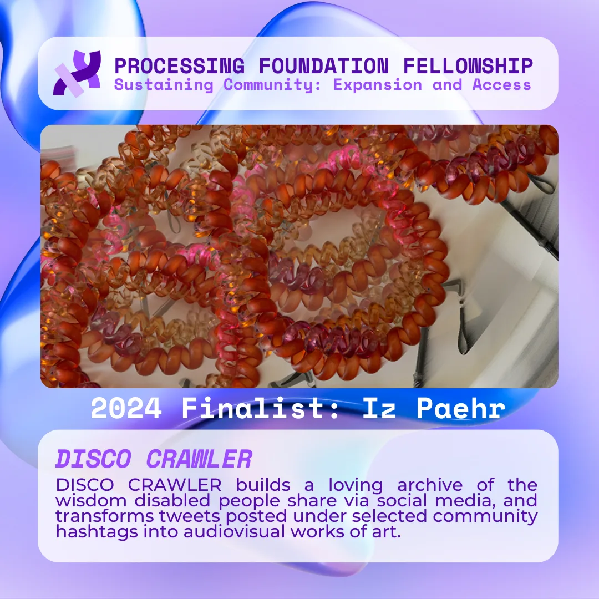

*2024 Finalist Project: DISCO CRAWLER*

DISCO CRAWLER archives the wisdom that disabled people share on social media and turns crip knowledge into posters for web and print. DISCO stands for Disabled Community, crawling points to web technologies. The further availability of knowledge collected under hashtags such as #Ableismtellsme, #DisabilityTooWhite, #ActuallyAutistic, #AltTextPalestine, and more, is at the whim of proprietary platforms. DISCO CRAWLER wants to build an otherwise archive of holding, lovingly visualizing, and publishing the meaningful insights, critiques, and survival techniques that disabled people continue to share generously online amidst a global pandemic. The project centers on disabled communities and engages crawling as both a crip and web technology. Disabled people have famously crawled up the stairs of the U.S. American Capitol Building to demand equal rights. Crawling is also a technical term for when a program visits websites in search of certain information. DISCO CRAWLER is built on disabled histories of crawling and crawls on in search of crip wisdom.

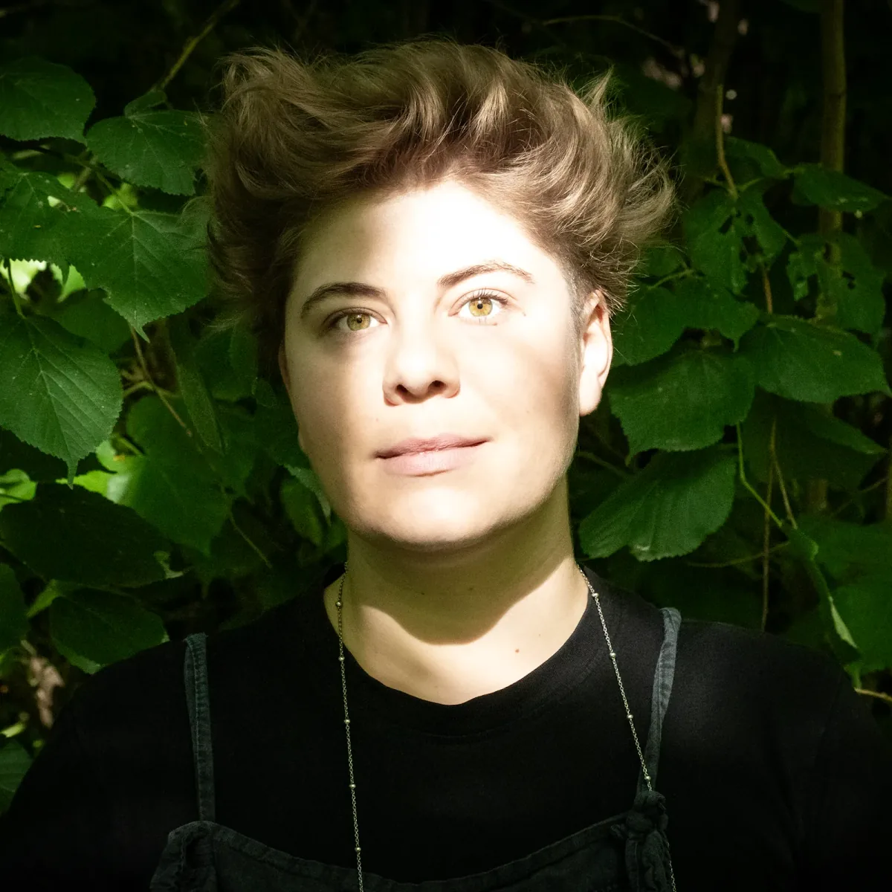

*Photo of Iz Paehr by Jasper Meiners*

*Iz Paehr works as a designer on the politics and poetics of access. Iz’ experiences as a disabled and autistic person inform their design work and drive their passion for furthering Disability Justice through critical technological practice. Based in Berlin, they love watching birds and learning about internet infrastructure.*

*Follow Iz on* [*Twitter/X @isipaehr*](https://twitter.com/isipaehr)*,* [*Mastodon @Iz*](https://disabled.social/@iz)*, and* [*Iz’s Website*](http://izpaehr.xyz)*.*

#### Francisco Barretto (he/him) and Micaelle Lages (she/her) | Hacking the Algorithm: Underrepresented Communities Take Charge of AI

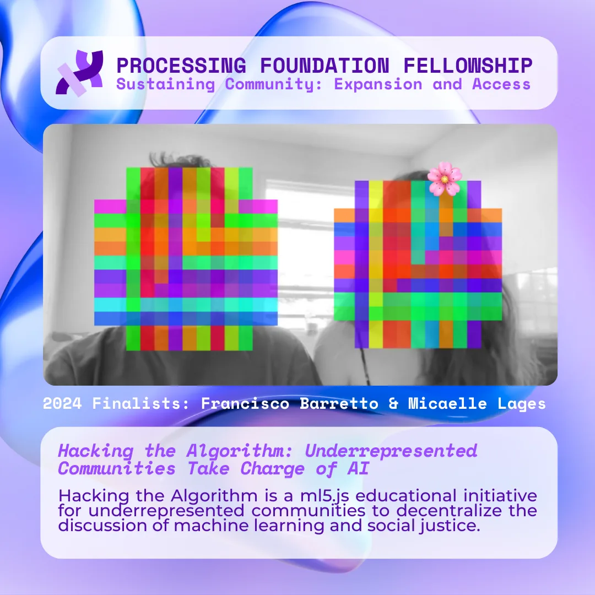

*2024 Finalist Project: Hacking the Algorithm: Underrepresented Communities Take Charge of AI*

Hacking the Algorithm is a ml5.js educational initiative for underrepresented communities to decentralize the discussion of machine learning and social justice. Hacking the Algorithm aims to bridge the gap in access to creative technology by empowering underrepresented communities through the use of Machine Learning with ml5.js and p5.js. The project aims to develop an extensive workshop in Salvador, Brazil, focused on identifying possible social and artistic applications for these technologies and engaging participants to propose solutions to community challenges. The work involves developing a syllabus, executing a workshop, and developing open documentation that can serve as archives and a starting point for creatives interested in leading the same initiative elsewhere. The workshop will equip participants with technical skills and foster critical thinking about machine learning’s social and political implications, and how developers and artists can address these issues in their work through innovative use of AI. This project disrupts the centralized narrative around AI by equipping participants with the skills needed for AI creation in a region beyond the traditional tech hubs. Through this project we strive for a future where communities are not passive consumers but are encouraged to be active participants in AI, shaping a technology that addresses global challenges. This is an effort to amplify other voices and perspectives in the discussion about technology and AI.

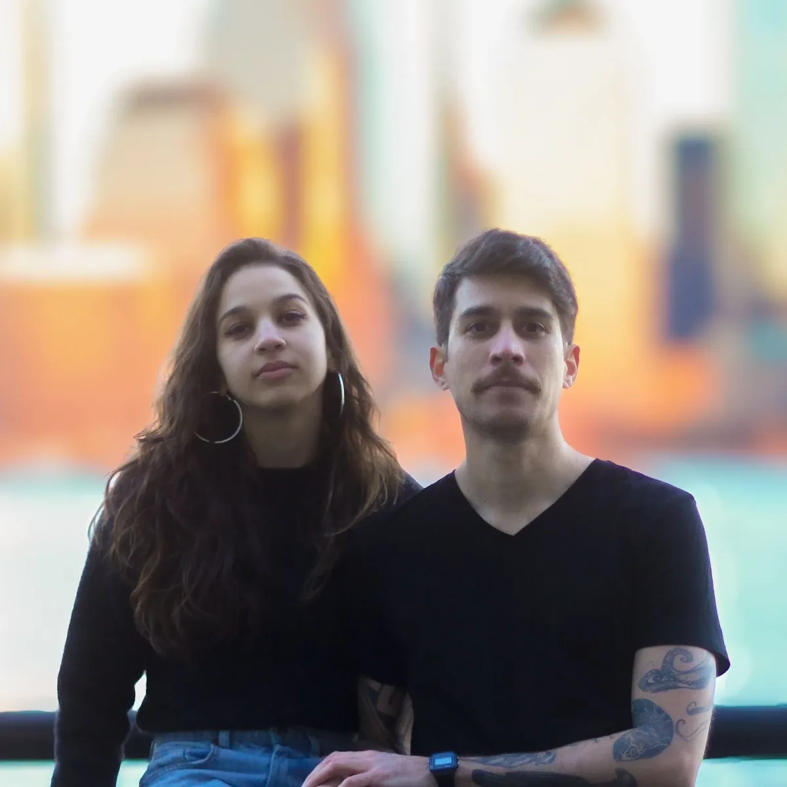

*Photo of Francisco Barretto and Micaelle Lages by Liana Kilpp*

*Francisco Barretto, a multimedia artist, software engineer, professor, and creative coder, explores the convergence of AI and computer creativity. With a background in Computer Science and a PhD in Art and Technology, he has dedicated part of his career to education and fostering students’ development of technological and critical thinking skills using Processing and p5js. Francisco founded LATE! (Laboratory of Art and Technology) and ICON (Laboratory of Interactivity, Computing, and New Interfaces) to advance these goals. As a professor at the Federal University of Bahia, Francisco has led diverse educational initiatives aimed at promoting creative coding and AI. Over the last decade, he has created numerous immersive interactive works showcased in museums and public events, earning him a nomination for the PIPA Prize in 2023 and other awards.*

*Micaelle Lages, a multimedia creative, technologist, researcher, and awarded art director, explores the intersections of art, technology, and immersive experiences. Holding a Master’s in Interactive Telecommunications (ITP) from NYU and a BA in Cinema and Audiovisual, Micaelle specializes in expanded audiovisual experiences with a focus on interactivity and immersion. Her work spans AI, Machine Learning, and human-computer interaction. Micaelle’s research focuses on themes such as magic, rituals, ancestrality, and the interconnected relationship between nature and digital realms. She is a researcher at the TATO (Laboratory of Research in Images, Bodies, and Affections), and her educational endeavors center on fostering collaborative knowledge-sharing spaces for underrepresented communities, guided by Paulo Freire’s teachings and pedagogy. She imparts technological expertise while also learning from their experiences. Micaelle’s projects have been featured at esteemed national and international festivals including Ojo Móvil (Peru) and FirstTime Filmmaker (UK). The artist has also hosted several workshops and lectures on Machine Learning, interactive media, and p5.js. Micaelle and Francisco are Brazilian immigrants currently based in Brooklyn, NY. Sharing the same passion for art, technology, machine learning, and accessible education, they have a history of leading educational, artistic, and scientific initiatives. The duo leads ‘thecode’, a creative lab that researches and develops interactive and immersive artistic projects. Together, they organize the IMMER festival, a new media and full-dome festival celebrating immersive digital art and technological innovation. Their collective work explores themes like human-machine connections, AI for creativity, new media interfaces, and the blend of physical and digital realms. Dedicated to art, science, and education, they are engaged in expanding access to creative technology tools and fostering critical thinking through their initiatives.*

*Follow Francisco on* [*Instagram @b4rretto*](https://www.instagram.com/b4rretto/)*,* [*LinkedIn (Francisco Barretto)*](https://www.linkedin.com/search/results/all/?fetchDeterministicClustersOnly=true&heroEntityKey=urn%3Ali%3Afsd_profile%3AACoAAAhN1GsB4VRsDLpo8SnKjWuj0Sps8RfZyVY&keywords=francisco%20barretto&origin=RICH_QUERY_SUGGESTION&position=0&searchId=4842ce66-29ca-4480-8a05-7b7106cad497&sid=X93&spellCorrectionEnabled=false)*, and* [*Francisco’s Website*](https://barretto.info)*.*

*Follow Micaelle on* [*Instagram @acosmica*](https://www.instagram.com/acosmica/)*,* [*LinkedIn (Micaelle Lages)*](https://www.linkedin.com/in/micaelle-lages-838015193/)*,* [*Micaelle’s Website*](https://micalages.art)*, and their* [*collective website*](https://thecode.art)*.*

#### Blair Subbaraman he/him | p5.fab

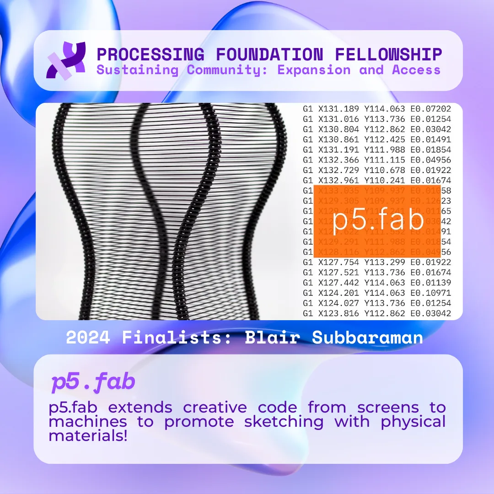

*2024 Finalist Project: p5.fab*

Artists and craftspeople have a deep knowledge of materials that are often not accounted for in contemporary digital fabrication tools. Software for machines like 3D printers is designed to translate a digital model to physical form as faithfully as possible. This not only forces practitioners to work against the software to explore creative possibilities but also makes it difficult to share work with others. To develop a community around creative digital fabrication workflows, p5.fab extends creative code from screens to machines to promote sketching with physical materials.

With p5.fab, practitioners can write creative code to control machines, interactively edit settings while the machine is running, and document the resulting material outcomes. The project explores how alternative interfaces for using machines can offer an entry point to code and computation that takes advantage of craft sensibilities. Ultimately, p5.fab seeks to cultivate a creative fabrication community that invites physical practitioners to engage and guide the development of digital fabrication software.

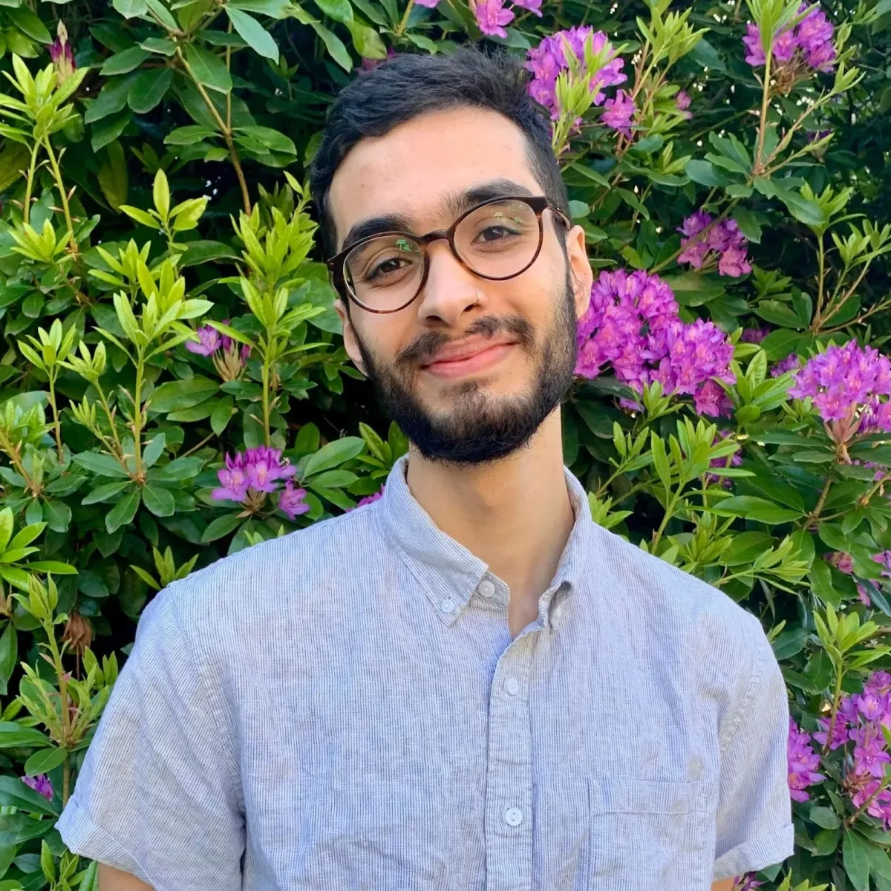

*Photo of Blair Subbaraman by Eliza Harris.*

*Blair’s work explores machine automation as a creative medium. He builds systems to creatively engage computer-controlled machines like 3D printers, plotters, and CNC mills. In this process, he examines how using machines in nontraditional contexts can inform the development of future systems. He’s most interested in how domain experts like artists and scientists can leverage their existing skills when using machines. Blair is currently a PhD student at the University of Washington in the Human Centered Design and Engineering department and works in the lab Machine Agency.*

*Follow Blair on* [*Twitter/X @blairsubbaraman*](https://twitter.com/blairsubbaraman)*,* [*Instagram @blairsubbaraman*](https://www.instagram.com/blairsubbaraman/)*, and* [*Blair’s Website*](https://blahblahblair.com/)*.*

#### Phoenix Perry (they/she) | Embodied Archival Practices: Generating Real-Time Visuals using Small Data and Personal Archival Footage

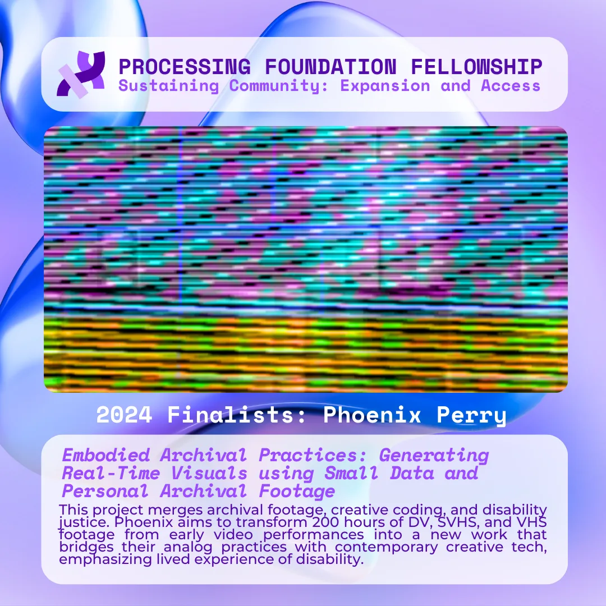

*2024 Finalist Project: Embodied Archival Practices: Generating Real-Time Visuals using Small Data and Personal Archival Footage*

This research focuses on the interplay between Archival Practices: Code & New Media and Disability Justice in Creative Tech. Drawing from their background as a filmmaker, circuit bender, and live video artist, they aim to create new work that bridges their past analog practices with current creative coding techniques, centering their experiences of disability. At the heart of this project is a deeply personal archive: approximately 200 hours of DV, SVHS, and VHS footage documenting my live video performances and experiments from the late 1990s and early 2000s. This footage captures a pivotal moment in their artistic development, as they began modifying and hacking video mixers to create accessible tools that resonated with their body’s glitches and movements as their disability manifested. By engaging with this archive, they seek to preserve and reanimate this critical period of their creative history but also to explore new ways of generating real-time visuals that embody the lived experience of disability.

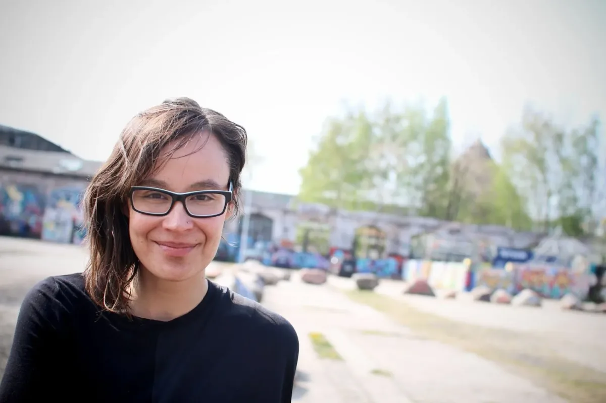

*Photo of Phoenix Perry by Julian Dasgupta*

*Dr. Phoenix Perry specializes in developing accessible machine learning tools, founds value-driven creative coding organizations and creates games that explore our collective interconnectivity. As a Reader in Games and Creative Technologies and founding Course Leader for the MSc in Creative Computing at the University of the Arts London, Phoenix Perry blends embodied gaming, inclusive design, and advanced machine learning in interactive systems. She holds a PhD in Computing from Goldsmiths where she focused on Disability Led Game Design. Founder of the Code Liberation Foundation, Perry has empowered over 6000 women to explore computational creativity with games. She also creates tools and open-source resources for game designers and artists, most notably InteractML. Her installation and game work have been shown at museums and festivals such as Wellcome Collection, Somerset House, A Maze, Indie Cade, and GDC.*

*Follow Phoenix on* [*Twitter/X @phoenixperry*](https://twitter.com/phoenixperry)*,* [*Threads @phoenixperry*](https://www.threads.net/@phoenixperry)*,* [*LinkedIn (Phoenix Perry)*](https://www.linkedin.com/in/phoenixperry/)*, and* [*Phoenix’s Website*](http://www.phoenixperry.com)*.*

#### Ghislain Irakoze (He/Him) | AI Contextualization Interactive Toolkit

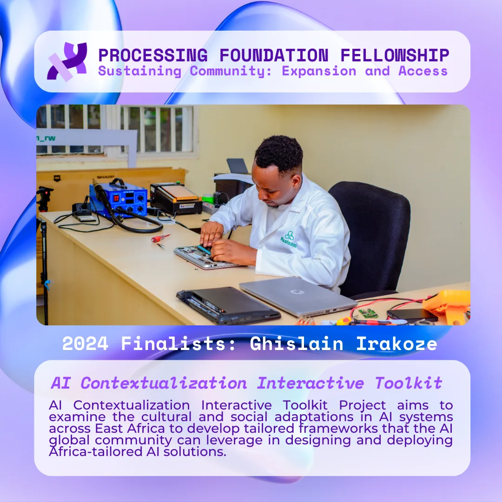

*2024 Finalist Project: AI Contextualization Interactive Toolkit. Credits: Wastezon.*

As AI deployment and adoption advance in Africa, interlinking it with existing social, economic, and cultural systems remains a paradoxical challenge that will deprive millions of Africans of their rights and belonging. ‘AI Contextualization Interactive Toolkit Project’ aims to examine the cultural and social adaptations in AI systems across East Africa to develop tailored frameworks that the AI global community can leverage in designing and deploying Africa-tailored AI solutions. It applies a focus group method research to engage at least 6 grassroots-level digital rights organizations to explore social and cultural necessities in AI systems contextualization. Leveraging the insights and recommendations from grassroots-led research, the project aims to develop an interactive toolkit comprising practical guides on social and cultural contextual considerations in designing and deploying localized AI systems. The toolkit will be presented to the global AI community, creating the needed locally informed resources to inform AI systems development.

*Photo of Ghislain Irakoze*

*Ghislain Irakoze is a social entrepreneur and researcher. He founded ‘Wastezon’, a cleantech social enterprise that leverages AI to repurpose electronic materials into low-cost devices for consumers or secondary raw materials for manufacturers with a mission of igniting digital transformation and circular economy. As a former Research Fellow at the World Wide Web Foundation and Planet ReImagined, Ghislain has developed circular economy policies and frameworks in alignment with sustainable development. He worked with the EU Commission on Africa-EU Circular Economy Cooperation and is a former Researcher at Mastercard Foundation’s Youth Think Tank. Ghislain is also a former Climate Fellow at Subak, where he created and advocated predictive models for measuring e-mobility materials maintenance. Ghislain sits on Global Greengrants Fund’s Next Gen Climate Board and EU Commission-International Partnerships’ Youth Sounding Board. For his community impact, Ghislain has received recognitions and awards such as the Commonwealth Youth Award, Green Biz 30 Under 30 Honoree, and UNEP’s Young Champion of the Earth Prize-Finalist.*

*Follow Ghislain on* [*Twitter/X @iraghislain*](https://x.com/iraghislain) *and* [*LinkedIn (Ghislain Irakoze)*](https://www.linkedin.com/in/ghislain-irakoze1/)*.*

#### Payton Croskey (she/her) | Preserving Liberatory Futures: An Afrofuturist Archive

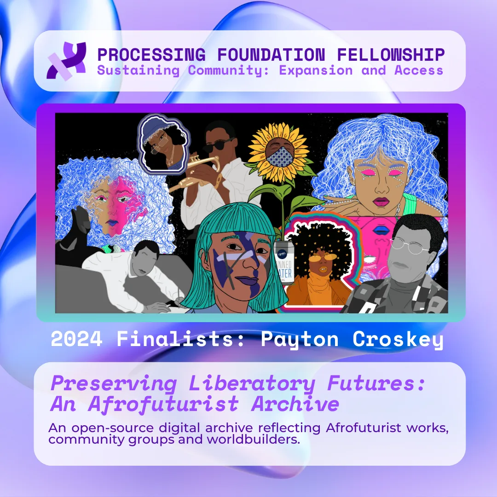

*2024 Finalist Project: Preserving Liberatory Futures: An Afrofuturist Archive*

Afrofuturism is a cultural movement that combines imaginings of the past, peculiarities of the present, and visions of the future. Creators in this domain challenge dominant narratives while embracing a “concept of seeing and creating the future from a perspective that has the lineage of an African seed, of something older and other than Western,” as described by writer and activist adrienne maree brown in Emergent Strategy. Although many dreamers work within this multidimensional space, their contributions are often unrecognized or undervalued in traditional computational environments. Additionally, questions surrounding who and what is to be archived are ever-present as politics over truth and facts are debated within schools and on social and media platforms.

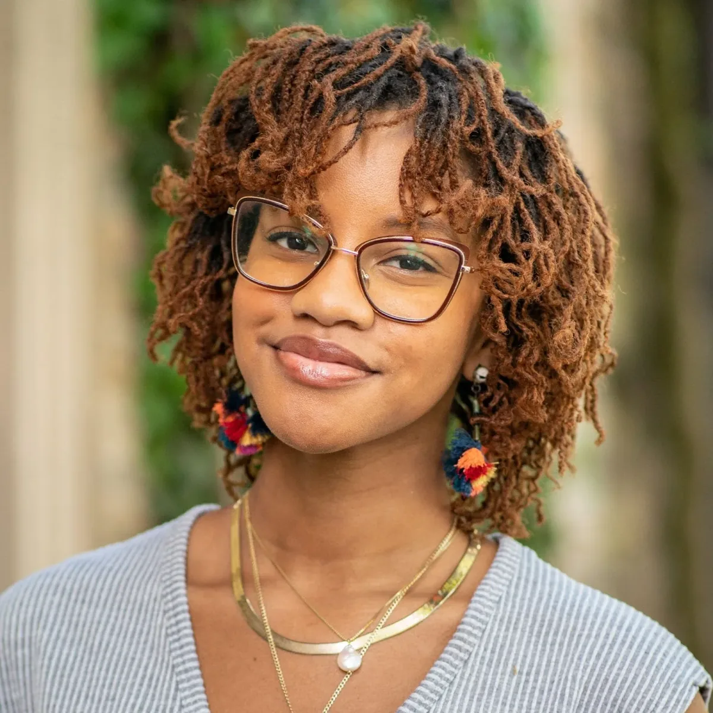

*Photo of Payton Croskey*

*Payton Croskey is a tech justice scholar and artist designing liberatory tools for a more just world. Pursuing a Ph.D. in UC Santa Barbara’s Media Arts & Technology (MAT) program, Payton’s work centers on collaboration with Black and other systemically marginalized groups to subvert, build, and reimagine technology. This is a continuation of her undergraduate research in Princeton University’s African American Studies and Computer Science departments. There, she explored Afrofuturism, efforts to resist surveillance systems, and what she coined the ‘Augmented Undercommons’, a fugitive maker space where inhabitants redefine security, community, and innovation while dreaming of new worlds.*

*Follow Payton on* [*Twitter/X @PaytonCroskey*](http://x.com/PaytonCroskey)*,* [*Instagram @quirkycouture*](http://instagram.com/quirkycouture)*,* [*LinkedIn (Payton Croskey)*](http://linkedin.com/in/payton-croskey/)*, and* [*Payton’s Website*](http://paytoncroskey.com)*.*

#### Kai Lin Cort, Kyle Albasi, and Warren Longmire | Rhyme or Reason: Journal of Poetic Inquiry

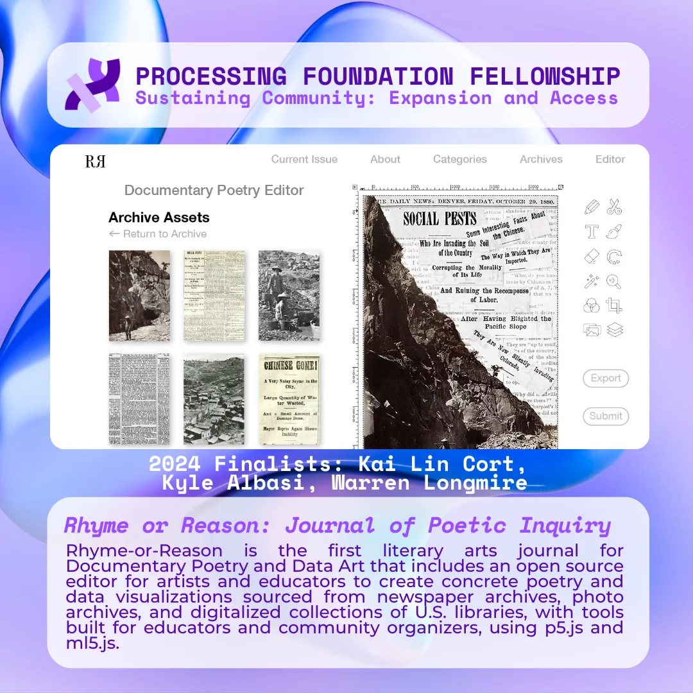

*2024 Finalist Project: Rhyme or Reason: Journal of Poetic Inquiry*

Rhyme-or-Reason is the first literary arts journal for the Documentary Poetry genre that features ergodic, concrete, computational, multimedia poetry, and data art. The collaborative, crowd-sourced journal includes an open-source editor for creators and educators to draw source documents and data from archives and libraries, with p5.js tools for erasure poetry, visual poetry, and generative art, alongside audio readings & video, and kin-hyperlinked, discoverable footnotes.

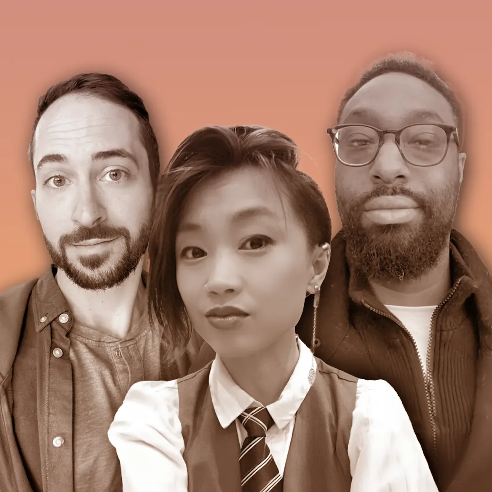

*Photo of Kai Lin, Warren Longmire, and Kyle Albasi.*

*Kai Lin is a creative technologist and educator, who has taught various classes on (creative) coding at Sketch, PerScholas, HackReactor, and PluralSight while working as a software engineer by day — currently at AidKit, building technical infrastructure for guaranteed basic income pilots. Their artwork, music, and plays have been shown at the Montreal and Denver Fringe Festivals, Toronto Feminist Art Conference, and LitFest. They’ve given talks at the MoMA, Columbia University, NYU, and Harvard Law. They were an Emerging Writers fellow at the Asian American Writers Workshop in 2015 and 2020. Before coding full time, they worked as an immigrant labor organizer and freelance journalist in NYC Chinatown, co-founded the Red Canary Song collective. They also served in government during the pandemic at the New York State Assembly as the Executive Director of the Asian Pacific American Task Force, addressing random acts of anti-Asian violence while providing support to immigrant essential workers.*

*Warren is a writer, performer, technologist, and educator from the bad part of North Philadelphia. He is the host of House Poet: A Spoken Word Dance Party and founder of \_mixlit press. Warren’s work has been published in journals including Cartridge Lit, The Cleveland Review of Books, The Painted Bride Quarterly, and The American Poetry Review. He was featured in the Best American Poetry 2021, edited by Tracey K. Smith, and will be featured in the anthology A Black Philadelphia Reader: African American Writings About the City of Brotherly Love (PENNSYLVANIA STATE UNIVERSITY PRESS) in June 2024 His latest book,* [*Bird/Diz: an erased history of bebop*](https://phillycam.org/project/birddiz) *(BUNNY Presse) was released in November, 2022. Warren will be attending the Iowa Writer’s Workshop in the Fall of 2024.*

*Kyle Albasi is a writer and multimedia artist. He holds a BFA in Film and Media Arts from Temple University in Philadelphia. His body of work includes fiction, poetry, video art, and screenwriting, which has been featured in publications such as Happy Harpy Review and Five South Journal, with forthcoming pieces in Katabatic Circus, and has placed in the Austin Film Festival. Kyle recently co-produced an immersive theater piece for Denver’s Fringe Fest — leading the art direction and design in crafting augmented reality experiences that utilized archival documents and AI to engage audiences with historical narratives and speculative futures. This summer, Kyle will undertake a residency at The School of Machines, Making & Make-Believe in Berlin contributing to an interactive public art installation to be displayed in Volkspark am Weinberg. His work continues to explore the intersections of technology, art, and storytelling.*

*Follow on* [*Instagram @alongmirewriter*](https://www.instagram.com/alongmirewriter/) *and* [*@heart.of\_code.\_\_.\_.\_*](https://www.instagram.com/heart.of_code.__._._/)*.*

#### Beccy Abraham (they/them) | Tiny Touch Instruments

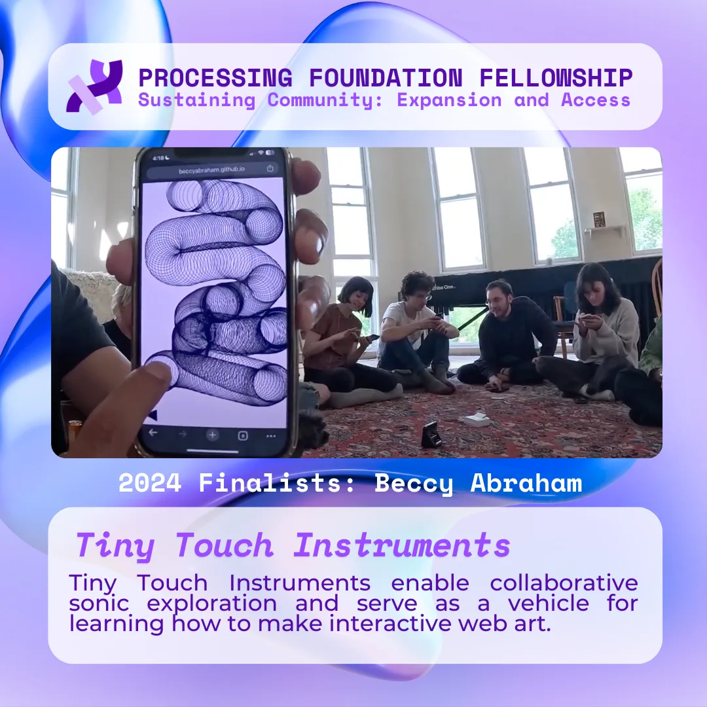

*2024 Finalist Project: Tiny Touch Instruments*

Beccy has been creating a set of Tiny Touch Instruments (TTIs), touch-controlled musical instruments that run on a mobile web browser. The instruments have simple interfaces and are designed for intuitive interaction. TTIs give people easy access to communal music-making. They recontextualize smartphones, which often foster disengagement, into tools for connection and creativity.

To further this work, Beccy is interested in creating a set of accessible, beginner-friendly tutorials that teach people how to build TTIs. These tutorials would span web interactivity and graphics with p5.js, Web Audio with tone.js, and mobile development concepts. They would also ask users to consider the creative aspects of building a software instrument, including interaction design, sound design, and visualization. Ultimately, Beccy would like to develop an approach to in-person TTI workshops, where people with mixed backgrounds in coding and music could come together to build TTIs and jam with their newly created instruments.

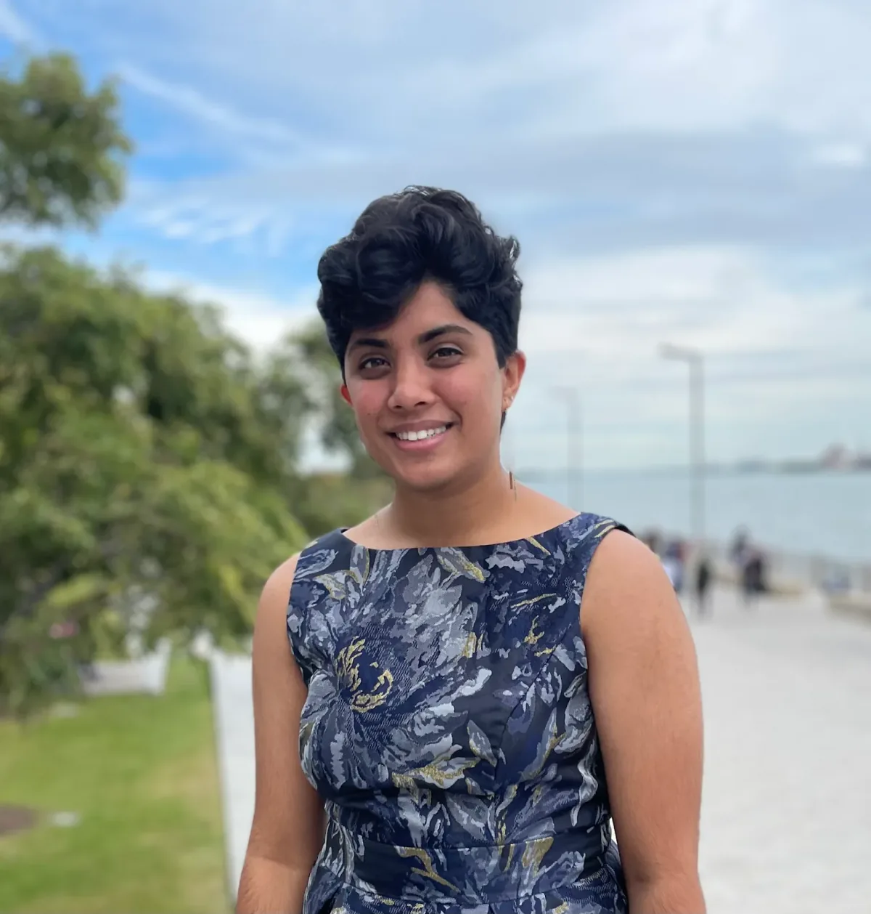

*Photo of Beccy Abraham*

*Rebecca Abraham is an instrument builder and researcher pursuing an MFA in Sonic Practice at Dartmouth College. They completed their Bachelor’s degree in Electrical Engineering and Computer Science at UC Berkeley in 2020 and worked as a software engineer in Oakland, CA. Beccy is pursuing graduate studies to create new ways to share the joy of musical expression. They are especially interested in facilitating collaborative musical experiences that engage broad audiences through their instruments like the Magical Musical Mat and Tiny Touch Instruments. They’re passionate about education and making technical skills accessible to young people, especially folks underrepresented in STEM fields. Beccy believes creative coding can be a powerful pedagogical tool and enjoys teaching workshops in p5.js and similar technologies. They’re constantly inspired by their students and what they come up with after learning just a few functions to create visual art or music. Beccy’s primary instrument is the marimba, and they have over a decade of orchestral percussion experience. They’ve played trombone with Cal Band and acted as principal percussionist in UC Berkeley’s University Wind Ensemble. They play marimba in the Dartmouth College Wind Ensemble and won 1st place (brass and percussion) in the 2024 Culley Concerto Competition.*

*Follow Beccy on* [*Instagram @beccyabraham*](https://www.instagram.com/beccyabraham/) [*@beccy.doodles*](https://www.instagram.com/beccy.doodles/)*,* [*Beccy’s Website*](http://beccyabraham.com)*, and* [*Tiny Touch Instruments Website*](http://tinytouchinstruments.com)*.*

We’re so excited to see what our Processing Finalists will work on this summer! We hope to keep supporting new artists, designers, activists, educators, engineers, researchers, coders, and collectives, year after year. Want to support the Processing Foundation in this work? [Donate here](https://processingfoundation.org/donate) to support our ecosystem at the intersection of art and technology!
