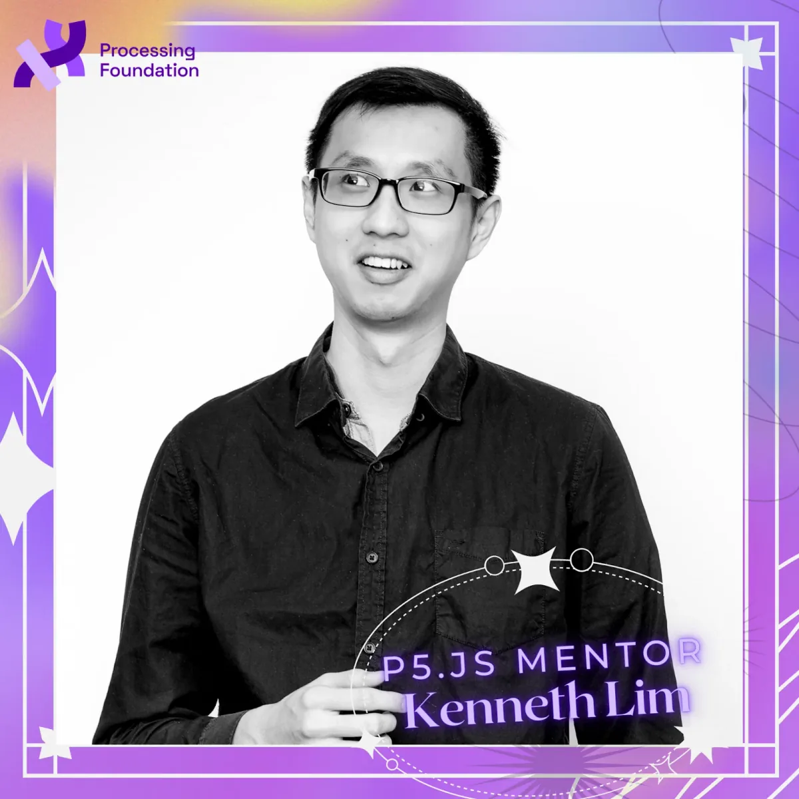

*Photo of Kenneth Lim, our new p5.js mentor.*

Kenneth has been involved in the Processing Foundation for 7 years through translating p5.js documentation to simplified Chinese as a Processing Foundation fellow in 2018, improving the contributor doc as the p5.js Season of Docs technical writer in 2022, and being one of the most active contributors in p5.js GitHub repositories. Kenneth will support and work with Qianqian to maintain the p5.js GitHub repositories, continue and expand p5.js’s effort in translation, and create a more accessible environment for contributors. Look out for Kenneth’s second Medium announcement in the coming months, which will be his personal take on his relationship to technology.

We also want to say biggest thanks and congrats to evelyn masso, the 2022 p5.js mentor and the 2021 p5.js co-lead. Thank you for your contributions to the project and community, evelyn!

Welcome Kenneth! We are so excited about the knowledge, experience, and care you bring to the project, and look forward to learning and working with you!

**Kenneth Lim** (he/him) is an interaction designer and creative coder working with text and language in all its forms. His work and research focuses on translations, machine understanding of language, and development of language in the modern age. As a freelance creative coder, Kenneth has worked on web design/development, AR app development, and interactive installations. He is a Processing Foundation Fellow of 2018 and also a maintainer of the open source p5.js creative coding library. Kenneth has a BA in Graphic Design from Central Saint Martins, an MA in Information Experience Design at the Royal College of Art and a MRes in Creative Computing from UAL Creative Computing Institute. Kenneth is currently a Lecturer and Acting Course Leader of BSc Creative Computing at UAL CCI. His work is available at limzykenneth.com.

Follow Kenneth on social media: [Instagram](https://www.instagram.com/limzykenneth/) and [Twitter](https://twitter.com/limzykenneth).
