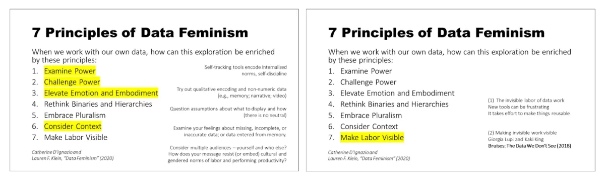
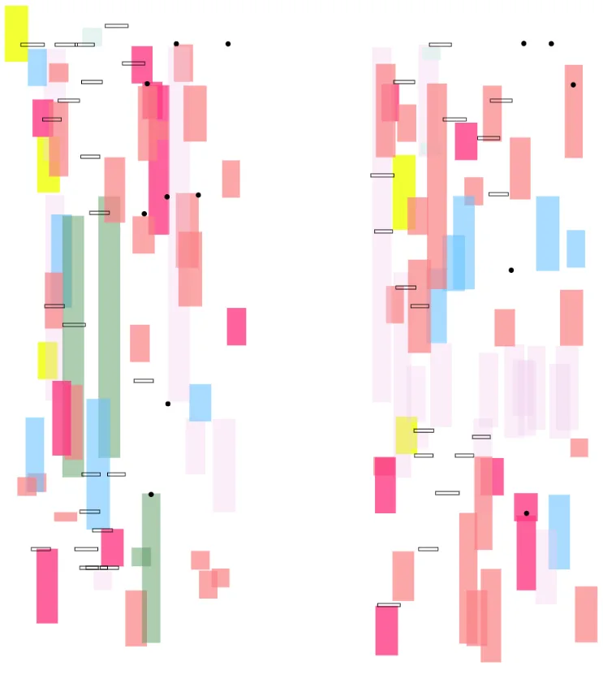

*Photo of Kit Kuksenok by [Cora EF Hamilton](https://www.instagram.com/coraefhamilton/) in Berlin.*

We’re beyond excited to welcome Kit Kuksenok to the team! With a deep passion for creative coding, Kit brings extensive experience in algorithmic art, data visualization, and tech criticism. They have loved using [p5.js](https://p5js.org) since 2019 and have researched body data (both voluntary and otherwise). Algorithmic art in p5.js sketches has allowed them to explore (il)legibility and (un)certainty in data visualization. Between their personal p5.js sketches and teaching courses with p5.js, their aim with generative art has been to [facilitate data-feminist practice and discussion](https://criticalcode.recipes/contributions/critical-data-practice-at-home-and-with-friends).

**“An example set of “book-end” slides. At the beginning of any presentation (keeping lecture to a minimum) within a course, I highlight all the topics covered in the course and then highlight today’s theme. At the end of any talk, I briefly show the list again to remind what we have covered. I always try to connect the general principle to something concrete, but it may be a different example or question based on the theme of that class. Repetition is a powerful teacher.” — Kit Kuksenok, quoted from the* [Critical Coding Cookbook](https://criticalcode.recipes)*.* [7 Principles of Data Feminism](https://responsibledata.io/anniversary/the-seven-principles-of-data-feminism/) *by Catherine D’Ignazio and Lauren F. Klein.**

They deeply believe in the power of creative coding communities to reframe and reclaim our collective engagement with technology. We can’t wait to see the fantastic work they’ll be doing for the [Processing Foundation](https://processingfoundation.org). Thank you, Kit, for your brilliance and dedication to critically envisioning open-source creative technology while supporting others on their journey. Stay tuned for more from Kit — including updates on p5.js, p5.js contributor support, and shaping the future of p5.js!

***“**[daybird](https://openprocessing.org/class/70239#) *(2021) is a p5.js sketch used as an example of an abstract, expressive rendering of my time-on-task data over 11 weekends (left is the accumulation of Saturdays, and right — Sundays). The bright neon yellow segments draw attention to times of day that are frequently not tracked, and randomness (in position within the days, but also the width of the brush-strokes) visually confronts the assumption of data neutrality and completeness.” Courtesy of Kit Kuksenok, quoted from the* [Critical Coding Cookbook](https://criticalcode.recipes)*.**

[Kit Kuksenok](https://xnze.ro/) **(they/it)** is an artist, writer, and coder. Since first learning to code in 2002, they have worked as a systems integrator, web developer, software engineer, data analyst, and lecturer in computer science. Their art/writing is informed by their proximity to technology and its variegated uses; they’ve taught numerous courses exploring technology’s role in society through algorithmic art. They hold a PhD (2016) in Computer Science and Engineering from the University of Washington in Seattle. Born in Ukraine and having lived in the US and Germany, Kit speaks English, Ukrainian, Russian, and some German.

Follow them on [Instagram @xn\_ze\_ro](https://www.instagram.com/xn_ze_ro/) and [LinkedIn (Kit Kuksenok)](https://www.linkedin.com/in/kuksenok/)

Help shape the future of p5.js! The [beta release of p5.js 2.0](https://github.com/processing/p5.js/issues/7488) is ready — try testing and report any bugs you encounter. We invite you to weigh in on the coming updates in this [community check-in survey](https://forms.gle/XGTQc3gZN6ibbPdv7) as well: If you are an artist, teacher, or use p5.js in any capacity, Kit would love to hear from you. Thank you for contributing to our open-source community!
