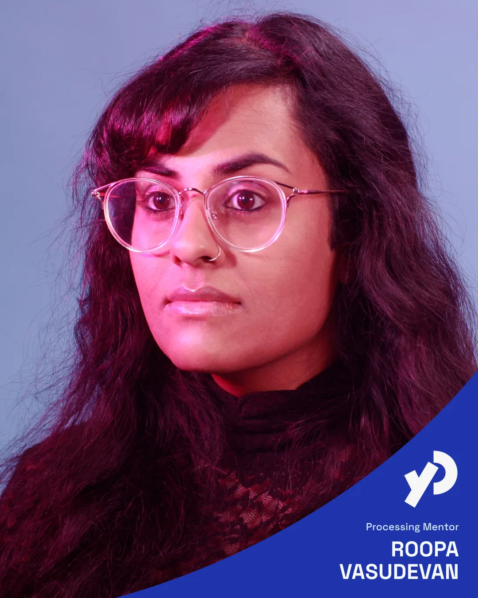
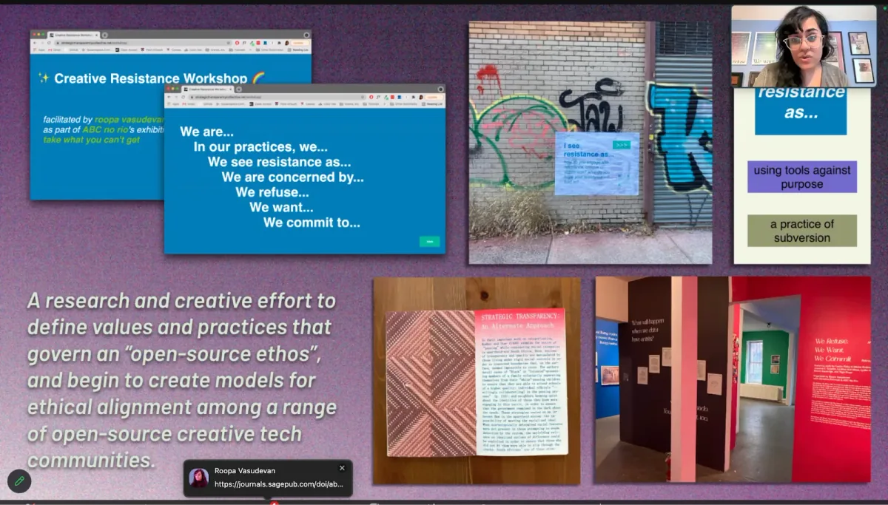
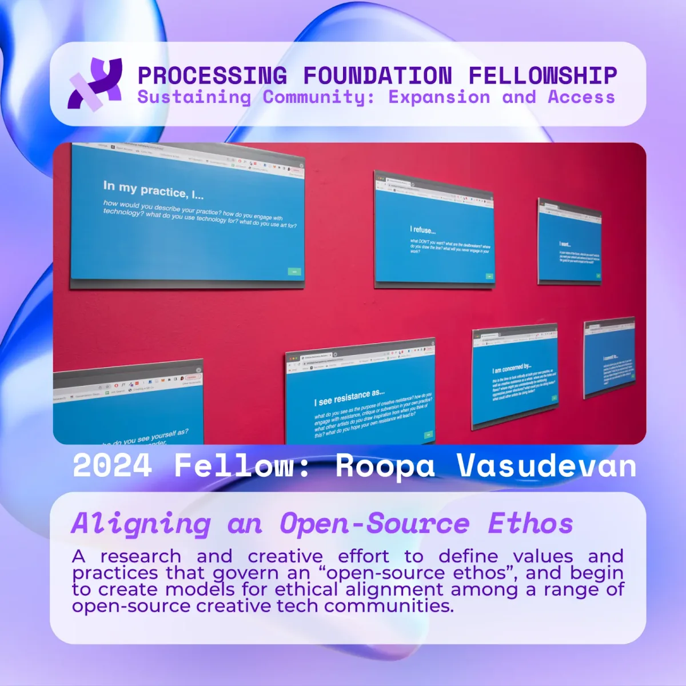
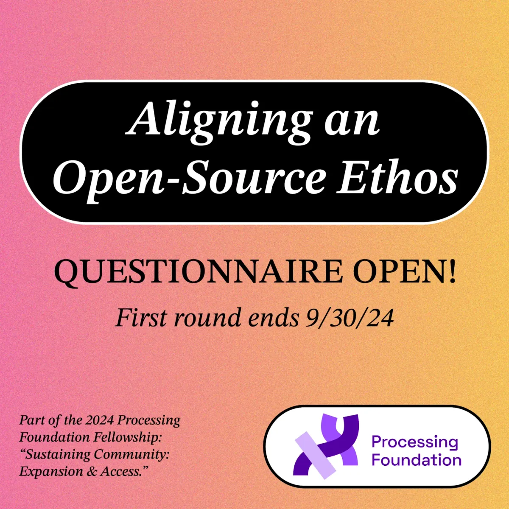
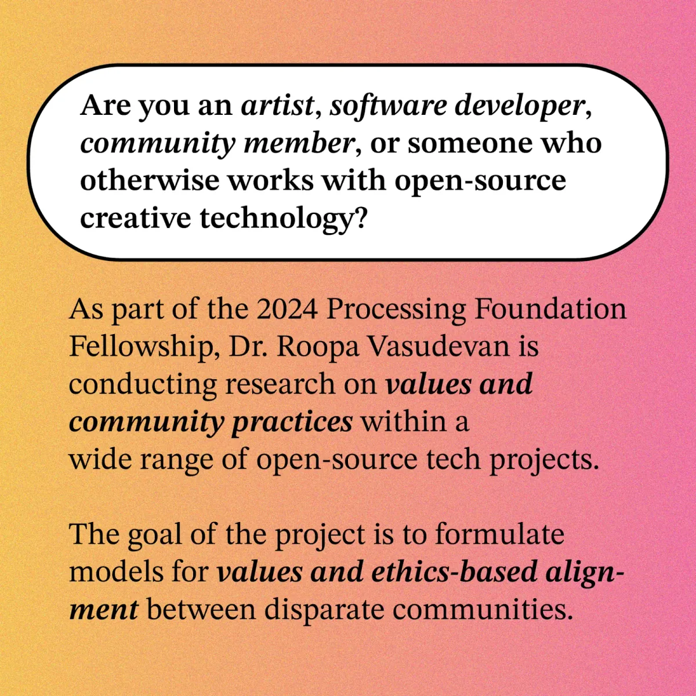

*Processing Mentor Dr. Roopa Vasudevan*

Within her artistic practice, she has been using Processing since 2011 and [p5.js](http://p5.js) since 2015. Her involvement with the Processing Foundation extends back to presenting at [Processing Community Day 2019 (LA)](https://processingfoundation.org/advocacy/processing-community-day-2017-2019); participating in the [Open Source Arts Contributors Conference (OSACC)](https://opensourceart.cc) in 2023 and 2024; and being a [2024 Processing Foundation Fellow](https://processingfoundation.org/fellowships/fellowships-2024) for our [2024 Fellowship themed ‘Sustaining Community: Expansion & Access.’](https://medium.com/processing-foundation/meet-our-2024-processing-foundation-fellows-4b7f5ed5d104)

*Screenshot of Dr. Roopa Vasudevan’s presentation during the 2024 Fellowship Kick-off*

As part of our internal support structure, each project lead at the Foundation is paired with a mentor. Roopa will work closely with Raphaël de Courville, our Processing Community Lead. They will meet regularly to share ideas, talk through decisions, and reflect on ongoing work. It’s one of the ways we try to ensure the people supporting our community are supported too.

*Social Media posts from [Dr.](https://opensourceethos.net) [Roopa Vasudevan](mailto:roopa.vasudevan@gmail.com)’s 2024 Fellowship Project: Aligning an Open-Source Ethos*

**Roopa Vasudevan (she/her)** is a new media artist, computer programmer, and researcher investigating default technical practices and protocols, and how they intersect with larger social and economic power structures. Her work has been exhibited and featured by press outlets internationally, and she has demonstrated a particular and steadfast commitment to artist-led organizations throughout her career. She is a 2024 Processing Foundation Fellow; a 2020 Eyebeam Rapid Response for a Better Digital Future Fellow; a community member at NEW INC, the art and technology incubator at the New Museum (New York), where she was a member of the Art & Code track (in partnership with Rhizome) between 2021 and 2023; and a co-investigator on the Data Fluencies Project, an international research team funded by the Mellon Foundation between 2022 and 2025. Her writing has appeared in venues such as the *Brooklyn Rail*, *New Media and Society*, *Media-N: The Journal of the New Media Caucus*, the Social Science Research Council’s “Just Tech” platform, and ACM *Interactions*, along with a range of self-published and bespoke collections. Roopa received her PhD in Communication from the University of Pennsylvania in 2023, and an MPS from the Interactive Telecommunications Program (ITP) at NYU in 2013. She is currently an Assistant Professor in the Department of Art at the University of Massachusetts, Amherst.

Follow her on [her Website](https://roopavasudevan.com), [Github @rouxpz](https://github.com/rouxpz), [Bluesky @rouxpz.bsky.social](https://bsky.app/profile/rouxpz.bsky.social), and [Instagram @rouxpz](https://www.instagram.com/rouxpz/)

Welcome, Roopa!
