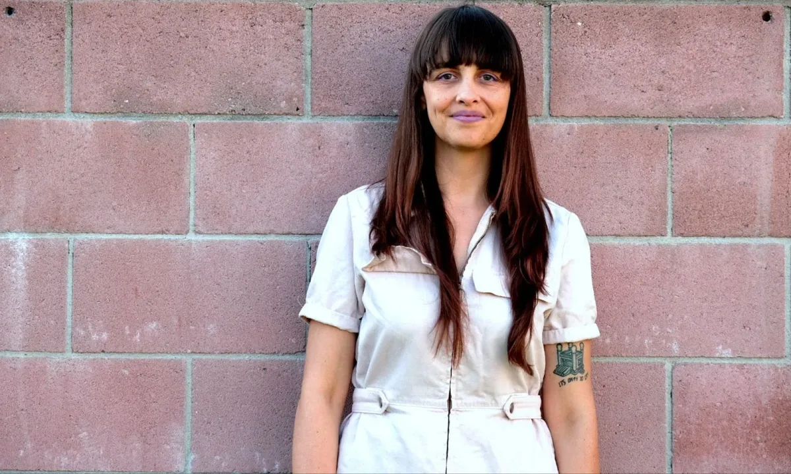
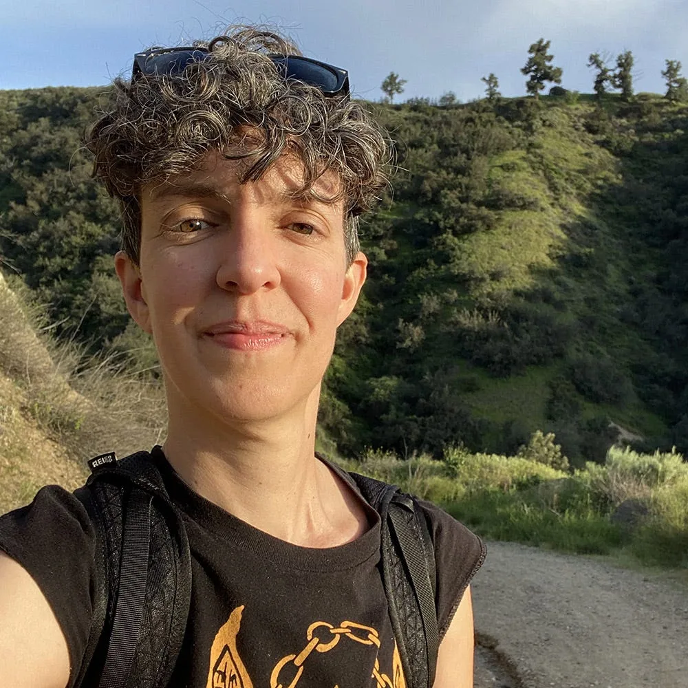
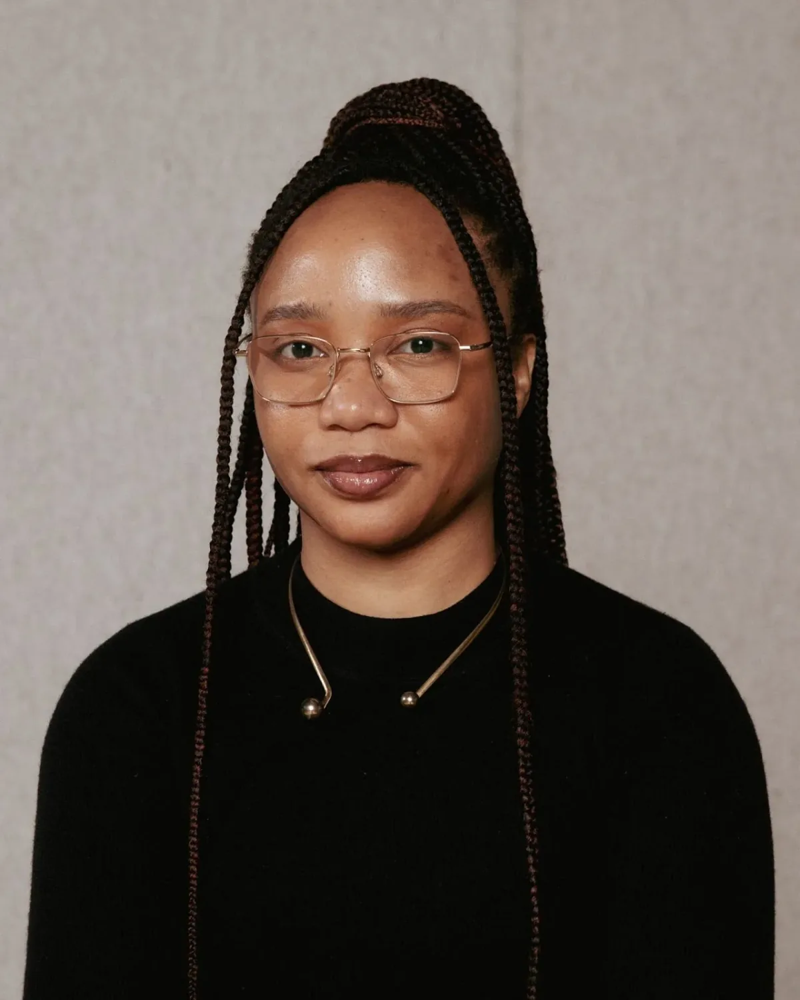

This project aims to create p5.js critical AI tutorials.

This project will create tutorials that contextualize critical AI approaches for the p5.js community, by focusing on conscientious use. These will be written in a similar beginner-friendly style to existing p5.js tutorials introducing new users to debugging, unit testing, and open-source contribution — concepts that are not exclusive to the p5.js library but transferable to new tools and contexts. The documentation will help users understand the key technical concepts underlying the AI systems they use and explain how AI methods connect to the p5.js library. Most importantly, it will highlight how to use AI in their p5.js work conscientiously, by considering common pitfalls and ethical concerns, making informed choices using data cards and model cards, and understanding the complexity of AI through clear, concise language. By expanding the p5.js documentation to highlight important AI use cases, this documentation will support the project’s sustainability and its community growth.

#### [**Sarah Ciston**](https://sarahciston.github.io/) **| p5.js Technical Writer (they/any)**

*Sarah Ciston, p5.js Technical Writer. Photo by Paige Zangoglia*

*Sarah Ciston builds critical–creative tools to bring intersectional approaches to machine learning. Author of ‘A Critical Field Guide for Working with Machine Learning Datasets,’ they have recently been named an AI Newcomer by the German Informatics Society and an AI Anarchies Fellow at the Akademie der Künste Berlin. They hold a PhD in Media Arts and Practice from the University of Southern California and are the founder of Code Collective: an approachable, interdisciplinary community for co-learning programming.*

Over the coming months, Sarah plans to work with the mentor, advisor, and the broader p5.js community to create p5.js critical AI tutorials. AI can be overwhelming and difficult to navigate for anyone — whether or not you are new to programming or p5.js. If you hope to create mindfully with AI, these tutorials will offer critical AI approaches and connect them to the p5.js library. The documentation will use clear language to unpack complex concepts underlying AI systems. Users can avoid common pitfalls in the AI tools they already know, and learn more about using AI critically and creatively with p5.js.

*Follow Sarah on* [*GitHub*](https://github.com/sarahciston/)*,* [*Twitter*](https://x.com/sarahciston)*, and* [*Instagram*](https://www.instagram.com/sarahciston/)*.*

#### [**Emily Martinez**](https://somethingnothing.me/) **| p5.js Technical Writer Mentor (they/she)**

*Emily Martinez, p5.js Technical Writer Mentor*

*Emily Martinez is a new media artist, 1st generation immigrant/refugee (Cuba > Miami), and a self-taught coder who believes in technological disobedience and the tactical misuse of technology. Their art has been exhibited internationally, mostly through collaborations with Anxious to Make and Queer AI. Their solo work is a departure from previous collaborations and a return to unburying histories of immigrant, queer un/belonging. When Emily is not working, she is learning to love and doing their energy work.*

*Follow Emily on* [*LinkedIn*](https://www.linkedin.com/in/emilymartinez1977/)*,* [*Twitter*](https://twitter.com/queermachines)*,* [*Instagram*](https://www.instagram.com/queerai)*, and* [*Emily’s Website*](https://somethingnothing.me)*.*

#### **Minne Atairu | p5.js Technical Writer Advisor (she/her)**

*Minne Atairu, p5.js Technical Writer Advisor. Photo by Dana Gola*

*Minne Atairu is a researcher and interdisciplinary artist interested in generative artificial intelligence. Utilizing AI-mediated processes and materials, Minne’s artistic practice is dedicated to illuminating understudied gaps and absences within Black historical archives. Minne’s academic research focuses on Generative AI, Art and Educational policy in urban K-12 Art classrooms.*

*Minne has exhibited and performed at The Shed, New York (2023), Frieze, London (2023), The Harvard Art Museums, Boston (2022); Markk Museum, Hamburg (2021); SOAS Brunei Gallery University of London, London (2022); Fleming Museum of Art, Vermont (2021). Minne is the recipient of The Graham Foundation Grant for Research (2023), The Community Engagement Grant from Columbia University’s Center for Science and Society (2023), Columbia University’s Artistic Dialogue Across Disciplines Grant (2022), the Lumen Prize for Art and Technology (2021).*

*Follow Minne on* [*Twitter*](https://x.com/minneatairu)*,* [*Instagram*](https://www.instagram.com/minneatairu/)*, and* [*LinkedIn*](https://www.linkedin.com/in/minne-atairu-882a9333)

Welcome aboard! We’re so excited to be a part of Google Season of Docs for another year.
