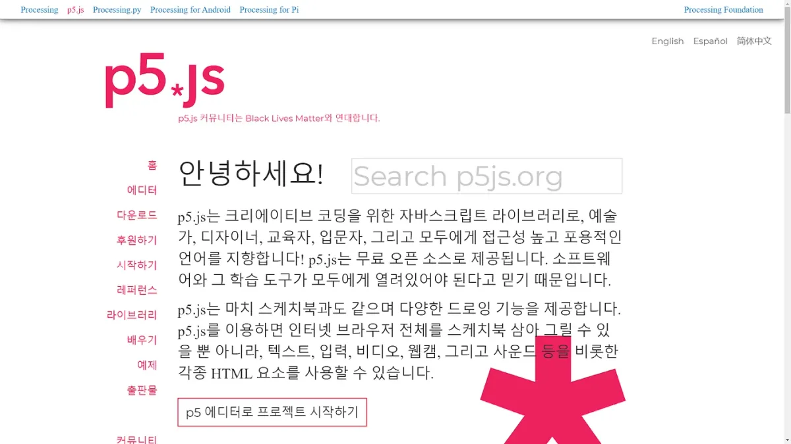
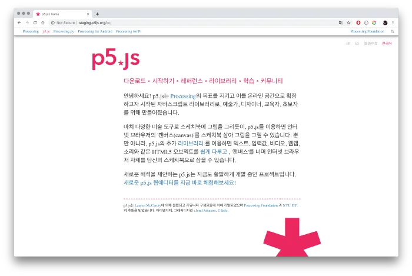
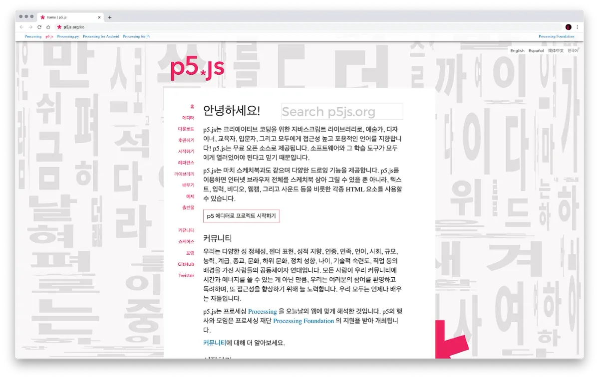

---

*p5js.org is now available in Korean at [p5js.org/ko](https://p5js.org/ko/).*

[이 글을 한글로 읽고싶다면, 여기(here)를 클릭하세요](https://medium.com/@ProcessingOrg/p5-js-ko%EB%A5%BC-%EB%9F%B0%EC%B9%AD%ED%95%A9%EB%8B%88%EB%8B%A4-2f0affd2ff13)*.*

During the 2019 p5.js Contributor Conference, [Olivia Ross](https://www.instagram.com/cyberdoula/?hl=en) facilitated a discussion on [How to Write Non-Violent Creative Code](https://contributors-zine.p5js.org/#reflection-olivia-mckayla-ross). In the reflection, we asked ourselves what it means to translate programming languages built upon colonial projects like the English language.

In an effort to make p5.js a more inclusive community, allowing for different languages and perspectives is extremely important. Translating can be an act of reclaiming, it builds bridges to exchange new ideas and gives agency and access to more people.

My experience participating in the [p5.js Chinese translation](https://medium.com/processing-foundation/chinese-translation-for-p5-js-and-preparing-a-future-of-more-translations-b56843ea096e) project, led by [Kenneth Lim](https://limzykenneth.com/) in 2018, introduced me to a new path of relearning p5.js. (p5.js has also been translated [into Hindi](https://medium.com/processing-foundation/interview-with-2019-fellows-manaswini-das-nancy-chauhan-and-shaharyar-shamshi-172127c2e277) and [Spanish](https://p5js.org/es/).) I felt so empowered and connected to the p5.js community statement written in my native language. For the 2020 Processing Foundation Fellowship, fellows Inhwa Yeom and Seonghyeon Kim worked on the project [p5 for 50+](https://medium.com/processing-foundation/p5-js-for-ages-50-in-korea-50d47b5927fb) and completed the Korean translations of the p5.js website. As the mentor for their Fellowship, I am so proud and thrilled to help announce the launch of p5.js/ko.

— [Qianqian Ye](https://www.qianqian-ye.com/)

---

*The Korean translation started with Yeseul Song, when Lauren McCarthy was planning a p5.js workshop in Gwangju, South Korea, in 2019. During the time, Yeseul was invited to translate major p5.js functions and methods, as well as the staging page. The translation was used as a part of Lauren’s teaching materials, and Yeseul’s experience was featured in the p5.js 1.0 Release.*

*Inhwa Yeom, who was the production assistant of the workshop, volunteered to continue translating p5js.org in Korean. She translated the substantial amount of the website, with the assistance of Seonghyeon Kim, during their* [Processing Foundation Fellowship in 2020](https://medium.com/processing-foundation/p5-js-for-ages-50-in-korea-50d47b5927fb)*. The completion of the translation became one major outcome of Inhwa & Seonghyeon’s Fellowship project,* [“p5 for 50+”](https://medium.com/processing-foundation/p5-js-for-ages-50-in-korea-50d47b5927fb)*. Below, Inhwa and Seongheon answer questions about the process in an interview with Processing Foundation Director of Advocacy, Johanna Hedva.*

**Johanna Hedva: Hello, Inhwa and Seongheon! This is so exciting! p5js.org is now available in Korean! We have wanted to have p5.js be available in Korean for a long time. It’s a huge goal to accomplish.**

**Inhwa Yeom & Seonghyeon Kim:** Hello and 안녕하세요! we are glad to have p5js.org/ko finally launched! This translation is dedicated to the entire Korean-speaking population in Korea and around the world. We are excited to have more language groups engage with p5 in further accessible and legible manners.

*Initial Korean Translation of the p5.js website, by Yeseul Song, from 2019.*

**JH: Can you walk us through the process of translating a programming language into Korean? What are some of the practical challenges of this kind of work?**

**IY & SK**: Korean (or Hangeul) is a highly flexible and embracing language. When translating the terms that originated outside of the country, we borrow their phonetic sounds. This way, we can prevent the loss of original meaning and context, or maintain smoother communications at a global level. A difficulty, however, arose when we had to decide between whether to keep the foreign expression as-is, or to translate it directly into Hangeul. Whereas the latter is crucial in terms of preserving the language, it can be an over-translation to those who are already familiar with the foreign expressions that are commonly used. On the other hand, phonetic translation can be a barrier to those who are not familiar with the foreign language itself — English, in this case — or with the field usage of terms.

For the purpose of p5js.org, we tried to include a varying degree of English levels and coding experiences of Korean audiences. Thus, we scaled the audience scope to those who can speak basic English and programming languages. Those are the people who supposedly have a stronger need in understanding the current contents on p5js.org and can thereby better engage with the p5.js community. While maintaining the readability of the website in Korean, we translated most of the programming-specific or CG(Computer Graphics)-specific terms in consideration of their field usage.

**JH: Do you have any suggestions for future contributors to the Korean version?**

**IY & SK**: Above all, we welcome virtually any types of comments or “pull requests” [at the GitHub here](https://github.com/processing/p5.js-website/tree/korean), on any part of p5js.org/ko you believe is insufficiently or overly translated! Still, we hope that future contributors check and double-check the correct usage of the written Korean language, as well as the field usages, before submitting a pull request :)

Notwithstanding the fluidity of Korean as a spoken language, its writing system is extremely demanding. Even experts often get confused with its grammar and spelling, since the standard changes every year. Therefore, we paid close attention to grammar, spacing, spelling, and notation based on the following references: norms of Korean language and translation promulgated by the National Institute of Korean Language (NIKL), a spell-check program provided by NIKL, and two different online English-to-Korean dictionaries.

In integrating the usage of programming-specific and CG-specific terms throughout p5js.org/ko, we thought we should create a [glossary for p5js.org/ko translation](https://drive.google.com/file/d/1pEMMrRCKiuerNK3_f3pl-um4h2FGRm_C/view?usp=sharing). The glossary was modeled after [Kenneth Lim](https://designerken.be/designing)’s for p5js.org/zh-hn translation, which was a part of his [Processing Foundation Fellowship 2018](https://medium.com/processing-foundation/chinese-translation-for-p5-js-and-preparing-a-future-of-more-translations-b56843ea096e).

As for our translation on specific jargon, we referred to a variety of print materials on JavaScript and Processing, and online forums and discourses in Korean. We hope that the glossary can be useful for or further reviewed by our future contributors.

One last-but-not-least thing to note: p5js.org has overall a very friendly tone. We also would like to have this style maintained p5js.org/ko, as well :)

**JH: Can you tell us about the background artwork on p5js.org/ko, which was made by your Fellowship partner** [Seonghyeon Kim](http://github.com/okdalto)**?**

**IY & SK**: In celebration of launching p5js.org/ko, [Seonghyeon Kim](http://github.com/okdalto) created *Hunminjeongeum2020* for the background. The artwork is his re-interpretation of “Hunminjeongeum” with p5.js. *Hunminjeongeum* is the native script of the Korean characters and language, invented and promulgated by King Sejong in 1446. Seonghyeon found much similarity between King Sejong’s intention of creating Hangeul characters with the spirit of p5.js, especially in terms of enhancing everyone’s accessibility to lingual experiences. In implementation, Seonghyeon used the KD-Tree algorithm. The position value of each node was designed to interact with the mouse position, so that it gives visually intriguing movements and compositions.

*Completed version of Korean Translation of the p5.js website, with Seonghyeon Kim’s “Hunminjeongeum2020“ in the background.*
