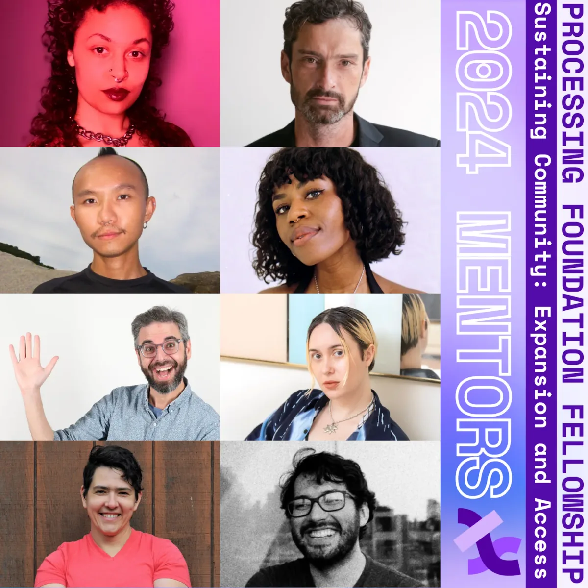
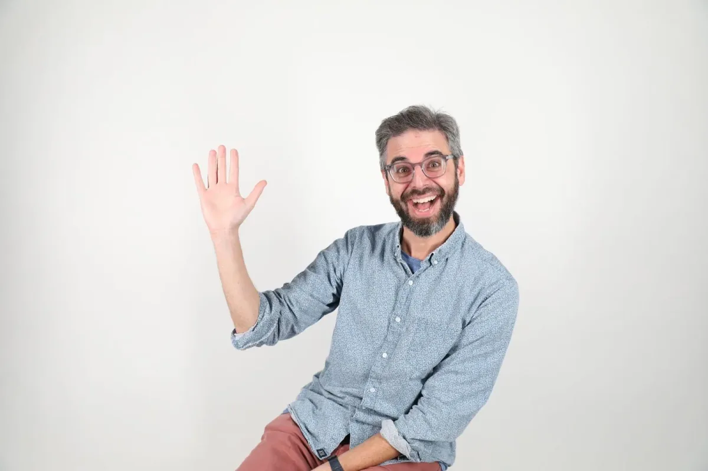
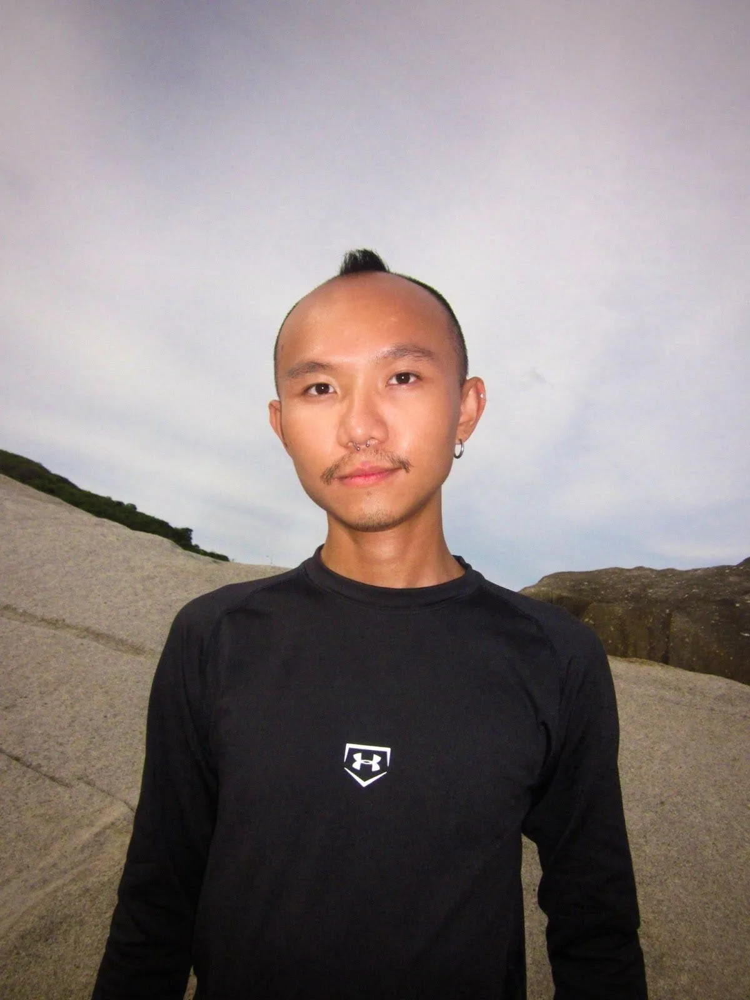
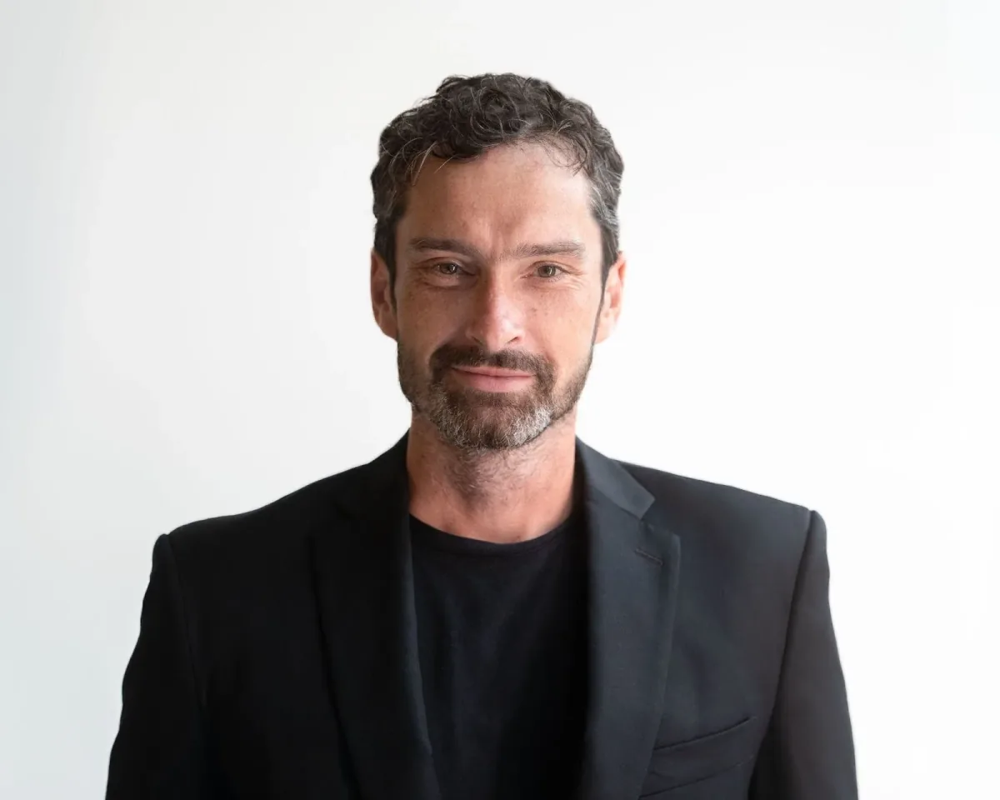
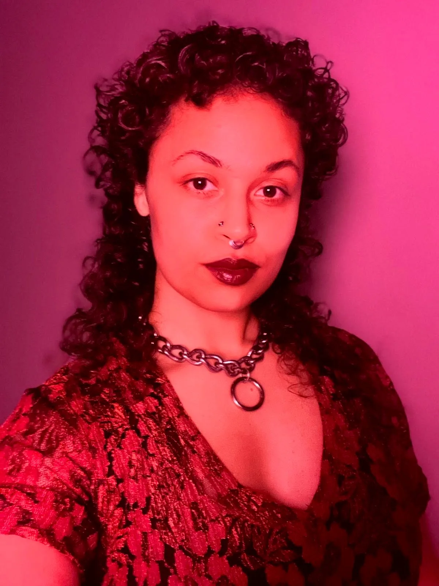
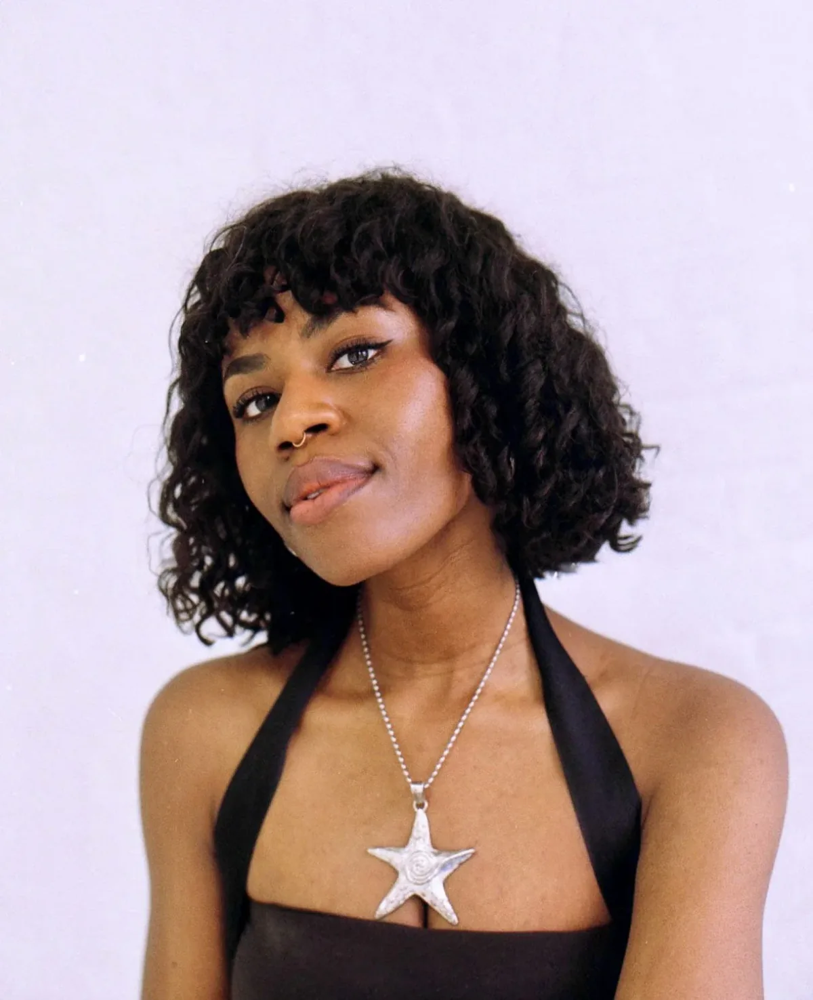
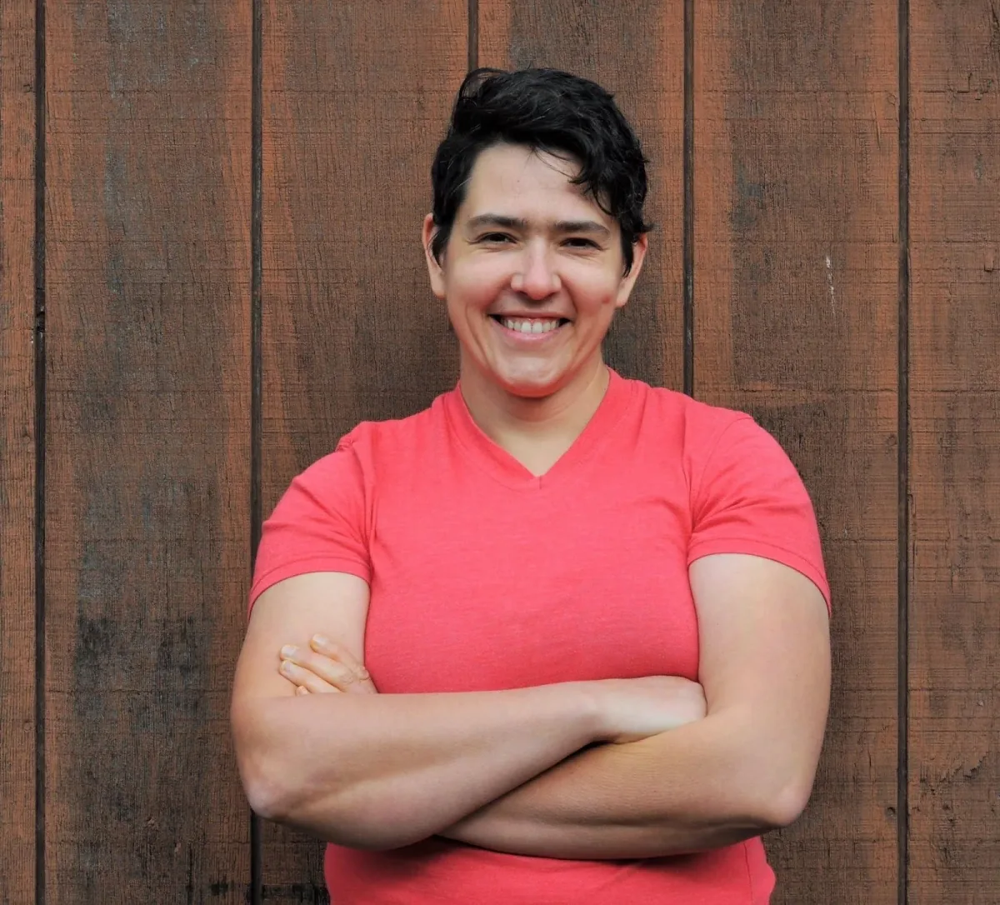
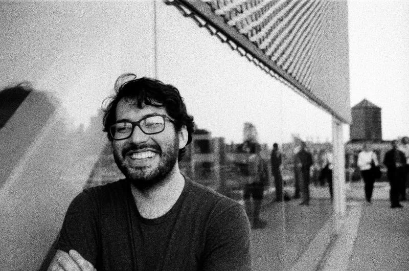
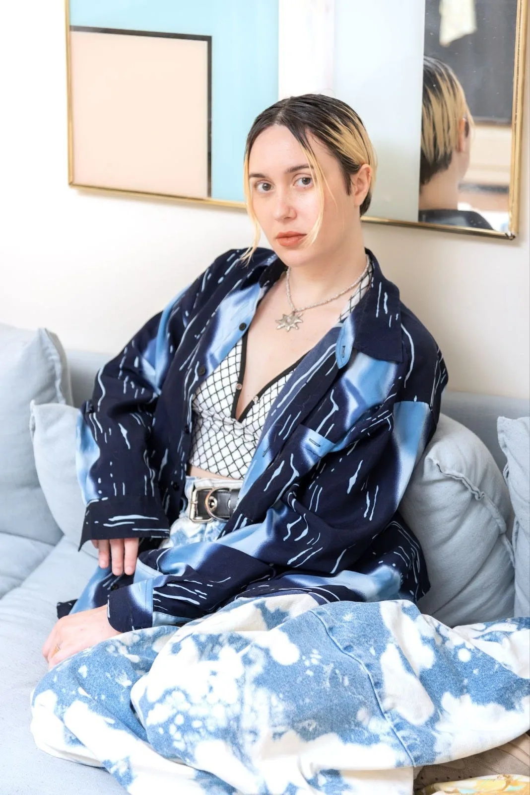

*Processing Foundation 2024 Fellowship ‘Sustaining Community: Expansion and Access’ Mentors*

We received yet another year of a record-breaking number of applications with 346 incredible submissions and were able to award 8 fellowships. Special thanks to our Program Manager, Tsige Tafesse, who made this work possible! We were also able to provide financial support in the form of a Processing Foundation Fellowship Grant to 8 finalist projects.

Continuing with previous years, we asked applicants to address at least one of four Priority Areas, describing how their project responds to the concerns of the topic. The four priority areas were:

-   Archival Practices: Code & New Media: Projects aimed at developing tools and platforms for archiving and preserving creative code/the digital, as well as new media archival practices.
-   Open-Source Governance: Initiatives focused on creating governance models that promote equitable decision-making, inclusive communities, engagement, and sustainable growth in open-source projects.
-   Disability Justice in Creative Tech: Tools and projects that advance access and promote disability justice within the realm of creative technology.
-   Access & AI: Engaging AI technologies to create accessible solutions and improve inclusivity in digital spaces.

For an archive of our past Fellows, check out our [Fellowship Page](https://processingfoundation.org/fellowships) on our [Processing Foundation Website](https://processingfoundation.org).

#### Daniel Shiffman (he/him) | Mentor for Luís dos Santos Miguel

*Photo of Daniel Shiffman by Tuan Huang*

*Daniel Shiffman is the conductor of the Coding Train on YouTube, where he shares his love of creative coding with videos on subjects ranging from the basics of programming languages like JavaScript (with* [p5.js](https://p5js.org)*) and Java (with* [Processing](https://processing.org)*) to algorithms for physics simulation, computer vision, and data visualization. In his spare time, he works as an Associate Arts Professor at ITP/IMA, Tisch School of the Arts, NYU. He is also the author of ‘The Nature of Code’ and ‘Learning Processing: A Beginner’s Guide to Programming Images, Animation, and Interaction’.*

*Follow Daniel on Twitter/X* [@shiffman](https://x.com/shiffman) [@thecodingtrain](https://x.com/thecodingtrain) *and Instagram* [@daniel.shiffman](https://www.instagram.com/daniel.shiffman/) [@the.coding.train](https://www.instagram.com/the.coding.train/)*.*

#### Luís dos Santos Miguel’s ‘Holografia: p5.js in Brazilian Sign Language’ Project Description

‘Holografia’ is an initiative based on open-source principles, aimed at promoting design literacy and creative coding in Brazil, especially amongst Deaf individuals. The project ‘p5.js in Brazilian Sign Language’ comprises a series of freely accessible educational videos explaining the fundamentals of p5.js in Libras — the sign language commonly used by Deaf communities in urban areas of Brazil. These videos will feature visual resources, given the Deaf community’s reliance on visual communication, and will also include an audio track and subtitles in Portuguese to ensure accessibility for a broader audience across the country. The project will be conducted by a collective of professionals including Luís Miguel, Jaque Brenda, Paulo de Almeida Sachs, and Camila Delfino.

#### Nhan Phan (he/him) | Mentor for Anh (Autumn) Pham

*Photo of Nhan Phan by [Ngoc Vo](https://www.instagram.com/cat0melette/)*

*Nhan Phan is a technologist and educator based in Ho Chi Minh City. Emerged from data analytics and photography, Nhan has been teaching machine learning at independent institutions in Vietnam since 2019. His curriculums often revolve around the local practices of technology in Vietnam; the harmony between humans, nature, and machines; and the use of technology as an artistic medium for self-reflection. Nhan believes in the power of education. He believes that if everyone can understand what technology is and what is happening within machines, society can break free from the capitalistic, patriarchal, and Western-dominated nature of the current tech industry. Based on this belief, he founded ‘CodeSurfing’, a study club that promotes accessibility in technology for artists in Vietnam. Initiated during Nhan’s participation in the Processing Fellowship in 2023, ‘CodeSurfing’ has since welcomed more than 300 participants from various backgrounds and mediums of practice to its courses and workshops. The team has also launched collaborative research on creative technology and the Vietnamese language, which expands into a three-month fellowship that supports local artists in developing their projects around this theme. In parallel with his teaching, Nhan’s artistic practice focuses on images and algorithms, extending to physical mediums, including prints. His projects portray his struggle with the passage of time and his relentless attempts to turn back time. They often reflect his Asian heritage — being born and raised between Vietnam and Japan — his family traditions, identity, and relationships. You might find his works somewhere in Ho Chi Minh City, Tokyo, New York, Bangkok, and Kuala Lumpur.*

*Follow Nhan on* [Instagram @nhaninsummer](https://www.instagram.com/nhaninsummer/) *and* [CodeSurfing’s Website](http://codesurfing.club)*.*

#### Anh (Autumn) Pham’s ‘How do We Care for Each Other’ Project Description

‘How do We Care for Each Other’ (“Vì Mình Thương Nhau”) aims to create an archival website that documents the actual lived experiences of disabled people in Vietnam through visual storytelling using code, such as Processing and p5.js. By collecting first-person narratives, the project seeks to highlight and celebrate the diverse stories of Vietnamese disabled individuals, recognizing that all bodies deserve to be celebrated. Using creative technology tools, the project hopes to bring visibility to Disability Justice, care, and community. How can we celebrate disabled people as they are and dismantle ableism, especially within all the nuances of the Vietnamese cultural context? Beyond the fellowship period, the project aspires to cultivate a solid community for Disability Justice in Vietnam, continually documenting and celebrating disabled stories. It hopes to inspire more conversations and research on disability from Vietnamese scholars, students, and the general public. In the long term, the vision is to present this website as archival documentation to various levels of government. Better data informs better policies; the project hopes to advocate for better support for disabled people in housing, education, healthcare, and other social services.

#### Michael Connor (he/him) | Mentor for Roxanne Harris

*Photo of Michael Connor by Christine Rivera*

*Michael Connor is the Co-Executive Director of Rhizome, where he oversaw the Net Art Anthology initiative, an effort to retell the history of net art through 100 works, presented as an online exhibition, gallery exhibition, and book. He is also a curatorial advisor for Kadist, a non-profit contemporary art organization, and ArtBlocks, an NFT platform. His first online curatorial project took place in 2003 at FACT, Liverpool, where he organized an edition of the traveling exhibition ‘Kingdom of Piracy’ with Shu Lea Cheang, Yukiko Shikata, and Armin Medosch. Connor is currently editing a book by Gene Youngblood about the work of Kit Galloway and Sherrie Rabinowitz.*

*Follow Michael on* [Twitter/X @michael\_connor](https://x.com/michael_connor) *and* [Instagram @michaeljconnor](https://www.instagram.com/michaeljconnor/)*.*

#### Roxanne Harris’ ‘Ephemeral Experiments: Decoding Tendencies in Live Coding’ Project Description

This project aims to capture and preserve the nuances of live coding performances, detailing artistic decisions and challenges. The project involves developing a platform-agnostic tool that records live performances through keypress detection and state changes within the source code. This tool will effectively archive live coding performances, providing a comprehensive record of the real-time coding process and the artist’s intentions. Ensuring compatibility with any live coding platform, the tool will extend its use across various artistic practices and workflows. Code analysis will reveal patterns, trends, and potential areas for innovation, offering insights into live coding interactions. The project will open-source all tools and research outputs, promoting transparency and collaboration. This approach allows others to observe, contribute to, and build upon the findings. Additionally, the project aims to establish a discursive framework around individualistic practices in live coding, fostering a shared language and a clearer understanding of intent and purpose. By documenting and archiving live coding performances, this project seeks to contribute valuable knowledge and resources to the live coding community and the broader field of creative technology.

#### SHAWNÉ MICHAELAIN HOLLOWAY (she/her) | Mentor for Buffy Sierra

*Photo of SHAWNÉ MICHAELAIN HOLLOWAY*

*SHAWNÉ MICHAELAIN HOLLOWAY is a Chicago new media artist and poet. Known for her noisy experimental electronics and performance practice, HOLLOWAY shapes the rhetorics of computer programming and sadomasochism into tools for exposing structures of power. She has spoken and exhibited work internationally since 2012 in spaces like Performance Space New York, The New Museum, The Kitchen, The Time-Based Art Festival at the Portland Institute for Contemporary Art, Institute of Contemporary Arts (London), The Knockdown Center, and the NRW-Forum Düsseldorf. SHAWNÉ is currently an Assistant Professor of Kinetic Imaging at Virginia Commonwealth University and has had the pleasure of serving as the Digital Developer and Technology Manager with Black Lunch Table’s archives team from 2022–24. In addition to her work in the arts, she is an open-source software advocate, 1/2 of noise duo BONE LATTICE, and a bodybuilder.*

*Follow SHAWNÉ on* [Twitter/X @cleogirl2525](https://x.com/cleogirl2525)*,* [Instagram @cleogirl2525](https://www.instagram.com/cleogirl2525/)*, and* [SHAWNÉ’s Website](http://www.shawnemichaelainholloway.com)*.*

#### Buffy Sierra’s ‘Synthetic Moans’ Project Description

‘Synthetic Moans’ is a piercing scream into the void and a soft whisper to a lover, sister, or mother. Synthetic Moans indexes a process, a practice, and a palimpsest of trans life, and of transfeminine lineages between aesthetics, music, and science. The process at the heart of Synthetic Moans is a system for identifying and assembling transbiological data (hormone levels, frequency of medical visits, embodied memories of sexed and gendered becoming) and sonifying it into tones, sequences, and scores. The practice that will enable the emergence of Synthetic Moans is a method of memory work and archival research between transfeminine people sharing and recording documents, ephemera, and feelings related to broad and variable interpretations of transition. The palimpsest generated through the process and the practice of Synthetic Moans will both disclose and obfuscate felt dimensions of transfeminine life. It will be a digital archive and an evolving compendium of sounds and resources composed with transfeminine contributors. Inspiration for this project comes from many sources: Arca, ARCHANGEL, Annie Sansonetti, ANOHNI, Ita Segev, Jeanne Vaccaro, Juliana Huxtable, Keioui Keijaun Thomas, Mary Maggic, Mira Bellwether, SOPHIE, troizel xx, and many more.

#### Zainab Aliyu (she/her) | Mentor for Amad Ansari

*Photo of Zainab Aliyu by Flordalis Espinal*

*Zainab “Zai’’ Aliyu is a Nigerian-American artist and cultural worker living in Lenapehoking (Brooklyn, NY). Her work contextualizes the cybernetic and temporal entanglement embedded within societal dynamics to understand how all socio-technological systems of control are interconnected, and how we are all materially implicated through time. She draws upon her body as a corporeal archive and site of ancestral memory to craft counter-narratives through sculptures, videos, installations, virtual environments, publications, archives, and social practice. Zai is a 2023–24 NYSCA/NYFA Artist Fellow, design director for the African Film Festival at the Film at Lincoln Center in NYC, and was co-director of the School for Poetic Computation. Her work has been shown internationally at Gardiner Museum (Toronto, Canada), Film at Lincoln Center (New York, NY), Smack Mellon (Brooklyn, NY), Museum of Modern Art Library (New York, NY), Miller ICA (Pittsburgh, PA), Centre for Heritage, Arts and Textile (Hong Kong, China), among others. She has been awarded residencies at MASS MoCA (North Adams, MA), Haystack Mountain School of Crafts (Deer Isle, ME), ACRE (Steuben, WI), Casa do Povo (São Paulo, Brazil), Aktuelle Architektur der Kulturimages (Murcia, Spain), Pocoapoco (Oaxaca, Mexico) among others.*

*Follow Zai on* [Instagram @beatsbyzai](https://www.instagram.com/beatsbyzai/)*.*

#### Amad Ansari’s ‘Palestine Online’ Project Description

‘Palestine Online’ is a collection of web pages created by Palestinians (and friends), primarily in the late 90s and early 00s, sourced from the [Internet Archive’s Wayback Machine](https://wayback-api.archive.org), including but not limited to: personal homepages, news websites and online magazines, sites showcasing Palestinian art and culture, and online memorials.

The project preserves Palestinian web presence during or close to the Second Intifada and showcases the overlooked yet rich early history of Palestinian internet presence, tracing the World Wide Web as a crucial tool for resistance, connection, and expression that has given Palestinians an unprecedented platform under ongoing occupation, and which to this day is a primary commons for a people repeatedly silenced or misrepresented by mainstream media outlets.

Palestine Online is also an exploration of using the capabilities of the modern web, the most important global connectivity tool today, to create a rich and interactive archive that revitalizes and makes newly visible the digital contributions and expression of oppressed peoples.

#### Annie Winkler (they/them) | Mentor for Roopa Vasudevan

*Photo of Annie Winkler*

*Annie Winkler does a lot of different things. Currently working for the Vermont Employee Ownership Center and with the US Federation of Worker Cooperatives, they facilitate business conversions to worker-owned cooperatives. As a former worker-owner at Real Pickles Cooperative, they were a production manager, HR manager, IT manager, board president, and a member of the team that converted the business from a sole proprietorship to a worker co-op. They care more about good process and the journey than they do about the destination. They also believe games teach us more about how we work together than spreadsheets and work plans. They also are a very involved community member in Epic Skill Swap and used to be on the organizing committee.*

*Follow Annie through* [Annie’s Website](http://anniewinkler.com)*.*

#### Roopa Vasudevan’s ‘Aligning an Open-Source Ethos’ Project Description

Working with the Processing Foundation community, along with other creative technology projects that draw inspiration from Processing’s pioneering history, Roopa Vasudevan will begin a research and creative effort to develop both a definition of values and practices that govern an “open-source ethos”, and models for ethical alignment among a range of open-source creative tech communities.

While different protocols and practices are necessary for different languages and technical systems, the ethos surrounding the larger software art community should be consistent if it strongly believes in expanding access to and literacy with technology. Drawing from Vasudevan’s long-term work engaging the complex relationships between art, technology, and power — along with her history of facilitating exchange between tech-based artists about values, practices, and things they would like to see in the field — this project attempts to take steps towards reconciliation and alignment of value-based goals among open-source communities.

As part of the fellowship, Vasudevan will build a Web-based resource collecting her research; outlining findings; and soliciting feedback, ideas, and visions from community members for their hopes for the open-source creative software community. The work from the fellowship period will also be produced as a PDF and printed zine to be distributed in the fall of 2024.

#### Luis Morales-Navarro (he/him) | Mentor for Ahnjili ZhuParris, Dan Xu, Colette Aliman, and Alyssa Gersony

*Photo of Luis Morales-Navarro by Santiago Ospina*

*Luis Morales-Navarro is a researcher interested in how novices make sense of AI/ML-powered systems and issues of algorithmic justice. His work brings together perspectives from child-computer interaction and the learning sciences to investigate how we can support learners in creating AI/ML-powered projects and how young people develop and integrate functional and critical understandings of AI/ML and computing. Currently, he is a doctoral student in the learning sciences and technologies program at the University of Pennsylvania. Previously he researched and designed tools and environments for learning computing at NYU Shanghai, CMU’s Studio for Creative Inquiry, the Processing Foundation, Fundación Omar Dengo, and Apple.*

*Follow Luis on* [Instagram @luismn0\_0](https://www.instagram.com/luismn0_0/)*.*

#### Ahnjili ZhuParris, Dan Xu, Colette Aliman, and Alyssa Gersony’s ‘Screen-to-Soundscape’ Project Description

‘Screen-to-Soundscape’ adopts a creative and experimental approach to reimagining screen reader voices. The project aims to develop a speculative design prototype that transforms a browser or screen into an immersive soundscape. This prototype will feature multiple layered voices reading all readable text in unison with spatial audio, enabling users to discern the text’s location within the browser. The motivation behind this initiative is to overcome the inherent limitations of traditional screen readers by offering users with visual impairments a more intuitive and immersive way to navigate digital content. This benefits users with visual impairments and provides a richer, more engaging web experience for all users. [Constant](https://constantvzw.org/site/), a non-profit artist-run organization based in Brussels, will also support the project with content feedback, technical returns, a budget contribution, and public moments.

#### Nat Decker (they/them) | Mentor for Dorothy Howard and David Isaac Hecht

*Photo of Nat Decker by Olivia Alonso Gough*

*Nat Decker (they/them) is a Chicago-born, Los Angeles-based artist interrogating the politicality of the alienated body/mind networked within a call for collective care and liberation. Working critically with technology, they identify the computer as an assistive device affording a more accessible and capacious practice. They reflect on the virtual as a space of potential requiring contestation for the ways it mirrors patterns of exploitation and exclusion. Their practice fundamentally integrates accessibility, collectivism, and friction as generative mediums. Working with computational and sculptural processes, they trace serpentine connections between the body and modes of technology. They render the mobility device/the disabled body as cultural expansion and agitation of conventional desirability politics, as formal objects laden with the stigma while freedom-giving, sterile and metallic while sensual and soft, un/aestheticized while interacting with designations of usefulness, function, and capitalistic innovation. Nat is a 2024 Eyebeam Democracy Machine Fellow with their collective Cripping\_CG, a Y10 member of NEW INC, and were a 2023 Processing Foundation Fellow. They are also a community organizer and access worker. In June 2022, they graduated from UCLA with a degree in Design|Media Arts and Disability Studies.*

*Follow Nat on* [Instagram @nat\_decker\_\_\_](https://www.instagram.com/nat_decker___/)*.*

#### Dorothy Howard and David Isaac Hecht’s ‘Applying Restorative Practices to Develop an Openly Licensed Conflict Resolution System for Self-Organized Communities’ Project Description

Debate and disagreements are natural parts of people coming together, yet many projects lack deliberative protocols to support codes of conduct. For the 2024 Processing Fellowship, Dorothy Howard and David Hecht are focusing on the design of a conflict resolution system for self-organized communities, such as open technology projects, online groups, or cooperatives. The system will be published in an open repository, so communities can modify and improve it to suit their contextual needs.

The broader aims of this project are to reduce harms that can occur because of inadequate resolution procedures, as well as to foster discussion about applying restorative practices to collaborative governance. To inform the design, the team will conduct research including a review of restorative practices and conflict resolution case studies and literature, and organize a focus group with community practitioners. They will also create a community engagement plan to identify projects that might have needs the system can help address, and a structure for feedback.

This project will build with the Processing Foundation community work to develop practices around encouraging safe spaces and communication in times of conflict, applying the ethics of care to design, and fostering dialogues about the complexities of interpersonal communication, complaint, compassion, and well-being.

We’re so excited to see what our Processing Fellows will work on this summer! Thank you to our amazing cohort of mentors in the field who support this work. We hope to keep supporting new artists, designers, activists, educators, engineers, researchers, coders, and collectives, year after year. Want to support the Processing Foundation in this work? [Donate here](https://processingfoundation.org/donate) to support our ecosystem of open-source contributions!
