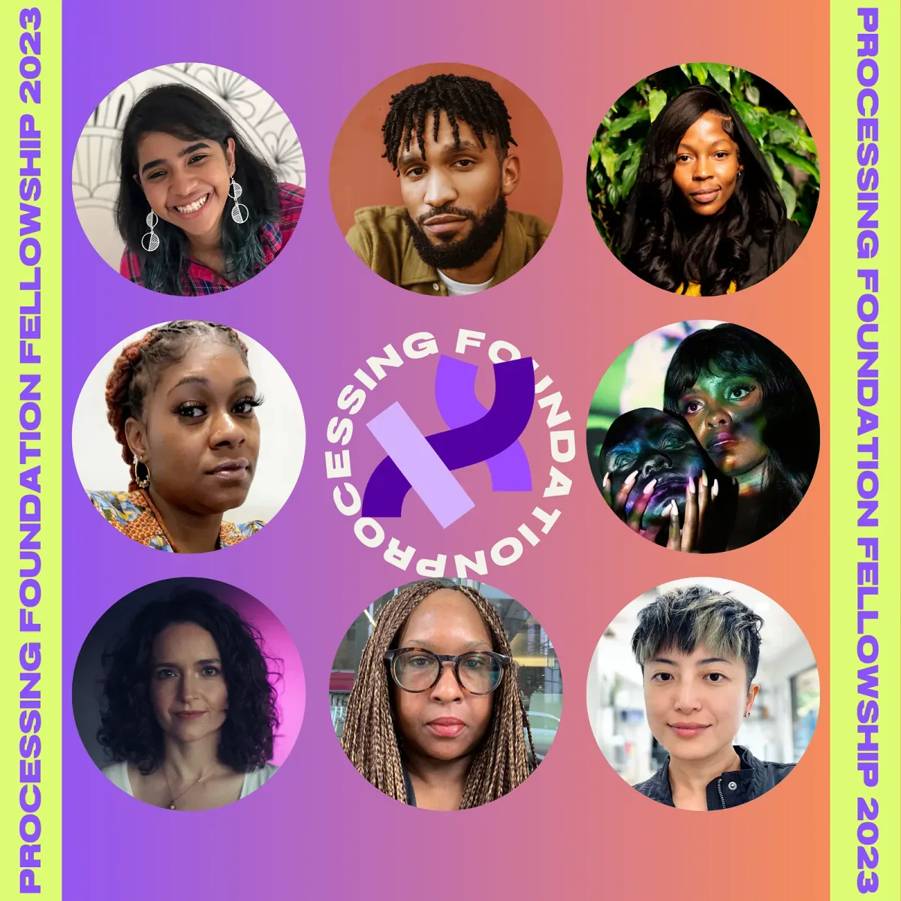
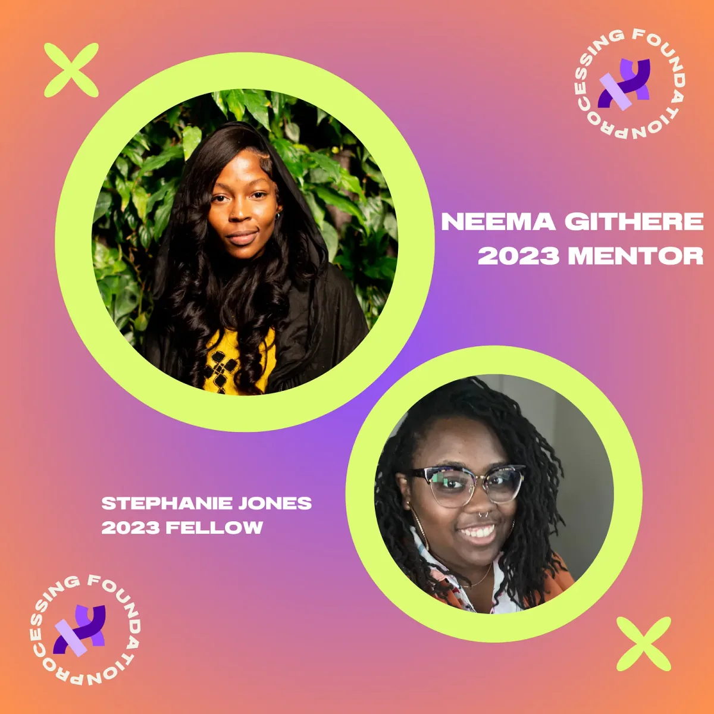
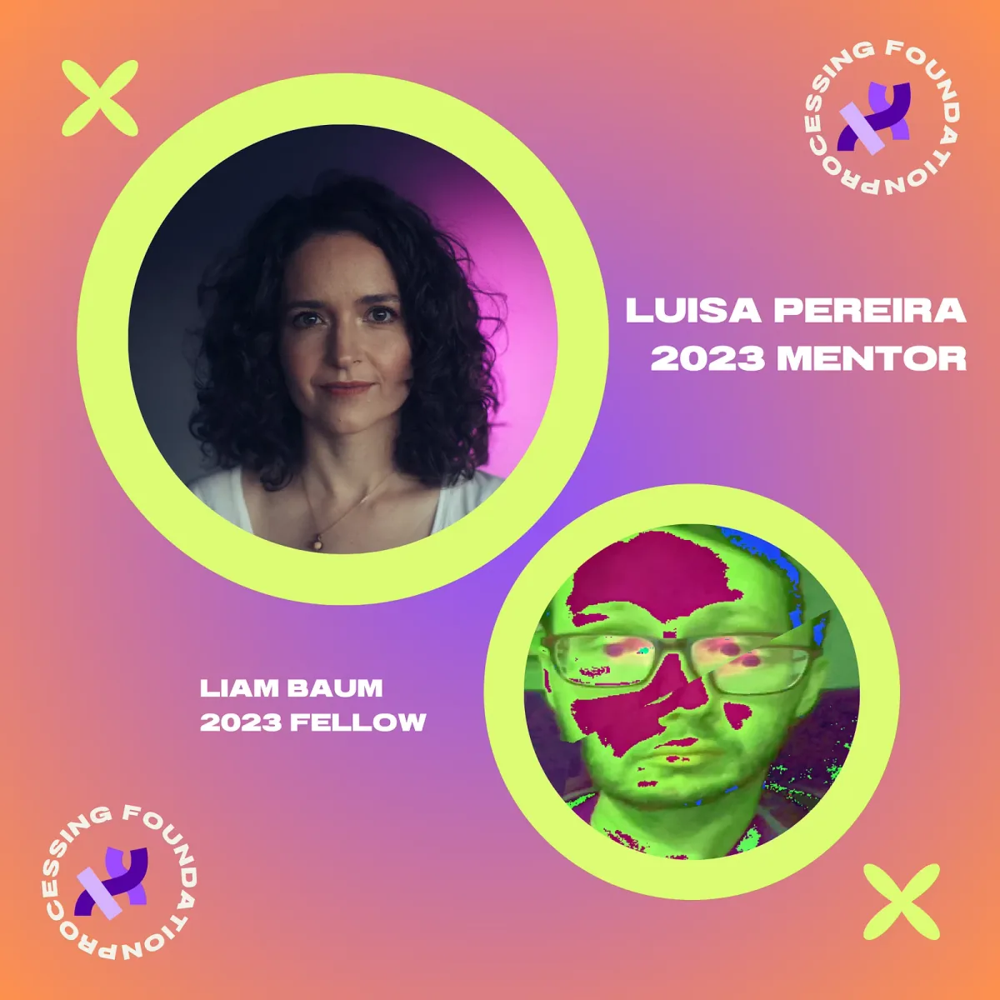
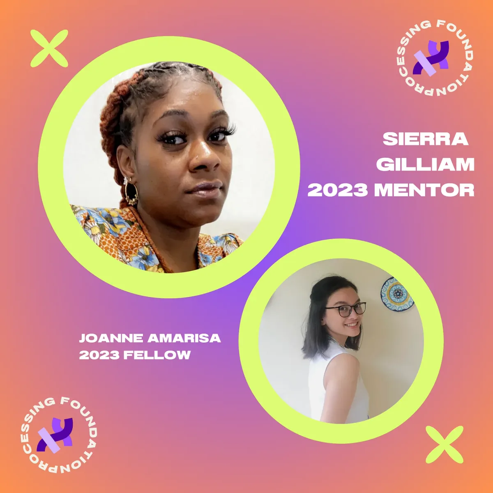
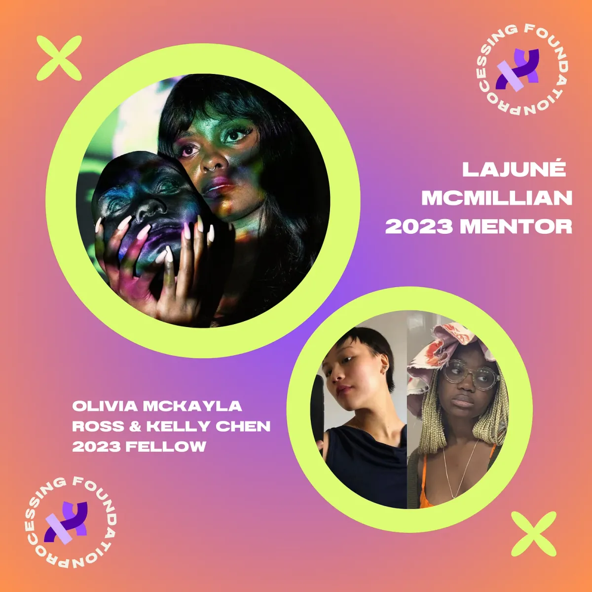
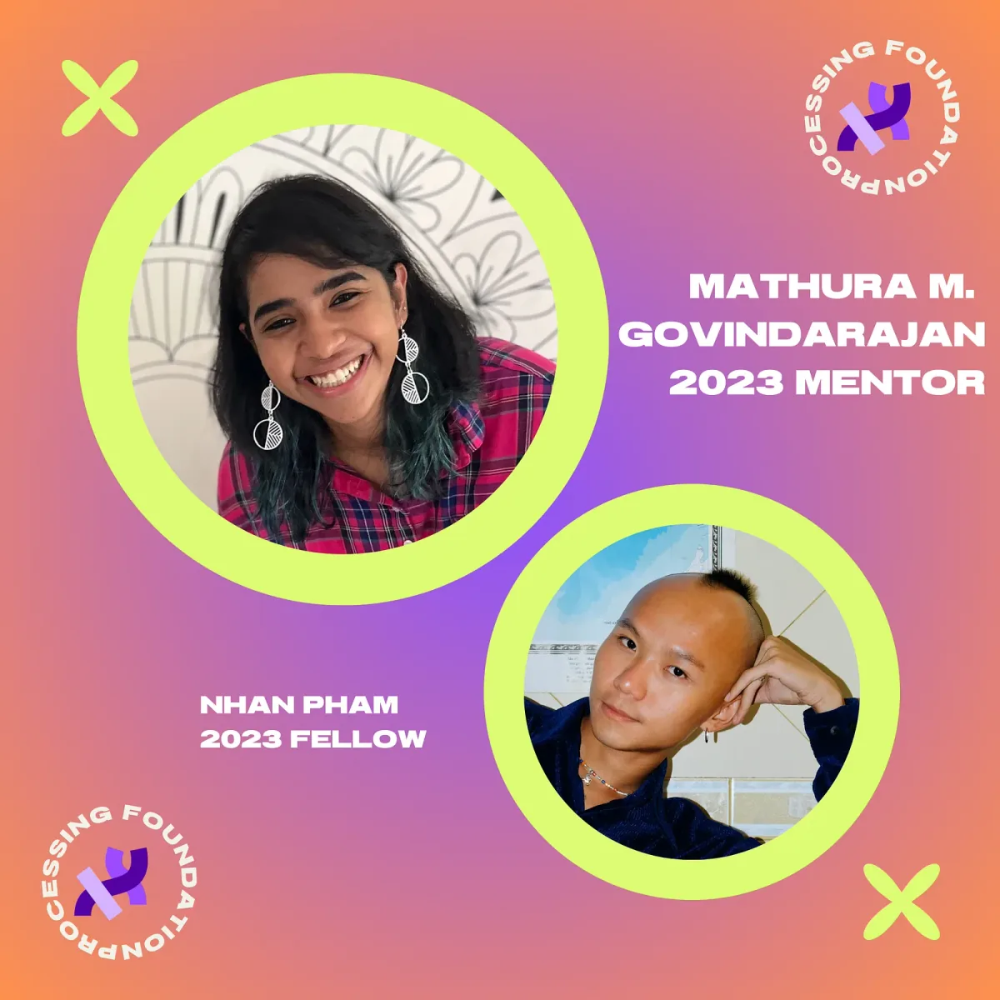
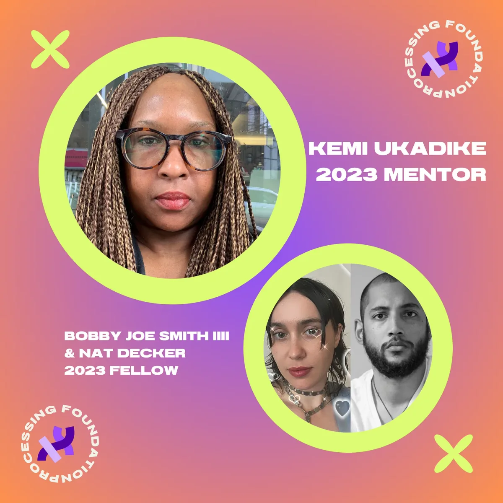
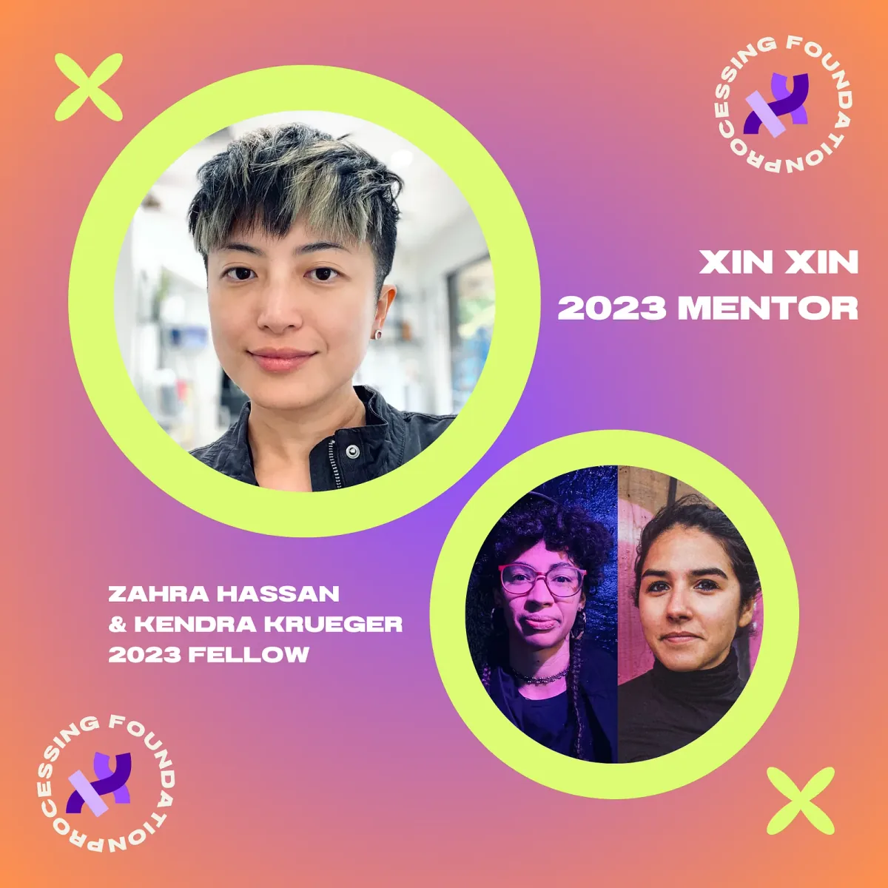
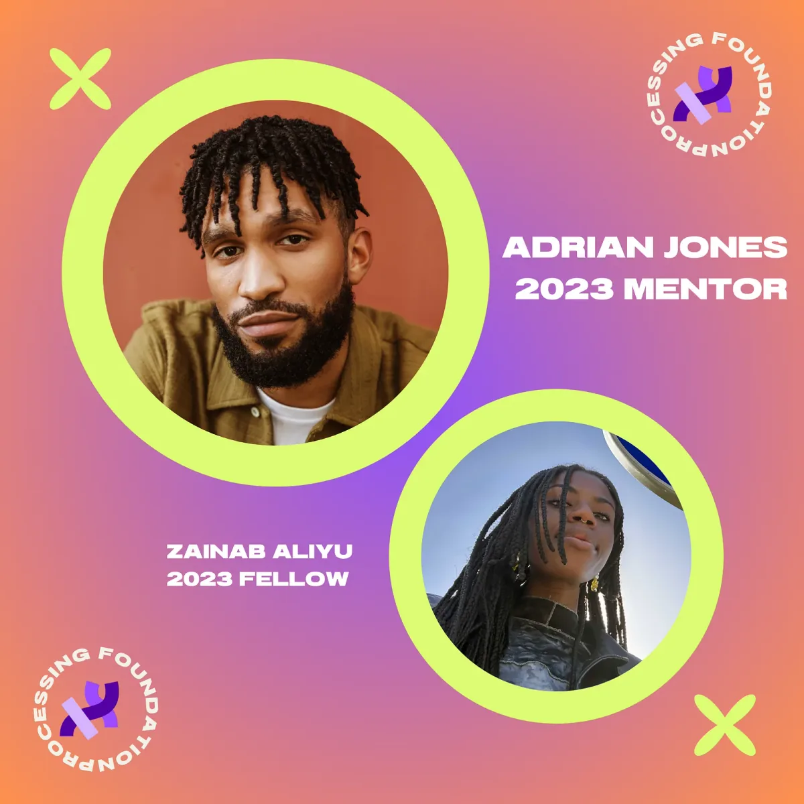

We are excited to announce the 2023 Processing Foundation Fellowship mentors! This is our eighth year running the fellowship program and we are proud to receive support from the National Endowment for the Arts.

We received **a record-breaking 241 applications** this year, and were able to award five fellowships and three teaching fellowships. Special thanks to our new Program Manager, Tsige Tafesse, who made this work possible! We were also able to provide financial support in the form of a Processing Foundation Fellowship Grant to 8 finalist projects.

Continuing with previous years, we asked applicants to address at least one of five Priority Areas that, to us, feel especially important for technology and coding right now: Accessibility, Internationalization, Continuing Support, AI Ethics and Open Source, and Ecology and Environment. We are also supporting Teaching Fellows, who will develop teaching materials that will be made available for free, and are oriented toward community learning.

We can’t wait to see the vital work that this amazing group makes over the next few months!

*For an archive of our past Fellows,* [*click here*](https://processingfoundation.org/fellowships)*, and to read our series of articles on the Fellowships,* [*click here*](https://medium.com/@ProcessingOrg)*.*

*A group image of our 2023 Processing Foundation Fellowship Mentors*

*A graphic image of our fellowship mentor Neema Githere, and fellow Stephanie T. Jones.*

#### Neema Githere (they/them) | Mentor for Stephanie Jones

Neema Githere (b. Nairobi, Kenya) is a writer, artist, and grassroots theorist whose work explores love and indigeneity in a time of algorithmic debris. Having dreamt themselves into the world via the internet from an early age, Githere’s work prototypes relationality-as-art through experiments that span community organizing, social design, travel, and image-making. Githere is a 2023–24 Technology & Racial Equity Practitioner Fellow at the *Digital Civil Society Lab* at Stanford University, where they are working on a project entitled *“Data Healing: A Call for Repair”.* There work is available at [https://www.findingneema.online](https://www.findingneema.online)

Follow Neema Githere on [Instagram](https://www.instagram.com/datahealing/) and [LinkedIn](https://www.linkedin.com/in/ngithere/?original_referer=https%3A%2F%2Fwww.findingneema.online%2F).

**Stephanie T. Jones’s ‘Black Life in the Age of AI’ Project Description**

Stephanie T. Jones is broadly interested in thinking about the role of AI in replicating and producing Black death, and the potential use of AI in projects of Black Life. During the Processing Fellowship, they will be producing a syllabus entitled, ‘*Black Life in the Age of AI*.’ This syllabus will contain multi-media approaches, from research articles, news publications, to podcasts, art, and videos. As a part of this work, they will have an AI and Black Life Art Gallery hosted on the site. This will be filled by accepting submissions from those who partake in the syllabus and seeded by the art they produce while designing this syllabus. This site is meant to be accessible not only in designing with disabled people in mind but also in terms of free content and having a variety of ways to engage in the topic. In addition to this, they will conduct interviews with prominent Black thinkers within the AI community. These interviews entitled, ‘Meditations on AI’, will invite participants to reflect and share their thoughts. In addition to this, it is important for us to reconsider narratives around fear, towards narratives of possibility, when building these systems. They hope to build community with others interested in this work and help shift imaginaries on possibilities for AI.

*A graphic image of our fellowship mentor Luisa Pereira, and fellow Liam Baum.*

#### Luisa Pereira | Mentor for Liam Baum

Luisa Pereira is a Brazilian-Uruguayan artist and systems engineer based in New York. A composer of musical systems, she has created sculptural, immersive instruments, a series of intelligent synthesizers, and year-long, ever-evolving compositions that respond to the New York sky.

Pereira has exhibited work widely, including the Museum of Contemporary Art in Santiago de Chile, the New Museum’s art and technology incubator in New York, FILE in São Paulo, Loop Summit in Berlin, and Bienal Kosice in Buenos Aires. A frequent collaborator, she has created a range of boundary-pushing musical installations and experiments in New York City, working on projects by musicians like Björk, St. Vincent, Julianna Barwick and Little Dragon. Pereira is Assistant Arts Professor of Interactive Telecommunications at Tisch School of the Arts, New York University. She has developed curricula for the NYC Department of Education and the Processing Foundation, and also taught in Shanghai, Berlin and Montevideo. Her work is available at [https://www.luisapereira.net](https://www.luisapereira.net)

Follow Luisa on [Twitter](https://twitter.com/luisa_ph).

**Liam Baum’s ‘p5.Sound Library Curriculum Development’ Project Description**

This project is a continuation to existing p5.Sound Library curriculum developed by previous Processing Teaching Fellows, [Layla Quinones](https://medium.com/processing-foundation/interview-with-2019-teaching-fellow-layla-quinones-3039f10ae761) and [Luisa Pereira](https://medium.com/@luisa.ph/making-your-own-musical-instruments-with-p5-js-arduino-and-webmidi-2422b9596791). It will explore the possibilities beyond the p5.Soundfile object into other areas of the sound library including Oscillators, Synths and Envelopes. This curriculum aims to teach about both computer science concepts and musical characteristics, using each area as a tool to understand the other. The lessons in this curriculum will focus on creating projects which highlight user interactivity to engage students in music making experiences through coding. A range of musical reference points will be incorporated to offer a more diverse representation of sound examples. There will also be significant effort put into integrating new features and highlighting developments being made with the p5.Sound Library through the work of p5.Sound Fellow [aarón montoya-moraga](https://medium.com/@ProcessingOrg/announcing-the-2023-p5-sound-fellow-aar%C3%B3n-montoya-moraga-7613450902f6). He hopes to create more entry points to creative coding for teachers, students, and artists who work in the medium of sound.

*A graphic image of our fellowship mentor Sierra Gilliam, and fellow Joanne Amarisa.*

#### Sierra Gilliam | Mentor for Joanne Amarisa

Sierra Gilliam is currently a Ph.D. candidate in the department of Learning Sciences at Georgia State University. Previously, she was an AP computer science teacher and founded the first drone technology program for Guilford County Public Schools in Greensboro, NC. She received her B.S. in Environmental Science and M.S. in Earth Science from North Carolina Central University. She reigns from our nation’s capital Washington, DC and is extremely passionate about computer science education and expanding access to computer science to youth and adults, particularly those living and working in historically underserved communities like the ones she grew up and has worked in. Her research interests are in computer science education with a particular focus on using Interaction Geography and Geographic Information Systems (GIS) to develop and study new teaching practices that support and broaden access to computer science learning and teaching. She hopes to teach, mentor, and continue to be a service to young intellectuals, guide them to delve deeper into complex computational learning strategies, and help them to find their voice and purpose. Sierra is also a mother to three sweet, handsome boys. She enjoys traveling, family outings and cheering her boys on at sporting events. Her work is available at [https://sway.office.com/QkZAaq9RIQlUg3dC?ref=Link](https://sway.office.com/QkZAaq9RIQlUg3dC?ref=Link)

Follow Sierra on [Twitter](https://twitter.com/Si_Gilliam).

**Joanne Amarisa with Mei Leong, Septia Nurmala, Echa Amalia, Arshi Saleh, and Larissa Serafina’s, ‘The Data Garden Project’ Project Description**

‘The Data Garden Project’ is a growing resource and learning community for young women who want to build their first data visualization artworks using Processing and p5.js.

Their mission is to build a resource for educators of diverse linguistic and cultural backgrounds to introduce creative coding and data storytelling to their classrooms and communities. By embarking on a Data Garden Project, a young person is invited to find and gather data from their own lives — such as the food in their pantry, Spotify playlists, text messages, interactions with friends or family — and visualize it by learning the basics of creative coding and drawing using p5.js.

As a result, young people discover how to create compelling and interactive data stories of who they are, using Processing as their data visualization canvas and tool. Part coding class, part data “treasure hunt”, part collective journaling activity, this project invites young people (women especially) into a safe space of intimate storytelling, finding snippets of who they are and scrapbooking it into their own creative coded artworks to share with a supportive group of peers. She hopes that we may work towards a future where young women are given more opportunities to grow, not only so they can learn to code, but also that through coding, they may be equipped to rally community, to teach, to share their stories, and to lead.

*A graphic image of our fellowship mentor LaJuné McMillian, and fellows Olivia McKayla Ross and Kelly Chen.*

#### LaJuné McMillian | Mentor for Olivia McKayla Ross & Kelly Chen

LaJuné is a Multidisciplinary Artist, and Educator creating art that integrates performance, extended reality, and physical computing to question our contemporary forms of communication. They are passionate about discovering, learning, manifesting, and stewarding spaces for liberated Black Realities and the Black Imagination. LaJuné believes in making by diving into, navigating, critiquing, and breaking systems and technologies that uphold systemic injustices to decommodify our bodies, undo our indoctrination, and make room for different ways of being.

LaJuné has had the opportunity to show and speak about their work at Pioneer Works, National Sawdust, Tribeca Film Festival, Times Square, and Art & Code’s *Weird Reality*. LaJuné was previously the Director of Skating at Figure Skating in Harlem, where they integrated STEAM and Figure Skating to teach girls of color about movement and technology. They have continued their research on Blackness, movement, and technology during residencies and fellowships at the Jerome Hill Artist Fellowship, Eyebeam, Pioneer Works, NYU ITP, Barbarian Group, and Barnard College. Their work is available at [https://laja.me](https://laja.me)

Follow LaJuné on [Instagram](https://www.instagram.com/_lovelaja/) and [Twitter](https://twitter.com/_lovelaja).

**Kelly Chen and Olivia McKayla Ross’ ‘CYBERNETIC THEATER COMPANY-IN-A-BOX’ Project Description**

Olivia McKayla Ross and Kelly Chen view performance as a system that can be modified, adapted, and reconfigured, creating a dialogue between the performer and the audience and blurring the boundaries between the two. For their proposal for the Processing Teaching Fellowship, they’re developing ‘CYBERNETIC THEATER COMPANY-IN-A-BOX’, a collection of performance scores, drama games, and other curriculum materials for youth that expand what we commonly imagine when we think of “open-source software arts education.”

They are looking to combine creative coding with experimental theater, in order to challenge the notion of computer science education as the development of functions, products, and applications motivated by capital and privatization. Many AP Computer Science students can achieve perfect scores on the exam without understanding fundamental ideas in computing, like computer memory, the graphics processing pipeline, computer networks, file systems, and data representation. However, exploring the implications and significance of these concepts sheds light on the design of our networked society. How can Processing’s open source tools and drama-based learning help youth navigate these concepts for (potentially) the first time? It allows students to envision programming as a part of their daily world and as a creative tool, rather than just software and hardware that they are subject to.

They view the Cybernetic Opera Company as a “test kitchen” for critical research and connection between electronics and performance, and a gateway for new models of engagement with open source arts. They hope that their summer fellowship with the Processing Foundation can help lay the groundwork for this new curriculum. Kelly Chen hopes to work with youth with a range of familiarity with computer science, theater, and critical theory, and to see how they interact with technology in their everyday lives. Olivia and Kelly hope that instead of pressuring to integrate the already abstracted language of computer science into the arts, they can bring out the ways in which computational concepts already exist in our everyday movements and how performing those movements can be a kind of art.

*A graphic image of our fellowship mentor Mathura M. Govindarajan, and fellow Nhan Pham.*

#### Mathura M. Govindarajan | Mentor for Nhan Pham

Mathura is currently a creative technologist in Bangalore, India. She runs a non profit called ‘Paper Crane Lab’, which focuses on making STEM (Science, Technology, Engineering, Mathematics) more accessible and affordable. She was a fellow and graduate student at New York University, in the Interactive telecommunication Program, and she is now a guest faculty at NYU. She completed her undergraduate studies from the National Institute of Technology, Surathkal, India in Electronics and Communication Engineering. Her current interests revolve around education, fabrication, coffee, and messing around with maps. Overall, she is very enthusiastic when it comes to learning new things. More so, she’s always looking out for things that help her bridge the gap between art, science, and technology.

Follow her on [Instagram](https://www.instagram.com/mathuramg/) and [Twitter](https://twitter.com/mathuramg).

**Nhan Phan’s ‘CodeSurfing’ Project Description**

‘CodeSurfing (CLB Lướt Code)’ is a backyard-science club for Vietnamese to study machine learning through p5.js. The club connects Ho Chi Minh City’s creative community with local young students to make impactful designs for the coastal environment of Vietnam. ‘CodeSurfing (CLB Lướt Code)’ is a backyard science club in Vietnam that focuses on studying machine learning through p5.js. The club aims to teach artists, designers, and engineers how to use programming for their creative pursuits, enabling them to create impactful designs for the local environment.

This is the first step toward building a p5.js community in Vietnam. In 2024, CodeSurfing plans to run a summer camp to connect the creative community of Ho Chi Minh City with local young students in Binh Thuan. They will teach high school students to program and together design applications to alleviate the effects of climate change in the area.

CodeSurfing hopes to make a lasting impact on the Vietnamese youth community and coastal environment through education and technology. The Earth is getting hotter and so is the creative scene in Saigon. Nhan hopes this young community can code as intense as the beat of Vinahouse, up-tempo the whole scene, break free from social norms, from the shadows of warfare, from the overwhelm of superficial visual and head to a new dynamic spectrum where their works can bridge across domains, reach beyond boundaries, and transform the community that we are living in collectively.

*A graphic image of our fellowship mentor Kemi Ukadike, and fellows Bobby Joe Smith III & Nat Decker.*

#### Kemi Ukadike | Mentor for Bobby Joe Smith III & Nat Decker

Kemi is presently the Head of Artist Initiatives and Inclusion at Eyebeam. She identifies as a black, disabled mother (of two teenagers), influencing her work and artistic practice. She is passionate about supporting and empowering artists from underrepresented communities. As an art practitioner, she focuses on digital accessibility and critically looks at interactive spaces through universal design.

At Eyebeam, she designs, plans, organizes, and supports artists and alums through fellowships, residencies, and public engagement. She also researches and ensures programs and events are accessible to artists, alums, and the community.

She is creating an open-source digital accessibility syllabus, a11ysyllabus.site, that Eyebeam and the Processing Foundation have supported. Lately, her thoughts have been on interrogating the generative Artificial Intelligence space and ledger-based spaces to examine how usable they are for all audiences. In particular, many artificial intelligence applications are not released with disabled users in mind. She hopes we can examine this space and write open-source code to expand these tools. Her work is available at [http://itp.blog.afrikatoday.com](http://itp.blog.afrikatoday.com)

Follow her on [Instagram](https://www.instagram.com/kemiukadike/) and [LinkedIn](https://www.linkedin.com/in/adekemisijuwade).

**Bobby Joe Smith III and Nat Decker’s ‘Sketching Access’ Project Description**

Bobby Joe Smith and Nat Decker will collaboratively gather research material as a community resource and foundation for the iterative contributions of future access fellows. They propose that this repository of curated citations, syllabi, practical/technical strategies, and educational material about access be made available on the Processing and p5.js website, linked from the access statement. These resources can support ongoing organizational commitments and future revisions to the access statement.

Finally, they propose a collaboration with Qianqian Ye and others on a 2023 p5.js Access Day, using our research and community connections to inform a new iteration of speaker panels and workshops. This programming would generate space to build more access-centered community and resources, and experiment with some of the new ideas and pedagogical techniques they will develop to support the Access Fellowship. They hope to create a sustainable, robust, and deeply rooted program within the Processing Foundation capable of generating new understandings and implementations of accessibility. They wish to be informed and inspired by the diverse needs, skills, and desires of the Processing and p5.js communities. They hope to help the Processing Foundation and p5.js actualize their commitment to the liberatory practices of accessibility.

*A graphic image of our fellowship mentor Xin Xin, and fellows Zahra Hassan & Kendra Krueger.*

#### Xin Xin | Mentor for Zahra Hassan & Kendra Krueger

Xin Xin is an artist currently making socially-engaged software that explores the possibilities of reshaping language and power relations. Through mediating, subverting, and innovating modes of social interaction in the digital space, Xin invites participants to relate to one another and experience togetherness in new and unfamiliar ways.

As an artist, their work has been exhibited internationally at Ars Electronica, Eyebeam, DIS, Kunstverein Wolfsburg, and the Gene Siskel Film Center. They were an Eyebeam Rapid Response for a Better Digital Future Fellow and a Sundance Art of Practice Fellow. As an organizer, Xin co-founded voidLab, a LA-based intersectional feminist collective dedicated to women, trans, and queer folks. They were the Director for Processing Community Day 2019 and they serve on the Processing Foundation Board. Their work is available at [https://xin-xin.info](https://xin-xin.info)

Follow Xin on [Instagram](https://www.instagram.com/xinemata/).

**Kendra Krueger and Zahra Hassan’s ‘4LoveandScience: An inclusive STEM pedagogy toolkit’ Project Description**

Kendra Krueger and Zahra Hassan are going to address the core issues of inaccessibility in today’s dominant science practices and point to alternatives of doing science otherwise. They move environmental practice to the center of our work as an interdisciplinary endeavor to unite different fields and collaboratively find solutions for a sustainable future. By employing the arts, humanities, and embodied practices, they are going to continue building these bridges and sharing their lessons with the world. In this vein, they are committed to developing an art-informed open-source teaching module for STEM that emphasizes non-extractive technologies. Such technologies move with the natural patterns and systems of the universe instead of disturbing, interrupting, or extracting them. With an emphasis on creating new tools for research and experimentation that help STEM practitioners and communities process information, we are foregrounding practices that are based on movement, meditation, improvisation, and employing data collection and pattern recognition through the body and the senses. As part of this teaching and learning module, they will focus on ways of leading classrooms and labs to a liberatory practice that is interdisciplinary, place-based, and acknowledges many knowledges as equally important to fight for a future that sustains the ecology. At the end of this process that includes workshops, exchanges, and case studies, they will create an open-source tool kit accessible through a website that includes how to address place-based knowledge (PBK) in everyday STEM practice.

Their goal is to build an inclusive STEM tool kit, an open-source learning tool to make STEM more accessible for learners and practitioners around the world. The aim of inclusive STEM pedagogy is to engage and uplift students from underrepresented backgrounds, effectively seeing themselves as future scholars and practitioners in the field. Their philosophy is rooted in understanding science through patterns, play, and the lens of storytelling. Approaching science through the lens of story is a method to make the sciences more accessible and invite various communities into these fields. By employing artistic practice, ancestral modes of storytelling, and tools borrowed from various fields and practices such as ‘Theater of the Oppressed’, this pedagogy seeks to reach a broad variety of communities, spark curiosity and enthusiasm for STEM, and make people move closer to a multiplicity of science approaches.

*A graphic image of our fellowship mentor Adrian Jones, and fellows Zainab Aliyu*

#### Adrian Jones | Mentor for Zainab Aliyu

Adrian Jones is a creative technologist whose practice is shaped by a commitment to those living in society’s margins. After earning a Bachelor’s degree in Electrical Engineering from Harvard University, his work in software development led him towards exploring the power of speculative imagination and intergenerational storytelling within digital spaces.

Currently, he is developing Looking Glass, an app-based archive of Black life in Pittsburgh. In January 2023, he was named Logic School’s inaugural Community Technologist. His work is available at [https://looking-glass.space](https://looking-glass.space)

Follow Adrian on [Instagram](https://www.instagram.com/ajarian/) and [Twitter](https://twitter.com/ajarian_).

**Zainab Aliyu’s ‘freedom is a durational practice’ Project Description**

Drawing upon Saidiya Hartman’s notion of the chorus in *‘Wayward Lives, Beautiful Experiments*’, the piece surfaces “wayward” compositions that distort the colonial residue and remnants of empire in our ongoing struggle for collective liberation, as evidenced in the historical effigies of national freedom songs across the African diaspora, many still imbued with chauvinistic and patriarchal constructs. The piece is a computationally generated ensemble composed from 80+ anthems, protests, hymns and freedom songs from the diaspora. As a durational, non-linear, browser-based program presented in the form of an experimental film, it is infinitely playing, and resets at the beginning of every hour. The sound is composed from a living ethno-musicological archive Zai is assembling, and will continue to assemble, of afro-diasporic instruments across Africa, the Caribbean and the Americas, and she leverages a variety of computational methods to defamiliarize the patriarchal constructs of their celebratory language; to alter them just enough to render them visible again.

We’re so excited to see what our Processing Fellows will work on this summer! Thank you to our amazing cohort of mentors in the field that support this work. We hope to keep supporting new artists, designers, activists, educators, engineers, researchers, coders, and collectives, year after year. Want to support the Processing Foundation in this work? [Donate here](https://processingfoundation.org/donate) to support our ecosystem of open source contributions!
