The GSOC program aims to get undergraduate students involved in open-source software by providing a summer stipend to work on a project of their choice. This year, students submitted proposals to work on an aspect of Processing, p5.js, Processing.py, and Processing for Android. We were able to offer 11 positions from a field of 90 applications.

Each student is paired with a mentor from the Processing Foundation community, many of whom are alumni from the GSOC program or Fellowship Program, who will guide their efforts over the summer. The students’ work kicks off at the beginning of June, and will continue throughout the summer. Stay tuned for updates!

---

#### Ghales Trilo

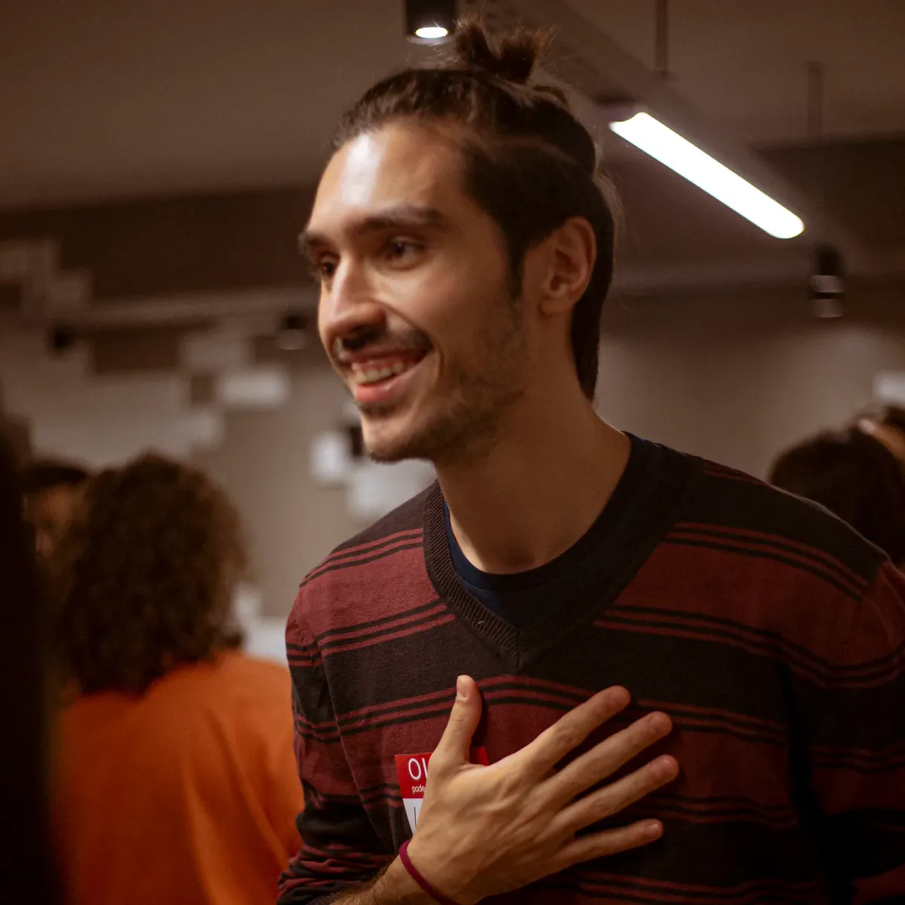

*“I’m a 24-year-old software developer, musician, and digital creator from Brasilia (Brazil), and a sophomore at the University of Brasilia. I’ve been a full-stack engineer at [Ribon](https://home.ribon.io/en/) for a year and a half, and today act as a web freelancer. I compose music and create art with code, using TidalCycles and p5, and most projects can be found on my [homepage](https://ghales.top). You can find me on [github](https://github.com/ghalestrilo) and [linkedin](http://linkedin.com/in/ghalestrilo), too.”*

Ghales Trilo will be working on improving the experience of the web editor on phones and tablets by detecting, validating, studying, and providing solutions for weak points on the mobile and tablet experience. Ghales will be mentored by [Cassie Tarakajian](https://cassietarakajian.com/), who is the current lead maintainer of the p5.js Web Editor.

---

#### **Inhwa Yeom**

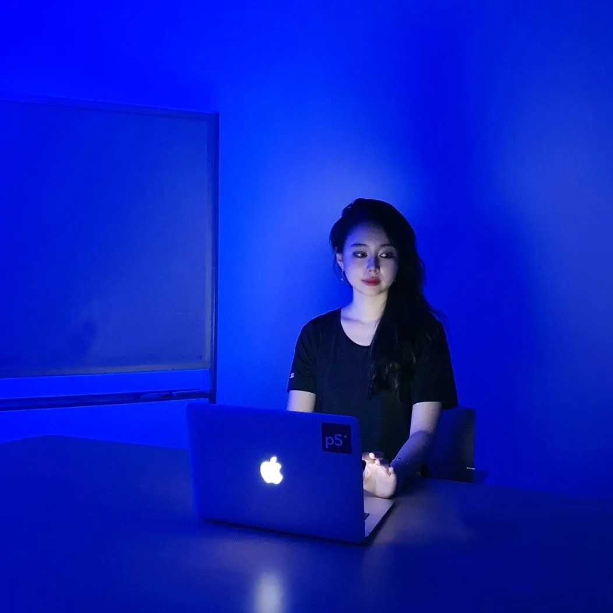

*“I’m a M.S. student of Culture Technology and research assistant of UVR Lab at KAIST. In my research projects, I design, develop, and evaluate AR/VR systems for collaborative creations and learning, mainly in consideration of people with less familiarity or accessibility to 3D interfaces and interactions. Please feel free to contact me via my [linkedin](https://www.linkedin.com/in/yinhwa/), [github](https://www.github.com/yinhwa), and [instagram](https://www.instagram.com/yinhwa.art) :).”*

Inhwa Yeom will be reaching out to educators around the world, who are aged 50 years old and up, with the aim to contribute to documenting, showcasing, and sharing teaching experiences, specifically by re-using the existing features of p5js.org. She will be mentored by [Qianqian Ye](http://www.qianqian-ye.com/), who was a Processing Foundation Fellow in 2019. With Seonghyeon Kim, Inhwa was a 2020 Processing Foundation Fellow.

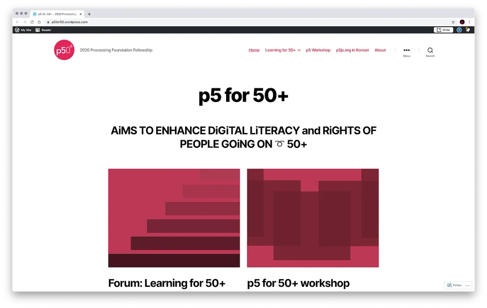

**In progress p5 for 50+ website.**

---

#### Omar Verduga

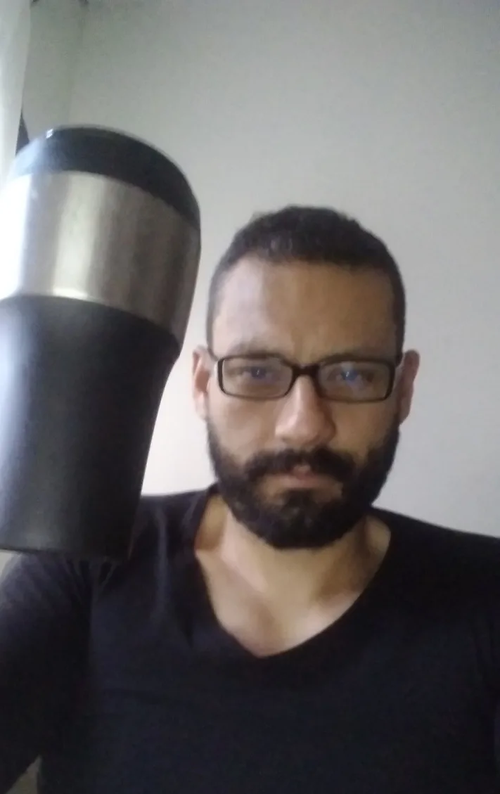

*“I’m a Mexican based in London. I did my Bachelor’s and Master’s Degree in Computer Science, and I’m currently finishing my PhD in Experimental Psychology. I have been involved in games, interactive art, academia, and other random stuff. You can find me on [Github](https://github.com/oruburos) and [Linkedin](https://www.linkedin.com/in/omar-verduga-8159939/).”*

Omar Verduga will be improving and expanding the Spanish translation of the p5.js web editor and documentation. This project will include translations for the reference and examples. Omar will be mentored by [Andrew Nicolaou](https://andrewnicolaou.co.uk/), who was a Processing Foundation Fellow in 2017.

---

#### **Akshay Padte**

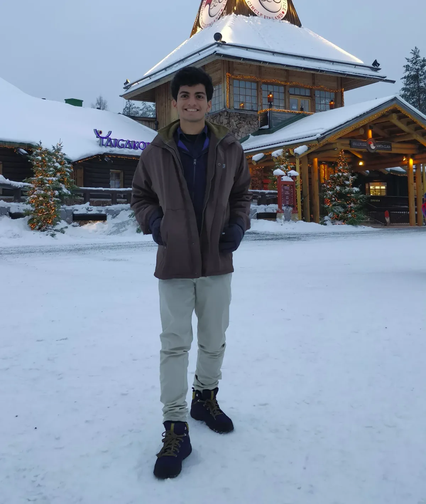

*“I am a 20-year-old undergraduate student of Computer Engineering based in Mumbai, India. I like building small and medium projects for fun and I also enjoy travelling to distant places for hackathons, CTFs, and other contests (pictured: me in Finland, originally for a hackathon). This is my first time in Google Summer of Code and I am thrilled to be working on this project on p5, a library that I have come to love so much! You can reach me on my [Linkedin](https://www.linkedin.com/in/akshay-padte/) and [Github](https://github.com/akshay-99).”*

Akshay Padte will be making p5.js’s Friendly Error System even friendlier. This project aims to extend the functionality of the FES, by adding new features and fixing existing issues. Akshay will be mentored by [Stalgia Grigg](https://stalgiagrigg.name/), who was a 2019 p5.js Fellow.

---

#### **Luis Morales-Navarro**

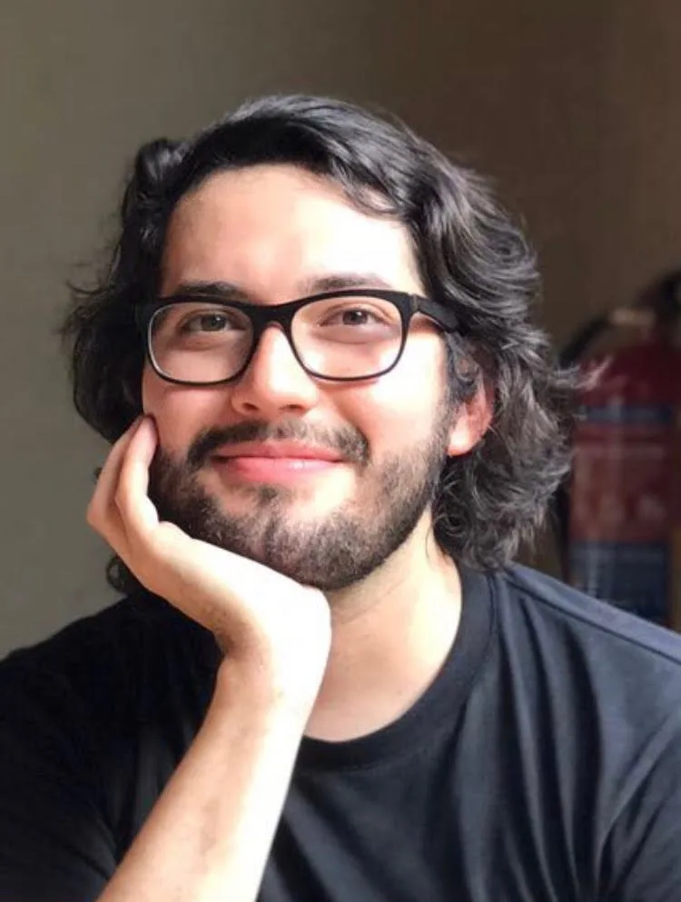

*“I am a graduate student in the Learning Sciences and Technologies program at the University of Pennsylvania. At Penn, my current research explores productive failure and the development of growth mindset through open-ended physical computing bug design and debugging activities. I joined the p5.js accessibility team in 2017 and together with [Claire and Mathura](https://www.youtube.com/watch?v=cgkbPDI6eME) built the [p5.js accessibility add-on](https://medium.com/processing-foundation/making-p5-js-accessible-e2ce366e05a0). I’m excited to continue working with Kate on this project! For more follow me on [twitter](https://twitter.com/lmhyphenn) and [github](https://github.com/lm-n).”*

Luis Morales-Navarro will be making p5.js more accessible by creating a describe() function that allows users to write their own text-based canvas descriptions. He will be updating, cleaning, simplifying, documenting, and preparing the p5.accessibility.js add-on for its integration into the p5.js library. Luis will be mentored by [Kate Hollenbach](http://www.katehollenbach.com/), with [Claire Kearney-Volpe](http://www.takinglifeseriously.com/about.html) and Lauren McCarthy as advisors. This project continues work to make p5.js accessibility that Luis has contributed to for several years, including as a Processing Foundation Fellow in 2018.

---

#### **Ziyao Zhang (Mark)**

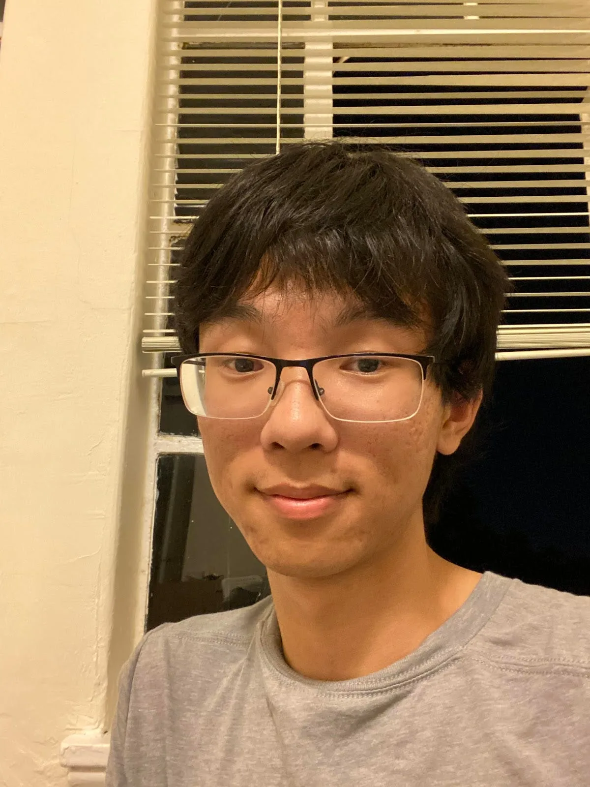

*“I am a third-year undergraduate studying computer science at UC Berkeley. In my spare time, I like clicking circles (aka playing osu) and wrangling with computer graphics. Find me at [https://markz.sh](https://markz.sh), which has a link to my Github, blog, and possibly some other thing to be added in the future.”*

Ziyao Zhang (Mark) will be working to improve p5.py, including standardizing its API, and implementing some new features in 3D mode. Mark will be mentored by [Abhik Pal](https://abhikpal.github.io/) and [Arihant Parsoya](https://github.com/parsoyaarihant).

---

#### **Juan Lee**

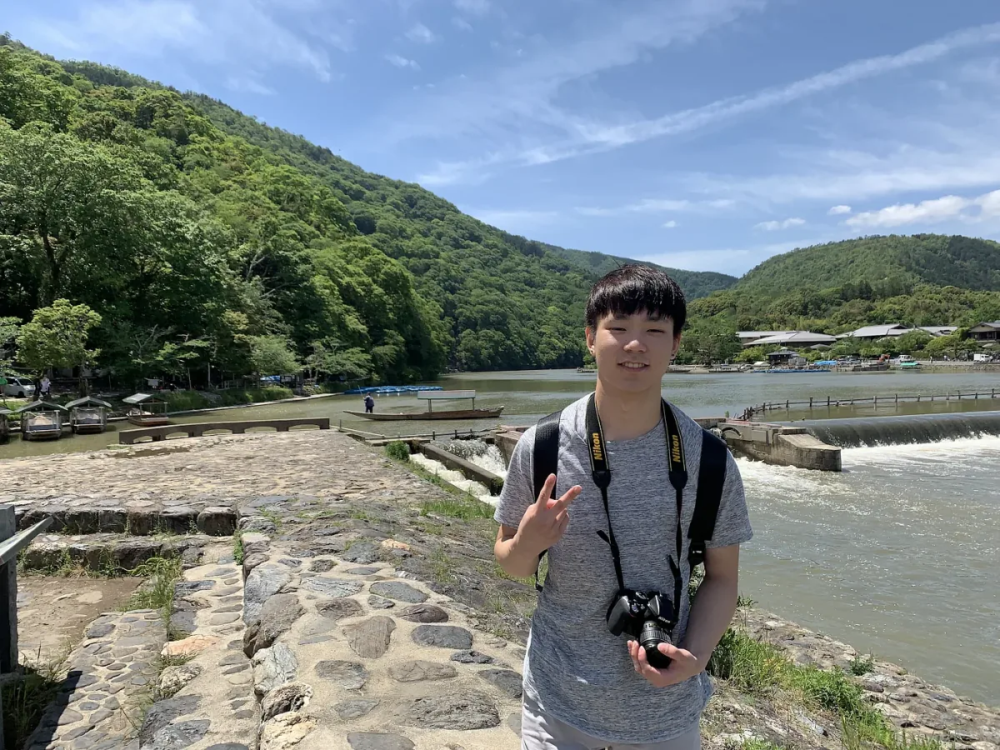

*“Hi, I am a 23-year-old Korean student who is currently pursuing a Bachelor’s Degree in Computer Science at the University of British Columbia. This is my first time participating in Google Summer of Code and also my first time contributing to open source code. I am excited to begin working on expanding the Swift Processing Library and working with Jonathan over the summer.”*

Juan Lee will be working to bring the camera functionality and 3D primitives to the Swift Processing Library. Juan will be mentored by [Jonathan Kaufman](https://github.com/jjkaufman).

---

#### Aditya Rana

*“I am a 21-year-old student software developer from India, currently pursuing B.Tech from NIT-Trichy, India. Interested in building applications that make day-to-day life easy, recently developed a keen interest in Operating Systems and Kernels. This is my first time in Google Summer of Code, and I am very excited to be a part of the software that I have been using for a long time.You can find me on [Linkedin](https://www.linkedin.com/in/adityarananitt/) and [GitHub](https://github.com/ranaaditya).”*

Aditya Rana will be working on the migration of Android-Processing mode and Migrating Groovy based Gradle System to Kotlin, and implementing the multiplatform library in iOS for as many as possible stubbed methods. Aditya will be mentored by Syam Sundar K, who was a GSOC student with Processing Foundation in 2018.

---

#### **Yukie Nomiya**

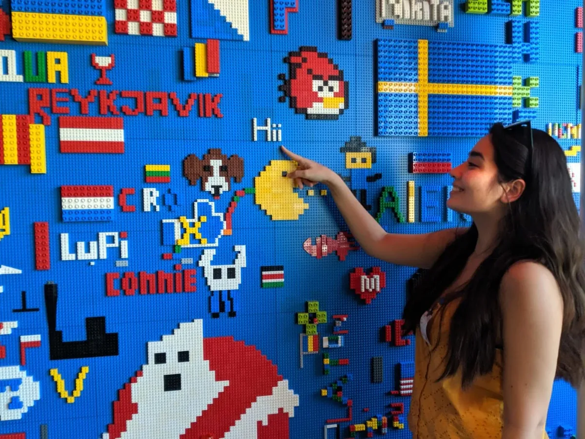

*“I’m a 22-year-old half Italian, half Japanese student and language enthusiast based in Rome. I’m currently pursuing my Bachelor’s Degree in Computer Science and starting to explore the world of open source. This is my first time participating in Google Summer of Code, and I’m beyond excited to work on the p5.js website. You can find me on [LinkedIn](https://www.linkedin.com/in/yukie-nomiya/) and [GitHub](https://github.com/yukienomiya).”*

Yukie Nomiya will be making the internationalization process of the p5.js website easier and more accessible to contributors, while also simplifying the maintenance of the translation. Using these implementations, they will add Italian to the languages supported by the p5.js website. Yukie will be mentored by [Evelyn Masso](https://outofambit.com), who was a p5.js Fellow in 2019.

---

#### **Connie Liu**

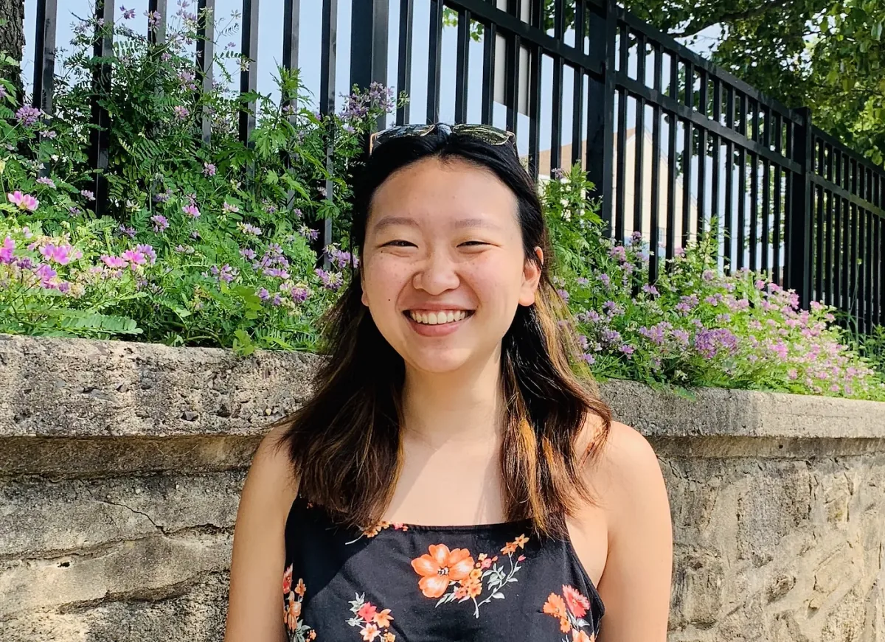

*“I’m an upcoming sophomore at Cornell University, pursuing a major in Information Science (with a concentration in User Experience and Interactive Technologies) and a minor in Computer Science. I hope to one day be a creative technologist. p5.js was what first opened my eyes to the world of creative coding. It’s my first time contributing to open source with Google Summer of Code and I’m beyond excited to contribute to the p5.js showcase. [Portfolio Website](https://connieliu0.github.io/#/) and [Linkedin](https://www.linkedin.com/in/connieliu23/).”*

Connie Liu will be expanding the p5.js showcase to allow users to be able to easily search for inspiration by specifying projects that use a specific library or function, with the aim to inspire users by the great diversity in p5.js’s community. Connie will be mentored by [Joey Lee](https://jk-lee.com/) and [Yining Shi](http://1023.io/), both of whom are mentors to 2020 ml5.js Processing Foundation Fellows.

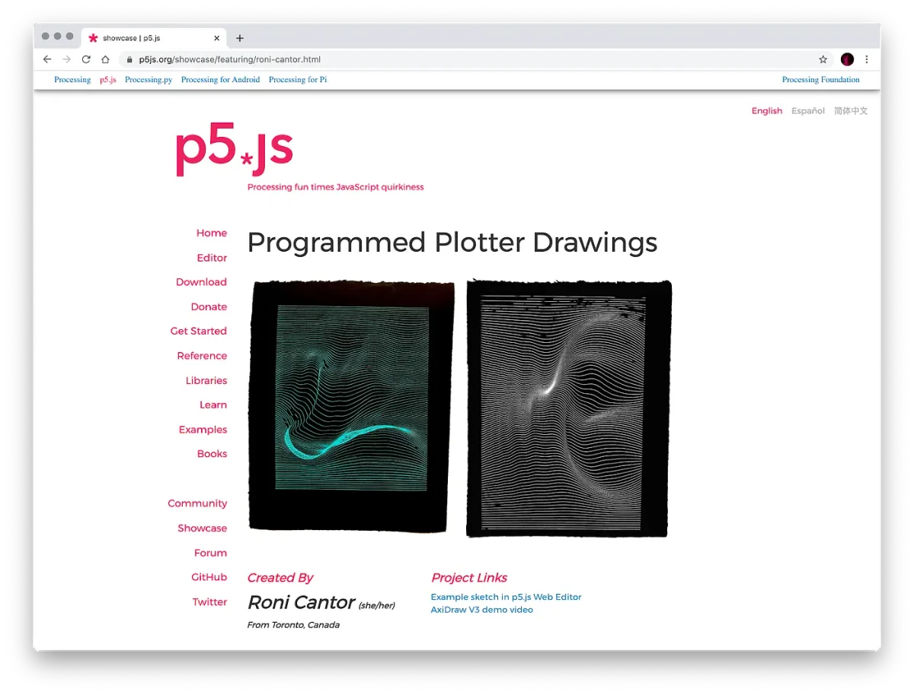

**Current p5.js Showcase**

---

#### **Divyanshu Raj**

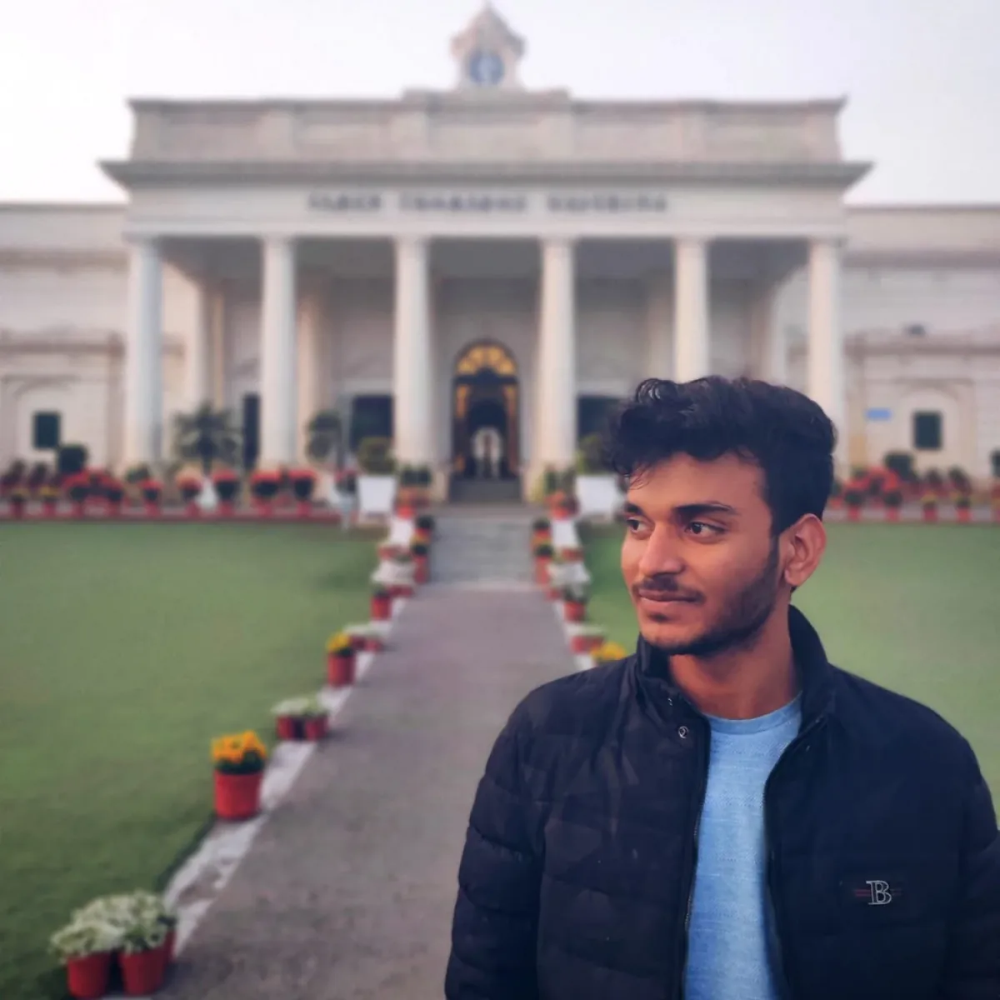

*“Hey! I am a sophomore programmer, currently pursuing my bachelor of technology from IIT Roorkee, India. This is my first exposure to the world of open source and I am very excited to work with the Processing Foundation community this summer Every ‘bit’ and ‘second’ that I devote to the p5.sound library boosts my enthusiasm to exceed the expectation and to bring some innovative change to the library. My mentors Jason Sigal and Kyle James are way more supportive and encouraging and I am damn sure this journey is gonna be very interesting and fruitful!”*

**Divyanshu Raj** will be working with the p5.sound library to upgrade the codebase to use es6 features and change the current module format (current AMD) and loaders(requireJS) used in the module system. Divyanshu will be mentored by [Kyle James](https://github.com/kyle1james) and [Jason Sigal](https://jasonsigal.cc), who was a mentor in GSOC 2018.

---

*Check back at the end of summer to read how the projects of the GSOC 2020 students went!*
