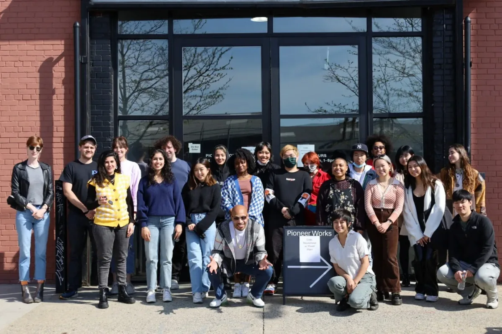
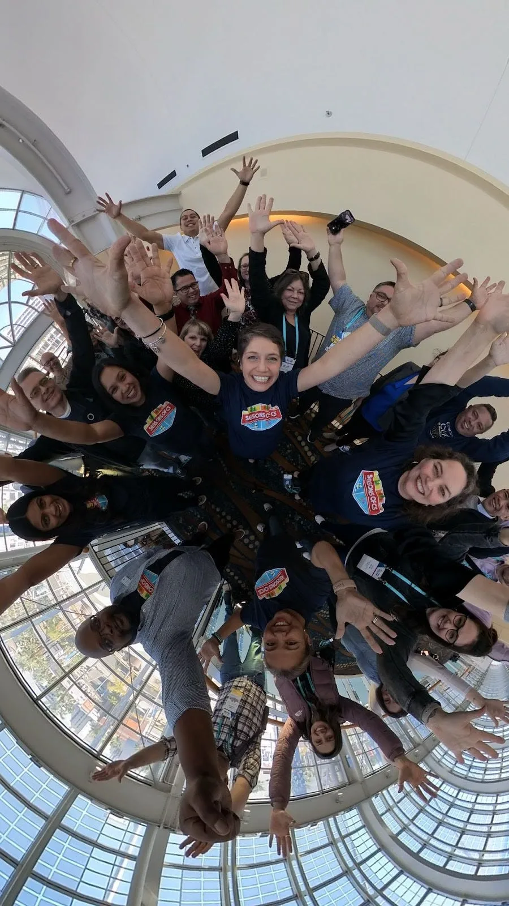

Roxana and Xin bring their visionary leadership and deep-rooted commitment to education, equity, and creativity. As Processing Foundation grows, their combined expertise will play a pivotal role in shaping our future.

#### About Processing Foundation

[Processing Foundation](https://processingfoundation.org) was created to democratize code education and ensure that creative coding tools are free, open-source, and accessible. From its inception, the foundation’s mission has focused on equity and accessibility in art, technology, and education. Through projects like [Processing](https://processing.org/), [p5.js](https://p5js.org/), and the [p5.js editor](https://editor.p5js.org/), our work has inspired countless educators, artists, and technologists to explore coding as a medium for self-expression, creativity, and social change.

### Collaboration through an Executive Co-Director Model

As the foundation has evolved, we’ve determined that a collaborative leadership model best reflects our values and will empower us. Xin Xin will serve as the Executive Co-Director of Community and Programs. They have been a long-term collaborator of the foundation, spearheading initiatives such as the global [2019 Processing Community Day](https://processingfoundation.org/advocacy/processing-community-day-2017-2019) and [Code, Decolonized](https://processingfoundation.org/advocacy/code-decolonized). Before joining as the Executive Co-Director of Research and Education, Roxana was the Associate Director of the [Computer Science Equity Project](https://centerx.gseis.ucla.edu/computer-science-equity-project/) at [UCLA Center X](https://centerx.gseis.ucla.edu). Through their experiences within the fields of art, code, education, and social justice, Xin and Roxana embody the ethos of accessibility, creativity, and community care that are core to the Processing Foundation’s mission.

*Photo of [Code, Decolonized](https://processingfoundation.org/advocacy/code-decolonized) with [POWRPLNT](https://www.powrplnt.org), taken at [Pioneer Works](https://pioneerworks.org). [Code, Decolonized is](https://www.powrplnt.org) a project and living archive initiated by [shawné michaelain holloway](https://shawnemichaelainholloway.com) and Xin Xin. Xin is pictured next to the Pioneer Works sign.*

Xin Xin is a Taiwanese-American artist and educator who explores the creative potential of community-driven technology. As creator of [TogetherNet](https://togethernet.org/) and co-curator of the [Critical Coding Cookbook](https://firstthenrepeat.hackersanddesigners.nl/#Critical_Coding_Cookbook), Xin facilitates consensus and social engagement in digital spaces. Their work has been exhibited internationally at Ars Electronica, Human Resources, Z/KU, and Kunstverein Wolfsburg. Xin is an Eyebeam NYC and Sundance Fellow and a former artist in residence at MASS MoCA, Santa Fe Art Institute, and Plug In Institute of Contemporary Art. Xin teaches art, feminism, and computation at the [New School](https://www.newschool.edu/parsons/faculty/xin-xin/).

*A 360-degree photo of participants and organizers of [Seasons of CS](https://www.seasonsofcs.org). Roxana Hadad, a former project director of Seasons of CS, is pictured in the middle of the image. Photo by [Ed Campos](https://www.campocreativo.org/).*

Roxana Hadad, PhD, was Associate Director of the Computer Science Equity Project at UCLA Center X. She was a project director for [Seasons of CS](http://seasonsofcs.org/), a statewide [CSforCA](https://csforca.org/) initiative to bring equity-minded computer science professional learning to educators in every region of California. She also managed [SCALE-CA](https://centerx.gseis.ucla.edu/computer-science-equity-project/scale-ca/), an NSF-funded research partnership focused on scaling teacher professional development, building the capacity of educational leaders for local implementation, and contributing to the research base on expanding equity-minded computer science teaching and learning opportunities in California. This resulted in the [CS Equity Guide](https://csforca.org/csequityguide/), which was developed to inform education leaders of ways to bring equitable CS into their schools. Roxana also served as the Director of Math, Science, and Technology at the Center for College Access and Success (CCAS) at Northeastern Illinois University in Chicago. Because of the opportunities computing has provided Roxana as a Latina and an artist, she is committed to ensuring more students have access to quality computing education.

### **A New Chapter for the Processing Foundation**

Co-directorship marks a new chapter in our organizational journey. We’re moving forward with a renewed focus to serve youth populations. We aim to refine our tools and resources to empower youth, particularly those from underrepresented communities, to access creative coding, explore technology, and contribute to open-source.

Roxana and Xin have long histories advocating for marginalized voices in technology and education. Roxana’s work in equitable computer science education and Xin’s experience creating community-driven technologies form the foundation of our commitment to diversity, equity, and inclusion. Their leadership will prioritize platforms, initiatives, and partnerships that center the experiences of historically excluded communities, fostering an environment where more people can see themselves as creators of technology.

We look forward to sharing more about our organization’s strategic plans to sustain our software projects, develop new youth programs, expand support for STEAM educators, and open-source advocacy in the coming months! Thank you to our community for your continued support throughout our journey. If you would like to support Processing Foundation, [donate here](https://processingfoundation.org/donate) to support our ecosystem of open-source education and contributions!
