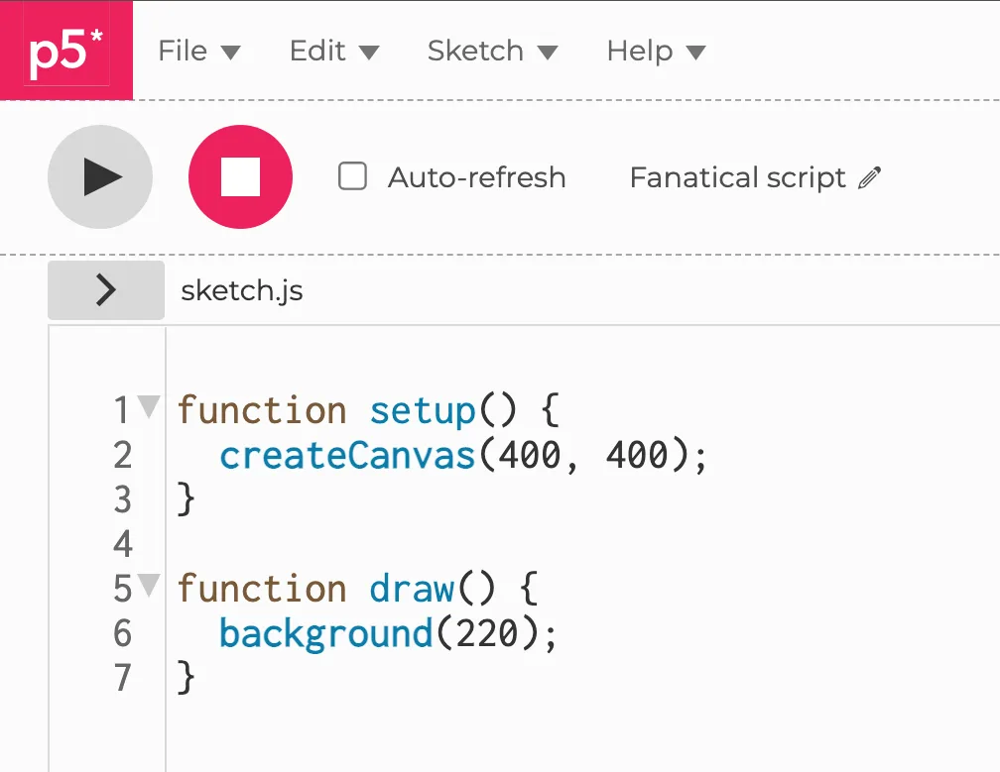
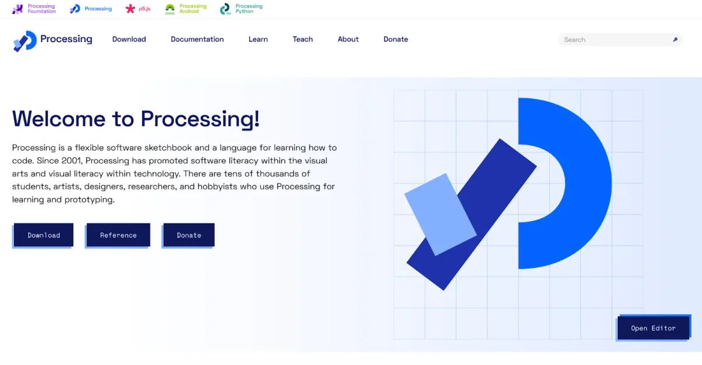
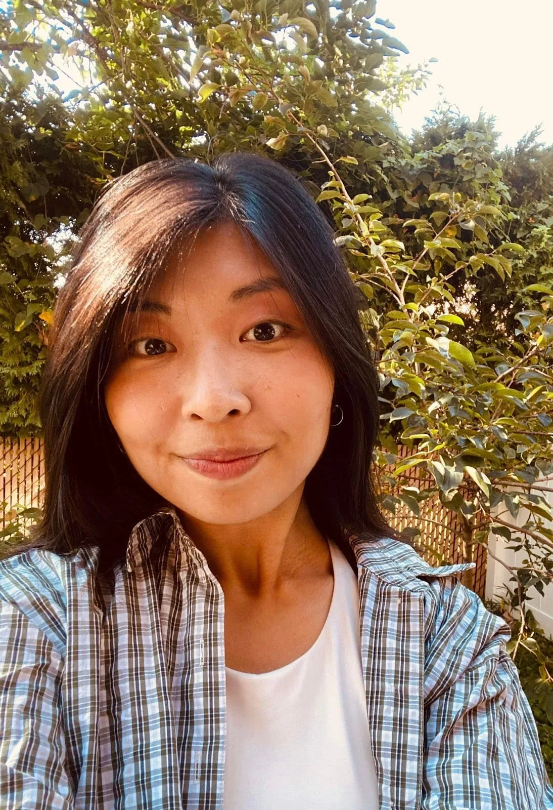

The p5.js Editor Project Lead will lead the technical development and maintenance of the p5.js Editor project while providing leadership and stewardship for the project.

[p5.js](https://p5js.org) is a JavaScript library that starts with the original goal of Processing — to make coding accessible for artists, designers, educators, beginners — and reinterprets this for today’s web. [The p5.js Editor](https://editor.p5js.org) is free to use and plays an essential role in making p5.js accessible. The mentor for this fellowship will be [Cassie Tarakajian](https://cassietarakajian.com), who currently fulfills the responsibilities of this role.

*Image description: A screenshot of the p5.js Editor console that shows the default seven lines of code that include functions of setup and draw along with createCanvas and background.*

The Processing Community Lead Fellowship is a one-year paid fellowship to guide and steward the global, decentralized community formed around the original Processing (Java) software and its ethos. We are committed to supporting this trajectory through mentorship provided by [Casey Reas](https://reas.com).

Processing is a flexible software sketchbook and a language for learning how to code. Since 2001, Processing has promoted software literacy within the visual arts and visual literacy within technology. There are thousands of students, artists, designers, researchers, and hobbyists who use Processing for learning and as a part of their creative practices.

*Image description: A gradient blue background with a deconstructed P and the words Welcome to Processing! on the left hand side with multiple navy colored buttons to Download software, access references, donate, and open editor.*

Thank you to all the collaborators, advisors, mentors, writers, community members, contributors, educators, friends, and human beings that worked with us on all these projects. We can’t come close to naming all of you, and we appreciate you deeply.

*Portrait of Rachel Lim.*

**p5.js Editor Project Lead:** [Rachel Lim](https://www.linkedin.com/in/rachel-lim-324a8ab6) **(she/her)** is a Korean-American programmer whose works explore articulating vulnerability, discomfort, and grief with gentleness and humor. She is currently a software developer within the edtech space. She holds a master’s degree from the Interactive Telecommunications Program at NYU, where she also received a BA in Art History. In her spare time, she loves crafting knick-knacks and running outdoors.

As the new p5.js Editor Project Lead, Rachel will:

-   Ensure the editor.p5js.org website continues to run by maintaining the database, servers, and other hosting services, including: the backend Node.js APIs, core React application (including components & styles), meeting web content accessibility guidelines (WCAG)
-   Update design documents
-   Maintain the p5.js Editor GitHub repository by responding to issues, fixing bugs, and merging pull requests

She will also envision the future of the p5.js Editor & community by:

-   Leading and stewarding the project by making decisions that take into account community feedback, upholding the [p5.js community statement](https://p5js.org/community/) and the value of [access](https://github.com/processing/p5.js/blob/main/contributor_docs/access.md)
-   Guiding the software development, such as the addition of new features
-   Improving the contribution and usage documentation
-   Working and communicating with the p5.js Editor community: contributors, students, educators, artists, and designers
-   Hiring and managing contractors and mentees, as needed
-   Envisioning new partnerships such as working with researchers or commercial entities with similar values for code and access

*Please note: This role is a separate project from the p5.js, currently led by Qianqian Ye. The p5.js Editor lead is not responsible for p5.js, but they do work in close collaboration.*

[p5.js Community Statement](https://p5js.org/community/):

We are a community of, and in solidarity with, people from every gender identity and expression, sexual orientation, race, ethnicity, language, neurotype, size, disability, class, religion, culture, subculture, political opinion, age, skill level, occupation, and background. We acknowledge that not everyone has the time, financial means, or capacity to actively participate in open source work, so we recognize and encourage involvement of all kinds . We facilitate and foster access and empowerment. We are all learners. We like these hashtags: #noCodeSnobs (because we value community over efficiency), #newKidLove (because we all started somewhere), #unassumeCore (because we don’t assume knowledge), and #BlackLivesMatter (because of course).

*Photo by Peter Kolski photography. Portrait of Raphaël de Courville.*

**Processing Community Lead Fellow:** [Raphaël de Courville](https://linktr.ee/sableraph) **(he/him)** is a generative artist and designer from Paris. Since 2012 he is a co-founder and co-host of Creative Code Berlin, a community that promotes collaboration between artists and coders. Raphaël streams twice a week on Twitch, mostly about Creative Coding. He lives and works in Berlin.

As the Processing Community Lead Fellow, Raphaël will:

-   Maintain and enhance the [Processing website](https://processing.org), including ensuring the site continues to run and content is updated as needed including, but not limited to, the Examples, Reference, and Tutorials. The website was developed by Design Systems International, but this role accepts responsibility for the site content
-   Coordinate with the team developing the [Processing (Java) software](https://github.com/processing/processing4) to keep the documentation in sync with the software as it evolves
-   Work with the Processing Foundation on the annual [fellows](https://processingfoundation.org/fellowships) and [Google Summer of Code](https://processingfoundation.org/advocacy/google-summer-of-code) participants
-   Be responsible for the [Processing Discourse](https://discourse.processing.org) discussion forum and community, which includes working with the current moderators and behind-the-scenes administration
-   Improve the accessibility of documentation which may include internationalization through translation of the site and software into other languages
-   Collaborate and coordinate on [Processing Community Day](https://processingfoundation.org/advocacy/pcd-2021) events
-   Collaborate and coordinate with the Processing Education Community on shared goals and initiatives
-   Contribute to [social media efforts](https://twitter.com/processingorg) for the Processing Foundation, as related
-   Contribute to the planning of the annual Processing Foundation fundraiser

Thank you Rachel and Raphaël for your brilliance and leadership! Please look out in 2023 for the next open calls for the p5.js Editor Project Lead position and Processing Community Lead Fellowship.
