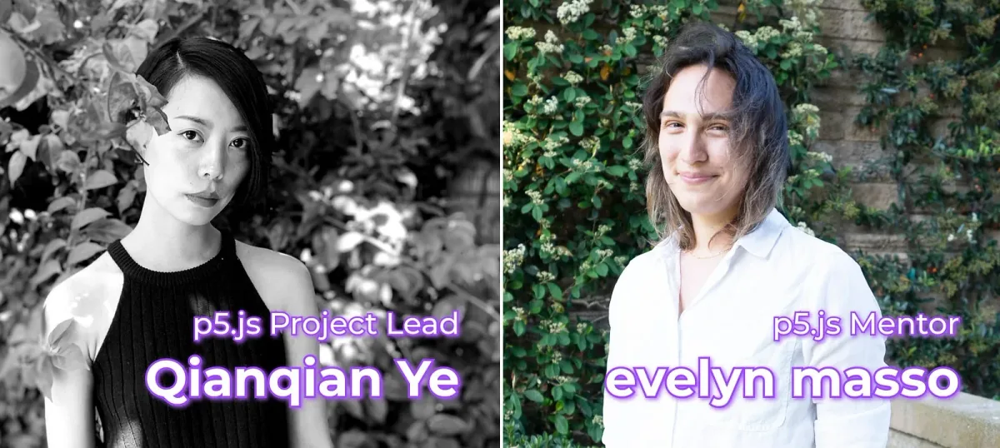
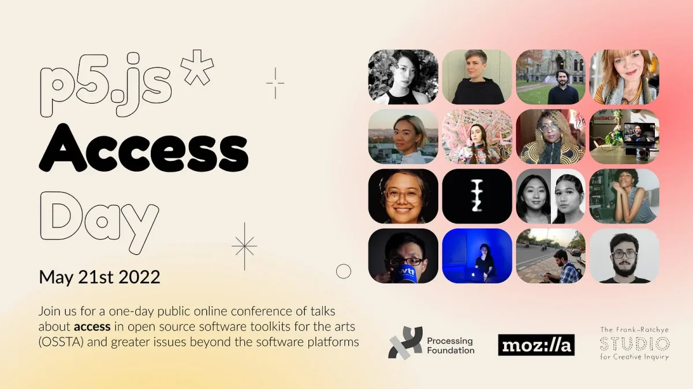

*Portrait of Qianqian and evelyn*

Last year, Qianqian and evelyn co-led the p5.js project. Their key initiatives included:

-   Releasing p5.js v1.3.1 to v1.4.1
-   Organizing p5.js Access Day
-   Curating the p5.js Video Tutorial Creator Showcase
-   Launching p5.js Discord server
-   Stewarding p5.js’s first year in the Google Seasons of Docs Technical Writer program
-   Managing p5.js social media
-   Publishing periodic updates on new changes in the p5.js library
-   Supporting the Processing 20th Anniversary community catalog, events, and fundraisers
-   Outlining initial approaches to redesigning the p5.js website
-   Supporting Processing Foundation Fellowship and GSoC p5.js projects

Thank you to all the collaborators, advisors, mentors, writers, community members, contributors, educators, friends, and human beings that worked with us on all these projects. We can’t come close to naming all of you, and we appreciate you deeply.

*Banner from p5.js Access Day, organized by Qianqian*

This year, Qianqian will continue leading the p5.js project. The intentions for the project include:

-   Planning more regular p5.js releases
-   Exploring the vision for p5.js 2.0
-   Improving contributor experience and the accessibility of documentation
-   Organizing more p5.js community events, showcases, and outreach
-   Planning the next leadership transition for p5.js
-   Continuing initiatives from last year, including p5.js’s second year in the Google Seasons of Docs Technical Writer program, Processing Foundation Fellowship and GSoC p5.js related project, outlining the redesign of the p5.js website, managing p5.js social media

#### p5.js Project Lead: [Qianqian Ye](https://qianqian-ye.com/) (they/she)

Qianqian (Q) Ye is a Chinese artist, creative technologist, and educator based in Los Angeles. Trained as an architect, she creates digital, physical, and social spaces exploring issues around gender, immigrants, power, and technology. Their most recent collaborative project, The Future of Memory, was a recipient of the Mozilla Creative Media Award. She currently teaches creative coding at USC Media Arts + Practice and 3D Art at Parsons School of Design, and serves as p5.js Lead at the Processing Foundation.

#### p5.js Mentor: [evelyn masso](https://twitter.com/outofambit) (she/they)

evelyn masso is a person (all the time), a tech worker (on weekdays), and a poet (on weekends). She has been contributing to p5.js (on-and-off) since 2016, was a p5.js co-lead for 2021, and is serving as a p5.js Mentor for 2022. Originally from Ohio, she currently lives on unceded Tongva land (near Los Angeles) with a collection of moody houseplants. She enjoys roller skating, babysitting her two godsons, and hanging out by the Los Angeles River.

Thank you Qianqian for your continued leadership and evelyn for your mentorship! Please look out in spring of 2023 for the open call for the next p5.js Lead Fellow.
