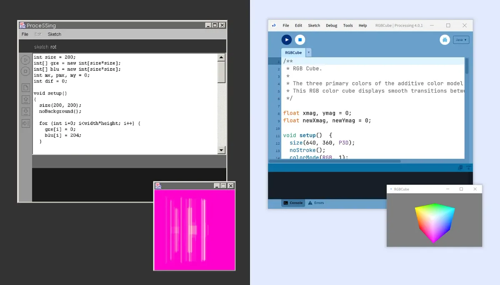
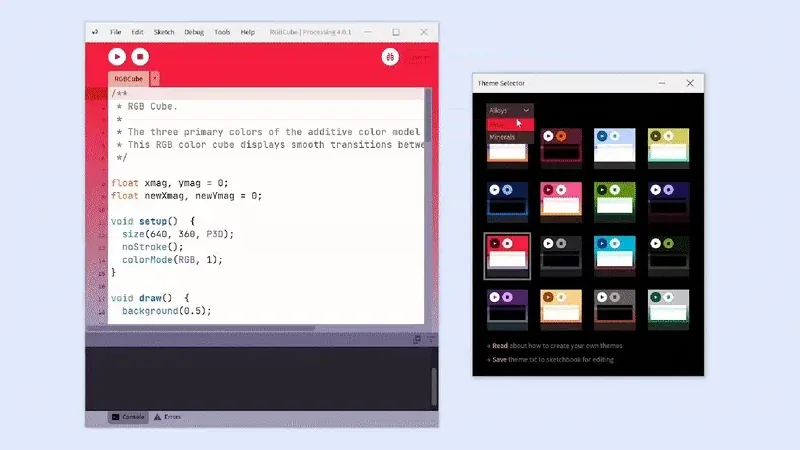
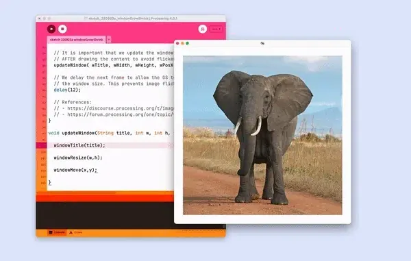
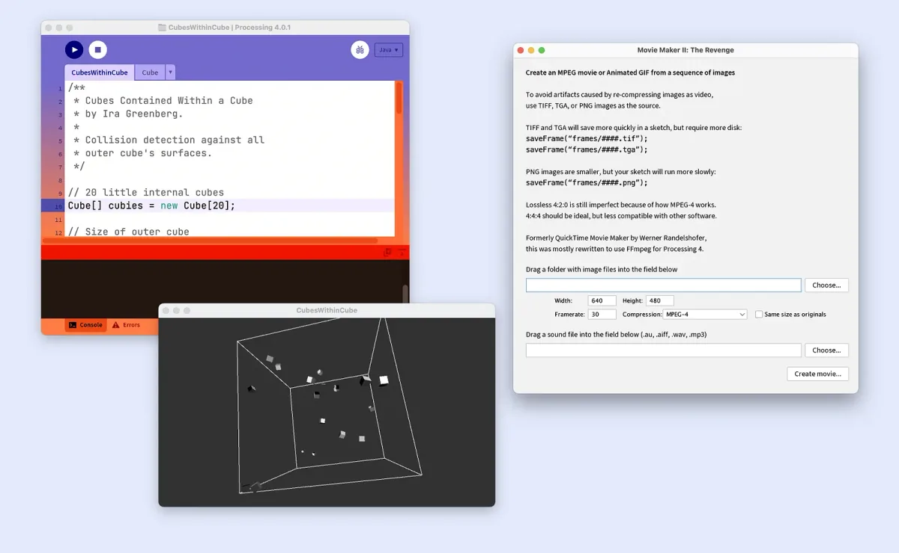
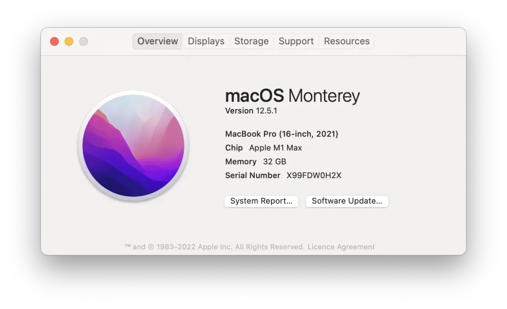

*Left side: Alpha version of Processing (then spelled Proce55ing) running on Windows — Right side: Processing 4.0.1 running on Windows 10.*

Initially created to serve as a software sketchbook and to teach programming fundamentals within a visual context, Processing has also evolved into a development tool for professionals. The Processing software has always been free and open source and has always run on Mac OS, Windows, and Linux.

**Processing 4.0** introduces major improvements behind the scenes, with the primary goal to keep your code running smoothly on the latest hardware and operating systems.

For most of you, nothing will change, though you may notice the new look of the editor and enjoy our color themes amongst other new features (more about that below).

If you are still using Processing 3 or a Processing 4 beta, we encourage you to switch to Processing 4 to get the best performance, compatibility, and support in the future.

#### 👉 [Download Processing 4](https://processing.org/download) **👈**

If you run into issues, [let us know](https://github.com/processing/processing4/issues) and we’ll do our best to fix them.

*Note: to get help with your code, it is better to post your questions on the* [Processing forum](https://discourse.processing.org/).

### What’s New in Processing 4?

*Here are some fun new features we wish to highlight from this version.*

#### Theme Selector

Not a fan of blue? Processing now comes in 32 beautiful color themes. Visit `Tools → Theme Selector` to pick your favorite. And if you are [that kind of person](https://gfycat.com/decimaldefenselesshousefly) who needs everything to match your aesthetic: yes, you can also create your own themes! More details [here](https://github.com/processing/processing4/wiki/Themes).

#### Stretch your Sketch!

Say hello to `windowResizable()` `windowResize()` `windowTitle()` `windowMove()` and the two new event handlers `windowResized()` and `windowMoved()`. The built-in examples and online reference will be updated soon but you can already use those today.

*Note that the earlier* `*surface*` *methods are still backwards compatible but you are encouraged to use the new methods for future sketches.*

*The Processing IDE is shown. A sketch window grows and shrinks overlapping with the PDE. The sketch window shows alternatively a picture of an ant (when the window is small) and a picture of an elephant (when the window is large). The title of the window switches between 🐜 and 🐘.*

#### Gifs! Gifs everywhere!

You can now create animated GIFs as well as high-resolution lossless MPEG videos without leaving Processing. First, render the frames you need from your sketch. Then open `Tools → Movie Maker`, drag your image folder to the import field, and click `Create movie…`

With the Movie Maker tool, it’s never been easier to capture your Processing sketches in their animated glory. Post them on social media and remember to tag us @processingOrg so we can see your beautiful work 👀

*The Processing editor, a sketch window showing a wireframe cube filled with lit grey cubes, and a window labeled “Movie Maker II: The Revenge”.*

#### Now blazing fast on Apple Silicon

Apple Silicon is now supported (and very speedy!) — Thanks a lot to [jaegonlee](https://github.com/jaegonlee) for your help getting OpenGL support working — If you have a recent Apple computer with an M1 or M2 chip, make sure to [download](https://processing.org/download) the *Apple Silicon* version of Processing.

Don’t know which chip you have? Click on the **** menu on the top left of your screen, then `About This Mac`. If it says Apple M1, or Apple M2, you have an Apple Silicon Mac.

*The About window of a MacBook Pro running macOS Monterey on an Apple M1 Max.*

#### Other notable changes

-   Not fond of the default sketch\_220809a naming system? You can also select an alternate naming scheme in the Preferences window. It’s also possible to create your own word list for generating sketch names.
-   Sketch folder restrictions have been relaxed, making it easier to use version control. By default, the name of the main tab and the sketch folder will be kept in sync as with previous versions of Processing (you can also turn this off by visiting the Preferences window).

This is not all but there is only so much we can fit in this article. For the full picture, check the [Processing 4 change log](https://github.com/processing/processing4/wiki/Changes-in-4.0#changes-in-every-40-release) and [full list of revisions](https://github.com/processing/processing4/blob/main/build/shared/revisions.md).

### Supported platforms

On the technical side, Processing 4 has important updates that prepare the platform for its future. Most significantly, this includes the [move to Java 17](https://github.com/processing/processing4/wiki/Supported-Platforms#java) as well as major changes to the range of platforms we support. At the moment of this writing, compatible platforms are as follows:

#### Apple

-   macOS 10.15.7 (Catalina),
-   macOS 11 (Big Sur)
-   macOS 12 (Monterey) on both Intel hardware and Apple Silicon (M1 and M2 chips)

*Apple has aggressively updated their OS and deprecated old features. Older versions of Processing (3.x and earlier) are likely to not work at all, due to Apple’s updates and restrictions. If you are using macOS, we very strongly recommend that you switch to Processing 4.0*

#### Windows

-   Windows 10 (64-bit Intel)

*As of August 5, 2022, we are not currently testing on Windows 11, therefore cannot exactly recommend it, but it should work fine.*

#### Linux

-   Linux (Ubuntu 22.04, 64-bit Intel) — If you’re using a different Linux (or different window manager), please [help us make improvements](https://github.com/processing/processing4) so that it runs on your platform of choice.
-   Linux on Raspberry Pi (32-bit ARM) — We don’t currently have a maintainer, but we’re doing releases. This is the only 32-bit platform that is supported with Processing 4.
-   Linux on Raspberry Pi (64-bit ARM) — Not a ton of people are 64-bit with their RPi devices yet, but releases are happening.

If you want the finer points, you can find a [detailed breakdown of compatible platforms](https://github.com/processing/processing4/wiki/Supported-Platforms) on Github.

### Wrapping up

With shiny new color themes, Apple Silicon compatibility, and tons of behind-the-scenes improvements, Processing 4 is the same creative coding sketchbook and professional development tool you know and love, only better.

#### 👉 [Download Processing 4](https://processing.org/download) **👈**

Processing continues to be an alternative to proprietary software tools with restrictive and expensive licenses, making it accessible to schools and individual students. Its free, libre, open-source status encourages community participation and collaboration that is vital to its growth. Whether you have been a Processing user for the last two decades or you just discovered our software today, we hope you will enjoy Processing 4!

*Note: If this is your first time installing Processing, head over to the* [Tutorials page](https://processing.org/tutorials) *to start learning and make your first sketch* 😃

*Thanks to* [Raphaël de Courville](https://linktr.ee/sableraph) *for your extensive knowledge and excitement in writing this article, and for* [Suhyun (Sonia) Choi](https://www.suhyunchoi.net) *for editing!*
