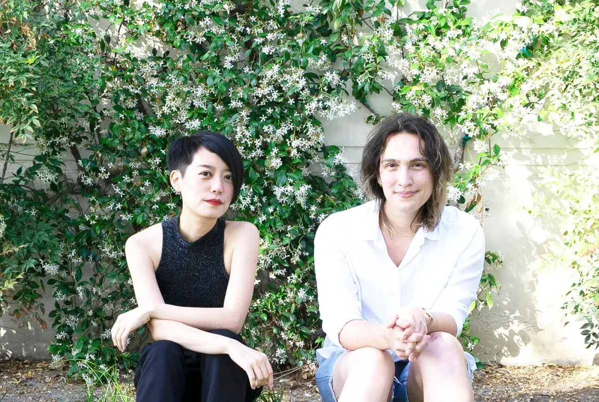

***Qianqian (Q) Ye (she/they) (left)** is a Chinese artist, creative technologist, and educator based in Los Angeles (Gabrielino-Tongva Land). Trained as an architect, she creates digital, physical, and social spaces exploring issues around gender, immigrants, power, and technology. She received a Master of Landscape Architecture from Cornell University and was a Processing Foundation Fellow in 2019. She currently teaches creative coding at USC Media Arts + Practice, and serves as a p5.js co-lead at Processing Foundation. **evelyn masso (she/they) (right)** is a person (all the time), a tech worker (on weekdays), and a poet (on weekends). She was a p5.js Fellow in 2019 and has spoken about issues of access in software at venues like the Frank-Ratchye STUDIO for Creative Inquiry, the W3C TPAC, and Write/Speak/Code. Originally from Ohio, she currently lives on unceded Tongva land (near Los Angeles) with a rapidly growing collection of houseplants. She spends her free time rollerskating, making silly jokes, and reading queer fiction. \[**image description**: Qianqian and evelyn sit next to each other in a garden, smiling at the camera. Qianqian, a non-binary Chinese person with black short hair, sits on the left, wearing a black tank top. evelyn, a light-skinned person with shoulder-length brown hair, sits on the right, wearing a collared white shirt.\]*

In 2020, the [p5.js](https://p5js.org/) community embarked on a process to [make space for the future of p5.js](https://medium.com/processing-foundation/making-space-for-the-future-of-p5-js-d3c6bd3da9ac), by transitioning to a rotating project leadership model. [Moira Turner](https://medium.com/processing-foundation/always-look-at-where-you-want-to-go-not-where-you-dont-want-to-be-69f82ba58762) was selected as our inaugural rotating p5.js project lead. Her immediate efforts focused on connecting with the larger p5.js community, and creating additional plans for outreach and educational resources. We’re sad that Moira had to step away from the role in late 2020, but we are grateful for her guidance and contributions. Moira provided leadership in a significant moment of transition, helping to define the role itself and imagining the next phase of the p5.js project. Thank you and congrats, Moira!

Early this year, we began the process of selecting the next p5 lead, and decided to go back to our shortlist from the open call, which was filled with visionary applicants. Assembled by a group of 15 volunteers from the community, each applicant on the list was considered for their experience with and potential for organizing, community building, technical direction, and commitment to diversity, inclusion, and access. We looked especially for the capacity to work collaboratively, hoping that this role could support learning from the community as well as leading it. We thought of how leadership could be shaped without hierarchy, asking how the p5.js community could provide collective mentorship to support the project lead, as much as the lead would guide and support the community.

We are thrilled to announce our new p5.js project co-leads: Qianqian Ye and evelyn masso! Their role over a 1–2 year term is to steward the p5.js project, software, and community. Qianqian is an artist, designer, and organizer, who has previously contributed to p5.js internationalization and educational work. [Read Qianqian’s intro post here.](https://medium.com/processing-foundation/tending-the-p5-garden-c4f3e666ca39) evelyn is a person (all the time), an engineering manager (on weekdays), and a poet (on weekends). They previously worked on processes for onboarding new contributors and working collaboratively, and most recently drafted the p5 Access Statement. [Read evelyn’s intro post here.](https://medium.com/processing-foundation/beginnings-by-evelyn-masso-7676719ba4a0)

Welcome evelyn and Qianqian! We are so excited about the leadership, energy, and care you bring to the project, and looking forward to learning and working with you!
