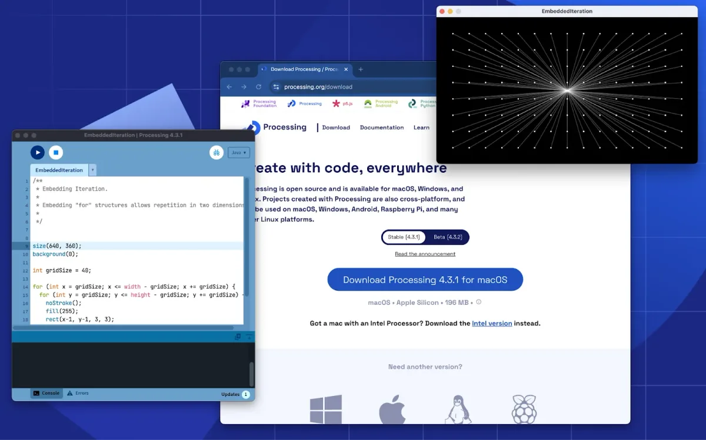
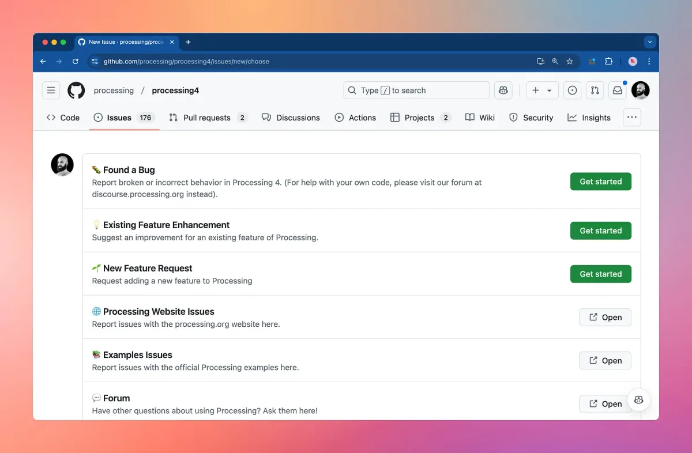
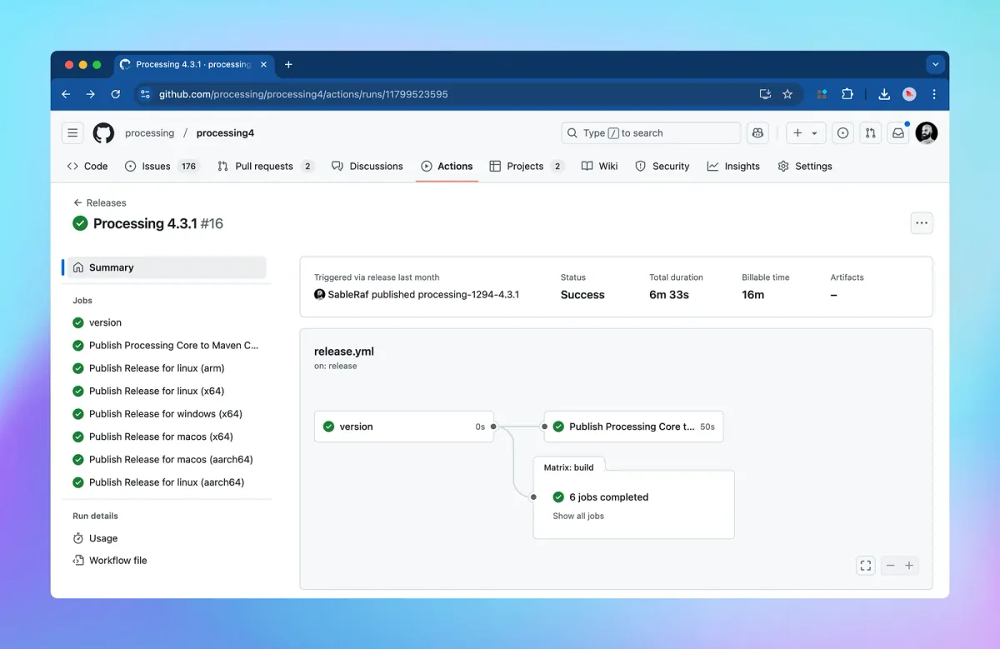
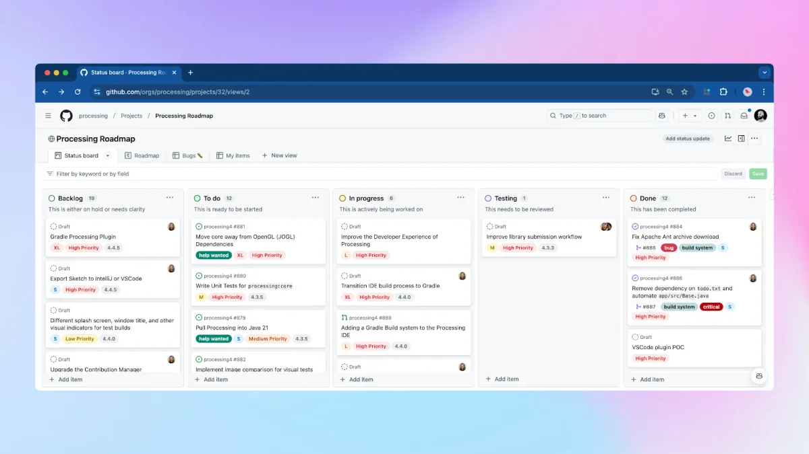
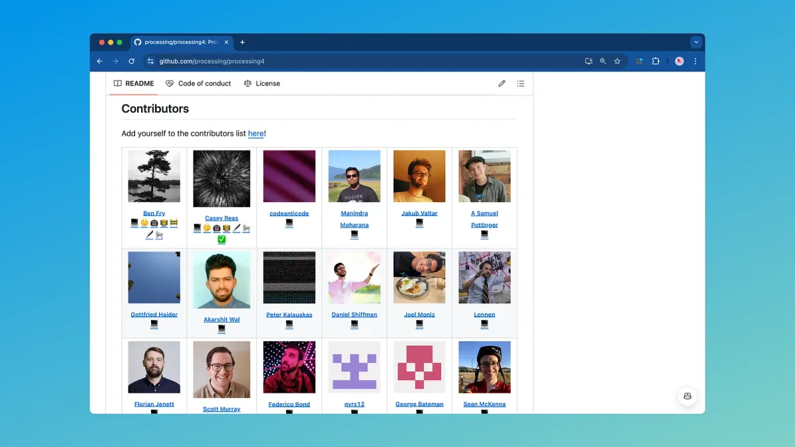

We’re thrilled to share that Processing 4.3.1 is now available! You might not notice big changes, but this version makes Processing easier to maintain and release. This means bug fixes can happen faster, new features will be simpler to implement, and updates will come more often! We highly recommend updating if you’re still using Processing 4.3 or earlier for the best support.

[**Download Processing 4.3.1**](https://processing.org/download)

*Screenshot of Processing 4.3.1. Download Processing 4.3.1 today!*

### What’s new in 4.3.1?

We’ve made contributing to Processing easier and more welcoming than ever! Whether you’re fixing a bug, building a library, or helping out in small ways, we’ve improved the tools, streamlined the setup, and expanded our documentation to make it simpler to get involved.

#### Simplified Feedback and Bug Reporting

Our new [issue templates](https://github.com/processing/processing4-carbon-aug-19/issues/new/choose) offer a more consistent way for users to share feedback and report bugs.

*Reporting bugs is now easier with issue templates.*

#### Automated Builds

Processing now builds and signs code automatically using GitHub Actions. Curious developers can find the [release script on GitHub](https://github.com/processing/processing4-carbon-aug-19/blob/main/.github/workflows/release.yml).

*Processing now builds automatically on GitHub Actions.*

#### Processing Core on Maven

Processing’s core libraries are now [available on Maven Central](https://central.sonatype.com/artifact/org.processing/core)! This makes integrating Processing into your Java projects easier, using tools like Maven or Gradle. Check out [examples of adding Processing core](https://github.com/processing/processing4/tree/main/core#including-the-processing-core-library-on-your-project) to your build system.

#### Simplified Local Setup

We’ve made [setting up a local development environment](https://github.com/processing/processing4/blob/main/build/README.md#intellij-idea-ce) easier, including configuration files for IntelliJ and updated documentation.

#### Improved Contributor Documentation

We are working on our contributor documentation to make it easier for first time contributors to get started. Starting with a more inviting [README](https://github.com/processing/processing4?tab=readme-ov-file), a new [Code of Conduct](https://github.com/processing/processing4?tab=readme-ov-file), and improved [Contribution Guidelines](https://github.com/processing/processing4/blob/main/CONTRIBUTING.md) to make the project even more inviting and welcoming!

#### Creating Libraries Made Easier

Many Processing contributors started by building libraries. To simplify this process, our [pr05 grant](https://medium.com/processing-foundation/meet-our-2024-pr05-grantees-5aaae55d5c9a) recipient, Claudine Chen, developed an improved system for building and submitting libraries. Visit the [Processing Library Template repository](https://github.com/processing/processing-library-template/) to learn more and start building your own Processing library!

#### What’s Next? A Public Roadmap!

Developers will appreciate our [new public roadmap](https://github.com/orgs/processing/projects/32/views/2). It outlines priorities and plans for Processing from a technical standpoint. Plans include even better CI/CD, [migrating the build system to Gradle](https://github.com/processing/processing4/pull/888), a new command line interface, and possible paths forward for the PDE, among other exciting developments. If you have questions about any of the items listed in the roadmap, feel free to ask in the corresponding issues!

*Screenshot of Processing’s Roadmap.*

### Celebrating Two Decades of Contributions

Processing was initiated in 2001 by Ben Fry and Casey Reas, who led the development and maintenance of the project until 2023. We are grateful for their vision and dedication to the project. Processing is also indebted to over two decades of contributions from [the broader Processing community](http://processing.org/people).

With the 4.3.1 release, Processing is adopting the [all-contributors](https://allcontributors.org/) specification, recognizing all forms of contributions! Check the [contributors list](https://github.com/processing/processing4-carbon-aug-19?tab=readme-ov-file#contributors) in the README, and if you don’t see your name, please add yourself by commenting on [this GitHub issue](https://github.com/processing/processing4-carbon-aug-19/issues/839). To see all commits by a contributor, click on the [💻](https://github.com/processing/processing4/commits?author=benfry) emoji below their name.

*Legacy of Processing with all contributors.*

*Note: Due to platform limitations, the GitHub Contributors page for the processing4 repository does not show the complete list of contributors. However, the* [*git commit history*](https://github.com/processing/processing4/commits/main/) *fully records the project’s contributions. Please refer to* [*the contributor graphs*](https://github.com/benfry/processing4/graphs/contributors) *for contributors before November 13, 2024.*

### Become a Processing Contributor 💙

This project is a labor of love nurtured by a community that learns, builds, and grows together. Your contributions — big or small — make a real impact, and we’re excited to see what you’ll create! Make sure to check out our [Code of Conduct](https://github.com/processing/processing4?tab=coc-ov-file "Code of Conduct
(https://github.com/processing/processing4?tab=coc-ov-file)") and read our [Contribution Guidelines](https://github.com/processing/processing4/blob/main/CONTRIBUTING.md "contribution guidelines
(https://github.com/processing/processing4/blob/main/CONTRIBUTING.md)") to help you get started.

If you’re unsure where to start, don’t hesitate to ask for guidance. The community is here to help you learn and grow as a contributor, and we’re happy to answer your questions. We have opened a new space for Processing contributors to connect and help each other. If you’re interested in getting involved, [join the Processing Contributor Community Discord](https://discord.gg/8pFwMVATh8)!

### Support Processing’s Development!

Processing Foundation is the non-profit behind Processing, p5.js, and the p5.js editor. We’re imagining open-source software that is free, creative, equitable, and accessible to all. However, free software is expensive to make, and we cannot do this work without you.

To keep the momentum going, we are raising $20,000 by January 17, 2025. These funds will directly support contributors who maintain and enhance Processing, p5.js, and the p5.js web editor, ensuring they stay up-to-date and reliable for artists, educators, and creative coders worldwide.

If Processing, p5.js, or the p5.js editor brought you $5 or more in value this year, please consider donating to help us continue to support our development. 100% of your donation funds this essential work — [**donate now**](https://donorbox.org/building-together)!

### Acknowledgments

This 4.3.1 release would not be possible without the support and collective wisdom of the Processing Community. A heartfelt thanks to Sam Pottinger, Stef Tervelde, Kate Hollenbach, Andres Colubri, Xin Xin, Roxana Hadad, Kevin Stadler, Roopa Vasudevan, Rune Madsen, Claudine Chen, Diya Solanki, Dora Do, Sinan Ascioglu, Sam Lavigne, Ted Davis, Justin ‘Cacheflowe’ Gitlin, Kazik Pogoda, Abe Pazos, Amy Traylor, Jim Schmitz, Chris Coleman, Dave Pagurek, Edwin Jakobs, Jakub Valtar, Phoenix Perry, Qianqian Ye, Rachel Lim, Nick Fox-Gieg, Tim Rodenbröker, Stig Møller Hansen, Alexandre B A Villares, Nick McIntyre, Alex (SPACEFILLER), Tetsu Kondo, Katsuya Endoh, and many others more.

I want to give special thanks to Jérémy Laviole for his help with the org.processing namespace on Maven Central and to the Sonatype support team for their support.

Additional thanks to my amazing Processing Foundation colleagues for their support, to the OSACC crowd for their ideas and enthusiasm, and to the Creative Code Berlin community for being a constant source of inspiration. My personal gratitude goes to Casey for his patient mentorship over the last two years, and to Dan for his kindness, encouragement, and for, you know, just being the best.
