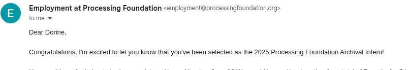
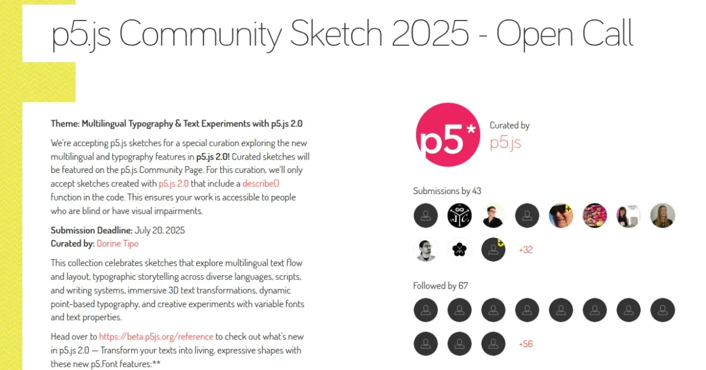
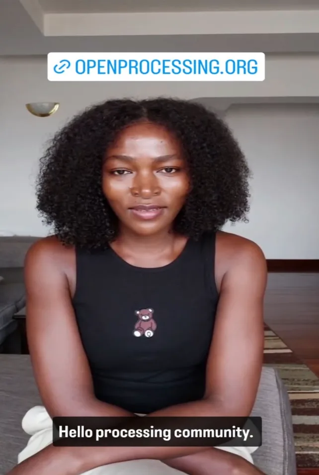
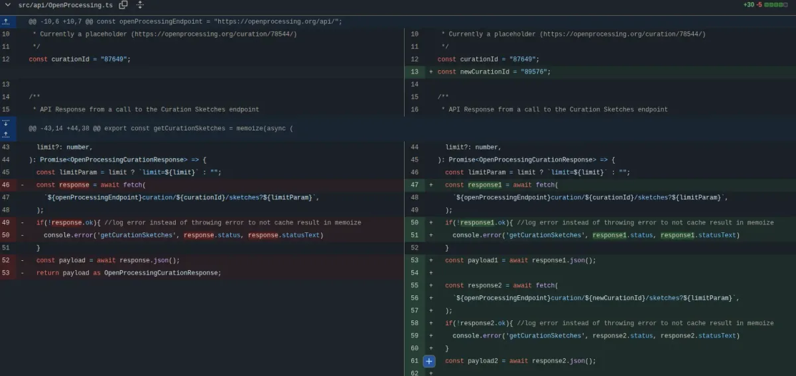
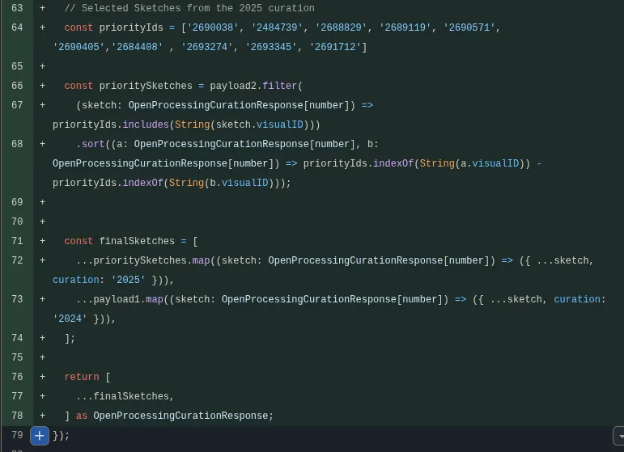
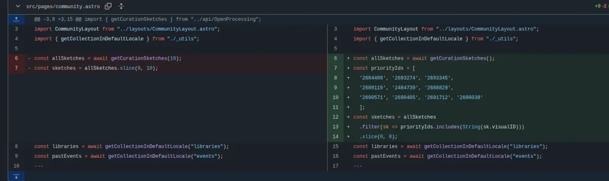
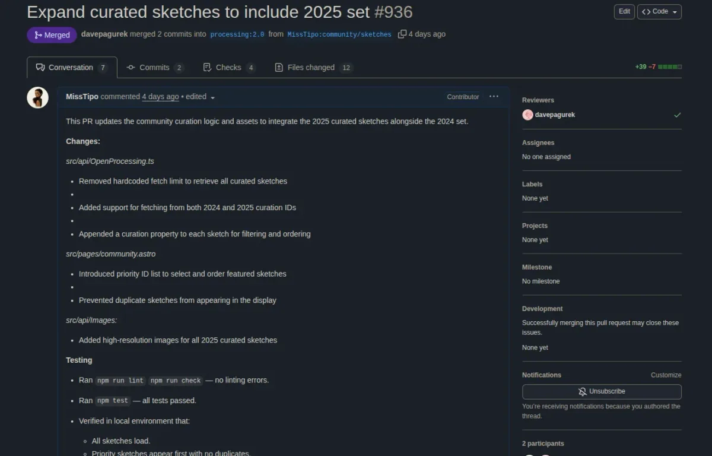
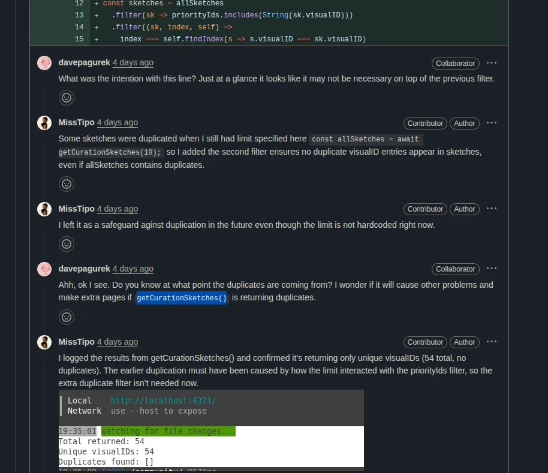
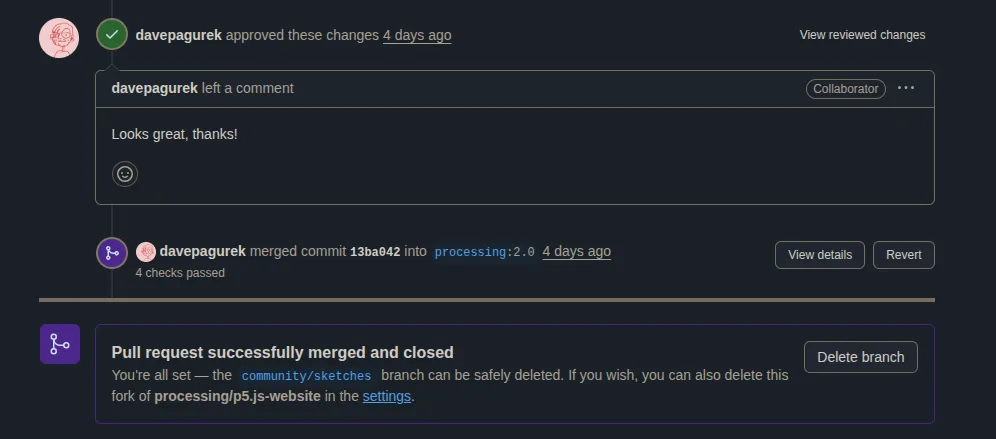

I am Dorine Tipo, from Nairobi, Kenya. Over the past few months, I’ve had the privilege of working as the 2025 Archival Assistant at the Processing Foundation. My journey into this role has been anything but linear. I hold a BSc. in Biology from the University of Nairobi, but my curiosity and persistence led me to transition into software engineering.

> Without a formal CS degree, I carved my own path through open-source contributions, which led me to the Processing Foundation.

I applied for the Archival Internship, and after interviewing with Xin, I received the good news that I had been selected as the 2025 Archival Intern. What followed has been one of the most fulfilling and transformative experiences of my career!

In my role as Archival Assistant, one of my main projects was curating the p5.js community page with sketches created using the newly released p5.js 2.0 by organizing a Community Sketch Open Call on OpenProcessing. My first proposal was to spotlight sketches celebrating LGBTQIA+ identities, highlighting themes of visibility, community, and joy, while encouraging experimental and personal interpretations of Pride during Pride Month. It was an exciting direction, but with concerns around visibility without protection and anonymity, we chose instead to focus the open call on the powerful new features in p5.js 2.0. I then drafted and published the theme: *Multilingual Typography & Text Experiments with p5.js 2.0.*

The next step was promotion, which brought its own set of challenges. I worried that the open call might not receive any submissions, so reaching as wide a community of p5.js users as possible felt crucial. To spread the word, I shared announcements across several Discord communities, sent mass emails to former Processing Foundation fellows, and created a promotional video for Instagram.

> Although being on camera has always felt uncomfortable, producing the video became an opportunity to stretch myself and try something new.

I also put together a short tutorial for the community, showing how to switch to p5.js 2.0 in the p5.js Editor so that even newcomers could participate in the call.

The open call proved to be a success, receiving 47 submissions and drawing the attention of 67 people who followed the curation.

> Each sketch offered a unique perspective and explored the new features of p5.js 2.0 in different directions. The creativity on display made narrowing down the selection both inspiring and challenging.

In the end, we selected 10 sketches to feature on the p5.js Community Page.

The final step was integrating these selected sketches into the p5.js Community Page and submitting a PR. The community page pulls sketches dynamically from OpenProcessing. The site was originally configured to fetch a single curation, in this case the 2024 set, by hitting the OpenProcessing API with one curation ID. Replacing that ID with the new 2025 curation would have erased the older sketches from view, which was not acceptable. The challenge was to preserve the 2024 work while adding the new 2025 selections, and also maintain control over the order in which the 2025 sketches appeared.

To preserve the history of past curations while adding this year’s selections, I modified the `getCurationSketches()` function so it could request sketches from both the 2024 and 2025 curations, then merge the two payloads before rendering them on the page. Since we wanted only the ten selected 2025 sketches to appear at the top, I created a list of their IDs and tried filtering and sorting the 2025 payload against that list. On paper, the logic looked correct, but the output stubbornly followed the API’s default ordering.

I added logs, compared objects, and still could not find the mismatch. With [Dave Pagurek](https://www.davepagurek.com/)’s (another p5.js contributor) help, we discovered the culprit: the OpenProcessing API uses `visualID` as the unique identifier, not `id`. I had been filtering and sorting against the wrong field. Switching the logic to `visualID` fixed the ordering immediately.

Next, I updated `src/pages/community.astro` by updating the `allSketches()` function. Instead of simply pulling the first ten results from the API, the function now explicitly filters by a `priorityIds` list containing the selected sketches from the 2025 curation. This step was necessary because the OpenProcessing API returns sketches in a generic order, which didn’t guarantee that the chosen curation picks would appear consistently. By filtering the fetched sketches against `priorityIds` and then slicing the results down to the top eight for display, I ensured that the community page reflected the exact editorial selection and ordering we had agreed upon.

One of the challenges was balancing dynamic fetching with predictability. The page needed to remain flexible enough to handle future curations while staying strict enough to display only the curated set for 2025. Another concern was verifying that the merged results from both the 2024 and 2025 curations continued to render correctly once the filtering was applied. I tested locally to confirm that the final payload displayed the chosen sketches in the correct order, with no duplication or gaps between the curations.

With filtering, ordering, and layout confirmed, I finalized the integration and submitted the PR.

Dave reviewed my PR and flagged a potential redundancy. I had added a second filter as a safeguard against duplicates, but after further testing we confirmed that the duplicates I had encountered earlier weren’t coming from `getCurationSketches()`.

The PR was merged and the new sketches are now live on [https://beta.p5js.org/community/](https://beta.p5js.org/community/)!

That marked the end of this remarkable and fulfilling journey. What truly made this experience so special was the unwavering support and mentorship from the team, and in particular from Xin. Having weekly check-ins with her was an honor. She guided me thoughtfully, introduced me to several other communities, and provided encouragement throughout the entire period.

Being part of the weekly team meetings kept me in sync with the work and also made me feel part of something larger. The icebreaker sketches we shared each week became little sparks of joy that fueled my creativity and reminded me why I love contributing to this community. Looking back, this achievement feels less like something I did alone and more like a reflection of the trust, encouragement, and collaboration that surrounded me throughout the process.

---

Dorine’s journey was made possible because of a community that believes in keeping p5.js free and open for everyone. Your support allows contributors like her to grow, share their skills, and give back to the community. Consider making a [monthly donation](https://donorbox.org/back-to-school-805292) to help us continue supporting p5.js and the people who make it thrive.
