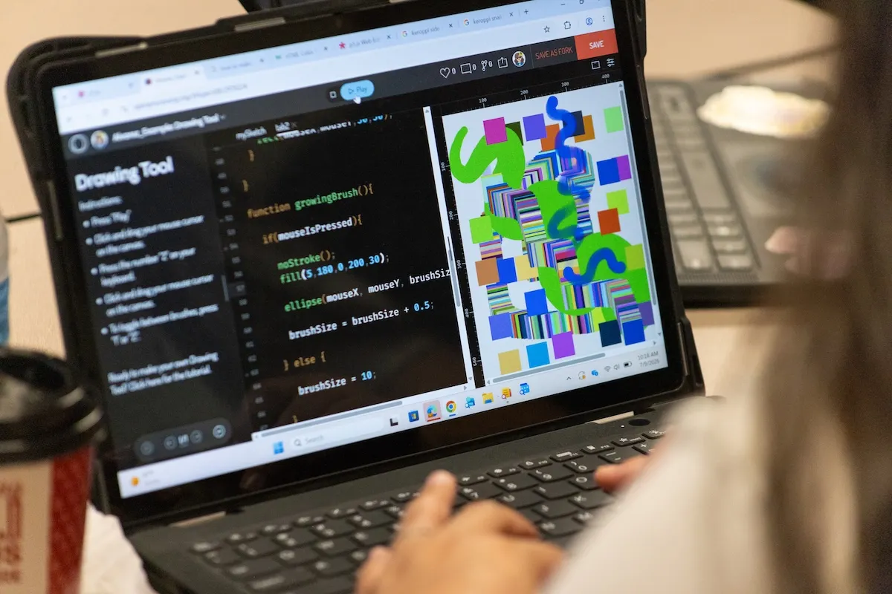
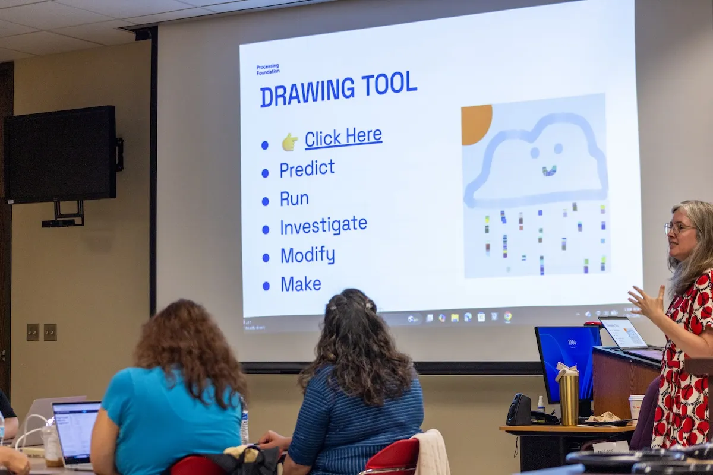
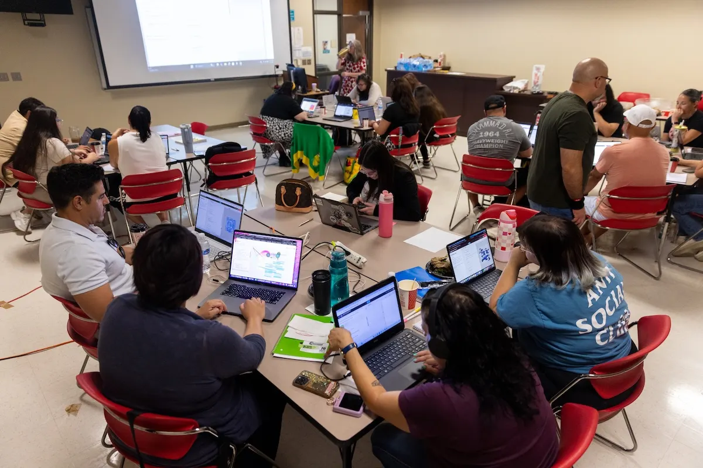
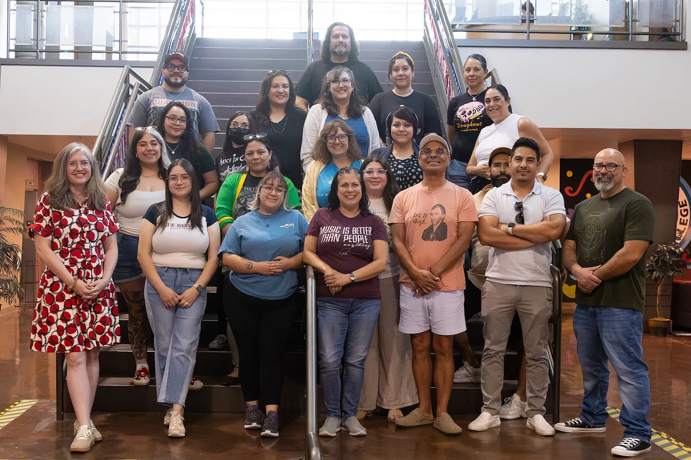

*Courtney Crowe-Mercer is an art teacher who teaches kindergarten through sixth grade for Arlington Independent School District in Arlington, Texas. She recently attended [Art + Code](/programs/partnerships/art-and-code/), a curriculum with an accompanying professional development series that trains K-12 educators to integrate free, open-source creative coding into arts classrooms. In 2026, Art + Code was supported by [WeTeach_CS](https://weteachcs.org/) to introduce creative coding to arts educators in Dallas and El Paso, Texas. Written by Courtney Crowe-Mercer.*

When I received an email that announced “Art educator professional development opportunity with a stipend, in partnership with WeTeach_CS,” I immediately signed up. As I read through the flyer attached, I thought to myself, “So you’re telling me that I can take a class for free, hosted at the beautiful campus of Southern Methodist University, *and* somebody is going to pay me?” Please… tell me more.

> We learned about open-source software and how it has the potential to change lives within marginalized communities by decreasing economic barriers and bypassing the traditional gatekeeping of the tech sector.

Considering that the last computing class I was associated with was back in 1993 in eighth-grade, we can probably agree that it’s been a while. Because we could not afford a computer at home until I was in college, all growth in the areas of the computing realm has been self-taught for most of my life. Art, on the other hand, has always been a huge part of my life. As a child growing up, art was my go to, it was something I would do when I was bored or wanted to relax, and I had access to it. Many of my students see art in the same way I did as a child, but many of my students are from low income families and art supplies are not accessible at home. If this workshop could provide a creative outlet for my students to gain access to a creative platform without requiring a financial investment, I’m all in!

I had no idea what I was getting into by signing up for [Art + Code](/programs/partnerships/art-and-code/). I’ve always been passionate about being a lifelong learner, but I do not recall ever being this excited about learning something new. On the first day of class, I was excited and maybe a little nervous. To begin our class, both instructors introduced themselves and explained that the [Processing Foundation](https://processingfoundation.org/) is an organization that promotes creative coding and strives to make it accessible to everyone. We learned about open-source software and how it has the potential to change lives within marginalized communities by decreasing economic barriers and bypassing the traditional gatekeeping of the tech sector.

> As we began to deconstruct the written code line by line to decipher which lines were responsible for what, things slowly began to make sense. This was how we learned to create shapes, lines, and then color in order to create our own character.

On Day 1, we created Zoogs. [Zoogs are made-up characters](http://learningprocessing.com/examples/chp01/example-01-05-zoog#), as described by Dan Schiffman, who has [a series of videos](https://thecodingtrain.com/) we were introduced to as a way to support our learning. In OpenProcessing, we could see the coding on the left side of the screen for our facilitator’s example Zoog, and the digital canvas on the right side, with a Zoog. At first, it was a shock of confusion and intimidation. There were parts that sort of reminded me of typing in equations into a spreadsheet to calculate an output. As we began to deconstruct the written code line by line to decipher which lines were responsible for what, things slowly began to make sense. This was how we learned to create shapes, lines, and then color in order to create our own character.

On Day 2, we created our own maps with locations and a new character. All of our maps were hand-drawn on paper, then we took pictures and uploaded the map and our character into p5.js.

On Day 3, we learned how to create our own style of brushes in code. We chose their color, their shape, their size, and even how to use them all by tying code. By the end of each day, I was left in awe…

Before this course, I never thought about creating art through writing code. Now that I’ve experienced the tiny tip of this magnificent iceberg, there’s no going back. I am simply mesmerized by so many mind boggling pieces of digital art that have been created using p5.js.

> Every day I left wanting to learn more, practice more, and create more. Although there was a ton of information, the immersive nature of the workshop made it accessible. We learned everything in multiple ways: we watched videos, we listened to the facilitators, we took notes, and we all worked together to understand all of our assignments.

This course was truly a gift that is going to only enhance my life, the lives of my students, and my career. I will be introducing my 4–6 grade art classes to coding this year and setting up a Coding Club that will take place before school. I have a few incoming 4th graders that have created their own games and characters while using animation apps. I am absolutely thrilled that I will be able to introduce them to coding this coming school year! As for myself, I will continue learning more on my own by taking deeper dives into the sea of all knowledge that has been shared in the tutorials and examples on p5.js.

Every day I left wanting to learn more, practice more, and create more. Although there was a ton of information, the immersive nature of the workshop made it accessible. We learned everything in multiple ways: we watched videos, we listened to the facilitators, we took notes, and we all worked together to understand all of our assignments. I was impressed by the diligence and thoughtfulness of my colleagues and our instructors. Because of them, I never once felt alone or without support.

Art + Code has inspired me to pursue certifications in both Computer Science 8–12 and Tech Apps EC-12. Previous to Art + Code, I honestly never thought I was smart enough, or maybe I’ve had this misconception that my brain only works well for some things and not others, like thinking that CS is not for me. But, obviously that is all very untrue! Art + Code has literally changed the trajectory of my future, and as a lifelong learner, I am beyond grateful.

Interested in bringing Art + Code to your school, district, or state? [Learn more here](/programs/partnerships/art-and-code/).
