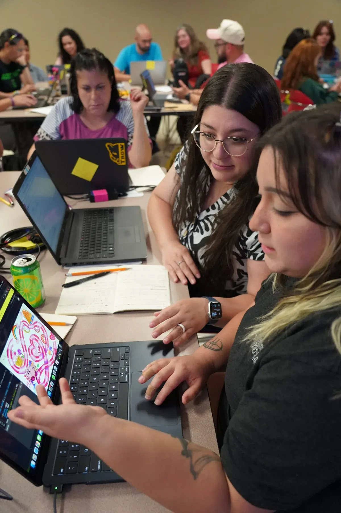
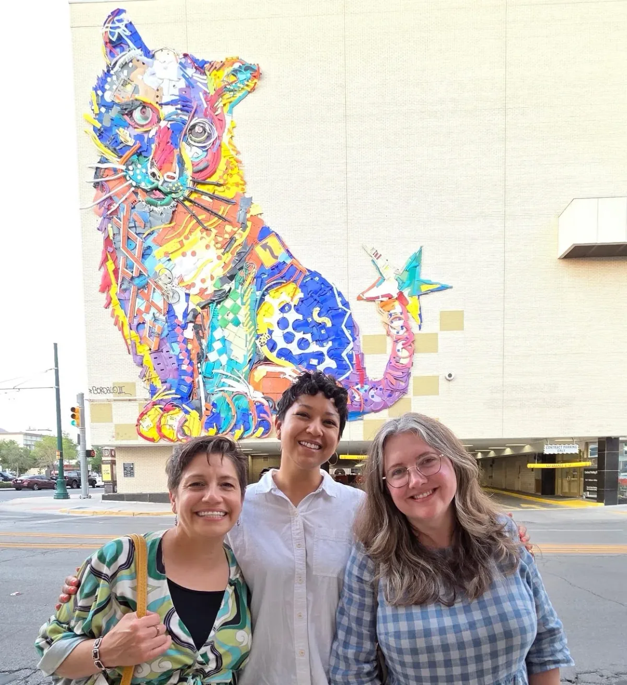
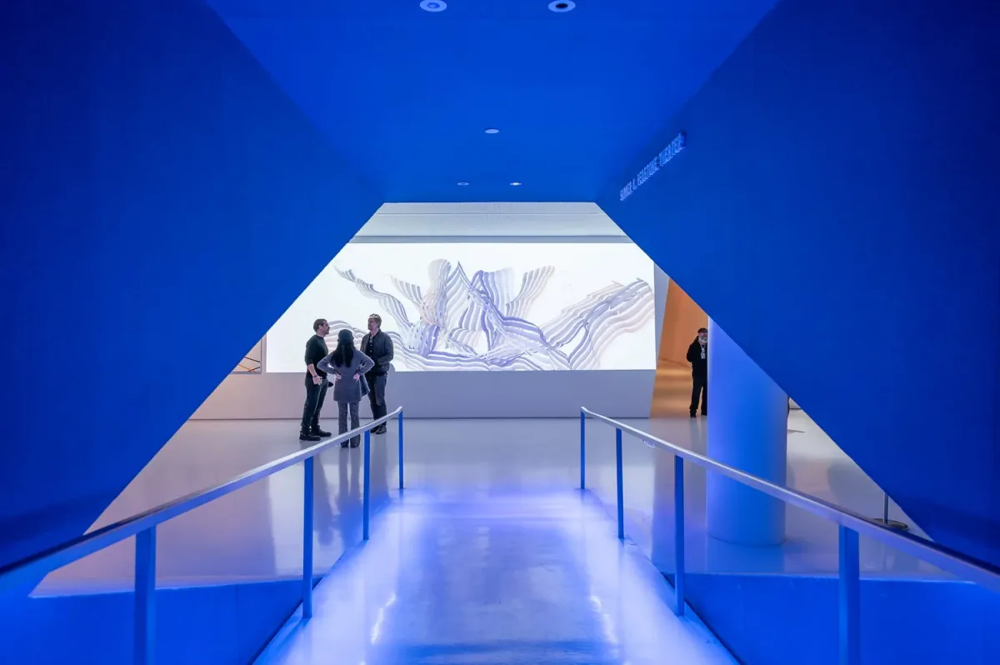
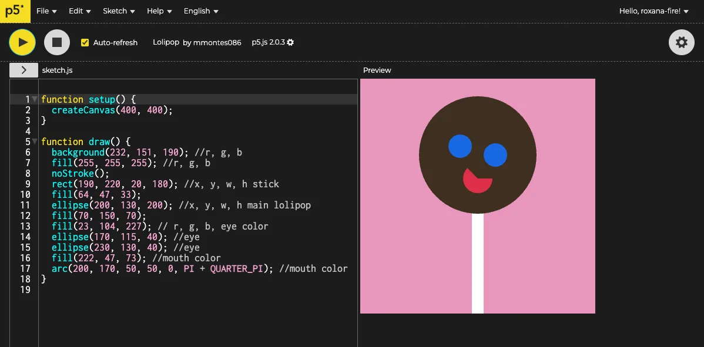
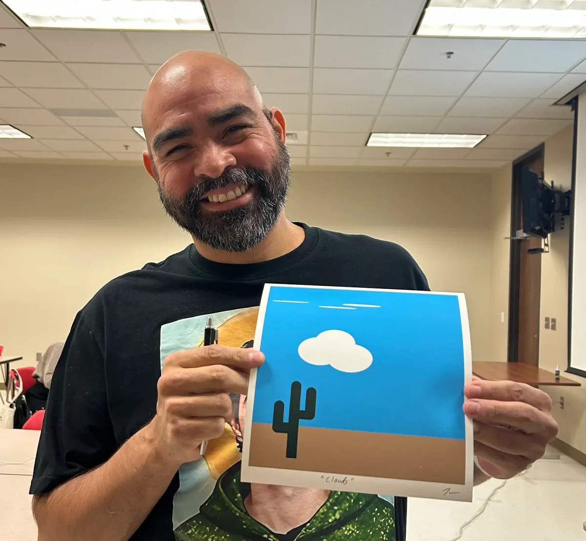
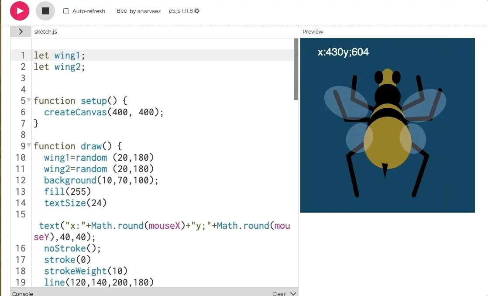
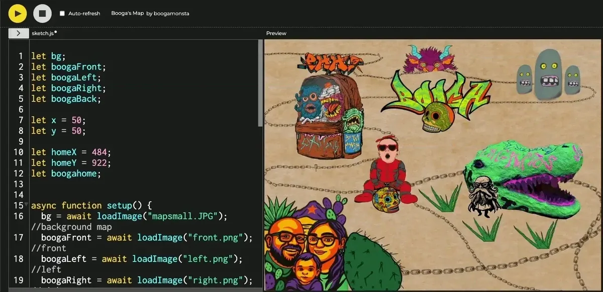
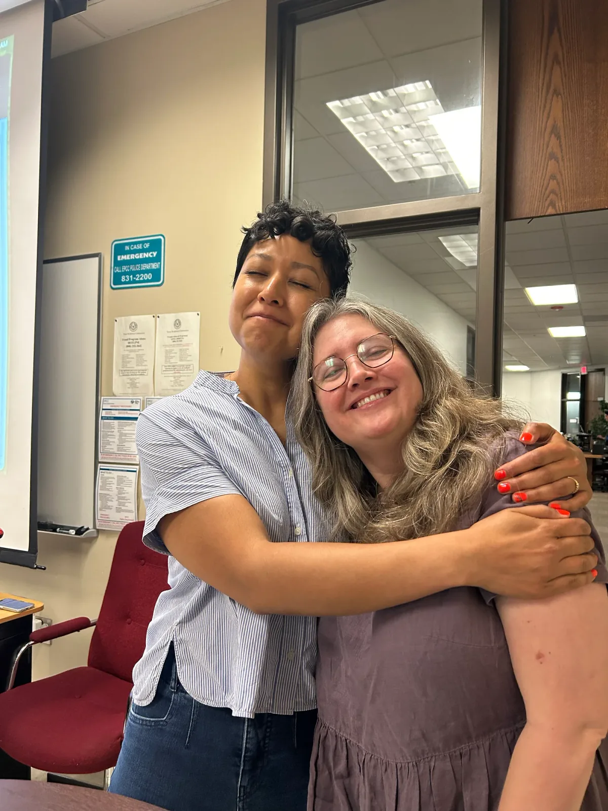
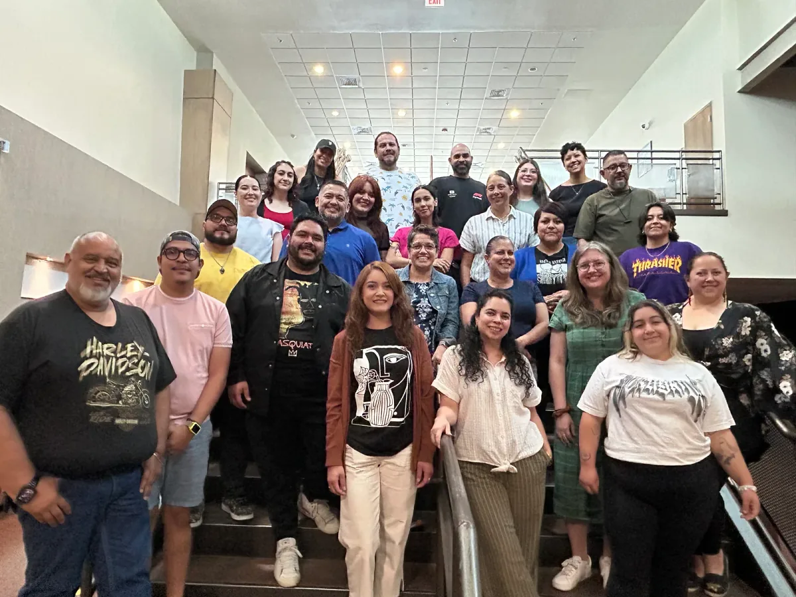

El Paso is a border town with a distinct identity, steeped in rich culture and
history. Every day, hundreds of people cross back and forth, by foot, car, even
skateboard, and Spanglish fills the air as a natural language of belonging. This
blending of cultures shapes the city’s creative spirit, and it was clear in the
hospitality and close-knit community the art teachers had built across three of
the major school districts. With support from a
[WeTeach\_CS](https://www.linkedin.com/company/weteach-cs/) grant in Texas, the
Processing Foundation joined that spirit by hosting a four-day professional
development workshop, where middle and high school art teachers explored coding
as a new language of self-expression.

_Art teachers using their own debugging skills and pair programming to problem
solve new software features for their hand drawn flat games._

For the Art + Code PD, we used [p5.js](http://p5.js), a javascript library built
by artists, for artists. On the first day of the course, we asked the teachers
“How many of you have always wanted to learn how to code?” Over half the group
raised their hand. And when we asked how many of them have never written a line
of code yet, again, over half. It’s often hard to know where to start when
learning how to code, and most learn-to-code platforms are focused on software
development for vocational purposes, not as a form of art-making. As we began
the week, they were all excited to experience [p5.js](http://p5.js) and its
low-barrier to entry along with its high ceiling for what is possible.

_Co-Executive Director, Dr. Roxana Hadad, Program Manager Amy B. Woodman, and
Co-Facilitator Adrienne Gifford pose in front of the 64-foot-tall mountain lion,
“Frankie,” by artist Bordalo Segundo. Photo by Candace Printz, Assistant
Director of Fine Arts at Socorro Independent School District, and President of
Green Hope Project, the organization that made this art installation possible._

_In showing examples of professional [p5.js](http://p5.js) artwork in museum
settings, Art + Code facilitators demonstrated how [p5.js](http://p5.js) was
much more than a “learn to code” environment. Aleksandra Jovanić’s “Returns” was
featured in the
[*Compositions in Code*](https://movingimage.org/event/compositions-in-code-the-art-of-processing-and-p5-js/)
exhibit at the Museum of the Moving Image in 2025._

This group of art teachers proved just how easy it is to extend artistic
practices into computational thinking practices. Art teachers know how to
imagine something from the blank page. They can visualize their ideas and
decompose the process into the steps it will take to build that idea. They can
follow an instinct to see where their ideas go, they’re good at improvising when
their curiosity nudges them in a new direction, and they’re comfortable
iterating on those ideas. We started slowly by first drawing a canvas on the
screen and then adding a rectangle here, a circle there.

On Day 1, we asked teachers to make a lollipop using circles and rectangles.

_“Paleta Payaso” by mmontes086, Michaela Monteros-Agness_

On Day 2: Still lifes:

_“Clouds” by Harry Sanchez_

By Day 3, teachers were making their own animations that are triggered by
keyboard and mouse interactions.

_“Wasp” by Amanda Narvaez_

And by day 4, they were building their own interactive flat games.

_Ivan’s Neighborhood Map by Ivan Ortega_

**“I am excited to share with my kids and continue learning it myself. I NEVER
thought I would be able to code ANYTHING.” — Liz, Art Teacher, El Paso, TX**

The design of the PD itself also reflected the equity and responsiveness at the
core of the curriculum. After listening to feedback from an earlier cohort in
Anaheim that summer, we made adjustments in El Paso: more upfront scaffolding,
explicit debugging practice, and clear reference sheets that teachers could
carry back to their classrooms. We closed each day with celebrations of
progress, reminding participants that learning code is not just a technical
process, but an emotional one as well. We looked at a research project called
[“Debugging Emotion”](https://kumu.io/kaelas/debugging-emotion#custom) by Dr.
David DeLiema and Dr. Maggie Dahn, which shows that coding is just as much about
socio-emotional learning, too.

Teachers left with classroom-ready projects like Lost and Found, Walk in the
Neighborhood, and Drawing Machine, all adaptable to their own students and
teaching contexts. Many teachers saw the possibilities of using coding beyond
art: connections to math, science, and humanities. For art teachers in
particular, coding unlocked new ways of blending analog and digital practices.
In El Paso, teachers even integrated cultural traditions with these contemporary
tools.

By the end of the week, spirits were high and teachers felt confident in
reclaiming coding as a form of creative expression, rooted in equity, access,
and community.

_Hearts full, Art + Code PD Facilitators Amy B. Woodman and Adrienne Gifford
pose for a final photo after the 4-day workshop._

_The El Paso cohort poses for a group photo in El Paso Community College._

Interested in bringing Art + Code to your school, district, or state?
[Learn more here](https://processingfoundation.org/education).
