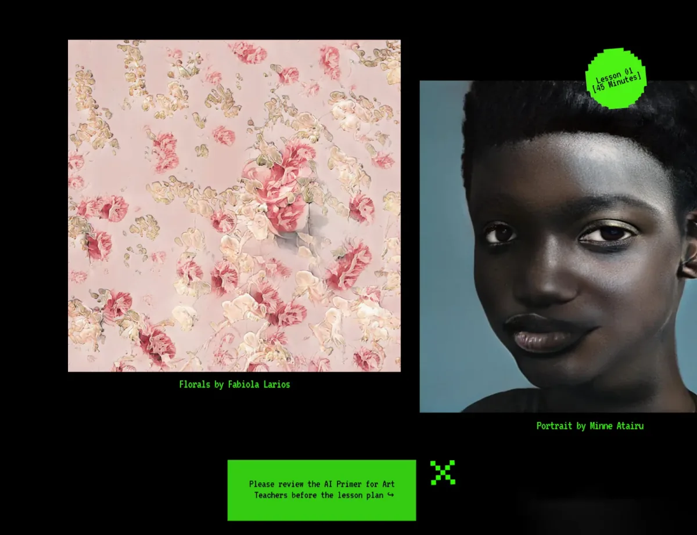

**Tell us about yourself.** My name is Minne Atairu. I am an interdisciplinary Artist and doctoral candidate at Columbia University. Much of my research and artistic practice explores the intersections between Art, Technology, and Education Art. I am interested in how Generative AI can be used to support artistic exploration and learning in K-12 classrooms. I currently live in New York City.

**What was your fellowship project?  
**In Spring 2021, I conducted a research study with Art Teachers in New York City Public Schools. Through the study, I sought to understand Art Teachers perspectives about Artificial Intelligence (AI) Art, with a focus on the lessons that we might draw from the Teachers responses, and how we might integrate their perspectives into K-12 Art classrooms. While most Art Teachers expressed an appreciation for Artificial Intelligence, there was also resistance, due to perceived lack of creativity and originality in AI Art, the erosion of pedagogical authority, gaps in technical knowledge, and artistic displacement. Overall, the study suggests that, in order to successfully integrate AI-based artistic processes in K-12 Art education, a number of issues need to be addressed, including: the need for greater AI literacy among Art Teachers, and the need to develop pedagogical resources and support structures that might help Art Teachers navigate the tensions between AI and traditional art-making processes.

*Screenshot showing the featured Artist section for the lesson plan on StyleGAN (Lesson One).*

Through the development of an ‘AI Toolkit for Art Teachers’, my fellowship project addresses some pedagogical needs that were identified in the above described research study.

The AI Toolkit is a web-based platform that provides Art Teachers with beginner-friendly educational resources needed to understand, experiment with, and integrate Generative AI processes into classroom teaching. Specifically, the toolkit offers resources related to two Generative processes that do not require any prior coding experience, and are relevant to the Visual Arts — StyleGAN and Text-to-Image Synthesis. The toolkit currently consists of the following modules:

-   **Module 1 — a Primer on AI for Art Teachers**: This module provides Art Teachers with an overview of Generative AI, Arts-based use cases, and ethical considerations to keep in mind when integrating into art classrooms.
-   **Module 2 — Experimenting with AI in Art Classes:** This module guides Art Teachers through the process of incorporating Generative AI processes into classroom teaching. It includes three lesson plans that offer concrete examples of how AI can be used to support artistic exploration and learning.

As the AI Toolkit is further developed, additional modules will be created to address specific concerns and needs identified by K-12 Art Teachers. In developing the AI Toolkit, I have worked closely with my mentor, Layla Quinones whose feedback and guidance has been essential in shaping the project.

**What were challenges that you encountered while doing your project?  
**One challenge that I encountered while developing the AI Toolkit was finding arts-based use cases that were accessible to K-12 Art Teachers. Many of my initial examples were either too technical, too complex, or too abstract. As a result, I had to find a balance between providing examples that were simple enough to be understood by someone with limited AI knowledge, while also being interesting and engaging enough to pique the curiosity of an art teacher.

Another challenge was developing lesson plans that would be achievable within a typical classroom setting. I had to be realistic about what could be accomplished in one class period. As a result, I focused on examples that could be implemented in a single class or integrated over multiple classes.

**What are some of the joyful moments that you encountered while doing your project?  
**Some of the joyful moments I encountered while working on the resource were when I was able to find use cases and examples that I knew would be engaging and interesting for K-12 Art Teachers. It was also great to receive feedback from my mentor, [Layla Quinones](https://twitter.com/MsQCSNYC), who is an experienced Computer Science Teacher. Layla’s feedback helped to ensure that the AI Toolkit was grounded in the realities of K-12 classrooms.

**What are words of wisdom you would have for future fellows?  
**My words of wisdom for future fellows would be to take the time to develop a clear understanding of your project goals and objectives. This will help to ensure that you are able to stay focused and on track as you work on your project.

[*Minne Atairu*](http://Minneatairu.com) *is an interdisciplinary Artist and doctoral student at Columbia University. Minne’s academic research emerges at the intersection of Machine Learning, Art Education, and Hip-Hop Pedagogy. Through the use of Artificial Intelligence (StyleGAN, GPT-3), Minne recombines historical fragments, sculptures, texts, images, and sounds to generate synthetic Benin Bronzes which often hinge on questions of repatriation, and post-repatriation.*
