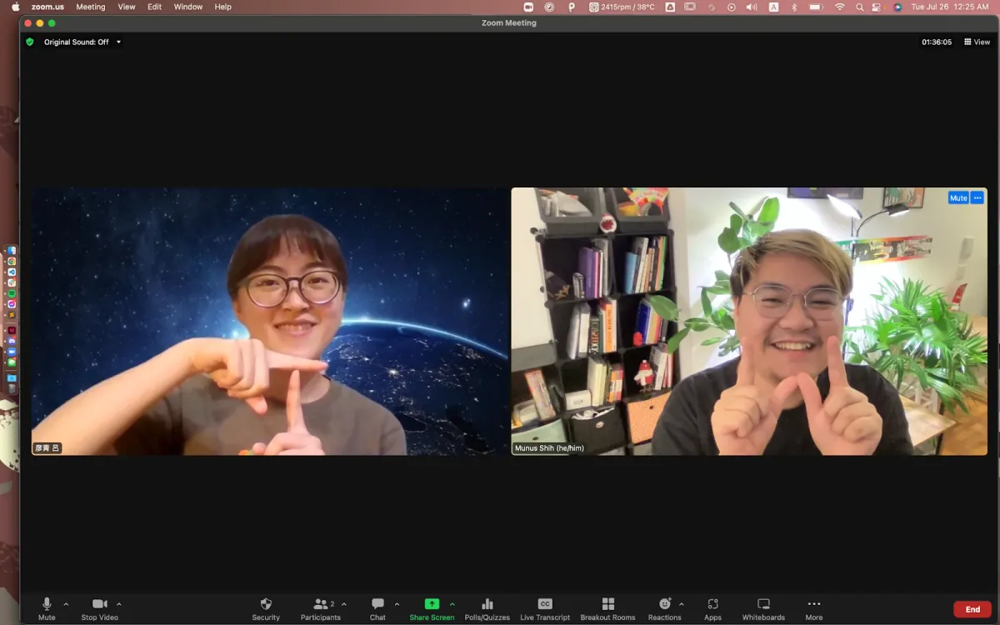
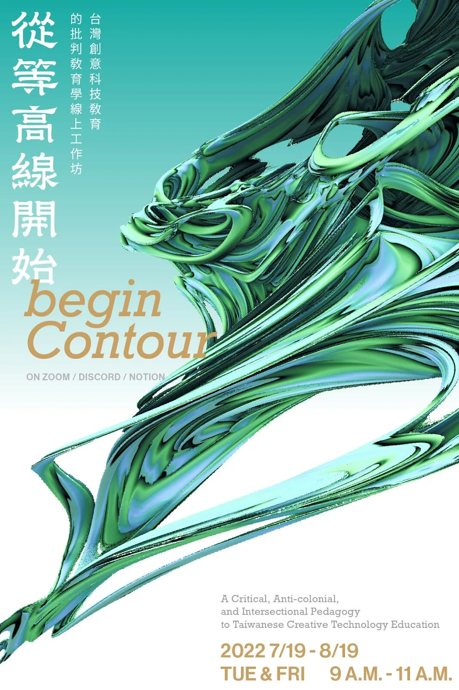
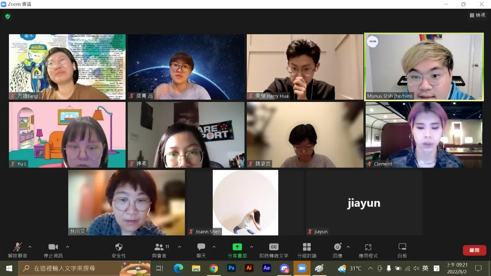
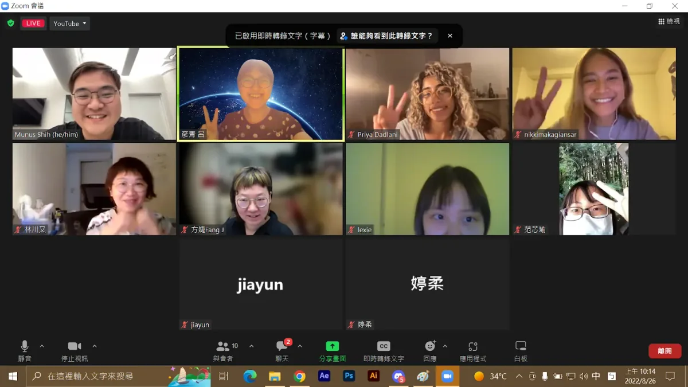
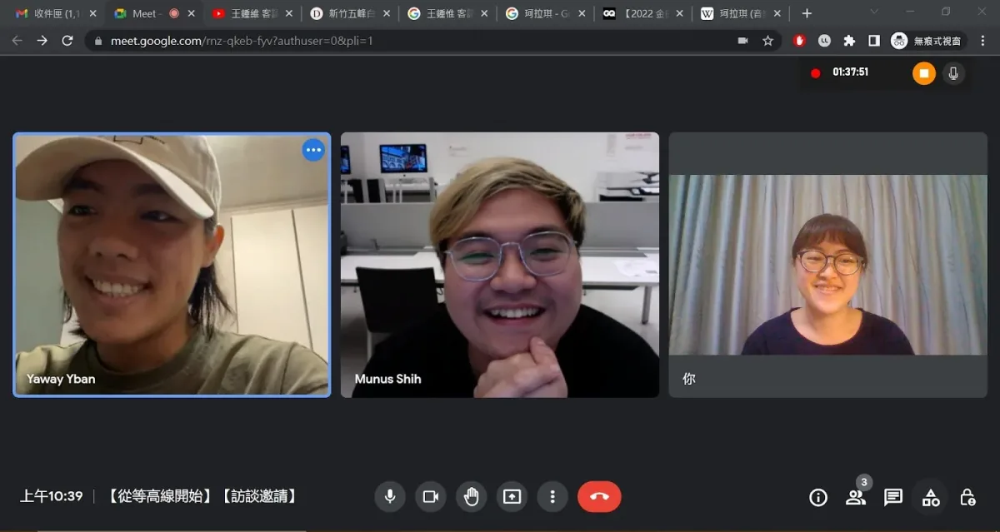
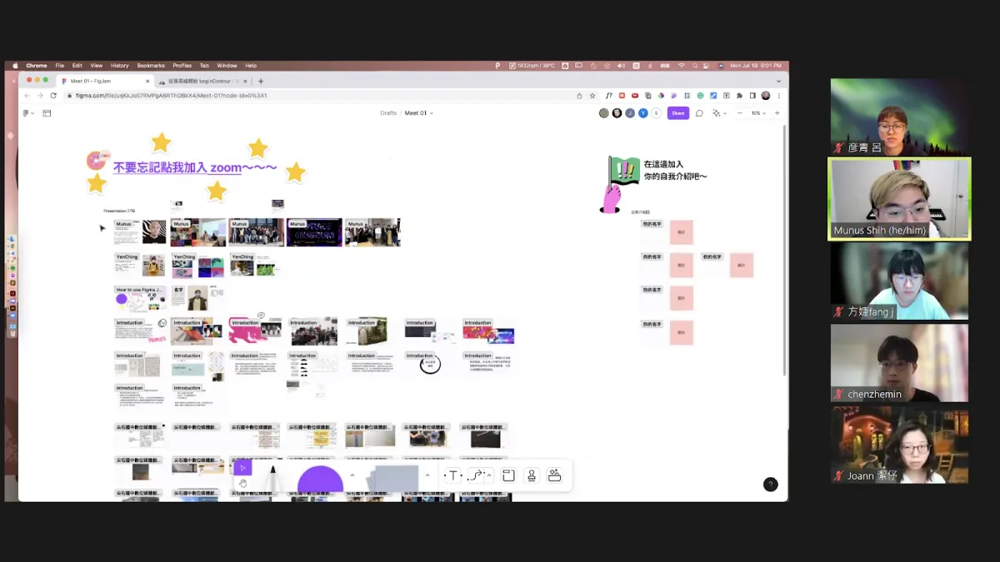

#### **Please introduce yourselves and where you’re located.**

**Yenching (Y):** Hi! I’m Yenching. I’m currently pursuing my master’s degree in Applied Arts at the National Yang-Ming Chiao Tung University (NYCU) in Hsinchu, Taiwan. I focus on studying speculative design, and bio-art. My research topic uses code and open-source software as a creative medium to share different kinds of perspectives on technology with indigenous students of Atayal in remote areas of Hsinchu.

**Munus (M):** Heyyy, I’m Munus. I’m a Taiwanese designer, creative coder, and educator, currently pursuing the Design and Technology MFA at Parsons School of Design in New York, USA. I use code to work with contextual data, bespoke algorithms, investigate queer theories, decolonial design studies, and experimental community building.

*A poster we designed for our online workshop. There are abstract green and line-wound cones in the picture to express the meaning of contour lines.*

#### **What was your fellowship project?**

**Y:** Our project “beginContour 從等高線開始: A Critical, Anti-colonial, and Intersectional Pedagogy to Taiwanese Creative Technology Education” is a teaching practicum. We invited many Taiwanese middle school teachers, art educators, experimental educators, designers, and creative coders to collectively reimagine creative technology through a more beginner-friendly and approachable technology education.

**M:** In a six-week process, we introduced participants to various critical, decolonial, and intersectional approaches to creative tech education. We also conducted lectures, discussions, workshops, and test runs to help them develop their own teaching tools and syllabus. It was intensive but we had a lot of fun!

**Y:** [We have archived all of our processes and materials here](https://munusshih.notion.site/beginContour-7f0ecc6ac1fe4fd0a411332d3efff105).

#### **How did the idea for your fellowship project begin?**

**M:** We started this project by noticing the lack of support and resources for creative tech educators in Taiwan. I took Professor Xin Xin’s class “code, decolonized” at Parsons last year where I was first introduced to the concept of intersectional, critical, and decolonial coding education. That experience opened up a whole new world for me and led me to start reading more into these different topics and got me very excited about sharing them with my fellow friends in Taiwan. However, I wasn’t able to find many resources written in Mandarin around the topic, and it became frustrating not only to me but to those other Taiwanese educators who are just as passionate as I am about critically challenging educational methods. They are hindered by the language barrier because English is simply not their first language, but that shouldn’t be why these resources are inaccessible. It became clear to me that there is something that needs to be done here.

**Y:** This got me thinking on my teaching experience in the “Digital Media Creation Club” at Hsinchu County Jianshi Junior High School, which is a school that comprises of mainly Taiwanese indigenous students. I teach my students how to express themselves through visual art and design using technology and open-source tools. From a school’s perspective, they see “technology” or more specifically smartphones as entertaining products that need to be controlled. Because of that, students are not allowed to use their phones in school and that makes it harder for them to think of electronic devices as a learning or creative tool. By adopting open-source software that could be operated on phones and mobile devices as my teaching tools, I wish to change the mindset students have with technology so they perform an active role in content creation or self-expression through tech.

**M:** It is very important to acknowledge that most of Yenching’s students do not have computers at home because it is not necessary for them, but they all pretty much have the latest generations of smartphones. Sometimes when we think of teaching creative tech, we immediately think of p5.js, Processing, and all kinds of cool things that could be easily done on desktop computers but not on mobile devices. This adds a dimension to our project where we have to give up things we’ve learned before and start focusing on what needs to be done here. Design for the real world. \*laugh\*

**Y:** True that. At the start of my teaching, I struggled with what I could offer and what content students would find connection to and interest in. I had to think over and over again in the teaching process about how to lower the financial and technical barriers for my students and make the classes more approachable. Also, as someone who is not indigenous teaching indigenous students, I need to constantly remind myself not to force my aesthetics onto my students. A lot of these things coincided with the critical, intersectional, and decolonial pedagogy in teaching tech Munus was interested in so we started to brainstorm about what we can share with other educators and how we can better support each other.

#### **Which community was the project for and why?**

**Y:** We want to share with people who want to know what critical pedagogy, creative technology, creative programming, or intersectionality are, and how these topics go together. People who do don’t need to have teaching experience, but believe that education is a sharing of knowledge and experience, not just a top-down form of teaching.

**M:** We also want to include people who do not know or are not proficient in any programming language, technology, or software, but are passionate about technology or creative technology. We believe that it is important to bring those people in, and believe that apart from the traditional computer science teaching method, there is another kind of technology education that is more suitable for beginners and approachable.

**Y:** Most importantly, we want to contribute to a community of people who are interested in studying Taiwanese art, design, aboriginal culture, decolonization theory, politics, and history and how those intersect with creative technologies.

**M:** We often are asked to simplify our target community and name specific groups of people in Taiwan that are doing the same thing, but I don’t think we have successfully done either of that \*laugh\*.

**Y:** I think that is also why this project is worth doing for us. We are creating an invisible community that has not been well facilitated in Taiwan. A community that will not only support critical educators who are directly teaching art and design using creative technology but other people who are also working with the same or very similar topics through other possible contributions.

*A screenshot of a zoom meeting. At the time, there were 11 participants discussing the theme of the week. Everyone’s video background was colorful and showed different personalities.*

*A screenshot from our online workshop. There were ten participants. One of them was clapping, and four others posing with a peace sign. This was a group photo at the end of the speech, and everyone was smiling happily.*

*This is a screenshot of a zoom meeting. At the time, Munus and Yen-Ching were interviewing 曾林彥均, a design student of Atayal background. Three people appeared side by side on the screen and laughed heartily.*

#### **What were challenges that you encountered while doing your project?**

**Y:** I think the biggest challenge definitely was the time difference. Because our mentor Yindi, Munus, and I are respectively located in California, New York, and Hsinchu, Taiwan. It was really hard to find a time that works for the three of us, one of us always had to stay up really late or wake up super early in the morning.

**M:** Another challenge I think is how the cultural nuances get translated, both linguistically and figuratively. I studied decolonization theory in the U.S., but am applying what I have learned in the Taiwanese context, and will have to eventually translate it back into English to share it with others. There are many layers of translations both culturally and linguistically being conducted here, and I feel like sometimes the very nuanced things get lost in translation.

Taiwan is an island that has experienced waves of colonization by the Spanish, the Dutch, the Chinese, and the Japanese. A colonizer in the past might be colonized by another settler in the future, and some people might be oppressed by their own ethnicity or cultural group if they support a different dynasty or just simply immigrated from different regions of the same country. I find it very hard to use proper language to describe what has happened on the island, let alone translate it into my second language. It is a string of history that is very tangled and convoluted with politics and power dynamics, and sometimes it is hard to name very specifically what we are “decolonizing” as the word means different things to different groups of people on the island. However, these histories all shaped the communal experience as a Taiwanese now and it is important to acknowledge that even though it is hard to “decolonize” right now, we can all be “anti-colonial” and bring in care and support into our community and together perform communal healing.

**Y:** If I have to add one more thing, I think we didn’t really understand how “Education is a long process” when we first started the project. Because of the timeline of our 3-month fellowship, it was hard to find people to collaborate with. At first, we were eager to collaborate with indigenous schools and really rushed to make it happen, but then we realized we need long-term plans to work with institutions and short-term rushed collaborations will only bring them greater harm. We both first really wanted to dive deeper into the field, and later agreed that we needed to focus on what we had planned for the sake of time.

**M:** I think one last thing we found out during the process is how privileged we are.

**Y:** We certainly are!

**M:** The fact that we are able to share what we are sharing is very fortunate. Even though there are many creative technology educators in Taiwan who are thinking of bringing these values into their pedagogy and coming up with alternative teaching methods, they have to face pressures from the current educational system and will not be able to make too big of a change in fear of losing their job. So, to be able to be here and talk about these things, facilitating a group that opens many other discussions without pressure from institutions is indeed very privileged.

*A screenshot of a zoom meeting. On the left side of the screen, we use Figma to share various information and links with everyone, and on the right side are the participants.*

#### What are some of the joyful moments that you encountered while doing your project?

**Y:** During the workshop, one of the participants of our project invited me to go to Sun Moon Lake (Nantou County, Taiwan) to participate in the design-oriented teaching workshop for Taiwanese teachers. That really opened my eyes and I realized there are still many things that I need to learn. I am also excited about the possibility of more community connections and collaboration brought about by the project itself.

**M:** I think as a designer, there is always that tendency of “making something”, anything, and you would question yourself if your project is really “doing something” when most of it is discussion based. But then, I appreciate everyone’s genuineness and the ability to be vulnerable in the discussions. We went from total strangers to a warm loving community for open-minded educators, all thanks to this experience of community building and organizing. I don’t think we would’ve been able to achieve what we did if we didn’t think of ourselves as organizers and not just designers. The transformative experience really brought me joy.

Another thing to mention is that, in the beginning, I was worried that I didn’t have the right to talk about these things, or that I didn’t know much about the existing communities having studied these concepts in the U.S. However, the feedback and input we got from our participants blew my mind and made me realize the true importance of holding space. It was a real pleasure to see that the ideas that we shared with our participants were able to reach different communities and spaces in Taiwan, and the experience inspired them to develop their own teaching materials with the intersectional, critical, and anti-colonial approach.

#### What are words of wisdom you would have for future fellows?

**Y:** I am very fortunate to work with Munus on this project, and we often support each other to improve the content of the project. So I highly recommend organizing your own project with your friends!

**M:** I could never finish this project without Yenching. We entered this project together without much experience in the field, not knowing much about what was coming next. We went from being terrified of letting people down to being able to talk confidently about what we have done. Most importantly, I want to thank the old us who submitted that application form for fellowship, who back then didn’t know how hard this was going to be \*haha\*. Because it is that leap of faith and the embrace of unknown possibilities that truly made the project work.

#### **Who were sources of support for you throughout your fellowship?**

**M:** First, I want to thank [Xin Xin](https://xin-xin.info/) who inspired me to do this project and encouraged me to start applying. We will not be here sharing this project without you. We also want to thank our mentor Yindi who guided us through this fellowship with much love and support. We truly appreciate it.

**Y:** This project would also not exist without [Qianqian](https://qianqian-ye.com/) from Processing; Jay and his amazing open source generative music software [Polymorph](https://jaytobin.com/polymorph/); Priya and Nikki from [SPICY](https://spicyzine.wordpress.com/) who gave an amazing talk about community building and resilience, 哲民 and his thorough ethnography in Atayal, 大亨 who have been supporting us since we were in undergrad, 曾林彥均 who shared with us his experience as an Atayal design student, Anoushka Khandwala who permitted us to translate her beautiful article “[What Does It Mean To Decolonise Design](https://eyeondesign.aiga.org/what-does-it-mean-to-decolonize-design/)”… and most importantly, everyone who participated in the project!

**M:** This project is merely a start of a much larger project that requires more help from people with various different points of view and interdisciplinary backgrounds. We are proud to present what we have done within the three months period, but there are definitely more that could be done. We won’t stop here and please let us know if you’re interested in joining us on a bigger journey or simply want to share your thoughts with us. You can reach us through [munusshih@newschool.edu](mailto:munusshih@newschool.edu) or [yenchinglu.hs09@nycu.edu.tw](mailto:yenchinglu.hs09@nycu.edu.tw).

**Y:** An alternate approach to creative tech education is possible. Let us begin contour.

*Being born and raised in Hsinchu, Taiwan, both* [Yenching](https://fb.me/yenchinglu.xyz) *(she/her) and* [Munus](https://munusshih.com) *(he/him) have strong connections to their local art and design community and for the past four years have been trying to cultivate one. In 2018, they started the first design-focused group “Tzaiwu Graphic Design” at National Tsing Hua University, where they hosted various art and design workshops, gave out lectures, invited speakers, and hosted discussions about the critical aspects and politics of design in the Taiwanese contexts.*
