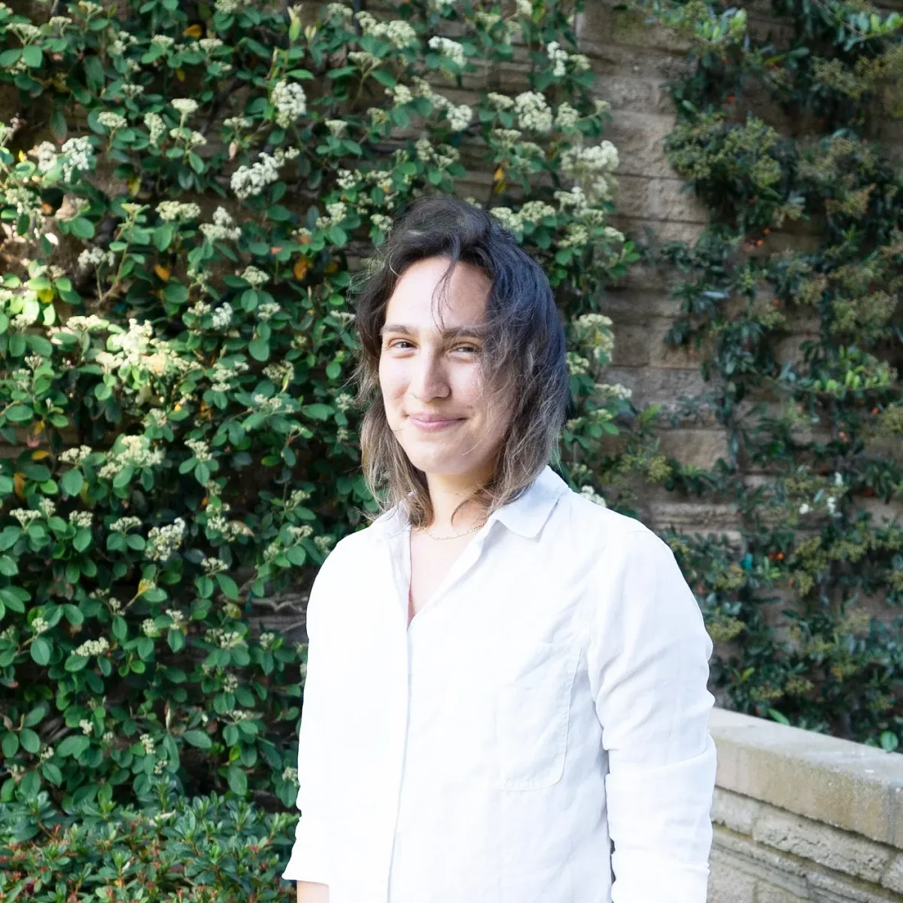

#### by evelyn masso

***evelyn masso (she/they)** is a person (all the time), a tech worker (on weekdays), and a poet (on weekends). She was a p5.js Fellow in 2019 and has spoken about issues of access in software at venues like the Frank-Ratchye STUDIO for Creative Inquiry, the W3C TPAC, and Write/Speak/Code. Originally from Ohio, she currently lives on unceded Tongva land (near Los Angeles) with a rapidly growing collection of houseplants. She spends her free time rollerskating, making silly jokes, and reading queer fiction. \[**image description**: evelyn wearing a collared white shirt, standing in front of a stone wall covered in ivy. She is light skinned with shoulder length brown hair and looking at the camera, smiling slightly.\]*

Hey everyone,

I’m so thrilled and grateful to be writing this post. I want to share a bit about myself and how I came to the p5.js community. This role and project hold meaning for me in a few ways, each one with its own beginning.

### the beginning of a beginning

My first experience with p5.js was actually with Processing in 2010, before p5.js had started. In the middle of trying to major in interior architecture at Miami University (the one in Ohio not Florida), I took an independent study about interactive objects. I learned about variables and if-statements, and made an interactive lamp that turned on and off when you tilted it back and forth. If it wasn’t for Processing and Arduino, I never would have learned how to code, or even wanted to learn how to code.

I was enchanted with the idea of being able to make magic objects, and after a few more interactive art classes, I became enchanted with making objects that made people feel something. Finding ways to express myself within the safety of building something meant a lot to me. It was something I could believe in, even as a closeted, young trans girl who had a lot to learn about how to be themselves. There weren’t a lot of those things for me growing up as a perpetual outsider in rural southeast Ohio.

I finished my undergrad degree with a double major in interactive media and psychology, and a thesis project called [Coordination Table](https://www.outofambit.com/coordination-table). It’s a table that tries to help two people build their relationship by analyzing their nonverbal behavior and printing out short stories for them to talk about. I used to think this piece was about social anxiety, but now I know it’s really about building relationships and community.

### a beginning and a middle

I got involved with p5.js itself much later (around 2016) when I started facilitating “Intro to Contributing to Open Source” workshops with Emma Cunningham and Rebecca Bever as part of [Write/Speak/Code](https://www.writespeakcode.com) Los Angeles. I felt a lot of responsibility to the folks who were contributing to an open-source project for the first time; I wanted to give them an environment of support, respect, and care. It’s a vulnerable process, and the way open-source projects treat newcomers makes a huge difference. p5.js was the only project I knew I could rely on to provide that welcoming space. I’d already contributed to other open-source projects, and I’d learned the basics of how p5.js worked so I could facilitate these workshops. I even fixed [a couple bugs](https://github.com/processing/p5.js/pull/2127) that we ran into during the workshop.

When I was [a p5.js fellow in 2019](https://medium.com/processing-foundation/interview-with-evelyn-masso-2019-p5-js-fellow-7ac6769704df), I came in with an engineering-heavy mindset. I kept asking myself, “What could I code for p5.js?” and then doing it. Before long, that didn’t feel rewarding for me; I was treating myself like a resource to extract labor from, without regard for what felt fulfilling for me. I had to revisit why I had first come to p5. Two to three years isn’t a long time, but I felt pretty far from the workshops I had initially done with p5. I started doing workshops again, leaning into conversations about what was uniquely important about the project and community of p5.js.

Since then, I’ve realized that I don’t work on p5.js so I can write code, or even so I can use it to make art. I work on p5.js to build and enjoy community.

### beginning to find community

However, I didn’t feel like a real part of the p5.js community until about a year and a half ago, in late 2019 / early 2020. This shift started with [Processing Community Day](https://day.processing.org) Los Angeles. Although it was a great event, and I knew many [wonderful people](https://day.processing.org/people.html) there, I spent much of it feeling somehow out of place. I even told a new friend I’d made there that I’d been involved in p5.js for a few years, but I wasn’t “established in the community.” Later in the day, I realized that in fact I had been involved with p5.js for longer than at least half of the people at the event, and that I’d developed relationships with most of the people I would have said were “established in the community.” I don’t think tenure is the way to measure our place in a community, but the realization got me thinking.

If I wasn’t part of the community, how could I expect so many people who were newer than me to feel that they were? Wasn’t that the whole point?

After that, I started telling myself that I *was* a member of the p5.js community, because if I wasn’t, how could anyone be if they hadn’t worked on it since the very beginning? That wasn’t how I wanted it to work, and I knew it wasn’t how [Lauren](https://lauren-mccarthy.com) or anyone else wanted it to work.

Starting then, a big part of my approach to working on p5.js is deciding that I *do* belong, that I *do* matter, and that I can extend that same feeling to others. It’s both giving myself what I desire (to feel that I belong and that I matter), and helping to support the kind of community I want to be in.

### beginning with Qianqian

I remember seeing Qianqian at that Processing Community Day from across a room and thinking “I’ve seen that person and [their art](https://www.instagram.com/p/BdDzunJhg0E/) on Instagram… they are *very* ***cool.***” But I felt too scared to go up and say hi. Lucky for me, I got connected with Q later that year because we were both Processing Fellows and they were moving to LA.

Later that year, we met up in a bar in San Francisco and bonded over worrying about our Fellowship projects and sharing a distaste for all-male panels. A few months later, we co-facilitated the javascript part of a [coding + weaving workshop](https://womenscenterforcreativework.com/events/digital-weaving-physical-computing/) with [Ahree Lee](https://www.ahreelee.com) and [Berfin Ataman](http://www.berfinataman.com). I got to see Qianqian’s breadth of references and unique perspective to building curricula up close.

I really enjoy being friends with and working with Qianqian. We have similar values, complementary skills, and we communicate with each other well. Many of our hangouts or meetings have a “feelings check-in” at the beginning. Qianqian lets me be intense, and sometimes they are more intense than me (especially when they have some tea called “Morning Thunder” 😧). It’s nice to feel like we can trade off! I’m a huge fan of their work, especially the [Qtv video series](https://medium.com/processing-foundation/interview-with-2019-fellow-qianqian-ye-799c0115c295) and the [Censorship Resistance Toolkit](https://thefutureofmemory.online/toolkit/).

I would not have applied or accepted the p5 lead role alone. I’ve been around this project long enough to know there’s a lot of different things to be done. I struggle to feel like any amount of effort is enough, even when that effort comes at the expense of my own wellbeing. I wanted to do this with someone else because I want us to hold each other accountable and show each other care in our work. I like to think of me and Qianqian [as a little community](https://medium.com/cosmicpropulsions/april-21-2021-for-ocean-1acec93e0e9c) within a larger one.

### beginning again

Since the [p5.js Contributor’s Conference](https://p5js.org/community/contributors-conference-2019.html) in 2019, we’ve been [talking about access](https://github.com/processing/p5.js/blob/main/contributor_docs/access.md) a lot in p5.js. There are many people we want to build access for, in code and community and more. I’m excited to begin again with p5.js, to build a deeper and wider community with Qianqian and all of you: the people who’ve made p5.js what it is *and* the people who will in the future. Maybe you’ve been involved since the beginning, maybe you’ll come say hi for the first time next week, maybe you know some of us and you’re curious to know more. Now more than ever, if you are (or want to be) doing the work to increase access to p5.js and you wonder “Do I belong here?” or “Is this for me?” the answer is **you do** and **it is**.
