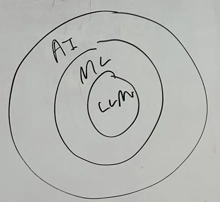

On March 15th, Processing Foundation partnered with the [Clinic for Open Source Arts](https://clinicopensourcearts.org) to host a thought-provoking focus group at the [Open Source Arts Contributor Conference](https://opensourceart.cc) at [New York University’s Interactive Telecommunications Program](https://tisch.nyu.edu/itp). The conversation centered on large language models (LLMs) in K-12 creative coding education, and the challenges and affordances LLMs bring to learning experiences. The discussion was focused on questions like: How does the complexity of being human enhance learning? What role does human connection play? How can we empower students and teachers amid rapid technological change?

Special thanks to the amazing K-12 educators and artists who joined us for this incredible conversation: [Aarati Akkapeddi](https://aarati.online), [Lauren Berrios](https://www.instagram.com/lab_mediaarts/), Meghan Clark, [Jackie Liu](https://jackieis.online), [José Olivares](https://joseolivarez.com), [Tess Ramsey](https://tessramsey.com), and [Carrie Wang](https://carriesijiawang.com). Executive Co-Directors [Xin Xin](https://xin-xin.info) and [Roxana Hadad](https://www.linkedin.com/in/rhadad/), p5.js Editor [Rachel Lim](https://www.linkedin.com/in/rachel-lim-324a8ab6/), and Program and Communications Coordinator [Suhyun Choi](https://www.suhyunchoi.net) represented Processing Foundation.

### Defining AI, ML, and LLMs

We all felt that the terms “Artificial Intelligence (AI),” “Machine Learning (ML),” and “Large Language Models (LLMs)” were being used interchangeably in the public sphere, and wanted to define them and provide examples before we dug into the discussion. In general, we saw them fitting into a concentric Venn diagram, with AI being the broad term that referred to “technology that mimics intelligence,” ML referring to “the process of gathering data and using learning to algorithms to make predictions,” and LLMs as “a subset of ML that learns from text and can emulate human writing styles”. The group also discussed the importance of understanding the history of AI — how it came from basic chatbots and chess-playing programs that followed set rules, to now systems that are adapting and learning with the experiences they are exposed to.

> In general, we saw them fitting into a concentric Venn diagram, with AI being the broad term that referred to “technology that mimics intelligence,” ML referring to “the process of gathering data and using learning to algorithms to make predictions,” and LLMs as “a subset of ML that learns from text and can emulate human writing styles”.

*Defining AI, ML, and LLM diagram.*

### Process vs. Product in Learning

While LLMs certainly facilitate the coding experience in some way, the group expressed concerns about students becoming too reliant on them and therefore not developing the necessary computational thinking skills (e.g. being able to decompose a problem) necessary to understand why an AI is producing certain outputs. By providing immediate answers, LLMs shortcut the “meaningful friction” and “human messiness” that helps build skills by removing the process of arriving at a solution and instead just providing immediate answers. We agreed that we wanted to elevate the importance of teaching problem-solving skills, skills for looking at code critically, and the need for students to be able to articulate their thought process when coding. We discussed the potential of using AI tools as a tool for learning, rather than a replacement for it.

### When and How to Introduce LLMs

Age appropriateness was mentioned as a significant concern, with some group members mentioning 13 as the minimum age to interact with an LLM. This suggested age requirement is due to beginner students:

-   Not understanding the fallibility and non-objectivity of AI because of the data it is comprised of
-   Not understanding that responses are coming from a machine that lacks nuance
-   Struggling more with LLM responses due to a limited vocabulary and the inability to develop appropriate prompts
-   Developing a dependency on AI rather than using it as a resource.

One educator suggested “challenge levels” (mild, medium, spicy 🌶️🌶️🌶️!) where LLMs are introduced at more advanced stages, while another educator proposed teaching a “hybrid” approach that introduces the appropriate use of AI from the beginning of a coding education, so that students can develop a healthy understanding of when to use AI from the get-go.

Instead of providing answers, the group would rather have an AI help give prompts or hints to students. LLMs could be valuable as scaffolding tools that guide students at appropriate learning levels; i.e. the guidance an AI system should provide a 6th grader needs to be entirely different to the guidance it would provide a 12th grade student.

### Practical Classroom Strategies

Rather than viewing LLMs as replacements for traditional learning methods, the group saw potential for LLMs, when used with extreme caution ⚠️, as supplementary tools within a broader educational approach that still values core computational thinking skills.

#### Pre-coding Activities

One way the group thought to circumvent the overreliance on using LLMs was to get students thinking computationally before even touching a computer. Teachers can encourage students to

-   Design or draw their project on paper first and aim to have their program produce something very close to the drawing;
-   Work backwards, i.e. “What code would create this visual?”
-   Pseudo-code before implementation; or
-   Make architectural and design decisions before coding begins.

#### Structured LLM Use

Effectively integrating LLMs into coding education requires a strategic approach, and teachers need to set clear guidelines for when LLM use is appropriate. In order to promote students’ ability to code independently, educators should encourage students to not use LLMs as their first attempt at coding and instead:

-   Use LLMs primarily for debugging rather than initial coding
-   Talk through their code and explain their choices, where they used AI and why
-   “Ask 3, then GPT, then me” approach to balance human and AI assistance, by having them approach 3 peers, then ask an LLM, and then approach the teacher with what they know.

### ***Preserving Student Agency***

The group felt strongly that it was important to create an environment where AI is viewed as a collaborative tool that enhances learning, not a replacement for student creativity and critical thinking. In order to do this, they outlined strategies:

-   Empowering students to make conscious choices about when and how to use LLMs, teaching them to discernAI assistance.
-   Developing metacognitive and computational thinking skills by requiring students to reflect on their decision-making process and the value of AI interactions.
-   Creating assignment structures that reward original thinking and creative problem-solving.
-   Helping students understand the ethical implications of AI use, including issues of academic integrity and the importance of intellectual and creative ownership.
-   Encouraging students to view LLMs as a skill-building tool that can help them learn and grow, rather than a shortcut to completing assignments.

> In general, educators wanted students to experience the joy in research, discovery, and the “messiness of human experience”.

#### Student experiences

Students also seem to feel conflicted about the use of LLMs. On the day before the focus group, Roxana Hadad visited the Advanced Placement Computer Science A class of Joshua Hans, a teacher at [Franklin Delano Roosevelt High School](https://www.fdrhs.org). Students mentioned feeling “dirty” or “icky” when using AI for schoolwork, and one student pondered aloud whether AI is “making us dumber”.

But interestingly, the conversation landed on the students seeing LLMs as “unreliable friends” — occasionally convenient but not trustworthy.

In other words, LLMs are more like study buddies that can help us learn — but only if we use them wisely. The magic happens when we treat AI as a collaborative tool that sparks our curiosity, not a shortcut that does the thinking for us. By staying curious, asking questions, and remembering that the most important part of learning is the journey. We can turn these technologies into something that actually makes education more exciting and accessible.

Would you like to support us in sharing accessible educational models for creative open-source tools? [Donate today](https://processingfoundation.org/donate) to help sustain and grow the impactful work of Processing Foundation! Your donation supports our organization’s mission to provide self-determination to youth in open-source education. Thank you for your unwavering support.
