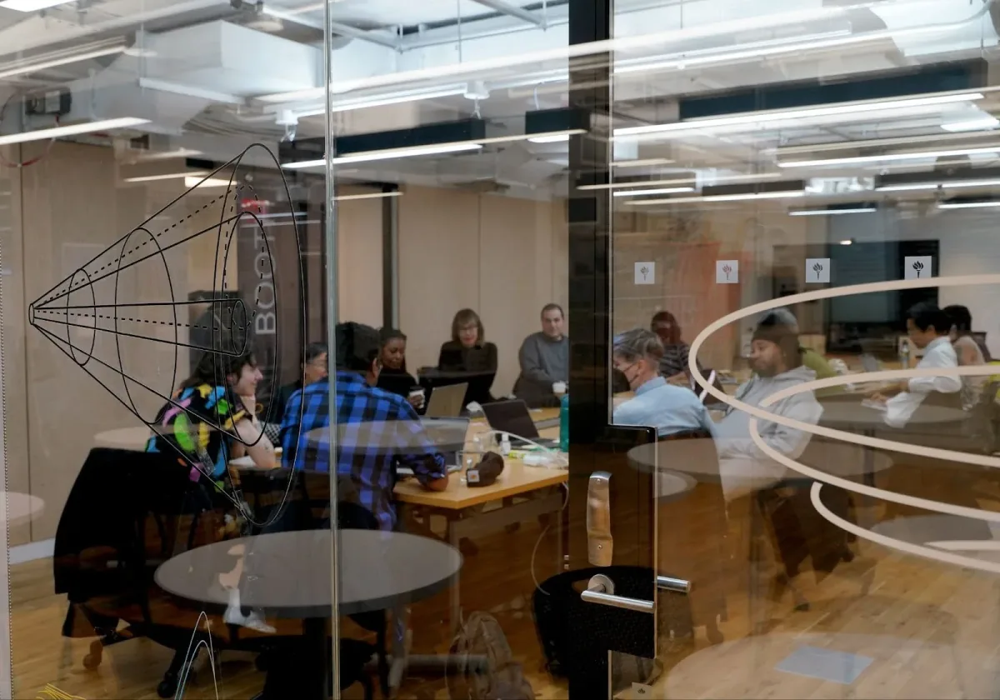
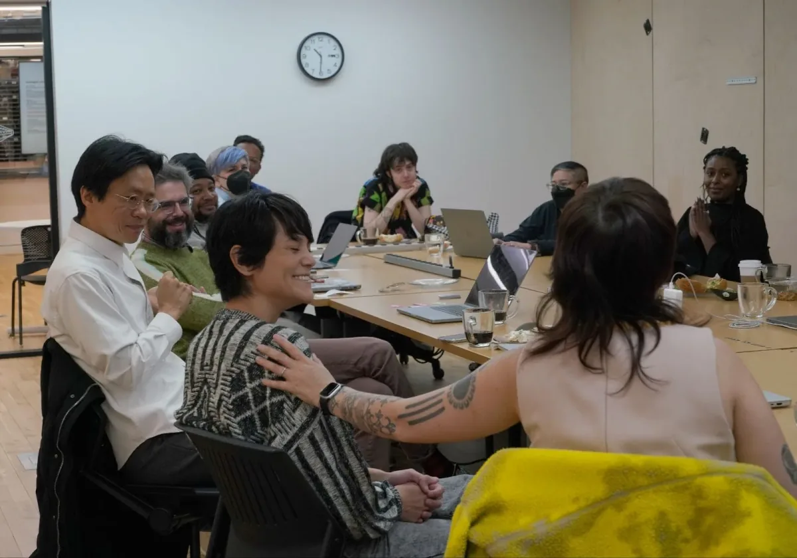
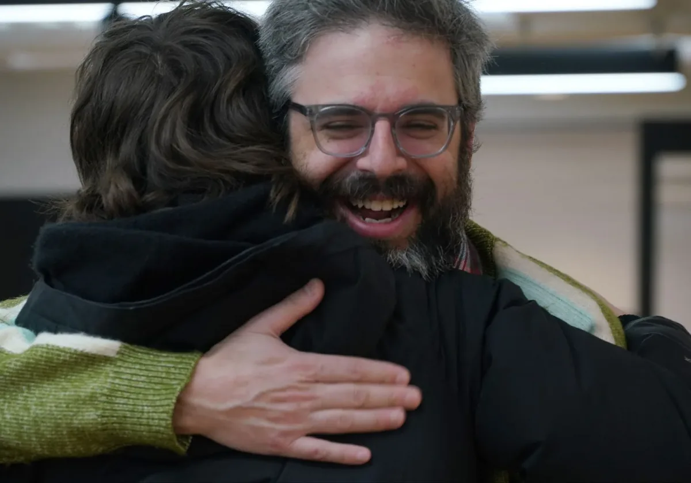
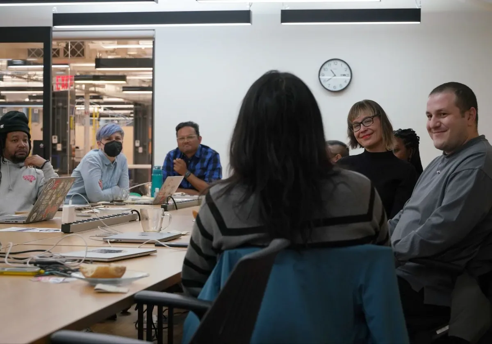
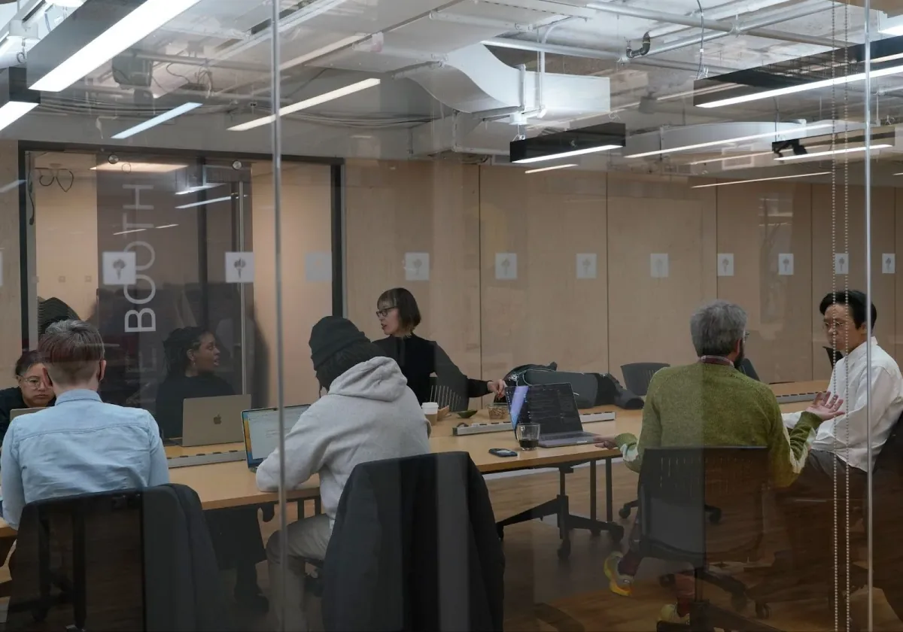
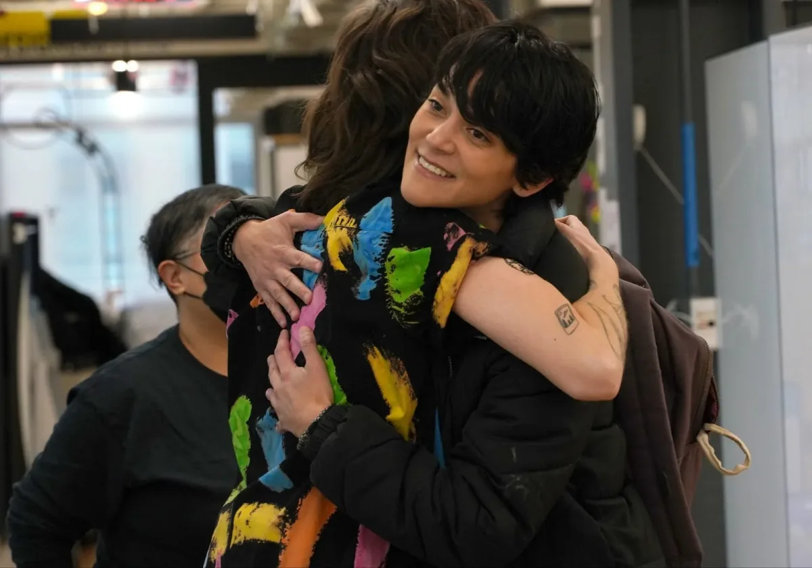
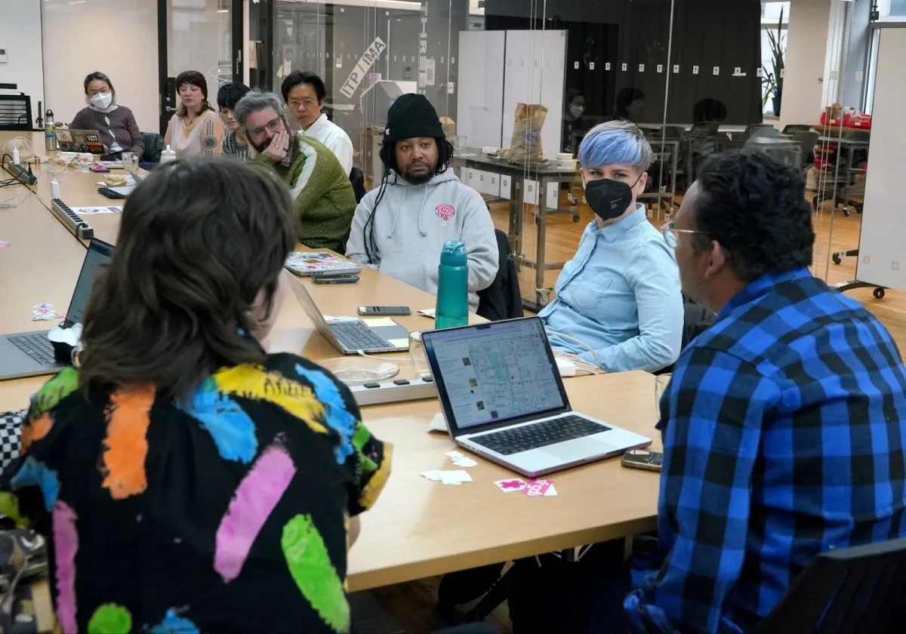
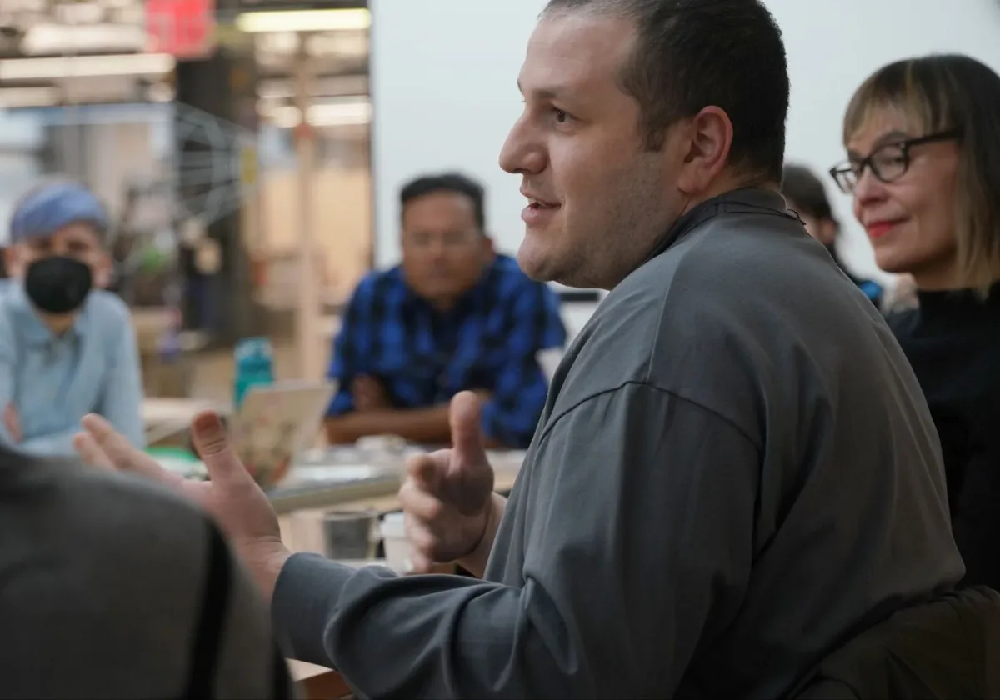

*Processing Foundation Board Retreat 2024*

> “The board retreat made me feel a sense of, oh, this is what it looks like when you slow down and actively listen. An embodied practice to listen, even when it’s most difficult to do that.”

> — Dr. Dorothy R. Santos, Board of Directors Treasurer

This past January, we held a productive board retreat at NYU ITP with our new board of directors and advisors, staff, and community members in person and via Zoom. This gathering created a rare opportunity to engage in rich discussions to shape the foundation’s future. With the [addition of eight diverse and talented individuals to the board of directors](https://medium.com/@ProcessingOrg/board-transitions-new-and-departing-members-fc5bc1d06db4) and the support of our community, the foundation is set to make powerful transitions that sustain and deepen our impact.

**Processing Foundation Board Retreat 2024**

The retreat focused on sharing visions of the future, brainstorming on inclusivity, emphasizing transparency, community engagement, and software accessibility. As we progress, the Processing Foundation is excited about the new perspectives and energy the new board of directors bring, promising a future where creativity and technology converge with care.

> “The board retreat was a pivotal moment, allowing us to delve deep into the organization’s goals and strengthen our connections, both old and new. Meeting people in person whom I’ve only known virtually deepened relationships and provided a clearer understanding of the foundation’s inner workings.”

> \-Wesley Taylor, Board of Directors member

**Snapshots of the 2024 Processing Foundation Board Retreat**

> “Even in a tech-centered conversation, relationships should be prioritized over technology. It’s about fostering connections that propel us into the future.”

> — Wesley Taylor, Board of Directors Member

We invite you to learn more about the people we are honored to have steer our community in our following medium article, [Board Transitions: New and Departing Members](https://medium.com/@ProcessingOrg/board-transitions-new-and-departing-members-fc5bc1d06db4). This group’s collective expertise and passion promise to build on the foundation’s legacy, mission, and impact. Below is a message from [Lauren Lee McCarthy](mailto:lmccart@ucla.edu), creator of p5.js, that encapsulates the spirit and ethos of how we build and strengthen community relationships. Their message reflects how we hope to hold space for our Processing Foundation team, board members, and our larger community.

> “Maybe you don’t need a whole plan. Maybe you just start with one little thing that you try and see where it goes from there.”

> — Lauren Lee McCarthy, Board of Advisors Member and Creator of p5.js

  <iframe src="https://www.youtube.com/embed/0ft4XohXIqU?feature=oembed" frameborder="0" scrolling="no"></iframe>

> “It’s a work in progress, and it evolves and grows and learns. The community learns together.” — Lauren Lee McCarthy

We deeply appreciate our community’s support as our organization undergoes transformative changes. Your continued support remains instrumental in our mission’s success. [Donations](https://processingfoundation.org/donate) enable us to drive positive change, continue our software projects, and sustain impactful programs. Thank you to all our new board members and our community.
