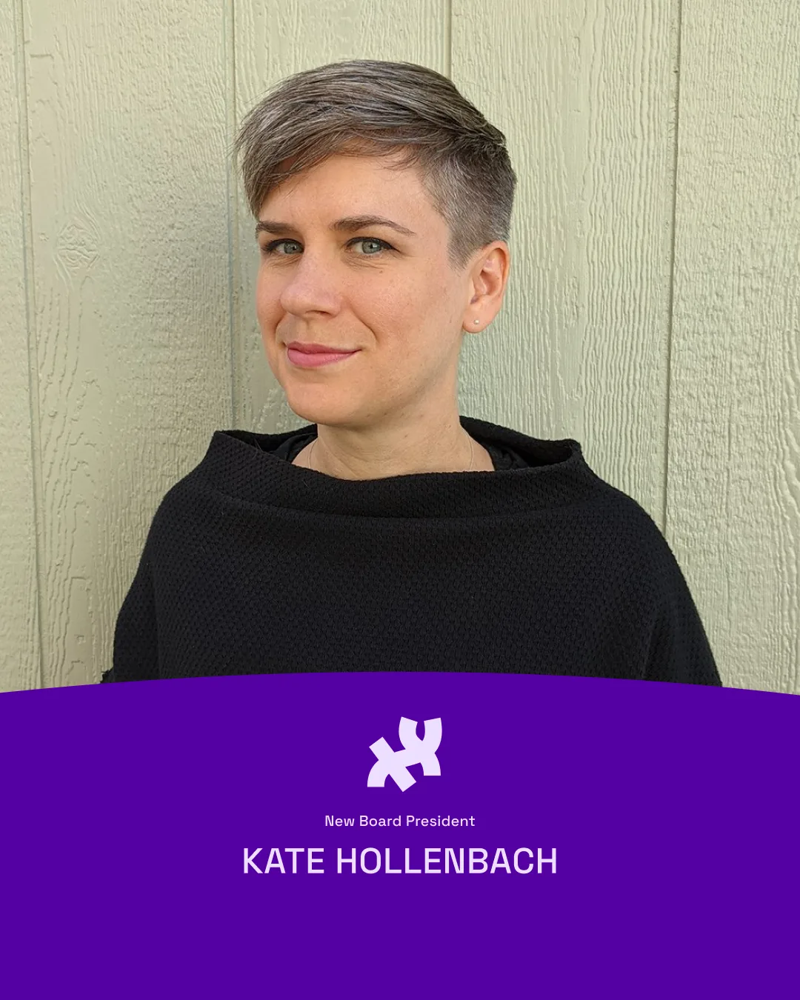
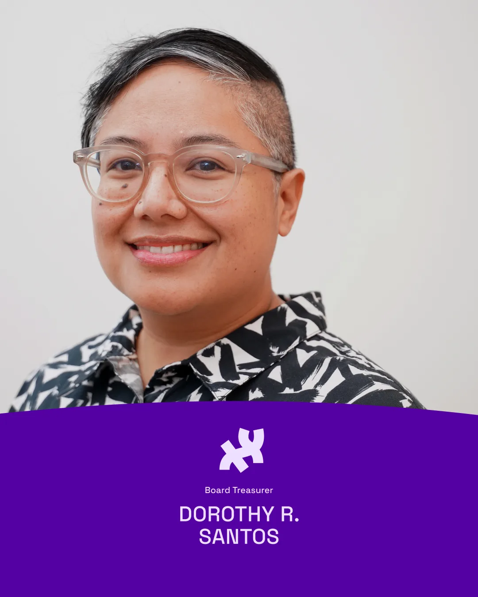
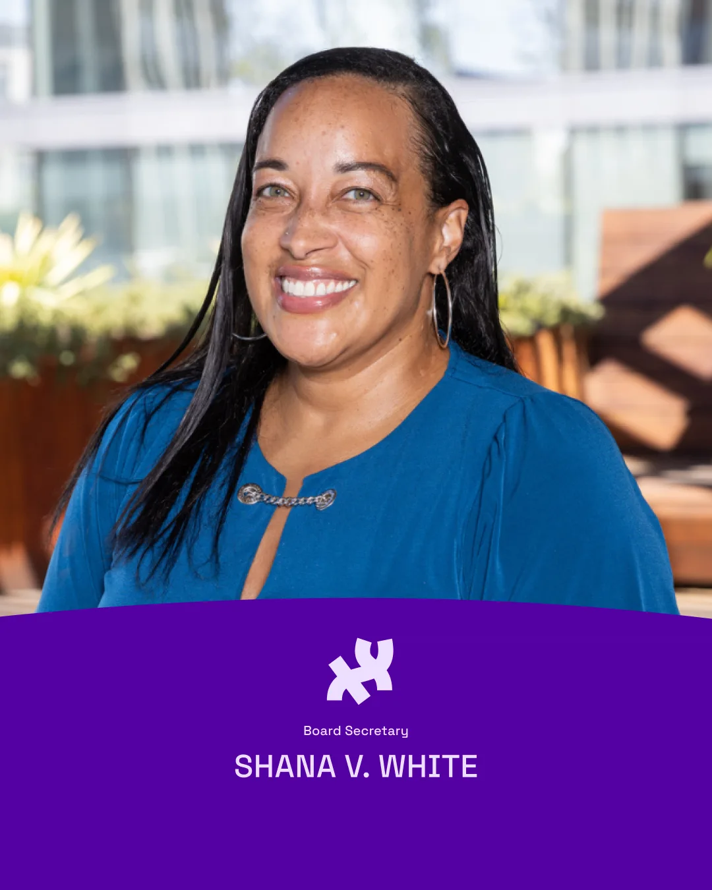
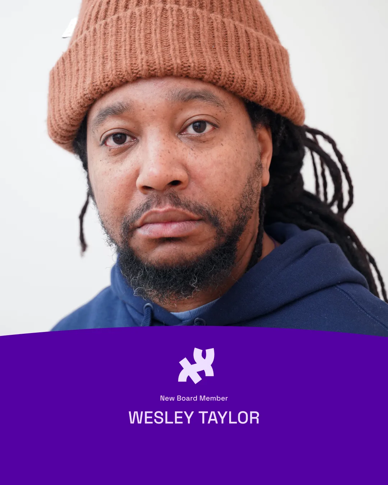
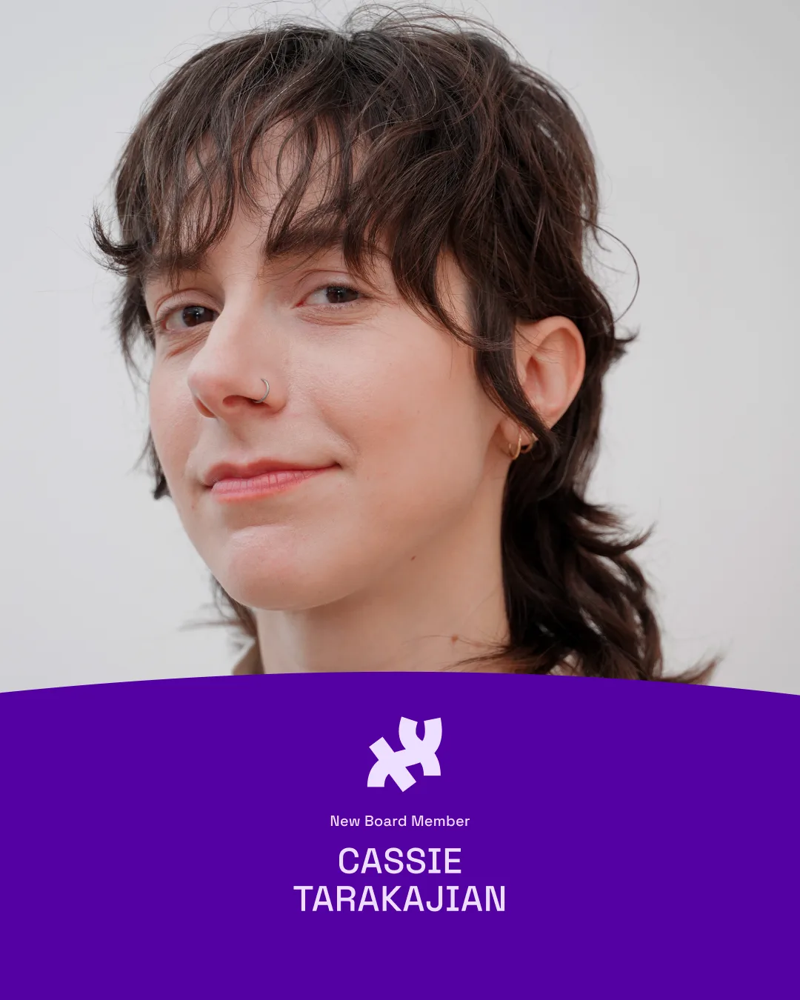
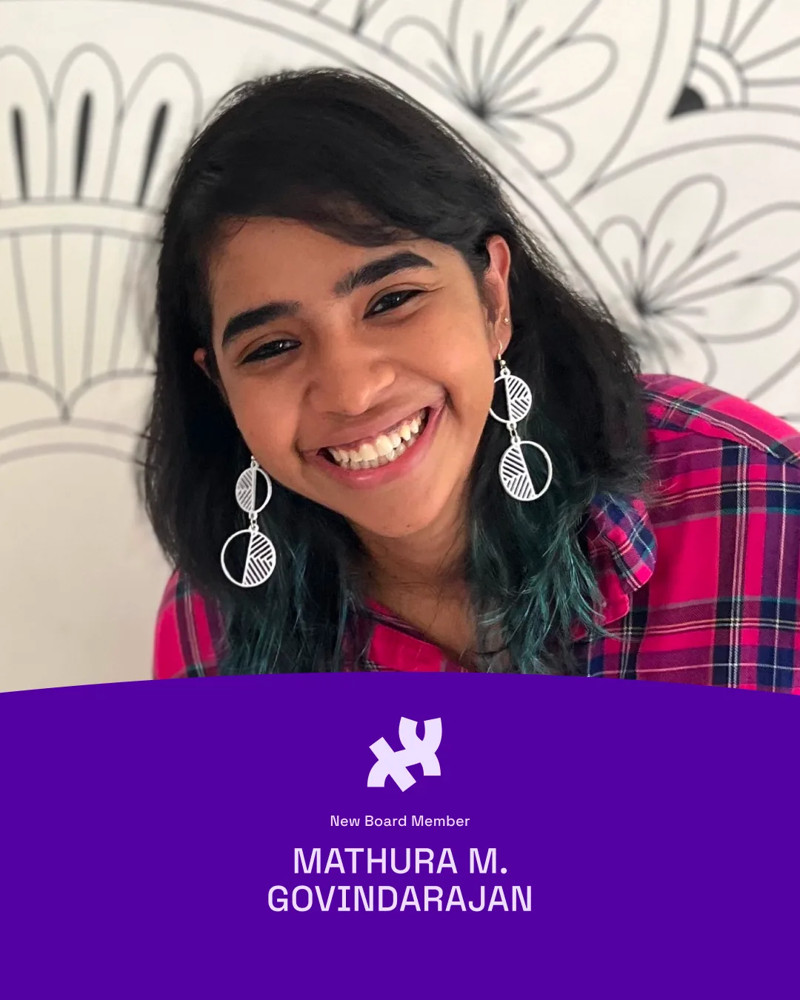
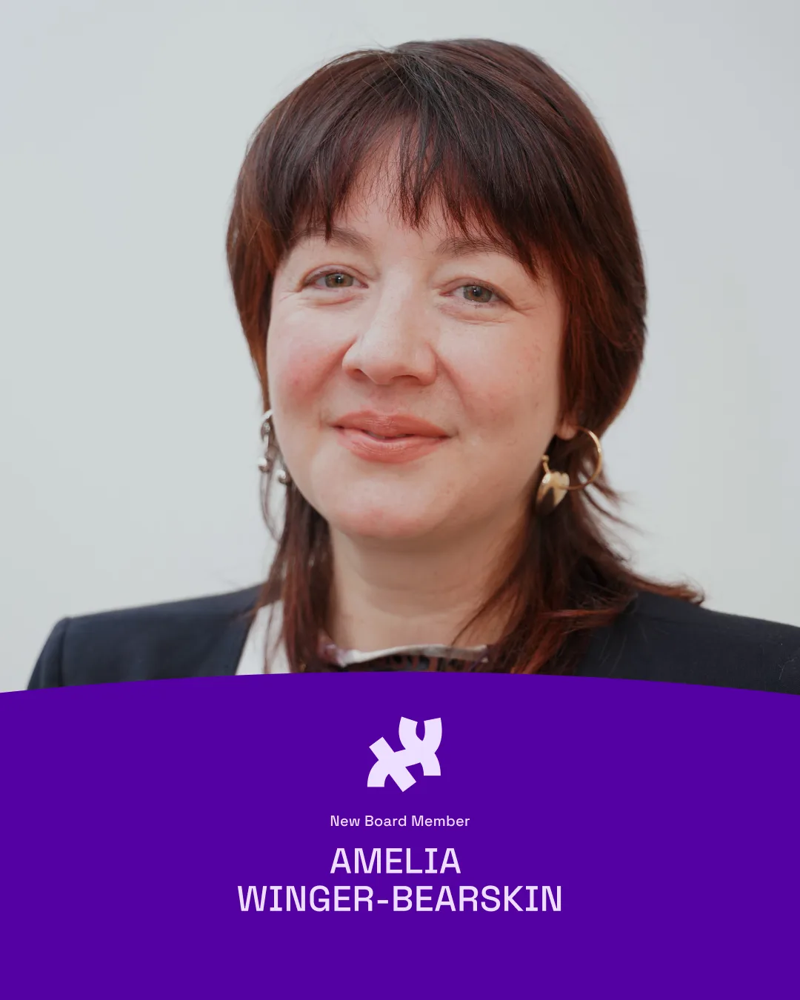
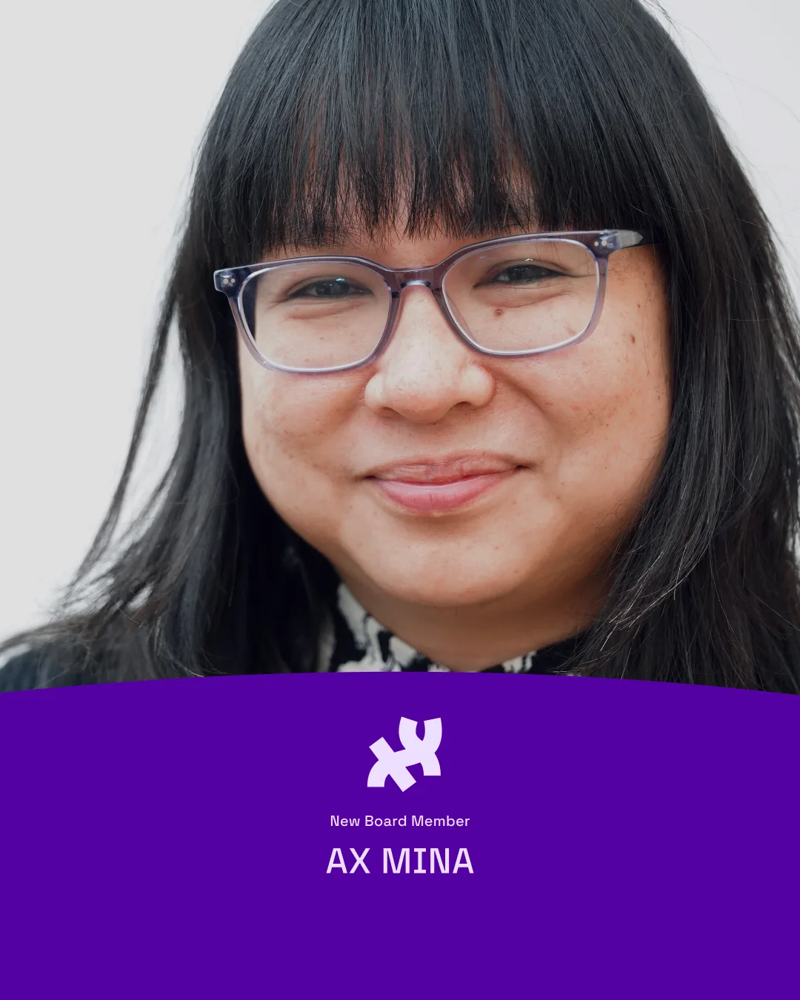
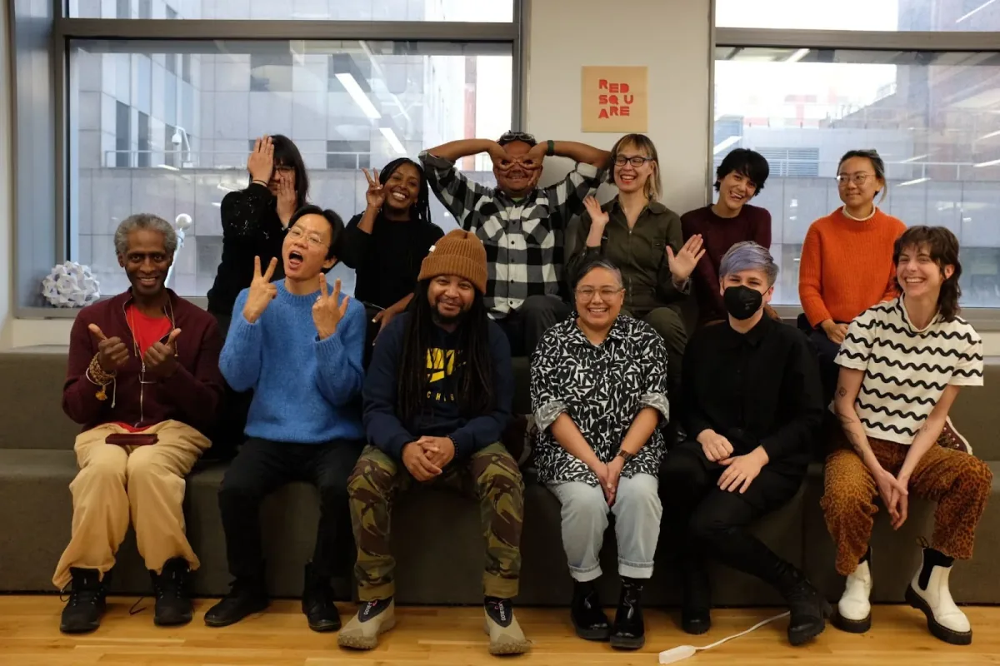

To embrace a new leadership model, the Processing Foundation has begun inviting more community members and new contributors to join our Board of Directors. Our organization is undergoing a strategic evolution encompassing significant changes in our board composition and a broader shift toward fostering diverse and focused leadership. This transformation reflects our commitment to equitable decision-making. As we bid farewell to valued departing board members and welcome new ones, our journey towards a more representative and equitable leadership structure symbolizes our dedication to better serving our community and aligning with [our mission](https://processingfoundation.org).

Introducing our new board of directors: Mathura Govindarajan, Shana V. White, Amelia Winger-Bearskin, Wesley Taylor, AX Mina, Cassie Tarakajian, Dr. Dorothy R. Santos, and Kate Hollenbach.

#### Board President: Kate Hollenbach

*Processing Foundation Board President, Kate Hollenbach.*

[Kate Hollenbach](https://www.katehollenbach.com) (she/they), who joined the Processing Foundation board in 2021, will serve as the new Board President. Kate is an artist and educator based in Denver, Colorado, where she is an Assistant Professor of Emergent Digital Practices at the University of Denver. She develops interactive systems with emerging technologies to create video, installation, print, and interactive works that relate body, gesture, and physical space. Their work addresses a new vernacular of interface design that spans across gesture, language, and visual design as sensors, cameras, and personal data play a pivotal role in human computer interaction. She has presented and exhibited work at venues including the San Francisco Museum of Modern Art, SIGGRAPH, Strange Loop, and INST-INT. Kate holds an MFA from UCLA Design Media Arts and a B.S. in Computer Science and Engineering from MIT.

Kate began working on p5.js in 2015 at the [first p5.js Contributor’s Conference](https://processingfoundation.org/advocacy/p5-js-contributors-conference-2015), supporting early development of the software. “I helped fix some bugs at the conference, and also had a chance to see how Lauren Lee McCarthy was approaching building the p5.js community. She placed emphasis not just on the code, but also on other different kinds of contributions that people could make to the project, which welcomed contributors with a broad range of skills and experiences. Her approach was instrumental to how we continue to build community at the Processing Foundation today,” Kate recalled.

Follow Kate on [Instagram @kjhollen](https://www.instagram.com/kjhollen/), [Twitter @kjhollen](https://twitter.com/kjhollen), [Github @kjhollen](https://github.com/kjhollen), and [LinkedIn @kjhollen](https://www.linkedin.com/in/kjhollen/).

#### Board Treasurer: Dr. Dorothy R. Santos

*"My name is Dorothy Santos. I’m currently on the Board of Directors as treasurer, but my history and journey started in 2018. I was the program manager and became the inaugural Executive Director in January 2021. Now, I’ve transitioned onto the Board to pursue my academic career.”*

*Processing Foundation Board Treasurer Dorothy R. Santos. Photo by June Canedo.*

[Dr. Dorothy R. Santos](https://dorothysantos.com/) (she/they) is a Filipino American writer, artist, and educator. She earned her Ph.D. in Film and Digital Media with a designated emphasis in Computational Media from the University of California, Santa Cruz. Her service to the field includes being a steward and mentor to [Collective Action School](https://school.logicmag.io) (formerly known as Logic School), an online, experimental school for tech workers produced by Logic Foundation with support from Processing Foundation. She is also an advisor to art and culture organizations, including slash art, POWRPLNT, Looking Glass, and House of Alegria.

> “This is a really exciting moment for the foundation because we have a brand new board, a board that is committed to those frameworks of how to truly be inclusive and that wording and that framing for it to not just be a term or a catchphrase that you see on a document or something that makes us look like, oh, we’re doing that work. No, we are actually, if you know the board, if you know the team, then you know that we do that in the everyday.” — Dr. Dorothy R. Santos

#### Board Secretary: Shana V. White

*2023 Processing Foundation Board Secretary, Shana V. White.*

[Shana V. White](http://www.shanavwhite.com) (she/her) is the Director of CS Equity Initiatives at the Kapor Center. She will be working on Equitable CS Initiatives, supporting both CSforCA and CSforGA, and working with stakeholders in Georgia to improve teachers’ professional development and increase participation and success for students of color in K12 CS courses. Prior to joining the Kapor Center, Shana worked for sixteen years in K12 education, serving in both public and private schools as a teacher and instructional technology specialist in metro Atlanta. Shana is passionate about disrupting the status quo, works to connect and create communities for educators online, and is strongly committed to racial justice and equity in K12 schools. She has a B.S. from Wake Forest University, a M.S. from Winthrop University, and an Ed.S from Kennesaw State University. Outside of work, Shana enjoys spending time with her husband and two kids, watching live sports and rom-coms, volunteering, and lifting weights.

Follow Shana on [Twitter @shanavwhite](https://twitter.com/shanavwhite) and [LinkedIn (Shana V. White)](https://www.linkedin.com/in/shana-v-white-she-her/)

#### Wesley Taylor

*“My name is Wesley Taylor, I am an educator, a designer, a fine artist, and a musician. I’ve been working on artworks that blend technology, social justice, design, performance, music, and bringing those together in making installations — they’re interdisciplinary. What brings me to the Processing Foundation is my involvement with art and the incorporation of technology.”*

*2023 Processing Foundation Board Member, Wesley Taylor. Photo by June Canedo.*

[Wesley Taylor](https://inst-int.com/speaker/wesley-taylor/) (he/him) is a print maker, designer, musician, animator, educator, mentor, and curator. He roots his practice in performance and social justice. His work combines, oscillates between, and blurs these different disciplines. His work is multi-disciplinary as well as anti-disciplinary. His individual practice is inextricably linked to his constellation of collectives and networks he has formed over 20 years. Those collectives include: Complex Movements, Talking Dolls Detroit, Design Justice Network, Athletic Mic League, and All Faux Everythings. His work is inspired by elder knowledge, complex science, 90s underground hip hop, punk aesthetics, and science fiction. He is an associate professor at Wayne State University and he splits his time between Detroit, and Stockholm, Sweden where he is a fellow in the OPI (Of Public Interest) Lab at the Kungl. Konsthögskolan.

> “This is one of the rare places where I actually see what they’re trying to do. I agree with what’s happening and where they’re trying to go and how they’re trying to create conversations around tech. I hope that there is time given to seeing these things through in a really steadfast way. Maybe engaging new audiences and more deeply invested audiences. The future is just not exciting if it’s exclusionary. An amazing future is not going to happen without a lot of people involved in it.” — Wesley Taylor

#### Cassie Tarakajian

*"I probably have had one of the longest-term relationships with the Processing Foundation, and I felt drawn to think on a higher level about where I would want this project to go, who I want to be included in it, and how I would like to support contributors to this project. I’ve seen the Processing Foundation when there was no staff and there was a working board, so to be able to bring together skills to dream of new things is amazing.”*

*2023 Processing Foundation Board Member, Cassie Tarakajian. Photo by June Canedo.*

[Cassie Tarakajian](https://cassietarakajian.com/) (they/them) is an Armenian-American educator, technologist, and artist based in Chicago, IL. They are a Processing Foundation Board member as well as mentor for the p5.js Editor. Their work centers around creating accessible and inclusive tools for making art, and interrogating the relationship between technology and pop culture. They are the creator of the [p5.js Editor](https://editor.p5js.org), an open-source in-browser code editor for creative coding in p5.js, supported by the Processing Foundation. They were an adjunct professor at New York University’s Interactive Telecommunications Program (NYU ITP), teaching creative coding, web development, and making cursed content. They are a Y8 and Y9 member of NEW INC’s Art + Code Track, and in the past, have held residencies at NYU ITP, Pioneer Works, and the STUDIO for Creative Inquiry at Carnegie Mellon.

> “Getting the opportunity to work on open source is amazing, and for the project to be about including people and to be expansive in that way, that’s rare even now. I learned so many things about myself getting to mentor folks. It’s been amazing learning about leadership and doing all the things for making software that is not just making software.” — Cassie Tarakajian

Follow Cassie on [Instagram @hellothisiscass](https://www.instagram.com/hellothisiscass/) and [Twitter @hellothisiscass](https://twitter.com/hellothisiscass).

#### Mathura M. Govindarajan

*“The reason the community is awesome is because the tech is awesome, and the reason the tech is awesome is because the community is awesome. I feel like there’s such a strong balance in that.”*

*2023 Processing Foundation Board Member, Mathura M. Govindarajan.*

[Mathura M. Govindarajan](https://mathuramg.com) (she/they) is a creative technologist based in Bangalore, India. She runs a non-profit called ‘[Paper Crane Lab](https://www.instagram.com/papercranelab/?hl=en)’, which focuses on making STEM (Science, Technology, Engineering, Mathematics) more accessible and affordable.

She was a fellow and graduate student in the Interactive Telecommunication Program at New York University, and she is now a guest faculty member at NYU. She completed her Electronics and Communication Engineering undergraduate studies at the National Institute of Technology, Surathkal, India.

Her current interests revolve around education, fabrication, coffee, and maps. Overall, she is very enthusiastic when it comes to learning new things. More so, she’s always looking for things that help her bridge the gap between art, science, and technology.

Mathura has been involved in the Processing Foundation since 2018. She was initially [a fellow in our Fellowships program in 2018](https://processingfoundation.org/fellowships/fellowships-2018), working on p5.js accessibility with Luis Morales-Navarro. Since then, she has mentored in our fellowships in 2019 and [2023](https://processingfoundation.org/fellowships/fellowships-2023). She was also one of the core organizers of [PCD Bangalore in 2019](https://medium.com/@mathuramgovindarajan/processing-day-bangalore-2019-9a6d4650158b).

> *“This is something I picked up from a talk that happened in the foundation, but it enables people to be active participants and not passive users of the tool, which I found interesting. When people say they’re using the tool, they have a chance to make something with it, but they also have a chance to contribute to it.” - Mathura M. Govindarajan*

Follow Mathura on Twitter and Instagram @mathuramg and @papercranelab

#### Amelia Winger-Bearskin

*2023 Processing Foundation Board Member, Amelia Winger-Bearskin. Photo by June Canedo.*

[Amelia Winger-Bearskin](https://www.studioamelia.com) (she/her) is an artist who innovates with artificial intelligence in ways that positively impact our community and the environment. She is a [Banks Family Preeminence Endowed Chair](https://news.ufl.edu/archive/2014/02/banks-family-commits-5-million-to-support-university-of-floridas-preeminence-i.html) and Associate Professor of [Artificial Intelligence and the Arts](https://news.ufl.edu/2020/07/nvidia-partnership/), at the [Digital Worlds Institute](https://digitalworlds.ufl.edu) at the University of Florida. She founded the [UF AI Climate Justice Lab](https://www.climatejusticelab.com) and the [Talk To Me About Water Collective](https://www.talktomeaboutwater.com). She founded Wampum Codes, an award-winning [podcast](https://wampumcodes.org) and [an ethical](https://foundation.mozilla.org/en/blog/indigenous-wisdom-model-software-design-and-development/) software development framework based on Indigenous co-creation values. Wampum Codes was awarded a Mozilla Fellowship embedded at the MIT Co-Creation Studio from 2019–2020 and was featured at the 2021 [imagineNative](https://imaginenative.org) festival. She continued her research in 2021 at Stanford University as their artist and technologist in residence, made possible by the Stanford Visiting Artist Fund in Honor of Roberta Bowman Denning (VAF). In 2022, she was awarded a MacArthur Foundation Award as part of the Sundance AOP Fellowship cohort for her project CLOUD WORLD / SKYWORLD, a commission by the Whitney Museum of American Art for the Sunrise/Sunset series, curated by Christiane Paul in 2022. The non-profit she founded, IDEA New Rochelle, in partnership with the New Rochelle Mayor’s Office, won the 2018 1 Million Dollar Bloomberg Mayor’s Challenge for their VR/AR Citizen toolkit to help the community co-design their city. Amelia is of mixed heritage: an enrolled member of the Seneca-Cayuga Nation of Oklahoma and Jewish. Amelia is the co-founder of the stupid hackathon.

Follow Amelia on [Twitter @ameliawb](https://twitter.com/ameliawb), [Instagram @studioamelia](https://www.instagram.com/studioamelia/), [Threads @studioamelia](https://www.threads.net/@studioamelia), [Facebook @studioamelia](https://www.facebook.com/@studioamelia), and [GitHub @Ameliawb](https://github.com/Ameliawb)

#### AX Mina

*2023 Processing Foundation Board Member, AX Mina. Photo by June Canedo.*

[AX Mina](https://fiveandnine.substack.com) (she/they) is a creative consultant, futures thinker, and leadership coach. She produces Five and Nine, a podcast, newsletter, and event series about magic, work, and economic justice, with events hosted in venues like The Shed, Festsaal Kreuzberg (Berlin), and NEW INC, and her work has been exhibited in spaces such as the Museum of the Moving Image, the Victoria and Albert Museum, and the Mozilla Festival Open Artist Studio (curated by the V&A Museum and Tate Modern). She has worked on three books, including most recently The Hanmoji Handbook with Jason Li and Jennifer Lee. She has also written for Hyperallergic, The Atlantic, Nieman Journalism Lab, and Places Journal. She is currently a Senior Civic Media Fellow at the USC Annenberg School for Journalism and Communications and a certified trauma-informed yoga teacher.

Follow AX Mina on [Instagram @fiveandnine\_podcast](https://www.instagram.com/fiveandnine_podcast/)

### Thank you to our Co-founders and Former Board Members

> “What I want code to be able to do is create more justice in the world. And I think that we can build tools, which are value-driven, like p5, that in their core infuse those values into what gets made with them.” — Phoenix Perry, Board of Advisors member

The transition and departure of our three esteemed board members and co-founders Ben Fry, Casey Reas, and Daniel Shiffman, marks a pivotal moment in our history. Their visionary leadership and unwavering dedication have played a crucial role in shaping our mission, guiding our growth, and supporting our software development. Not only have they laid a solid foundation, but they have also fostered a culture of innovation and excellence. Casey and Dan will join our advisory board, ensuring their expertise and wisdom continue benefiting our organization. Their decision to shift their roles is a testament to their commitment to promoting equity and creating space for new voices to flourish within our organization. As they pass the torch, we extend our deepest gratitude for their invaluable contributions and look forward to building upon their legacy with fresh ideas and leadership. Simultaneously, Xin Xin, a long-time community member who joined the board in 2022, is also transitioning their role to join the board of advisors. Xin has led equitable practices for our communities and played an important role in advising the new board selection process. We thank Ben, Casey, Dan, and Xin for their remarkable contributions.

*Processing Foundation Board Retreat 2024*

> “We can take the values that are infused in the foundation and push those values out into the bigger open source space.” — Phoenix Perry, Board of Advisors Member

We deeply appreciate our community’s support as our organization undergoes transformative changes. Your continued support remains instrumental in our mission’s success. [Donations](https://processingfoundation.org/donate) enable us to drive positive change, support the continuance of our software projects, and sustain impactful programs. Thank you for your unwavering support.
