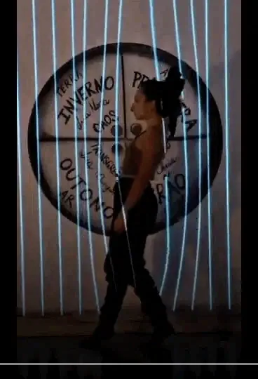
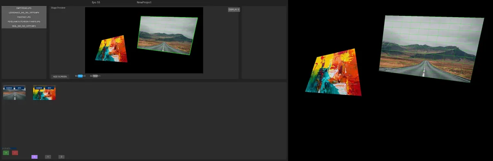
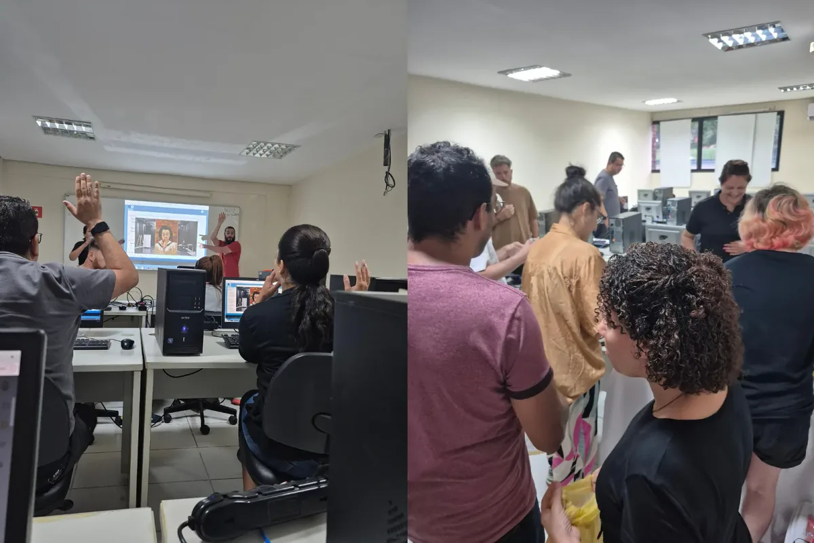

#### Projection Mapping with the Luna Library — Processing Foundation Fellowship Project 2025

<iframe src="https://www.youtube.com/embed/K6crurddeJY?feature=oembed" width="700" height="393" frameborder="0" scrolling="no"></iframe>

#### Fellowship Project: Body as Data

-   Artist: [Daniel Corbani](https://www.instagram.com/danielcorbani/)
-   Luna Project: [GitHub repository](https://github.com/danielcorbani/LunaMapping) or the [website](https://luna.art.br/)

“Art doesn’t live in the tools; it lives in the experience we create.” Daniel Corbani, author of the Luna Video Mapping Library

Daniel Corbani, an engineer who transitioned into a visual artist and creative coder, dedicated his 2025 Processing Foundation Fellowship to a project titled “Body as Data.” This project expands his [Luna Video Mapping library](https://github.com/danielcorbani/LunaMapping), seeking to bridge the gap between technical engineering and the ephemeral nature of live performance. For Daniel, technology is merely a tool, much like a dancer’s flexibility, and the true art exists in the shared experience between performers and their audience.

*Paola Higa interacts with Daniel Corbani’s Luna Library projection system, where virtual guitar strings appear as vertical beams of light. As Paola moves through them, the strings play musical notes.*

The fellowship project, “Body as Data,” focuses on interactive and embodied projection mapping. “The secret here is to use projection mapping to match the position of the generative content to the source… as best as possible to create the illusion that the physical body is touching / creating / interacting with the digital image,” says Daniel. His artistic expression is best exemplified in his collaboration with dancer Paola Higa, whose work involves charcoal drawings and mandalas created through full-body movement.

Luna facilitates this three-stage narrative journey in Paola’s performance:

1.  The Illusion: Using pre-recorded video to create the sense of a digital double
2.  The Merge: Blurring the lines between the physical performer and digital content
3.  The Interaction: A “full merge” where the body’s movement creates images in real-time, such as a fluid or smoke simulation that reacts to the performer’s presence.

This approach transforms the human body into a source of data, using an infrared camera and background subtraction to turn performers into “white blobs” or masks. These masks then interact with digital objects, creating the illusion that the physical body is directly touching or creating the digital image.

Technically, Luna is designed to be both a functional software for non-coders and a flexible platform for developers. The architecture is built upon several core classes:

-   Project: The central manager of the entire system
-   Screen: A renderer that handles the output to external displays
-   Scene: Manages specific moments in a performance, coordinating multiple media types
-   Medialtem: Manages individual videos or images and contains the complex homography math required for mapping visuals onto physical surfaces.

*Luna’s projection-mapping interface allows artists to arrange and transform media in real time. The software can treat custom generative code as if it were standard video, enabling artists to integrate live simulations and visuals.*

A key technical breakthrough Daniel achieved during the fellowship was the implementation of Java interfaces. These act as a “bridge,” allowing Luna to recognize custom generative code as if it were a standard video file. This enables artists to use libraries like PixelFlow for real-time physics simulations while still utilizing Luna’s mapping and scene-management tools.

At the heart of Daniel’s work is a profound commitment to the philosophy of open source. He says Luna is open source largely because “I realized that so much of what I’ve been able to do exists thanks to others sharing their work with me,” whether it’s Processing itself, the libraries he uses, or the examples people publish in forums and on their websites. He continues, “It only felt fair to give something back by sharing my own work in the same spirit.” He views open-source software as both a technical choice and as a primary method for redistributing power to diminish inequality. He recognizes the place of big tech, yet imagines a more communal ecosystem where knowledge, access, and even some economic opportunity circulate freely, allowing creative tools and ideas to reach far beyond their original makers.

Daniel acknowledges that his own growth was made possible by the generosity of the Processing community and shared libraries. Consequently, he intends Luna to be an open platform for those who cannot afford expensive commercial software licenses, particularly artists from marginalized communities. By keeping the code accessible, he aims to share economic power and knowledge, allowing performers in theater and dance to integrate complex visuals without a high financial barrier.

*Daniel leads a Luna workshop for creative coders in São Paulo, Brazil. The workshops reflect Daniel’s commitment to sharing knowledge and expanding access to creative coding tools within the arts community.*

Daniel’s work has generated significant excitement with the Brazilian arts community, where cultural workers are eager for free tools to incorporate coding and projection into their work. Looking forward, Daniel sees Luna as a way to facilitate remote collaboration, “What is most special to me is that with Luna I can reach people far… they can run Luna there and I can send my work and help them from a distance because now we have a great tool for that.”

---

The Processing Foundation Fellowship supports artists and creative technologists developing open-source creative tools and practices that expand access to creative technology. Through financial support, mentorship, and community partnerships, fellows create tools, artistic works, and research that contribute to a more open and accessible creative coding ecosystem.

-   Learn more about the Fellowship → [here](https://processingfoundation.org/fellowships)
-   Support programs like this → [here](https://processingfoundation.org/donate)
