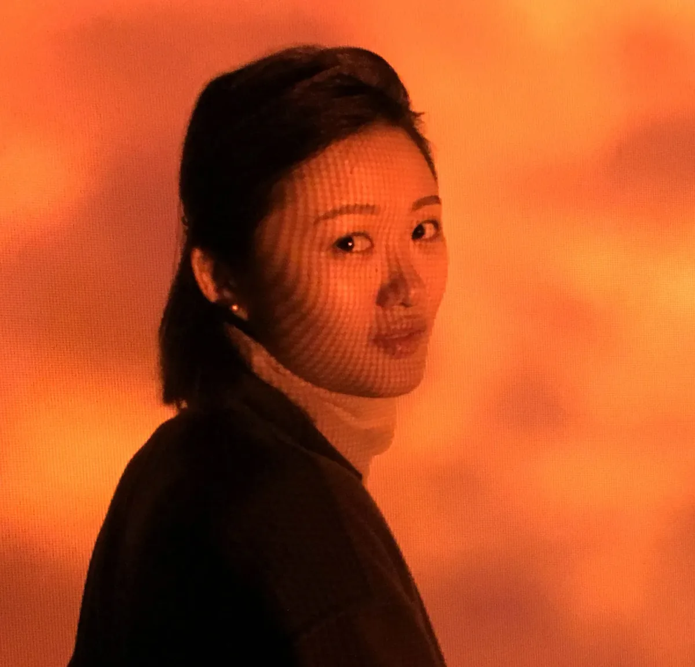
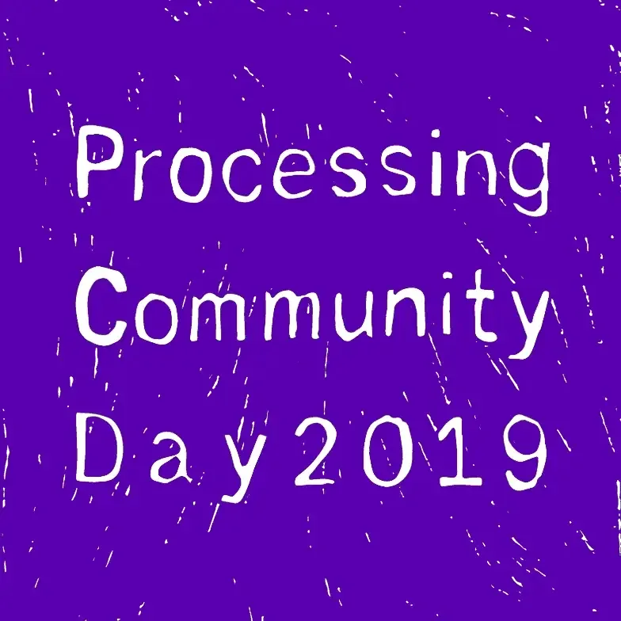
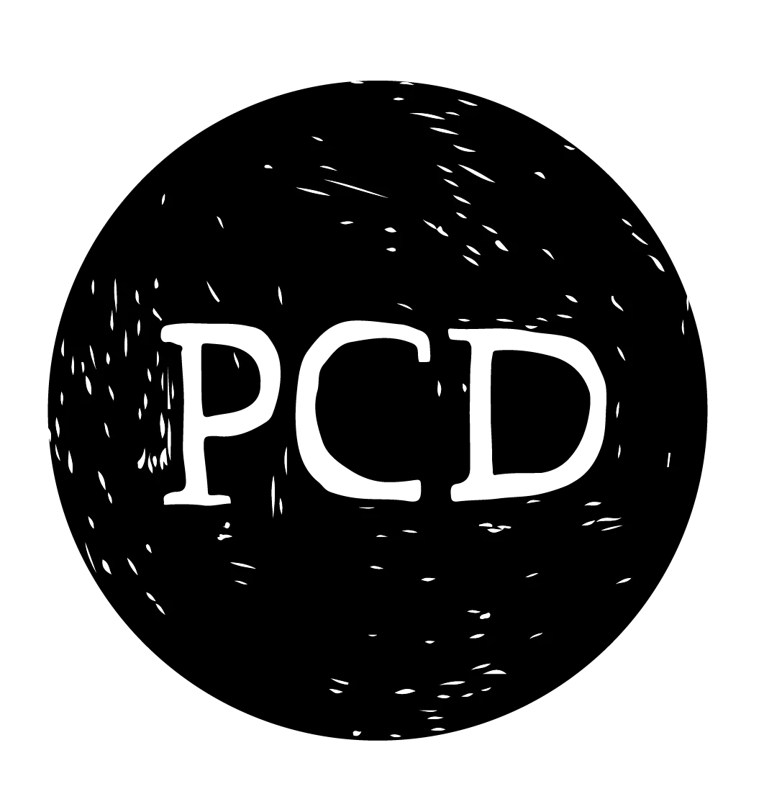
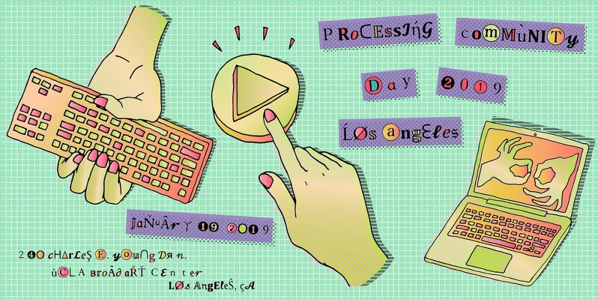
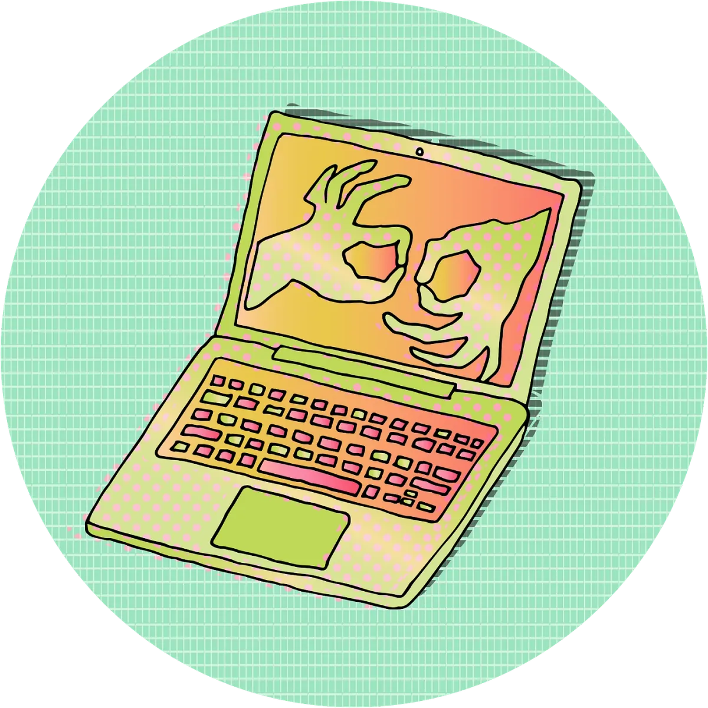
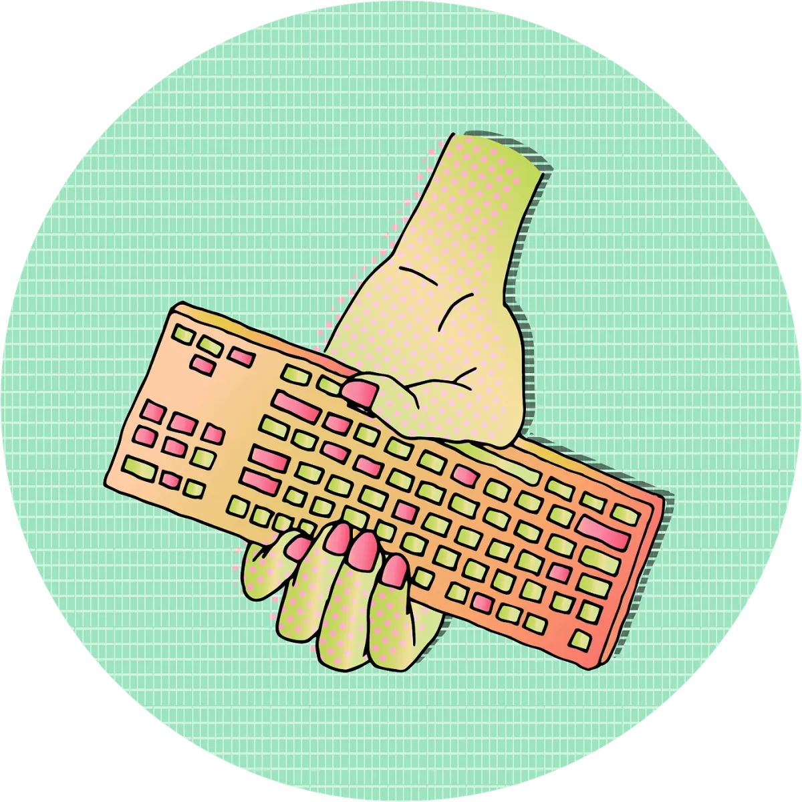
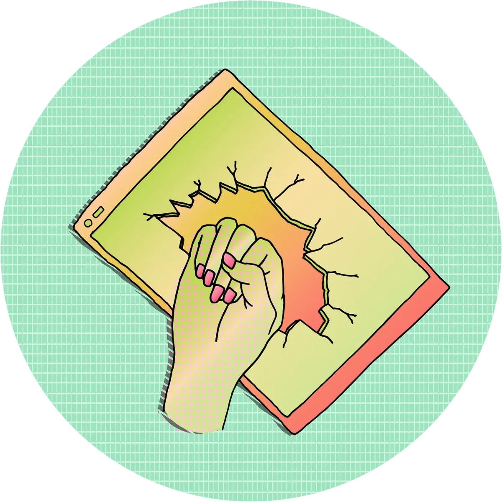
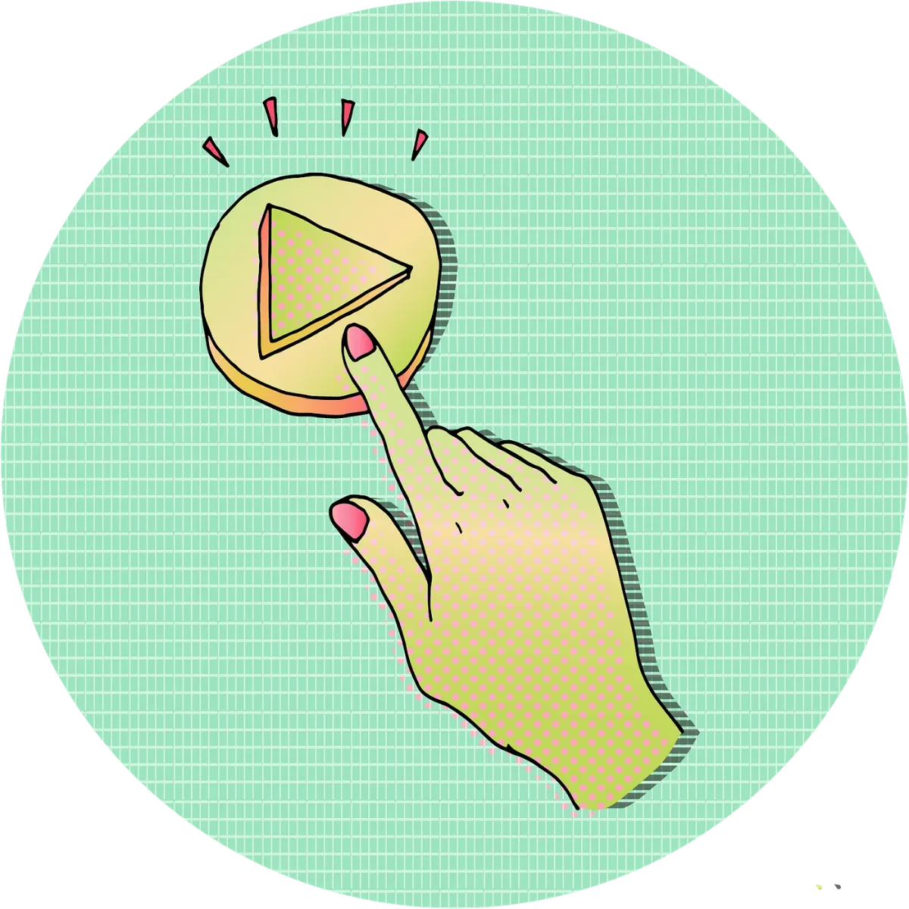
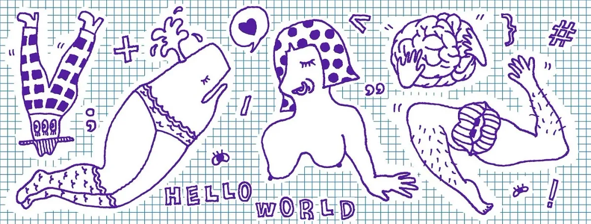

#### **Artist Yuehao Jiang on Creating the Visual Identity for Processing Community Day 2019**

As Visual Artist for [Processing Community Day](https://day.processing.org/) (PCD), artist Yuehao Jiang is in charge of creating the visual identity for the event. Yuehao created illustrations and designed logos, signs, web banners, and posters that creatively represent PCD’s unique intersection of art, code, and diversity. Lead organizer Xin Xin interviewed Yuehao Jiang about her process of creating the visual identity for PCD 2019.

PCD is a day to celebrate art, code, and diversity in Los Angeles and more than 100 communities worldwide. It will take place from January 15, 2019 through February 15, 2019.

*Yuehao Jiang is a heterosexual-Chinese-born-in-the-90s-female-interdisciplinary artist living and working in Los Angeles. She explores digital media in nontraditional gallery settings. Her work has been shown internationally at K Museum of Contemporary Art, Ars Electronica, Hammer Museum, LUMEN Festival, The Gallery Beijing, and Suzhou N9 Art Center. She holds an MFA from the University of California, Los Angeles and a BFA from the School of the Art Institute of Chicago. \[image description: Yuehao Jiang standing in front of an orange projection, facing the camera.\]*

**Xin Xin:** Thank you so much for doing this interview! We are excited to have you as our visual artist for Processing Community Day 2019, and I’m so glad to have this opportunity to ask you more questions about the ideas behind your work. I remember the first few images you created were logos for Processing Community Day World Wide and Processing Community Day Los Angeles. So, my first question is, how did you create a distinction between the worldwide event and Los Angeles?

**Yuehao Jiang:** When we first started the conversation about PCD’s visual identity, I remember you brought up zines. Zines are a do-it-yourself method of publication that evoke the ethos of the Processing Foundation and PCD: free software, open-source, and easy to access for diverse communities. So, I looked at the PCD original logo and transformed it with a hand-drawn style to evoke the visual style of zines. I also made them into GIFs to be more engaging, dynamic, and shareable on the event website and social media.

In order to distinguish the Processing Community Day Los Angeles logo from the worldwide one, I went with the color purple. Purple was the main color used on the website and at the event for the last PCD in 2017. I thought it would be nice, especially when we are kicking off the promotion and the event, to carry through the same kind of color identity from the last event. It’s recognizable.

**XX:** I also thought that the purple is quite nice because it’s a blended color between blue, which is the visual color of Processing, and red or pink which is the color of p5.js. It’s a nice symbol for merging these two identities together into a cohesive Processing community.

**YJ:** Totally!

*PCD Los Angeles Logo. \[animated gif description: A hand-drawn style square logo. In white text, “Processing Community Day 2019” is written on a violet background. As with the worldwide logo, the impression is that the background has been filled in by hand, indicated by thin white dots and lines\]*

**XX:** I’m also really excited about your redesign of the Processing Worldwide logo. We have distributed the Processing Worldwide Organizers Kit, which includes a promotional and a tutorial package, and the logos you designed are in both of those kits. People can use these materials for their own events — they can remix or change the color, and use it for whatever identity they decide to take on for their own event. It’s exciting to see what they will come up with at the end.

**YJ:** The Worldwide logo is pretty adaptable in that regard. I chose black as the background, so if they want to add other components to it, they have a simple starting point and many choices.

*PCD Worldwide Logo. \[image description: A hand-drawn style circular logo. The letters “PCD” are drawn in white on top of a black background. The impression is that the background has been filled in by hand, with small white artifacts.\]*

**XX:** To return to the idea of zine aesthetics, there are many different directions to go in. How did you decide on the series of images and aesthetics you chose for the open call and event banner?

**YJ:** I went with a hand-drawn style — solid lines plus patterns, not really having too much shadow. It’s something I always draw, a style I access intuitively. In the banner, I made it kind of like collage or stickers. I remember we were talking about the event — I don’t know if it’s still true — but you mentioned that there will be a zine station where people can make stuff during the event. I imagined people would draw things or use the scissors to cut some shapes and glue them together. The collage style felt like a good fit.

**XX:** That’s interesting! Collage is not what we immediately might think about when we think about making artwork with Processing or p5.js, which is usually vector-based and heavy on geometry as a starting point. I think this is a completely different kind of interpretation — a hand-drawn and doodle aesthetic that is almost a way of saying, “Hey, there is another way of using Processing and p5.js to make artwork that doesn’t necessarily always tie into the aesthetic of using eclipse and rectangle and arrays.” It’s a different read or approach.

**YJ:** Absolutely. The other thing I really want to emphasize is having fun and being playful. Even though these images might not be the first thing people think of when using Processing or p5.js, the feeling they embody is something people can share or have through the event — having fun, having a hands-on experience, trying to be creative and experimental.

**XX:** I like the image where a pair of hands is massaging the brain, it really caught my eye. Sometimes I think it’s massaging, and at other times I think it’s just holding the brain, and it’s just a nice metaphor of an event that is stimulating to the mind but also very careful and gentle.

**YJ:** \[laughs\] Really gently massaging the brain.

*PCD Los Angeles 2019 Event Banner. \[image description: A hand-drawn collage style event banner. There are drawings of hands and computer hardware in green, yellow, pink, and orange on top of a green and white grid. The text is the name, location, and time of the event: “Processing Community Day 2019, Los Angeles. January 19th 2019. 240 Charles E Young Dr. N, UCLA Broad Art Center, Los Angeles, CA.”\]*

**XX:** The overarching event for PCD Los Angeles is a day to celebrate art, code, and diversity, and within this big umbrella, we’ve created four different tracks. I’m curious — did the contents or track descriptions inspire any of the images that you made?

**YJ:** I started to think about creating signs or logos or images for each of the tracks by reading the descriptions, and they were helpful. I feel like “playful” is a word I keep coming back to. One thing that stood out for me was the idea of making the design reflect that PCD is an event that is accessible and open for all ages of people, as well as to people from different communities.

I want to make things that are encouraging to people from diverse backgrounds — people of color, kids, moms, people with disability, those who aren’t normally shown, or included as part of a poster or the visual identity. But, it was also important to me not to portray specific identity markers in the banner design. Directly pointing out a certain group of people is being inclusive, but in a way, also being exclusive. I feel like it would contradict the goal —

**XX:** — by putting them on display?

**YJ:** Yes. As an illustrator and designer, I’m aware that by picking a certain group to represent visually, I may run the risk of saying, “You are a segregated group already, or a minority group, and that’s why we are targeting you.”

**XX:** Right. It makes sense. How did you develop that from ideas or feelings to images? That seems like an interesting process. How did you go from trying to capture a feeling or a mood, to an image that is not representing minority groups in a stereotypical way? Or a performative way?

**YJ:** I started by looking up logos related to disability. I saw this logo that shows two hands that indicates the usage of American Sign Language during presentations, so I had this idea to use images of hands plus computer devices as a starting point to create drawings for different tracks. Most people use hands to type code, and you need some kind of screen, computer, or keyboard to run the code. By turning the hands into an icon, they become more open to interpretation than in their functional purpose in a programming context. I want to emphasize this hands-on DIY or creative energy of the event, and I think hands are a really good indication of that.

*Accessibility, Disability, and Care Track Sign. \[image description: A hand-drawn style icon. As with the Event Banner, the background is a green and white grid like an architectural plotter. In the foreground there is a drawing of an opened laptop, with two “OK” hand signs on the screen in a Yin-Yang complementary style. The figures in the foreground are rendered in a light yellow, green, and orange gradient.\]*

**XX:** On the event banner the relationship between the hand and the technology is different each time. There’s a tiny keyboard being held inside the palm, versus the play button that you can see from Processing or p5.js editor that becomes a physical button, and also the ASL symbol on screen. Can you talk a little more about how you decided to create those relationships?

**YJ:** The event banner consists of a series of drawings I created for the themed tracks. In the **Accessibility, Disability, and Care** track sign, I drew the image of the two hands on the computer screen, which symbolizes the ASL language. I used the ASL logo to indicate the Processing Community Day purpose to make the programming environment more friendly and accessible. Ideally what should happen is that not only the programming language, but also the computer, and the whole platform and system should become more and more friendly to diverse groups of people.

For the **Radical Pedagogy** track, there is this common imagery, a raised hand making a fist, which frequently appears when representing the idea of radical politics. Since we are talking under the context of Processing, coding, and pedagogy, I thought it would be interesting to have a keyboard there. You know, a keyboard can be seen as the physical tool to learn coding, but on the other hand, I want to invert the keyboard as a way questioning the dominance of computer in learning code, to maybe ask the question, “Is there any alternative way to learn code and programming?”

**XX:** Yeah, and I really like that the keyboard fits the contour of the body and not the other way around.

*Radical Pedagogy Track Sign. \[image description: A hand-drawn style icon. As with the Event Banner, the background is a green and white grid like an architectural plotter. On the foreground, there is a fist holding a keyboard, facing downward. The fist is colored in a yellow to green gradient with pink fingernails. The keyboard is also colored in orange and pink. \]*

**YJ:** The next track: **Under the Silicon, the Beach!** The sentence that most strikes me from the track description is, “How do practices that use software and design for esoteric, discursive, political and aesthetic ends, help us break free from predominant narratives?” The “break free” phrase reminds me of breaking a screen, or how we say, “breaking the glass ceiling.” I came up with this image of a hand breaking a screen — it could be either an iPad or a phone screen. I consider these kinds of consumer mobile devices as a symbol for the design and tech industry.

*Under the Silicon, the Beach! Track Sign. \[image description: A hand-drawn style icon. As with the Event Banner, the background is a green and white grid like an architectural plotter. On the foreground, there is a drawing of a fist breaking an iPad screen. The fist is colored in yellow and green gradient, with pink fingernails. The iPad screen is colored in yellow and green gradient, with an orange border.\]*

**YJ:** The last track, **Epic Play!**, I wanted to be playful. Thinking about the word *play*, it can mean physically playing with toys or games, and in the context of a computer or digital media, it can mean to play music, play a video, etc. So, I ended up drawing the digital “play” logo we commonly see in computer systems. At the same time, the logo also looks like a physical button.

**XX:** This one is interesting to me because it raises the question — is this button physical or virtual, and is my hand even real. It’s a play between the physical versus virtual, merging them together and confusing which is which.

So far you have produced a series of images for social media and our website. What are your plans to circulate or distribute these images?

*Epic Play! Track Sign. \[image description: A hand-drawn style icon. As with the Event Banner, the background is a green and white grid like an architectural plotter. On the foreground, there is a drawing of a hand, colored in yellow and green gradient, clicking on a “play” button with index finger. The button, colored in yellow and green, has a triangle shape on it.\]*

**YJ:** I definitely thought a lot about social media and the Internet throughout this making process. The event banners are slightly different to fit the needs of different social media platforms. Some of the images may end up as physical stickers or as printed signs for the events. I want them to be capable of existing either together on a big poster or by themselves as a logo. Like what we just discussed, every image has its own meaning, and when they stay together they also convey certain things about the events that people can understand easily.

**XX:** Yeah, it’s great. And we’re definitely going to make some T-shirts for volunteers and staff. Maybe mugs, not sure yet \[laughs\]. Can you talk about your thoughts behind the Open Call banner?

**YJ:** For the open call, one thing that stood out to me when I was reading the event description early on was that this is an event friendly to all ages. There will be free on-site childcare, and a private room for breastfeeding. It’s also an event that invites people of color, queer people, and diverse groups, and encourages political and active ideas. I wanted the images on the banner to be kind of erotic in a playful way.

**XX:** Right.

*PCD Open Call Banner. \[image description: A hand-drawn collage style event banner. The banner is filled with drawings of cartoonish creatures, among them walking pants with three eyes and a hat, a sleeping mermaid whale wearing underpants and socks, a one-hand woman wearing polka-dot wig, a pair of hands holding a brain, and two hairy running legs with open lips. The creatures are surrounded by representations of coding syntax and the well-known phrase “HELLO WORLD.” The drawings are illustrated in violet lines, with a light blue grid as the background.\]*

**YJ:** I started to doodle these hybrid creatures or characters. Like the partially whale and partially human mermaid — it’s a mermaid whale! And the running legs with three eyes.

**XX:** I can imagine kids seeing these images, and being captivated by them. I can also see adults being captivated by them maybe for different reasons. I think it’s a great approach to solve the problem of age gap that we’re trying to encompass with this event.

It doesn’t feel like you’re changing your position to make these child-friendly, rather you’re making them in a way that considers how children can have an entry point. It won’t be dry or boring for them. It feels like there’s a lot of space for imagination in those images.

**YJ:** Definitely. Sometimes we see kids drawing typical boy and girl bodies. I want to create images that show a different possibility, for both kids and adults, so there might be a less stereotypical imagination or depiction of bodies.

**XX:** I can see that here. I also noticed you used graph paper texture in the banners as backgrounds. Can you talk about that choice?

**YJ:** Graph paper reminds me of notebooks I would use at school. It indicates that this event is educational, friendly to people with different backgrounds, and hands on, things like that.

**XX:** What’s really nice about the grid and the drawing is that the drawing doesn’t follow the grid at all. It doesn’t line up with any of the grids. It’s just floating on top of the grid. It’s interesting you brought up school paper or school assignment book. It reminds me of standardized ways of creating diagrams, or a quantified way of approaching a problem.

**YJ:** I would say these drawings are similar to the doodles I used to draw on a school notebook when I wasn’t focusing in class.

**XX:** I’m really looking forward to seeing the physical print-out of these images at the event, and how they will take up space and serve as actual symbols. Participants will use these logos to find where to go, and to associate the themed-tracks. I’m very excited to see how they’re going to activate the space.

**YH:** Me too!
