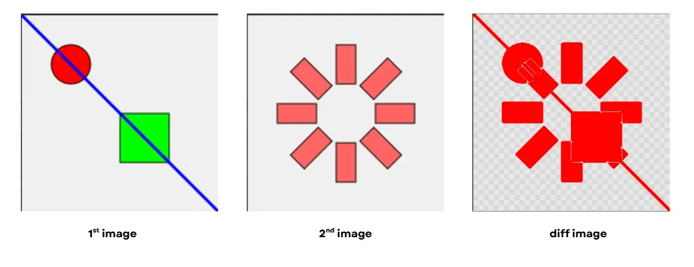
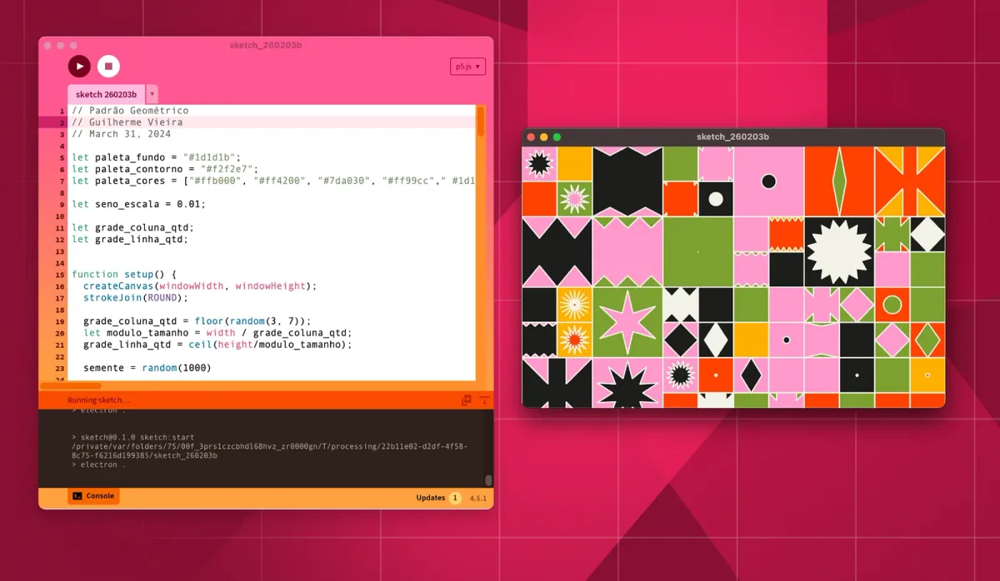
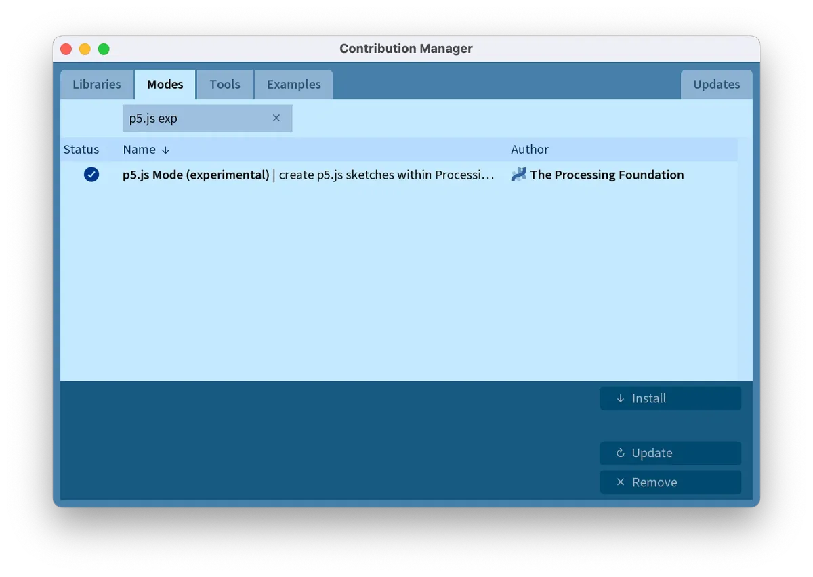

pr05 (pronounced “pros”) is the Processing Foundation’s fully-remote grant and mentorship initiative supporting the professional growth of early to mid-career software developers through hands-on contributions to Processing and p5.js. Launched in 2024, the program began with the theme “New Beginnings,” focusing on projects that would enhance and solidify the foundations of these ecosystems.

The 2025 program followed up with the theme “Building Bridges,” focusing on stronger connections across the ecosystem: creating better connections between Processing and p5.js, strengthening interoperability, and building pathways that make these tools more accessible and powerful together. The spirit of “Building Bridges” was reflected not only in the projects, but also in the way the program evolved, with returning contributors supporting the next cohort.

Over four months (July-October 2025) our pr05 Developers, Stephan Max, Claire Peng, and Vaivaswat Dubey worked on projects that literally and figuratively built bridges across parts of the Processing ecosystem. Each grantee received 40 hours of mentorship along the way. We want to give a special thanks to pr05 mentors Connie Ye, Claudine Chen, and Stef Tervelde for their unyielding support and guidance.

In October, the cohort presented their projects at [OpenAssembly](https://openassembly.processingfoundation.org/), sharing the results of their four months of work. We’re excited to revisit what they built and take a closer look at the ideas that came out of last year’s program.

*Written by Raphaël de Courville, edited by Patt Vira and Amy B. Woodman.*

---

#### [**Claire Peng**](https://github.com/clairep94)**: Incremental TypeScript Migration for the p5.js Editor**

<iframe src="https://www.youtube.com/embed/saA9Fb0b8DY?feature=oembed" width="700" height="393" frameborder="0" scrolling="no"></iframe>

Claire used her unique perspective to make the p5.js Editor easier to maintain. As a former fashion designer who discovered coding through Daniel Shiffman’s Coding Train tutorials, her non-traditional background shaped her approach to this technical project: making the codebase more approachable for contributors who, like her, learn best through visual hints and pattern-matching rather than dense technical documentation.

The p5.js Editor is a massive codebase (over 100,000 lines of code built over more than a decade) with layers of legacy dependencies. Rather than attempting to migrate everything, Claire took a strategic approach focused on broad coverage and clean ups across the codebase.

> TypeScript allows your code editor to provide more ‘spell-checks’ (or type-checks, as they are called). It also provides better autocompletion to give you more guardrails as you code, sort of like a game of MadLibs, with hints underneath each blank. — Claire Peng

As a result of Claire’s work, the p5.js Editor codebase is now 27% TypeScript. From a user’s perspective, nothing looks different, but for new contributors, the repo now offers the guardrails that make contributing more visual and intuitive.

Thanks to [Connie Ye](https://github.com/khanniie) for her mentorship and [Rachel Lim](https://github.com/raclim) for her guidance as core maintainer of the p5.js Editor.

#### Read More

Claire’s blog post: [Incremental Typescript Migration for the p5.js Editor](https://medium.com/@clairepeng94/incremental-typescript-migration-for-the-p5-js-web-editor-7749878e0cbe)

#### Related Links

-   [Migration Project Technical Documentation](https://github.com/processing/p5.js-web-editor/tree/develop/contributor_docs/pr05_2025_typescript_migration)
-   [Open Assembly Presentation Video](https://www.youtube.com/watch?v=saA9Fb0b8DY)

---

#### [**Vaivaswat Dubey**](https://github.com/Vaivaswat2244)**: Building a Visual Regression Testing System for Processing**

<iframe src="https://www.youtube.com/embed/mrfamBu6Rxo?feature=oembed" width="700" height="393" frameborder="0" scrolling="no"></iframe>

For a platform like Processing, success isn’t just about a sketch compiling without errors, it’s about how things *look*. If a shape renders even slightly differently on macOS than on Linux, or if a color blend changes subtly after a code refactor, that’s a regression that can break the creative intent of the work.

> Processing has always been a place where art and code intersect. It empowers people to express ideas visually, even if they’ve never written code before. But behind its simplicity is a complex rendering system that must stay consistent across updates, platforms, and years of evolution. — Vaivaswat Dubey

Vaivaswat built a fully native, dependency-free visual testing system for Processing that automatically catches these visual differences. The system runs Processing sketches, captures snapshots of rendered output, compares them to stored baseline images, and highlights even the tiniest differences.

If the color value of a pixel changes, the testing system generates a visual diff (difference) where pixels that differ between the first and second images are highlighted in red.

> Testing might not sound “creative,” but when it protects the integrity of an artistic tool like Processing, it becomes an art form of its own. — Vaivaswat Dubey

Thanks to [Claudine Chen](https://github.com/mingness) for her mentorship and guidance throughout the project.

#### Read More

Vaivaswat’s blog post: [Catching Visual Bugs Before They Happen: Building a Visual Regression Testing System for Processing](https://medium.com/@vaivaswat2244/catching-visual-bugs-before-they-happen-building-a-visual-regression-testing-system-for-processing-09b1ab227640)

#### Related Links

-   [Visual Testing Implementation](https://github.com/processing/processing4/tree/visual-testing/core/test/processing/visual)

---

#### [Stephan Max](https://github.com/stephanmax): Creating a New p5.js Mode for the Processing Development Environment

<iframe src="https://www.youtube.com/embed/HsV7tbOviEw?feature=oembed" width="700" height="393" frameborder="0" scrolling="no"></iframe>

Stephan’s project allows users to create and run p5.js sketches directly inside the Processing Development Environment (PDE) even without internet connection. This new “mode” bridges the gap between web-based and desktop coding.

Now, p5.js users can go beyond the limitations of an internet-dependent, browser-based code editor. Some exciting new features include: saving and loading files locally, accessing system resources, using Node packages, and even exporting sketches as standalone desktop applications across Windows, macOS, and Linux.

> My deep appreciation for the Processing Foundation does not come out of nowhere: Processing has been my companion for a while! It all started in 2009, when I bought the book ‘[Generative Gestaltung](http://www.generative-gestaltung.de/2/)’… That means I have been working with Processing for over 15 years. — Stephan Max

The mode is now available in the PDE’s contribution manager. Look for “p5.js Mode (experimental)”

Thanks to [Stef Tervelde](https://steftervel.de/) for his mentorship and [Raphaël de Courville](https://linktr.ee/sableraph) for his guidance as Processing Community Lead.

#### Read More

Stephan’s blog post: [pr05 Grant Retrospective](https://stephanmax.com/pr05-grant-retrospective/)

#### Related Links

-   [processing-p5.js-mode Repository](https://github.com/processing/processing-p5.js-mode)
-   [README file](https://github.com/processing/processing-p5.js-mode/blob/main/README.md)

---

### Moving Forward

Through the pr05 grant, we wanted to show that open-source infrastructure work (the kind that happens quietly behind the scenes) creates meaningful bridges between communities and technologies. Our 2025 grantees embraced this fully, approaching their projects with incredible care, technical rigor, and thoughtfulness about the contributor experience.

I’m genuinely proud of how much intentionality our pr05 grantees put into their contributions. There is a lot more to each of their projects than can reasonably fit in this article, and I strongly encourage you to read their stories in their own words through the blog posts linked above. To watch the pr05 talks and the presentations from the Processing Foundation’s 2025 Fellows and 2025 Google Summer of Code contributors, visit [https://openassembly.processingfoundation.org/](https://openassembly.processingfoundation.org/).

### Acknowledgements

Again, a huge thanks to our incredible and supportive mentors, [Connie Ye](https://github.com/khanniie), [Stef Tervelde](https://steftervel.de/), and [Claudine Chen](https://github.com/mingness)!

### **Support the Processing Foundation**

Processing Foundation is the non-profit behind Processing, p5.js, and the p5.js Editor. We’re imagining open-source software that is free, creative, equitable, and accessible to all. However, free software is expensive to make, and we cannot do this work without you.

[**Donate now**](https://processingfoundation.org/support)!

Your support is what keeps the Processing ecosystem alive, including core development, infrastructure, community programs, and fellowships like pr05. It helps ensure these tools remain free, creative, and accessible to everyone.
