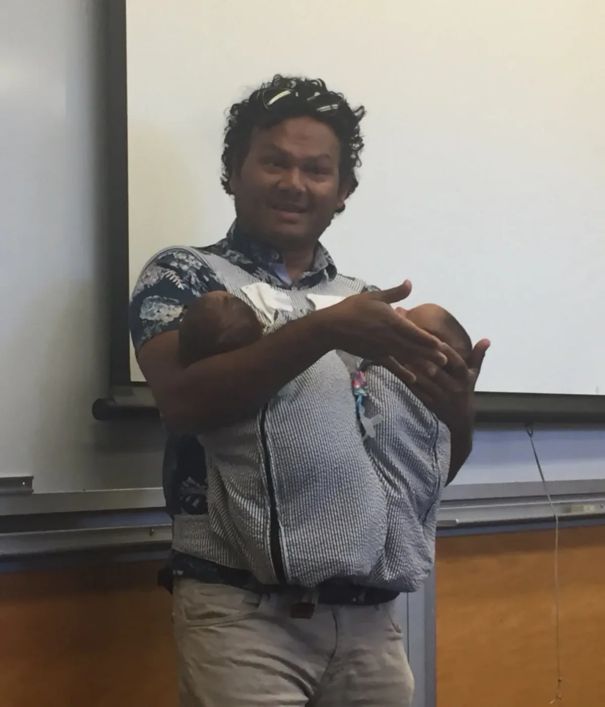
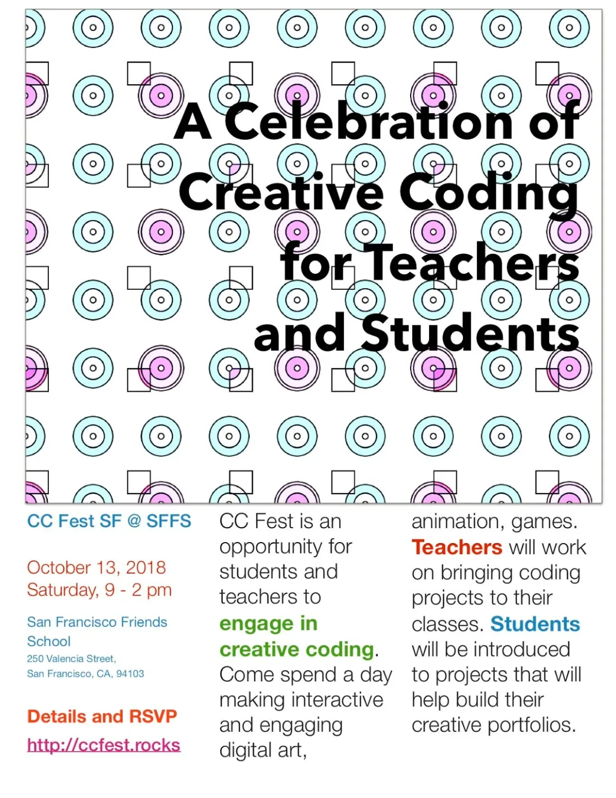
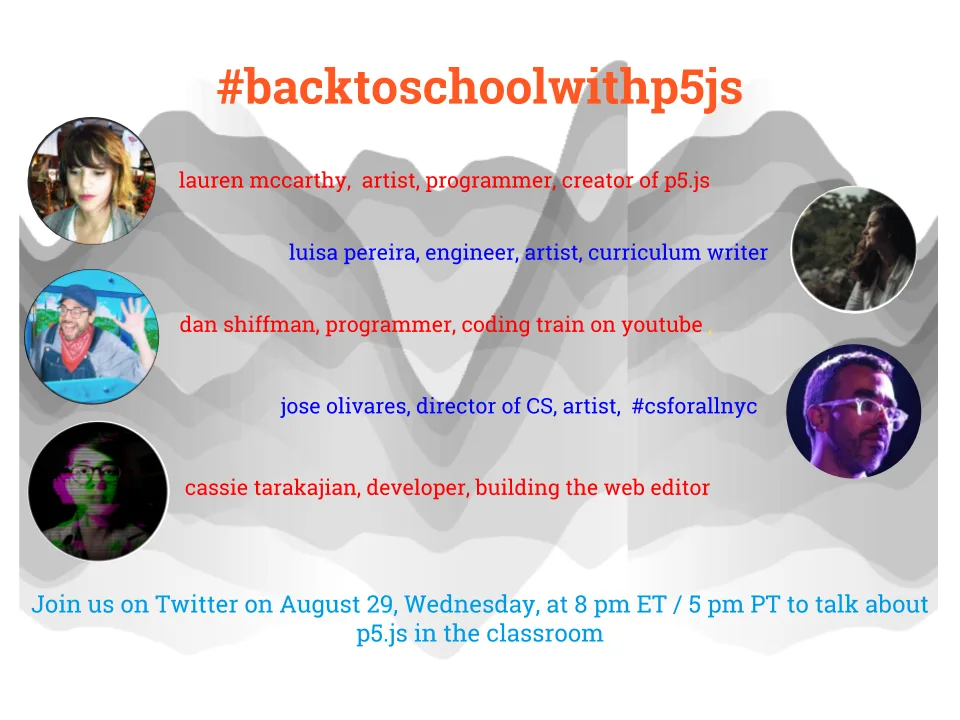
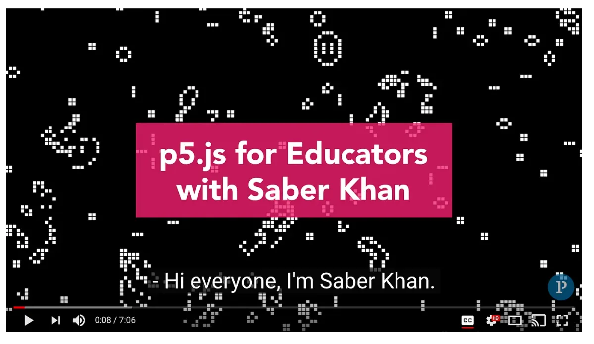
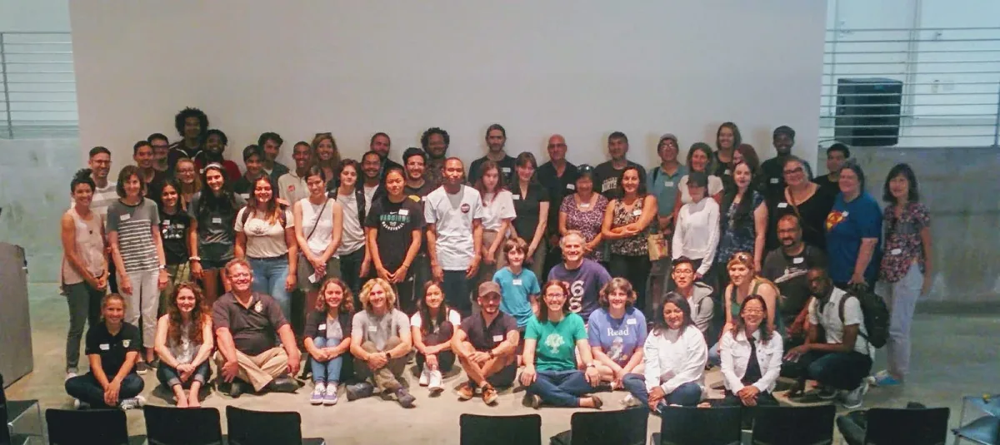
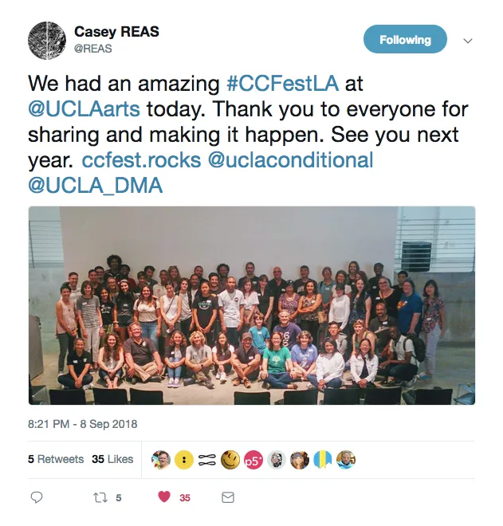

2018 Foundation Fellow

---

*The 2018 Processing Foundation Fellowships sponsored* [eight projects](https://medium.com/processing-foundation/introducing-the-2018-processing-foundation-fellows-a16ae4e87f80) *from around the world that expanded the p5.js and Processing softwares and their communities. Fellows developed work ranging from Chinese translation of the p5.js website, to workshops that teach smartphone coding in Ghana. During the coming weeks, we’ll post articles written by the fellows and interviews with them, in conversation with Director of Advocacy Johanna Hedva, that showcase and document the great work by this year’s cohort.*

---

*Saber Khan, speaking to new [Computer Science students at Stanford University](https://twitter.com/cynthiablee/status/1030233748342599680) with his newborn babies, Meghna and Anaya. \[image description: A man with a baby carrier speaking in a classroom.\]*

My goals for my 2018 fellowship are connected to my journey as an educator and my hopes for creating inclusive learning spaces. After 10 years of teaching math and science, I’ve taught middle and high school computing for the past five years. Having worked in public, private, and charter schools, I’ve been struck by the [segregation](https://medium.com/@ed_saber/diversity-and-technology-as-innovation-for-desegregation-3dce603a76fb) that separates students based on wealth, privilege, and access, and my work aims to create desegregated spaces for learning code.

I learned early on about Processing as a creative way to learn to code, and the development of p5.js has opened up new opportunities for making creative coding instruction more accessible. The expansion of the #CSforAll movement has helped with this, moving toward providing computer science education to all students. For my fellowship, my objective was to support these ongoing efforts by bringing a K12 educator perspective to the Processing Foundation. I looked for opportunities to engage with teachers, and find ways for educators and the creative computing community to work together on shared goals.

My involvement with Processing started with p5.js. I was using JavaScript to teach the basics of coding, and was introduced to p5.js and Dan Shiffman’s Coding Train. A few educators and I were excited about the opportunities that p5.js presented, and we talked to Dan about starting an event to share tools and projects with students and teachers. This became [CC Fest](http://ccfest.rocks), the first one of which was held at NYU-ITP in October 2016.

Since then we’ve held five more CC Fests in New York and Los Angeles. These events aim to create those desegregated, inclusive spaces that are hard to find in schools. Thanks to free space from NYU and UCLA, a low budget, and modest financial support from a few organizations, we’ve been able to keep the events free. The biggest asset has been the large number of educators who have given their time to organize, lead sessions, and volunteer. Beyond introducing a large group of [students and teachers to creative coding](https://medium.com/@ed_saber/creative-coding-for-all-7dadde33273b), I’m proud that we’ve helped form a community of educators who can support each other beyond the event. We’ve been able to bring CC Fest to more cities — the next one will be in San Francisco on October 13 — and hope to reach Chicago, Boston, and more.

*A flyer for [CC Fest SF](http://ccfest.rocks) at San Francisco Friends School. More information can be found at [#CCFestLA](https://twitter.com/search?q=%23CCFestLA&src=tyah), [#CCFestNYC](https://twitter.com/search?q=%23CCFestNYC&src=typd), and [#CCFestSF](https://twitter.com/search?q=%23ccfestsf&src=typd). \[image description: A flyer with mostly text in multi-colored type, and an image of a geometric pattern of squares and circles. The text on the flyer reads: “A Celebration of Creative Coding for Teachers and Students. CC Fest SF @ SFFS. October 13, 2018, Saturday, 9–2pm. San Francisco Friends School, 250 Valencia Street, San Francisco CA 94103. Details and RSVP: [http://ccfest.rocks.](http://ccfest.rocks.) CC Fest is an opportunity for students and teachers to engage in creative coding. Come spend a day making interactive and engaging digital art, animation, games. Teachers will work on bringing coding projects to their classes. Students will be introduced to projects that will help build their creative portfolios.”\]*

Events like CC Fest and Creative Coding Fest, combined with a burgeoning and engaged community of K12 students and teachers using p5.js for the first time, has led to the need for more support and guidance for these efforts. Over the past few years, p5.js has been a growing platform for computer science education in middle and high schools, and my fellowship was part of several endeavors to further develop this.

In New York City, the Department of Education is currently collaborating with the Processing Foundation to write curriculum using p5.js and to support the development of the web editor. This summer, two NYC CSforAll teachers, Jose Orea and Courtney Morgan, have been writing a comprehensive set of daily lessons for teachers that provide helpful direction on how to teach with p5.js. [Orea and Morgan’s work marks the first Teaching Fellowships for the Processing Foundation](https://medium.com/processing-foundation/making-processing-available-in-nyc-schools-b439eab71a9c), thanks to the support of the NYC DOE. This extends the work begun last year when the NYC DOE commissioned [Luisa Pereira](https://twitter.com/luisa_ph) (2016 Foundation Fellow) to write a [high school curriculum for creative coding](https://nycdoe-cs4all.github.io/) that is being used in many NYC public schools.

A huge step forward has been the release of the [web editor](https://editor.p5js.org/), from [Cassie Tarakajian](https://twitter.com/hellothisiscass) (2017 Foundation Fellow), which makes p5.js usable on more devices, especially Chromebooks, and makes it available to use in more classrooms. With the release of the web editor in August 2018, it felt like a good time for the Processing community to connect with K12 educators, so I organized a Twitter chat with Lauren McCarthy, Dan Shiffman, Cassie Tarakajian, and Luisa Pereira on August 29. We called it [#backtoschoolwthp5js](https://docs.google.com/document/d/1tmxHtaXV40Kr2OwHxX5XMpTJgAOWeiKbmES52gQQG_Q/edit?disco=uiAAAACIge91M&ts=5b9fe682#backtoschoolwithp5js). You can see a summary of the chat [here](https://wakelet.com/wake/4cee224e-d4f6-42b1-8240-6fbd5bbe3889).

*A flyer for the #backtoschoolwithp5js chat on [Twitter](https://twitter.com/ed_saber/status/1034883021604892672). \[image description: Orange and blue text is aligned with circular portraits of five people. In the background is an abstract graph in different shades of gray. The text reads, “#backtoschoolwithp5js. Lauren McCarthy, artist, programmer, creator of p5.js. Luisa Pereira, engineer, artist, curriculum writer. Dan Shiffman, programmer, coding train on youtube. Jose Olivares, director of CS, artist, #csforallnyc. Cassie Tarakajian, developer, building the web editor. Join us on Twitter on August 29, Wednesday, at 8pm ET/5pm PT to talk about p5.js in the classroom.”\]*

The fellowship has not been without some challenges. With CC Fest I’m still learning how to organize the event as open and inclusive in every area, so all feel welcome to attend and participate. With effort we were able to engage a diverse group of educators and students from public, private, and charter schools, but there is more work to be done. I have long-term goals that include fostering partnerships with other community organizations who work with diverse communities, like [Black Girls Code](http://www.blackgirlscode.com/).

On a personal level, managing all the different threads and finding the time to engage has been a challenge, because this summer my partner and I welcomed twin girls into the world. I’m learning a lot about what it means to be a dad through practice and error. While caring for the babies I have lots of time to think about how I can contribute even though I can’t share my contributions immediately. I’m learning how to manage my time better, which is important for the long-term because the maintenance of these projects has to be sustainable.

*[A video for Processing Foundation](https://www.youtube.com/watch?v=cu-qESR40IE&feature=youtu.be) explaining why p5.js is a great choice for teaching coding. \[image description: A screenshot of a YouTube video with a black background with white pixel-y shapes. A hot pink box with white type reads, “p5.js for Educators with Saber Khan.” The caption at the bottom of the video reads, “Hi everyone, I’m Saber Khan.”\]*

Questions about finding balance and sustainability are part of the larger conversation about open source and community building, and how they converge in education. Education and open source software share many values — openness, inclusivity, accessibility, working toward a public good — so it makes sense that many educators use open source tools. But those tools are often not developed with students, especially K12 students, in mind. Hopefully this will change as K12 students become a bigger part of the computing community.

The p5.js web editor is a great example of a tool developed with simplicity and clarity built into its overall design, which will have considerable impact with younger learners. While other developer tools seek to provide all the bells and whistles, the web editor aims to get you coding quickly with minimal fuss. Also, the web editor has benefited from feedback from teachers and students during the development process. This type of collaboration and feedback could be sustained to create tools that are more accessible than what we see now.

*A group shot of CC Fest Los Angeles. \[image description: Fifty eight people gathered in a group shot, two rows standing, one sitting. The room is large with concrete walls and floor, and some black chairs.\]*

*From [Casey Reas](https://twitter.com/REAS/status/1038583105299173376) at #CCFestLA. \[image description: A screenshot of a tweet from Casey Reas, with the group shot from CC Fest LA. The tweet reads, “We had an amazing #CCFestLA at @UCLAarts today. Thank you to everyone for sharing and making it happen. See you next year. ccfest.rocks @uclaconditional @UCLA\_DMA.”\]*

I think of my fellowship as the beginning of a larger relationship with the Processing Foundation. I think of myself not only as an educator but a community builder, and I love being part of the Processing community and supporting other teachers in using p5.js or Processing. We have an opportunity to offer an alternative to existing K12 CS education by caring about and incorporating creativity, identity, and ethics into the process.

I look forward to the reception of the release of the web editor and p5.js curriculum, and I hope to be able to support teachers who want to get started. Ultimately, I want to see how we can continue to do this work collaboratively, inclusively, and sustainably. Toward that end I want to explore opportunities to fund this work so it does not depend on donations and free labor from contributors.

Finally, I want to say that it is a treat to be a member of the Processing community. I have really enjoyed working with Cassie, Dan, Lauren, Casey, and the rest of the team.
